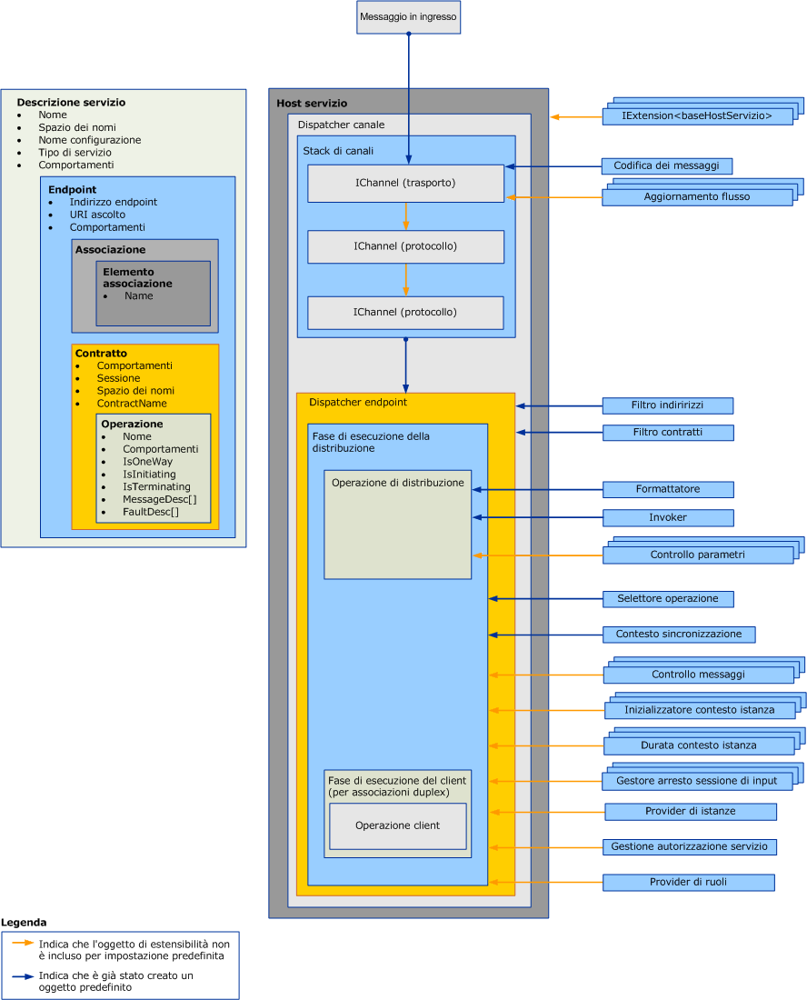

# Estensione di dispatcher
I dispatcher sono responsabili dell'estrazione dei messaggi in arrivo dai canali sottostanti, della loro conversione in chiamate al metodo nel codice dell'applicazione e della restituzione dei risultati al chiamante.  Le estensioni del dispatcher consentono di modificare questa elaborazione.  È possibile implementare controlli di parametri e messaggi che controllano o modificano il contenuto dei messaggi o dei parametri.  È possibile modificare la modalità in cui i messaggi vengono indirizzati alle operazioni o forniscono altre funzionalità.  
  
 In questo argomento viene illustrato come usare le classi <xref:System.ServiceModel.Dispatcher.DispatchRuntime> e <xref:System.ServiceModel.Dispatcher.DispatchOperation> in un'applicazione di servizio [!INCLUDE[indigo1](../../../../includes/indigo1-md.md)] per modificare il comportamento di esecuzione predefinito di un dispatcher o per intercettare o modificare messaggi, parametri o valori restituiti prima o dopo il loro invio o recupero dal livello del canale.  Per altre informazioni sull'elaborazione equivalente dei messaggi runtime del client, vedere [Estensione dei client](../../../../docs/framework/wcf/extending/extending-clients.md).  Per comprendere il ruolo dei tipi <xref:System.ServiceModel.IExtensibleObject%601> nell'accesso allo stato condiviso tra vari oggetti di personalizzazione runtime, vedere [Oggetti estensibili](../../../../docs/framework/wcf/extending/extensible-objects.md).  
  
## Dispatcher  
 Il livello del modello di servizi esegue la conversione tra il modello di programmazione dello sviluppatore e lo scambio di messaggi sottostante, comunemente denominato livello del canale.  In [!INCLUDE[indigo2](../../../../includes/indigo2-md.md)], i dispatcher di canale ed endpoint \(rispettivamente <xref:System.ServiceModel.Dispatcher.ChannelDispatcher> e <xref:System.ServiceModel.Dispatcher.EndpointDispatcher>\) sono i componenti del servizio responsabili dell'accettazione di nuovi canali, della ricezione di messaggi, della chiamata e dell'invio di operazioni e dell'elaborazione delle risposte.  Gli oggetti dispatcher sono oggetti destinatario, ma anche le implementazioni del contratto di callback nei servizi duplex espongono oggetti dispatcher per ispezione, modifica o estensione.  
  
 Il dispatcher del canale \(e la classe <xref:System.ServiceModel.Channels.IChannelListener> complementare\) estrae i messaggi dal canale sottostante e li passa ai rispettivi dispatcher dell'endpoint.  Ogni dispatcher dell'endpoint ha una classe <xref:System.ServiceModel.Dispatcher.DispatchRuntime> che indirizza i messaggi alla classe <xref:System.ServiceModel.Dispatcher.DispatchOperation> appropriata, responsabile della chiamata al metodo che implementa l'operazione.  Durante il processo vengono richiamate varie classi di estensione facoltative e obbligatorie.  In questo argomento viene illustrato come vengono assemblati questi pezzi e come è possibile modificare proprietà e inserirvi il proprio codice per estendere la funzionalità di base.  
  
 Le proprietà dispatcher e gli oggetti di personalizzazione modificati vengono inseriti usando oggetti comportamento di servizi, endpoint, contratti o operazioni.  In questo argomento non viene descritto come usare i comportamenti.  Per altre informazioni sui tipi usati per inserire modifiche dei dispatcher, vedere [Configurazione ed estensione del runtime con i comportamenti](../../../../docs/framework/wcf/extending/configuring-and-extending-the-runtime-with-behaviors.md).  
  
 Nel grafico seguente viene fornita una panoramica dettagliata degli elementi architettonici di un servizio.  
  
   
  
### Dispatcher del canale  
 Viene creato un oggetto <xref:System.ServiceModel.Dispatcher.ChannelDispatcher> per associare una classe <xref:System.ServiceModel.Channels.IChannelListener> in un particolare URI \(denominato URI di ascolto\) a un'istanza di un servizio.  Ogni oggetto <xref:System.ServiceModel.ServiceHost> può avere numerosi oggetti <xref:System.ServiceModel.Dispatcher.ChannelDispatcher>, ognuno associato a un solo listener e URI di ascolto.  All'arrivo di un messaggio <xref:System.ServiceModel.Dispatcher.ChannelDispatcher> esegue una query su ognuno degli oggetti <xref:System.ServiceModel.Dispatcher.EndpointDispatcher> associati per scoprire se l'endpoint può accettare il messaggio, quindi passa il messaggio all'endpoint che ne ha la possibilità.  
  
 Tutte le proprietà che controllano la durata e il comportamento di una sessione del canale sono disponibili per essere controllate o modificate sull'oggetto <xref:System.ServiceModel.Dispatcher.ChannelDispatcher>.  Sono inclusi gli inizializzatori di canale personalizzati, il listener del canale, l'host, l'oggetto <xref:System.ServiceModel.InstanceContext>e associato e così via.  
  
### Dispatcher dell'endpoint  
 L'oggetto <xref:System.ServiceModel.Dispatcher.EndpointDispatcher> è responsabile dell'elaborazione dei messaggi da una classe <xref:System.ServiceModel.Dispatcher.ChannelDispatcher>, quando l'indirizzo di destinazione di un messaggio corrisponde alla proprietà <xref:System.ServiceModel.Dispatcher.EndpointDispatcher.AddressFilter%2A> e l'azione del messaggio corrisponde alla proprietà <xref:System.ServiceModel.Dispatcher.EndpointDispatcher.ContractFilter%2A>.  Se due oggetti <xref:System.ServiceModel.Dispatcher.EndpointDispatcher> possono accettare un messaggio, il valore della proprietà <xref:System.ServiceModel.Dispatcher.EndpointDispatcher.FilterPriority%2A> determina l'endpoint con la priorità più elevata.  
  
 Usare <xref:System.ServiceModel.Dispatcher.EndpointDispatcher> per acquisire i due principali punti di estensione del modello di servizi, ovvero le classi <xref:System.ServiceModel.Dispatcher.DispatchRuntime> e <xref:System.ServiceModel.Dispatcher.DispatchOperation>, utilizzabili per personalizzare l'elaborazione del dispatcher.  La classe <xref:System.ServiceModel.Dispatcher.DispatchRuntime> consente agli utenti di intercettare ed estendere il dispatcher nell'ambito del contratto, ovvero per tutti i messaggi del contratto.  La classe <xref:System.ServiceModel.Dispatcher.DispatchOperation> consente agli utenti di intercettare ed estendere il dispatcher nell'ambito di un'operazione, ovvero per tutti i messaggi in un'operazione.  
  
## Scenari  
 Esistono vari motivi per estendere il dispatcher:  
  
-   Convalida di messaggi personalizzata.  Gli utenti possono imporre che un messaggio sia valido per un certo schema.  A questo scopo, è possibile implementare le interfacce degli intercettori di messaggi.  Per un esempio, vedere [Controlli messaggi](../../../../docs/framework/wcf/samples/message-inspectors.md).  
  
-   Registrazione di messaggi personalizzata.  Gli utenti possono controllare e registrare un set di messaggi dell'applicazione che passano attraverso un endpoint.  Questa operazione può essere eseguita anche con le interfacce degli intercettori di messaggi.  
  
-   Trasformazioni di messaggi personalizzate.  Gli utenti possono applicare determinate trasformazioni al messaggio nel runtime \(ad esempio per il controllo delle versioni\).  Anche in questo caso, l'operazione può essere eseguita con le interfacce degli intercettori di messaggi.  
  
-   Modello di dati personalizzato.  Gli utenti possono disporre di un modello di serializzazione dei dati diverso da quelli supportati per impostazione predefinita in [!INCLUDE[indigo2](../../../../includes/indigo2-md.md)] \(ovvero oggetti <xref:System.Runtime.Serialization.DataContractSerializer?displayProperty=fullName>, <xref:System.Xml.Serialization.XmlSerializer?displayProperty=fullName> e messaggi non elaborati\).  A questo scopo, è possibile implementare le interfacce dei formattatori di messaggi.  Per un esempio, vedere [Formattatore e selettore dell'operazione](../../../../docs/framework/wcf/samples/operation-formatter-and-operation-selector.md).  
  
-   Convalida di parametri personalizzata.  Gli utenti possono imporre che i parametri tipizzati siano validi \(a differenza di XML\).  A questo scopo, è possibile usare le interfacce di controllo dei parametri.  
  
-   Invio di operazioni personalizzato.  Gli utenti possono implementare l'invio su un elemento diverso dall'azione, ad esempio, sull'elemento corpo o su una proprietà del messaggio personalizzata.  A questo scopo, usare l'interfaccia <xref:System.ServiceModel.Dispatcher.IDispatchOperationSelector>.  Per un esempio, vedere [Formattatore e selettore dell'operazione](../../../../docs/framework/wcf/samples/operation-formatter-and-operation-selector.md).  
  
-   Pool di oggetti.  Gli utenti possono eseguire il pool delle istanze invece di allocare una nuova istanza per ogni chiamata.  A questo scopo, usare le interfacce del provider di istanze.  Per un esempio, vedere [Pooling](../../../../docs/framework/wcf/samples/pooling.md).  
  
-   Leasing di istanza.  Gli utenti possono implementare un modello di leasing per la durata dell'istanza, simile a quello di .NET Framework Remoting.  A questo scopo, è possibile usare le interfacce di durata del contesto dell'istanza.  
  
-   Gestione degli errori personalizzata.  Gli utenti possono controllare come vengono elaborati gli errori locali e come vengono comunicati ai client.  A questo scopo, usare le interfacce <xref:System.ServiceModel.Dispatcher.IErrorHandler>.  
  
-   Comportamenti di autorizzazione personalizzati.  Gli utenti possono implementare il controllo di accesso personalizzato estendendo i pezzi di runtime Contratto o Operazione e aggiungendo controlli di sicurezza basati sui token presenti nel messaggio.  L'operazione può essere eseguita con le interfacce degli intercettori di messaggi o di parametri.  Per i relativi esempi, vedere [Estensibilità della sicurezza](../../../../docs/framework/wcf/samples/security-extensibility.md).  
  
    > [!CAUTION]
    >  Poiché la modifica di proprietà di sicurezza può compromettere la protezione delle applicazioni [!INCLUDE[indigo2](../../../../includes/indigo2-md.md)], è consigliabile intraprendere modifiche relative alla protezione con attenzione e testarle accuratamente prima della distribuzione.  
  
-   Validator del runtime WCF personalizzati.  È possibile installare validator personalizzati che esaminano servizi, contratti e associazioni, per imporre criteri a livello di azienda in relazione ad applicazioni [!INCLUDE[indigo2](../../../../includes/indigo2-md.md)].  Per un esempio, vedere [Procedura: bloccare gli endpoint nell'organizzazione](../../../../docs/framework/wcf/extending/how-to-lock-down-endpoints-in-the-enterprise.md).  
  
### Utilizzo della classe DispatchRuntime  
 Usare la classe <xref:System.ServiceModel.Dispatcher.DispatchRuntime> per modificare il comportamento predefinito di un servizio o di un singolo endpoint oppure per inserire oggetti che implementano modifiche personalizzate in uno o entrambi i processi del servizio \(o i processi client nel caso di un client duplex\) seguenti:  
  
-   Trasformazione di messaggi in arrivo in oggetti e rilascio di tali oggetti come chiamate al metodo su un oggetto servizio.  
  
-   Trasformazione di oggetti ricevuti dalla risposta a una chiamata a operazioni del servizio in messaggi in uscita.  
  
 <xref:System.ServiceModel.Dispatcher.DispatchRuntime> consente di intercettare ed estendere il dispatcher del canale o dell'endpoint per tutti i messaggi di un particolare contratto, anche quando un messaggio non viene riconosciuto.  Quando arriva un messaggio che non corrisponde ad alcun messaggio dichiarato nel contratto, viene inviato all'operazione restituita dalla proprietà <xref:System.ServiceModel.Dispatcher.DispatchRuntime.UnhandledDispatchOperation%2A>.  Per l'intercettazione o l'estensione in tutti i messaggi relativi a una particolare operazione, vedere la classe <xref:System.ServiceModel.Dispatcher.DispatchOperation>.  
  
 Sono presenti quattro aree principali di estendibilità del dispatcher esposto dalla classe <xref:System.ServiceModel.Dispatcher.DispatchRuntime>:  
  
1.  I componenti del canale usano le proprietà di <xref:System.ServiceModel.Dispatcher.DispatchRuntime> e quelle del dispatcher del canale associato, restituito dalla proprietà <xref:System.ServiceModel.Dispatcher.DispatchRuntime.ChannelDispatcher%2A>, per personalizzare la modalità usata dal dispatcher del canale per accettare e chiudere canali.  In questa categoria sono incluse le proprietà <xref:System.ServiceModel.Dispatcher.ChannelDispatcher.ChannelInitializers%2A> e <xref:System.ServiceModel.Dispatcher.DispatchRuntime.InputSessionShutdownHandlers%2A>.  
  
2.  I componenti dei messaggi vengono personalizzati per ogni messaggio elaborato.  In questa categoria sono incluse le proprietà <xref:System.ServiceModel.Dispatcher.DispatchRuntime.MessageInspectors%2A>, <xref:System.ServiceModel.Dispatcher.DispatchRuntime.OperationSelector%2A>, <xref:System.ServiceModel.Dispatcher.DispatchRuntime.Operations%2A> e <xref:System.ServiceModel.Dispatcher.ChannelDispatcher.ErrorHandlers%2A>.  
  
3.  I componenti dell'istanza personalizzano la creazione, la durata e l'eliminazione di istanze del tipo di servizio.  Per altre informazioni sulle durate degli oggetti di servizio, vedere la proprietà <xref:System.ServiceModel.ServiceBehaviorAttribute.InstanceContextMode%2A>.  In questa categoria sono incluse le proprietà <xref:System.ServiceModel.Dispatcher.DispatchRuntime.InstanceContextInitializers%2A> e <xref:System.ServiceModel.Dispatcher.DispatchRuntime.InstanceProvider%2A>.  
  
4.  I componenti correlati alla protezione possono usare le proprietà seguenti:  
  
    -   <xref:System.ServiceModel.Dispatcher.DispatchRuntime.SecurityAuditLogLocation%2A> indica dove vengono scritti gli eventi di controllo.  
  
    -   <xref:System.ServiceModel.Dispatcher.DispatchRuntime.ImpersonateCallerForAllOperations%2A> controlla se il servizio tenta di eseguire una rappresentazione usando le credenziali fornite dal messaggio in ingresso.  
  
    -   <xref:System.ServiceModel.Dispatcher.DispatchRuntime.MessageAuthenticationAuditLevel%2A> controlla se nel registro eventi specificato da <xref:System.ServiceModel.Dispatcher.DispatchRuntime.SecurityAuditLogLocation%2A> vengono scritti eventi di autenticazione riuscita dei messaggi.  
  
    -   <xref:System.ServiceModel.Dispatcher.DispatchRuntime.PrincipalPermissionMode%2A> controlla le modalità di impostazione della proprietà <xref:System.Threading.Thread.CurrentPrincipal%2A>.  
  
    -   <xref:System.ServiceModel.Dispatcher.DispatchRuntime.ServiceAuthorizationAuditLevel%2A>specifica le modalità di esecuzione del controllo degli eventi di autorizzazione.  
  
    -   <xref:System.ServiceModel.Dispatcher.DispatchRuntime.SuppressAuditFailure%2A> specifica se sopprimere le eccezioni non critiche che si verificano durante il processo di registrazione.  
  
 In genere, gli oggetti di estensione personalizzati vengono assegnati a una proprietà <xref:System.ServiceModel.Dispatcher.DispatchRuntime> o inseriti in una raccolta da un comportamento del servizio \(un oggetto che implementa <xref:System.ServiceModel.Description.IServiceBehavior>\), un comportamento del contratto \(un oggetto che implementa <xref:System.ServiceModel.Description.IContractBehavior>\) o un comportamento dell'endpoint \(un oggetto che implementa <xref:System.ServiceModel.Description.IEndpointBehavior>\).  L'oggetto del comportamento da installare viene quindi aggiunto alla raccolta appropriata di comportamenti a livello di programmazione o implementando un oggetto <xref:System.ServiceModel.Configuration.BehaviorExtensionElement> personalizzato per consentire l'inserimento del comportamento usando un file di configurazione dell'applicazione.  
  
 I client duplex \(client che implementano un contratto di callback specificato da un servizio duplex\) hanno anche un oggetto <xref:System.ServiceModel.Dispatcher.DispatchRuntime> a cui è possibile accedere usando la proprietà <xref:System.ServiceModel.Dispatcher.ClientRuntime.CallbackDispatchRuntime%2A>.  
  
### Utilizzo della classe DispatchOperation  
 La classe <xref:System.ServiceModel.Dispatcher.DispatchOperation> è il luogo in cui è possibile eseguire modifiche del runtime ed è il punto di inserimento per estensioni personalizzate nell'ambito di una sola operazione del servizio.  Per modificare il comportamento del runtime del servizio per tutti i messaggi di un contratto, usare la classe <xref:System.ServiceModel.Dispatcher.DispatchRuntime>.  
  
 Installare modifiche di <xref:System.ServiceModel.Dispatcher.DispatchOperation> usando un oggetto comportamento del servizio personalizzato.  
  
 Usare la proprietà <xref:System.ServiceModel.Dispatcher.DispatchRuntime.Operations%2A> per individuare l'oggetto <xref:System.ServiceModel.Dispatcher.DispatchOperation> che rappresenta un'operazione specifica del servizio.  
  
 Le proprietà seguenti controllano l'esecuzione del runtime a livello di operazione:  
  
-   Le proprietà <xref:System.ServiceModel.Dispatcher.DispatchOperation.Action%2A>, <xref:System.ServiceModel.Dispatcher.DispatchOperation.ReplyAction%2A>, <xref:System.ServiceModel.Dispatcher.DispatchOperation.FaultContractInfos%2A>, <xref:System.ServiceModel.Dispatcher.DispatchOperation.IsOneWay%2A>, <xref:System.ServiceModel.Dispatcher.DispatchOperation.IsTerminating%2A> e <xref:System.ServiceModel.Dispatcher.DispatchOperation.Name%2A> ottengono i rispettivi valori dell'operazione.  
  
-   <xref:System.ServiceModel.Dispatcher.DispatchOperation.TransactionAutoComplete%2A> e <xref:System.ServiceModel.Dispatcher.DispatchOperation.TransactionRequired%2A> specificano il comportamento della transazione.  
  
-   Le proprietà <xref:System.ServiceModel.Dispatcher.DispatchOperation.ReleaseInstanceBeforeCall%2A> e <xref:System.ServiceModel.Dispatcher.DispatchOperation.ReleaseInstanceAfterCall%2A> controllano la durata dell'oggetto di servizio definito dall'utente relativo alla classe <xref:System.ServiceModel.InstanceContext>.  
  
-   Le proprietà <xref:System.ServiceModel.Dispatcher.DispatchOperation.DeserializeRequest%2A>, <xref:System.ServiceModel.Dispatcher.DispatchOperation.SerializeReply%2A> e <xref:System.ServiceModel.Dispatcher.DispatchOperation.Formatter%2A> consentono di controllare esplicitamente la conversione dei messaggi in oggetti e viceversa.  
  
-   La proprietà <xref:System.ServiceModel.Dispatcher.DispatchOperation.Impersonation%2A> specifica il livello di rappresentazione dell'operazione.  
  
-   La proprietà <xref:System.ServiceModel.Dispatcher.DispatchOperation.CallContextInitializers%2A> inserisce estensioni del contesto di chiamata personalizzate per l'operazione.  
  
-   La proprietà <xref:System.ServiceModel.Dispatcher.DispatchOperation.AutoDisposeParameters%2A> controlla quando vengono eliminati in modo permanente gli oggetti parametro.  
  
-   La proprietà <xref:System.ServiceModel.Dispatcher.DispatchOperation.Invoker%2A> consente di inserire un oggetto invoker personalizzato.  
  
-   La proprietà <xref:System.ServiceModel.Dispatcher.DispatchOperation.ParameterInspectors%2A> consente di inserire un controllo del parametro personalizzato utilizzabile per controllare o modificare parametri e valori restituiti.  
  
## Vedere anche  
 <xref:System.ServiceModel.Dispatcher.DispatchRuntime>   
 <xref:System.ServiceModel.Dispatcher.DispatchOperation>   
 [Procedura: ispezionare e modificare i messaggi sul servizio](../../../../docs/framework/wcf/extending/how-to-inspect-and-modify-messages-on-the-service.md)   
 [Procedura: controllare o modificare i parametri](../../../../docs/framework/wcf/extending/how-to-inspect-or-modify-parameters.md)   
 [Procedura: bloccare gli endpoint nell'organizzazione](../../../../docs/framework/wcf/extending/how-to-lock-down-endpoints-in-the-enterprise.md)