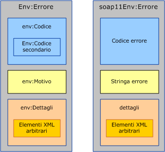
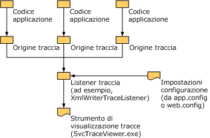

# Gestione di eccezioni ed errori
Le eccezioni vengono utilizzate per comunicare errori localmente, all'interno del servizio o nell'implementazione del client.Gli errori, d'altra parte, vengono utilizzati per comunicare problemi tra servizi, ad esempio dal server al client o viceversa.Oltre agli errori, i canali del trasporto spesso utilizzano meccanismi specifici per comunicare errori a livello di trasporto.Il trasporto HTTP, ad esempio, utilizza codici di stato, come 404, per comunicare un URL di endpoint inesistente \(nessun endpoint al quale restituire un errore\).Questo documento è composto da tre sezioni che contengono istruzioni utili per gli autori di canali personalizzati.Nella prima sezione sono contenute linee guida sulle circostanze e le modalità di definizione e generazione delle eccezioni.Nella seconda sezione sono fornite istruzioni sulla generazione e l'utilizzo di errori.Nella terza sezione viene spiegato come fornire informazioni di traccia per aiutare l'utente del canale personalizzato a risolvere i problemi delle applicazioni in esecuzione.  
  
## Eccezioni  
 È necessario tenere presenti due principi per la generazione di un'eccezione: innanzitutto deve essere di tipo tale da consentire agli utenti di scrivere codice corretto in grado di reagire in modo appropriato all'eccezione.In secondo luogo deve fornire informazioni sufficienti per consentire all'utente di capire il problema, valutare le conseguenze dell'errore e correggerlo.Nelle sezioni seguenti vengono fornite linee guida sui tipi e i messaggi di eccezione per i canali di [!INCLUDE[indigo1](../../../../includes/indigo1-md.md)].Istruzioni generali sulle eccezioni sono inoltre disponibili in .NET nel documento relativo alle linee guida di progettazione per le eccezioni.  
  
### Tipi di eccezione  
 Tutte le eccezioni generate dai canali devono essere <xref:System.TimeoutException?displayProperty=fullName>, <xref:System.ServiceModel.CommunicationException?displayProperty=fullName> o un tipo derivato da <xref:System.ServiceModel.CommunicationException>.Eccezioni come ad esempio <xref:System.ObjectDisposedException> possono essere generate ma solo per indicare che il codice chiamante ha adoperato male il canale.Se il canale viene utilizzato correttamente, deve generare solo le eccezioni date. In [!INCLUDE[indigo2](../../../../includes/indigo2-md.md)] sono disponibili sette tipi di eccezione che derivano da <xref:System.ServiceModel.CommunicationException> e il cui impiego previsto è con i canali.Esistono altre eccezioni derivate da <xref:System.ServiceModel.CommunicationException>, pensate per essere utilizzate in altre parti del sistema.Questi tipi di eccezione sono elencati di seguito:  
  
|Tipo di eccezione|Significato|Contenuto dell'eccezione interna.|Strategia di recupero|  
|-----------------------|-----------------|---------------------------------------|---------------------------|  
|<xref:System.ServiceModel.AddressAlreadyInUseException>|L'indirizzo dell'endpoint specificato per l'ascolto è già in uso.|Se presente, fornisce ulteriori dettagli sull'errore del trasporto che ha provocato l'eccezione.Ad esempio:<xref:System.IO.PipeException>, <xref:System.Net.HttpListenerException> o <xref:System.Net.Sockets.SocketException>.|Provare un indirizzo diverso.|  
|<xref:System.ServiceModel.AddressAccessDeniedException>|Al processo non è consentito l'accesso all'indirizzo dell'endpoint specificato per l'ascolto.|Se presente, fornisce ulteriori dettagli sull'errore del trasporto che ha provocato l'eccezione.Ad esempio: <xref:System.IO.PipeException> o <xref:System.Net.HttpListenerException>.|Provare con credenziali diverse.|  
|<xref:System.ServiceModel.CommunicationObjectFaultedException>|L'oggetto <xref:System.ServiceModel.ICommunicationObject> utilizzato è nello stato Faulted \(per ulteriori informazioni, vedere [Informazioni sui cambiamenti di stato](../../../../docs/framework/wcf/extending/understanding-state-changes.md)\).Si noti che quando un oggetto con più chiamate in sospeso passa allo stato Faulted, solo una chiamata genera un'eccezione riferita all'errore e il resto delle chiamate genera un'eccezione <xref:System.ServiceModel.CommunicationObjectFaultedException>.In genere questa eccezione viene generata perché un'applicazione trascura qualche eccezione e tenta di utilizzare un oggetto già Faulted, probabilmente su un thread diverso da quello che ha rilevato l'eccezione originale.|Se presente, fornisce dettagli sull'eccezione interna.|Creare un nuovo oggetto.Si noti che a seconda di ciò che ha determinato in primo luogo l'errore di <xref:System.ServiceModel.ICommunicationObject>, potrebbero essere necessarie altre operazioni per la relativa correzione.|  
|<xref:System.ServiceModel.CommunicationObjectAbortedException>|L'oggetto <xref:System.ServiceModel.ICommunicationObject> utilizzato è stato interrotto \(per ulteriori informazioni, vedere [Informazioni sui cambiamenti di stato](../../../../docs/framework/wcf/extending/understanding-state-changes.md)\).Analogamente a <xref:System.ServiceModel.CommunicationObjectFaultedException>, questa eccezione indica che l'applicazione ha chiamato il metodo <xref:System.ServiceModel.ICommunicationObject.Abort%2A> sull'oggetto, probabilmente da un altro thread, e che l'oggetto non è più utilizzabile per questo motivo.|Se presente, fornisce dettagli sull'eccezione interna.|Creare un nuovo oggetto.Si noti che a seconda di ciò che ha determinato in primo luogo l'interruzione di <xref:System.ServiceModel.ICommunicationObject>, potrebbero essere necessarie altre operazioni per il recupero.|  
|<xref:System.ServiceModel.EndpointNotFoundException>|L'endpoint remoto di destinazione non è in ascolto.Ciò può essere dovuto a parti dell'indirizzo dell'endpoint non corrette o irresolubili oppure all'inattività dell'endpoint.Alcuni esempi sono l'errore DNS, il gestore delle code non disponibile e il servizio non in esecuzione.|L'eccezione interna fornisce dettagli, in genere dal trasporto sottostante.|Provare un indirizzo diverso.In alternativa il mittente può attendere e provare di nuovo nel caso in cui il servizio non fosse attivo.|  
|<xref:System.ServiceModel.ProtocolException>|Non esiste corrispondenza tra i protocolli di comunicazione degli endpoint, come descritto nel criterio dell'endpoint,ad esempio mancata corrispondenza del tipo di contenuto di frame o dimensione massima del messaggio superata.|Se presente, fornisce ulteriori informazioni sullo specifico errore di protocollo.Ad esempio, <xref:System.ServiceModel.QuotaExceededException> è l'eccezione interna quando la causa dell'errore supera MaxReceivedMessageSize.|Recupero: verificare che le impostazioni del protocollo del mittente e del destinatario corrispondano.Un modo per appurarlo consiste nel reimportare i metadati \(criterio\) dell'endpoint del servizio e nell'utilizzare l'associazione generata per ricreare il canale.|  
|<xref:System.ServiceModel.ServerTooBusyException>|L'endpoint remoto è in ascolto ma non è pronto per elaborare messaggi.|Se presente, l'eccezione interna fornisce dettagli dell'errore SOAP o dell'errore a livello di trasporto.|Recupero: attendere e ripetere l'operazione in un secondo momento.|  
|<xref:System.TimeoutException>|L'operazione non è stata completata entro il periodo di timeout.|Sono possibili dettagli sul timeout.|Attendere e ripetere l'operazione in un secondo momento.|  
  
 Definire un nuovo tipo di eccezione solo se quel tipo corrisponde a una specifica strategia di recupero diversa da tutti i tipi di eccezione esistenti.Se si definisce un tipo di eccezione nuovo, è necessario che derivi da <xref:System.ServiceModel.CommunicationException> o da una delle classi derivate.  
  
### Messaggi di eccezione  
 Poiché i messaggi di eccezione sono destinati all'utente, non al programma, devono fornire informazioni sufficienti per consentire all'utente di capire il problema e risolverlo.Le tre parti essenziali di un messaggio di eccezione ben redatto sono:  
  
 L'evento che si è verificato.Fornire una descrizione chiara del problema utilizzando termini che rientrano nelle conoscenze dell'utente.Un messaggio di eccezione errato, ad esempio, sarebbe "Sezione di configurazione non valida".L'utente non avrebbe la possibilità di individuare la sezione errata della configurazione né di capire la motivazione dell'errore.Migliore sarebbe il messaggio "Sezione di configurazione \<customBinding\> non valida".Una versione ancora migliore del messaggio sarebbe "Impossibile aggiungere il trasporto myTransport all'associazione myBinding perché l'associazione dispone già di un trasporto denominato myTransport".Si tratta di un messaggio molto specifico in cui sono utilizzati termini e nomi che l'utente può identificare facilmente nel file di configurazione dell'applicazione.Alcuni componenti fondamentali, tuttavia, mancano ancora.  
  
 Il significato dell'errore.A meno che il messaggio non esprima chiaramente il significato dell'errore, è probabile che l'utente si chieda se si tratta di un errore irreversibile o se può essere ignorato.In genere i messaggi devono proseguire con il significato dell'errore.Per migliorare l'esempio precedente, il messaggio potrebbe recitare "Impossibile aprire ServiceHost a causa di un errore di configurazione: impossibile aggiungere il trasporto myTransport all'associazione myBinding perché l'associazione dispone già di un trasporto denominato myTransport".  
  
 Modalità di correzione del problema da parte dell'utente.La parte più importante parte del messaggio consiste nel rendere possibile la risoluzione del problema.Il messaggio deve comprendere istruzioni o suggerimenti sugli elementi da controllare o da correggere per risolvere al problema.Ad esempio: "Impossibile aprire ServiceHost a causa di un errore di configurazione: impossibile aggiungere il trasporto myTransport all'associazione myBinding perché l'associazione dispone già di un trasporto denominato myTransport.Verificare che nell'associazione esista solo un trasporto".  
  
## Comunicazione di errori  
 SOAP 1.1 e SOAP 1.2 definiscono entrambi una struttura specifica per gli errori.Vi sono alcune differenze tra le due specifiche ma in genere i tipi Message e MessageFault vengono utilizzati per creare e utilizzare errori.  
  
   
Errore SOAP 1.2 \(sinistra\) ed errore SOAP 1.1 \(destra\).Si noti che in SOAP 1.1 solo l'elemento Fault è qualificato con lo spazio dei nomi.  
  
 In SOAP un messaggio di errore viene definito come messaggio contenente solo un elemento Fault \(un elemento denominato `<env:Fault>``<env:Body>) come elemento figlio di` .Il contenuto dell'elemento errore differisce leggermente SOAP 1.1 e SOAP 1.2, come mostrato in Figura 1.Tuttavia, la classe <xref:System.ServiceModel.Channels.MessageFault?displayProperty=fullName> normalizza queste differenze in un unico modello a oggetti:  
  
```  
public abstract class MessageFault  
{  
    protected MessageFault();  
  
    public virtual string Actor { get; }  
    public virtual string Node { get; }  
    public static string DefaultAction { get; }  
    public abstract FaultCode Code { get; }  
    public abstract bool HasDetail { get; }  
    public abstract FaultReason Reason { get; }  
  
    public T GetDetail<T>();  
    public T GetDetail<T>( XmlObjectSerializer serializer);  
    public System.Xml.XmlDictionaryReader GetReaderAtDetailContents();  
  
    // other methods omitted  
}  
```  
  
 La proprietà `Code` corrisponde a `env:Code` \(o `faultCode` in SOAP 1.1\) e identifica il tipo di errore.In SOAP 1.2 sono definiti cinque valori consentiti per `faultCode` \(ad esempio Sender e Receiver\) ed è definito un elemento `Subcode` contenente qualsiasi valore del codice secondario.Per un elenco dei codici di errore ammessi e del relativo significato, vedere la [specifica SOAP 1.2](http://go.microsoft.com/fwlink/?LinkId=95176) \(il contenuto potrebbe essere in inglese\). SOAP 1.1 presenta un meccanismo leggermente diverso. Definisce quattro valori `faultCode` \(ad esempio Client e Server\) che possono essere estesi definendo valori del tutto nuovi o utilizzando la notazione del punto per creare `faultCodes` più specifici, ad esempio Client.Authentication.  
  
 Quando si utilizza MessageFault per programmare errori, FaultCode.Name e FaultCode.Namespace eseguono il mapping al nome e allo spazio dei nomi di `env:Code` SOAP 1.2 o di `faultCode` SOAP 1.1.FaultCode.SubCode è associato a `env:Subcode` per SOAP 1.2 ed è null per SOAP 1.1.  
  
 È necessario creare nuovi codici secondari di errore \(o nuovi codici di errore se si utilizza SOAP 1.1\) se è utile distinguere un errore a livello di programmazione.Ciò ha valore analogo alla creazione di un nuovo tipo di eccezione.È consigliabile evitare di utilizzare la notazione del punto con i codici di errore SOAP 1.1.La specifica [WS\-I Basic Profile](http://go.microsoft.com/fwlink/?LinkId=95177), inoltre, scoraggia l'impiego della notazione del punto per i codici di errore.  
  
```  
public class FaultCode  
{  
    public FaultCode(string name);  
    public FaultCode(string name, FaultCode subCode);  
    public FaultCode(string name, string ns);  
    public FaultCode(string name, string ns, FaultCode subCode);  
  
    public bool IsPredefinedFault { get; }  
    public bool IsReceiverFault { get; }  
    public bool IsSenderFault { get; }  
    public string Name { get; }  
    public string Namespace { get; }  
    public FaultCode SubCode { get; }  
  
//  methods omitted  
  
}  
```  
  
 La proprietà `Reason` corrisponde a `env:Reason` \(o `faultString` in SOAP 1.1\), una descrizione intelligibile della condizione di errore analoga a un messaggio di eccezione.La classe `FaultReason` \(e `env:Reason/faultString` SOAP\) incorpora il supporto delle conversioni multiple nell'interesse della globalizzazione.  
  
```  
public class FaultReason  
{  
    public FaultReason(FaultReasonText translation);  
    public FaultReason(IEnumerable<FaultReasonText> translations);  
    public FaultReason(string text);  
  
    public SynchronizedReadOnlyCollection<FaultReasonText> Translations   
    {   
       get;   
    }  
  
 }  
```  
  
 Il contenuto dettagliato dell'errore è esposto in MessageFault con vari metodi, tra cui `GetDetail`\<T\> e `GetReaderAtDetailContents`\(\).Il dettaglio dell'errore è un elemento opaco per trasferire ulteriori informazioni sull'errore.È utile in presenza di dettagli strutturati arbitrari che si desidera trasferire con l'errore.  
  
### Generazione di errori  
 In questa sezione viene spiegato il processo di generazione di un messaggio di errore in risposta a una condizione di errore rilevata in un canale o in una proprietà di messaggio creata dal canale.Un esempio tipico è la restituzione di un errore in risposta a un messaggio di richiesta contenente dati non validi.  
  
 Nel caso della generazione di un errore, è preferibile che il canale personalizzato non invii l'errore direttamente bensì generi un'eccezione e lasci al livello superiore la decisione di convertire l'eccezione in errore e la scelta della modalità di invio.Per favorire questa conversione, è opportuno che il canale fornisca un'implementazione di `FaultConverter` in grado di convertire l'eccezione generata dal canale personalizzato all'errore appropriato.`FaultConverter` viene definita come:  
  
```  
public class FaultConverter  
{  
    public static FaultConverter GetDefaultFaultConverter(  
                                   MessageVersion version);  
    protected abstract bool OnTryCreateFaultMessage(  
                                   Exception exception,   
                                   out Message message);  
    public bool TryCreateFaultMessage(  
                                   Exception exception,   
                                   out Message message);  
}  
```  
  
 Ogni canale che genera errori personalizzati deve implementare `FaultConverter` e restituirlo da una chiamata a `GetProperty<FaultConverter>`.L'implementazione personalizzata di `OnTryCreateFaultMessage` deve convertire l'eccezione in un errore o delegare all'elemento `FaultConverter` del canale interno.Se il canale è un trasporto, deve convertire l'eccezione o deve delegare all'elemento `FaultConverter` del codificatore o all'elemento `FaultConverter` predefinito fornito in [!INCLUDE[indigo2](../../../../includes/indigo2-md.md)].`FaultConverter` predefinito converte errori corrispondenti ai messaggi di errore specificati da WS\-Addressing e SOAP.Di seguito è illustrata un'implementazione di `OnTryCreateFaultMessage` di esempio:  
  
```  
public override bool OnTryCreateFaultMessage(Exception exception,   
                                             out Message message)  
{  
    if (exception is ...)  
    {  
        message = ...;  
        return true;  
    }  
  
#if IMPLEMENTING_TRANSPORT_CHANNEL  
    FaultConverter encoderConverter =   
                    this.encoder.GetProperty<FaultConverter>();  
    if ((encoderConverter != null) &&               
        (encoderConverter.TryCreateFaultMessage(  
         exception, out message)))  
    {  
        return true;  
    }  
  
    FaultConverter defaultConverter =   
                   FaultConverter.GetDefaultFaultConverter(  
                   this.channel.messageVersion);  
    return defaultConverter.TryCreateFaultMessage(  
                   exception,   
                   out message);  
#else  
    FaultConverter inner =   
                   this.innerChannel.GetProperty<FaultConverter>();  
    if (inner != null)  
    {  
        return inner.TryCreateFaultMessage(exception, out message);  
    }  
    else  
    {  
        message = null;  
        return false;  
    }  
#endif  
}  
```  
  
 Un'implicazione di questo modello consiste nel fatto che le eccezioni generate tra livelli per condizioni di errore che richiedono messaggi di errore devono contenere informazioni sufficienti affinché il generatore dell'errore corrispondente crei il messaggio di errore corretto.Gli autori di canali personalizzati possono definire tipi di eccezione che corrispondono a condizioni di errore diverse se tali eccezioni non esistono già.Si noti che le eccezioni che attraversano i livelli di canale devono comunicare la condizione di errore anziché dati di errore opachi.  
  
### Categorie di errore  
 In genere le categorie di errore sono tre:  
  
1.  Errori penetranti in tutto lo stack.È possibile riscontrarli a qualsiasi livello dello stack di canali, ad esempio InvalidCardinalityAddressingException.  
  
2.  Errori che possono essere riscontrati ovunque al di sopra di un certo livello dello stack, ad esempio errori relativi a una transazione propagata o a ruoli di sicurezza.  
  
3.  Errori diretti a un unico livello dello stack, ad esempio errori di numeri di sequenza WS\-RM.  
  
 Categoria 1.Gli errori sono in genere WS\-Addressing e SOAP.La classe `FaultConverter` di base fornita in [!INCLUDE[indigo2](../../../../includes/indigo2-md.md)] converte gli errori corrispondenti ai messaggi di errore specificati da WS\-Addressing e SOAP, quindi non è necessario che sia l'utente a gestire la conversione di queste eccezioni.  
  
 Categoria 2.Gli errori si verificano quando un livello aggiunge una proprietà al messaggio che non utilizza completamente le informazioni del messaggio relative a tale livello.Gli errori possono essere rilevati in un secondo momento quando un livello più elevato chiede alla proprietà del messaggio di elaborare ulteriormente le informazioni del messaggio.È consigliabile che tali canali implementino la `GetProperty` specificata in precedenza per consentire al livello più elevato di restituire l'errore corretto.Ne è un esempio la TransactionMessageProperty.Questa proprietà viene aggiunta al messaggio senza convalidare completamente tutti i dati dell'intestazione: una tale operazione potrebbe richiedere la necessità di contattare il DTC \(Distributed Transaction Coordinator\).  
  
 Categoria 3.Gli errori vengono generati e inviati solo da un singolo livello all'interno del processore.Pertanto tutte le eccezioni sono contenute all'interno del livello.Per migliorare la coerenza fra i canali e semplificare la manutenzione, il canale personalizzato deve utilizzare il modello specificato in precedenza per generare messaggi di errore anche per errori interni.  
  
### Interpretazione degli errori ricevuti  
 In questa sezione vengono fornite linee guida per la generazione dell'eccezione adatta in caso di ricezione di un messaggio di errore.La struttura decisionale per l'elaborazione di un messaggio a ogni livello dello stack è illustrata di seguito:  
  
1.  Se il livello ritiene il messaggio non valido, deve eseguire la propria elaborazione di 'messaggio non valido'.Si tratta di un'elaborazione specifica del livello che potrebbe però comprendere il rilascio del messaggio, la traccia o la generazione di un'eccezione che viene convertita in errore.Ne sono esempi il sistema di sicurezza che riceve un messaggio protetto in modo inadeguato o RM che riceve un messaggio con un numero di sequenza errato.  
  
2.  In caso contrario, se il messaggio è un messaggio di errore specifico del livello e non è significativo al di fuori dell'interazione del livello, il livello deve gestire la condizione di errore.Ne è un esempio un errore RM di sequenza rifiutata, errore non significativo per i livelli superiori al canale RM e tale da determinare l'errore del canale RM e la generazione di eccezioni dalle operazioni in sospeso.  
  
3.  In caso contrario, il messaggio deve essere restituito da Request\(\) o Receive\(\).Sono compresi i casi in cui il livello riconosce l'errore ma l'errore si limita a indicare che una richiesta non è stata soddisfatta correttamente senza lasciare intendere che l'errore riguarda il canale e che è necessario generare eccezioni dalle operazioni in sospeso.Per migliorare la funzionalità in un caso simile, il livello deve implementare `GetProperty<FaultConverter>``FaultConverter` e restituire una classe derivata di `OnTryCreateException` in grado di convertire l'errore in un'eccezione eseguendo l'override di .  
  
 Il modello a oggetti seguente supporta la conversione dei messaggi in eccezioni:  
  
```  
public class FaultConverter  
{  
    public static FaultConverter GetDefaultFaultConverter(  
                                  MessageVersion version);  
    protected abstract bool OnTryCreateException(  
                                 Message message,   
                                 MessageFault fault,   
                                 out Exception exception);  
    public bool TryCreateException(  
                                 Message message,   
                                 MessageFault fault,   
                                 out Exception exception);  
}  
```  
  
 Un livello di canale può implementare `GetProperty<FaultConverter>` per supportare la conversione dei messaggi di errore in eccezioni.A tale scopo, eseguire l'override di `OnTryCreateException` e controllare il messaggio di errore.Se riconosciuto, eseguire la conversione, in caso contrario chiedere al canale interno di convertirlo.È consigliabile che i canali del trasporto deleghino a `FaultConverter.GetDefaultFaultConverter` di ottenere il FaultConverter SOAP\/WS\-Addressing predefinito.  
  
 Un'implementazione tipica si presenta come segue:  
  
```  
public override bool OnTryCreateException(  
                            Message message,   
                            MessageFault fault,   
                            out Exception exception)  
{  
    if (message.Action == "...")  
    {  
        exception = ...;  
        return true;  
    }  
    // OR  
    if ((fault.Code.Name == "...") && (fault.Code.Namespace == "..."))  
    {  
        exception = ...;  
        return true;  
    }  
  
    if (fault.IsMustUnderstand)  
    {  
        if (fault.WasHeaderNotUnderstood(  
                   message.Headers, "...", "..."))  
        {  
            exception = new ProtocolException(...);  
            return true;  
        }  
    }  
  
#if IMPLEMENTING_TRANSPORT_CHANNEL  
    FaultConverter encoderConverter =   
              this.encoder.GetProperty<FaultConverter>();  
    if ((encoderConverter != null) &&   
        (encoderConverter.TryCreateException(  
                              message, fault, out exception)))  
    {  
        return true;  
    }  
  
    FaultConverter defaultConverter =  
             FaultConverter.GetDefaultFaultConverter(  
                             this.channel.messageVersion);  
    return defaultConverter.TryCreateException(  
                             message, fault, out exception);  
#else  
    FaultConverter inner =   
                    this.innerChannel.GetProperty<FaultConverter>();  
    if (inner != null)  
    {  
        return inner.TryCreateException(message, fault, out exception);  
    }  
    else  
    {  
        exception = null;  
        return false;  
    }  
#endif  
}  
```  
  
 Per condizioni di errore specifiche con scenari di recupero distinti, prendere in considerazione la definizione di una classe derivata di `ProtocolException`.  
  
### Elaborazione MustUnderstand  
 SOAP definisce un errore generale per segnalare che un'intestazione obbligatoria non è stata capita dal ricevitore.Questo errore è noto come errore `mustUnderstand`.In [!INCLUDE[indigo2](../../../../includes/indigo2-md.md)] i canali personalizzati non generano mai errori `mustUnderstand`.Il Dispatcher [!INCLUDE[indigo2](../../../../includes/indigo2-md.md)], invece, che si trova all'inizio dello stack di comunicazione di [!INCLUDE[indigo2](../../../../includes/indigo2-md.md)], verifica che tutte le intestazioni contrassegnate con MustUndestand\=true siano comprese dallo stack sottostante.In caso contrario, viene generato un errore `mustUnderstand`.L'utente ha la possibilità di disattivare, se lo desidera, questa elaborazione `mustUnderstand` e di fare in modo che l'applicazione riceva tutte le intestazioni del messaggio.In questo caso l'applicazione assume la responsabilità dell'elaborazione di `mustUnderstand`. L'errore generato comprende un'intestazione NotUnderstood contenente i nomi di tutte le intestazioni con MustUnderstand\=true non comprese.  
  
 Se il canale del protocollo invia un'intestazione personalizzata con MustUnderstand\=true e riceve un errore `mustUnderstand`, deve appurare se l'errore è dovuto all'intestazione inviata.A questo scopo tornano utili due membri nella classe `MessageFault`:  
  
```  
public class MessageFault  
{  
    ...  
    public bool IsMustUnderstandFault { get; }  
    public static bool WasHeaderNotUnderstood(MessageHeaders headers,   
        string name, string ns) { }  
    ...  
  
}  
```  
  
 `IsMustUnderstandFault` restituisce `true` se l'errore è un errore `mustUnderstand`.`WasHeaderNotUnderstood` restituisce `true` se l'intestazione con il nome e lo spazio dei nomi specificati è incluso nell'errore come intestazione NotUnderstood.In caso contrario restituirà `false`.  
  
 Se un canale genera un'intestazione contrassegnata con MustUnderstand \= true, tale livello deve inoltre implementare il modello API di generazione delle eccezioni e convertire gli errori `mustUnderstand` causati da tale intestazione in un'eccezione più utile, come descritto in precedenza.  
  
## Traccia  
 In .NET Framework è disponibile un meccanismo per tenere traccia dell'esecuzione del programma che facilita la diagnosi delle applicazioni di produzione o di problemi intermittenti laddove non è possibile allegare semplicemente un debugger ed eseguire il codice.I componenti principali di questo meccanismo si trovano nello spazio dei nomi <xref:System.Diagnostics?displayProperty=fullName> e consistono in:  
  
-   <xref:System.Diagnostics.TraceSource?displayProperty=fullName>, origine delle informazioni di traccia da scrivere, <xref:System.Diagnostics.TraceListener?displayProperty=fullName>, classe di base astratta per listener concreti che ricevono le informazioni da tracciare da <xref:System.Diagnostics.TraceSource> e le restituiscono a una destinazione specifica del listener.<xref:System.Diagnostics.XmlWriterTraceListener>, ad esempio, restituisce informazioni di traccia a un file XML.<xref:System.Diagnostics.TraceSwitch?displayProperty=fullName>, infine, che consente all'utente dell'applicazione di controllare il dettaglio della traccia ed è in genere specificato nella configurazione.  
  
-   Oltre ai componenti principali, è possibile utilizzare lo strumento [Strumento Visualizzatore di tracce dei servizi \(SvcTraceViewer.exe\)](../../../../docs/framework/wcf/service-trace-viewer-tool-svctraceviewer-exe.md) per visualizzare e cercare tracce [!INCLUDE[indigo2](../../../../includes/indigo2-md.md)].Lo strumento è progettato in modo specifico per file di traccia generati da [!INCLUDE[indigo2](../../../../includes/indigo2-md.md)] e scritti utilizzando <xref:System.Diagnostics.XmlWriterTraceListener>.Nella figura seguente sono illustrati i vari componenti della traccia.  
  
   
  
### Esecuzione della traccia da un canale personalizzato  
 È consigliabile che i canali personalizzati scrivano messaggi di traccia per favorire la diagnosi dei problemi laddove non è possibile allegare un debugger all'applicazione in esecuzione.Ciò comporta due attività di livello superiore: creare un'istanza di <xref:System.Diagnostics.TraceSource> e chiamarne i metodi per scrivere tracce.  
  
 Durante la creazione un'istanza di <xref:System.Diagnostics.TraceSource>, la stringa che si specifica diventa il nome dell'origine.Questo nome viene utilizzato per configurare \(attivare\/disattivare\/impostare il livello traccia\) l'origine della traccia.Viene inoltre visualizzato nell'output della traccia stesso.È consigliabile che i canali personalizzati utilizzino un nome di origine univoco per consentire ai lettori dell'output di traccia di comprendere l'origine delle informazioni di traccia.La tecnica diffusa consiste nell'utilizzare il nome dell'assembly che scrive le informazioni come nome dell'origine di traccia.In [!INCLUDE[indigo2](../../../../includes/indigo2-md.md)], ad esempio, viene utilizzato System.ServiceModel come origine di traccia per informazioni scritte dall'assembly System.ServiceModel.  
  
 Una volta in possesso di un'origine di traccia, chiamare i relativi metodi <xref:System.Diagnostics.TraceSource.TraceData%2A>, <xref:System.Diagnostics.TraceSource.TraceEvent%2A> o <xref:System.Diagnostics.TraceSource.TraceInformation%2A> per scrivere voci di traccia nei listener di traccia.Per ogni voce di traccia che si scrive, è necessario classificare il tipo di evento in base ai tipi definiti in <xref:System.Diagnostics.TraceEventType>.Questa classificazione e l'impostazione del livello di traccia nella configurazione determinano se la voce di traccia è restituita al listener.Impostando il livello di traccia nella configurazione su `Warning`, ad esempio, si consente la scrittura delle voci di traccia `Warning`, `Error` e `Critical` bloccando però le voci Informazioni e Dettagliato.Segue un esempio di creazione di un'istanza di un'origine di traccia e di scrittura di una voce al livello Informazioni:  
  
```  
using System.Diagnostics;  
//...  
TraceSource udpSource=new TraceSource("Microsoft.Samples.Udp");  
//...  
udpsource.TraceInformation("UdpInputChannel received a message");  
```  
  
> [!IMPORTANT]
>  È consigliabile specificare un nome di origine di traccia specifico del canale personalizzato per consentire ai lettori dell'output di traccia di comprenderne l'origine.  
  
#### Integrazione con il visualizzatore di tracce  
 Le tracce generate dal canale possono essere restituite in un formato leggibile da [Strumento Visualizzatore di tracce dei servizi \(SvcTraceViewer.exe\)](../../../../docs/framework/wcf/service-trace-viewer-tool-svctraceviewer-exe.md) utilizzando <xref:System.Diagnostics.XmlWriterTraceListener?displayProperty=fullName> come listener di traccia.Non è necessario che tale operazione venga eseguita dallo sviluppatori di canali.Di fatto è l'utente dell'applicazione \(o la persona che risolve i problemi dell'applicazione\) che ha l'esigenza di configurare questo listener di traccia nel file di configurazione dell'applicazione.Nella configurazione seguente, ad esempio, le informazioni di traccia vengono restituite da <xref:System.ServiceModel?displayProperty=fullName> e da `Microsoft.Samples.Udp` al file denominato `TraceEventsFile.e2e`:  
  
```  
<configuration>  
  <system.diagnostics>  
    <sources>  
      <!-- configure System.ServiceModel trace source -->  
      <source name="System.ServiceModel" switchValue="Verbose"   
              propagateActivity="true">  
        <listeners>  
          <add name="e2e" />  
        </listeners>  
      </source>  
      <!-- configure Microsoft.Samples.Udp trace source -->  
      <source name="Microsoft.Samples.Udp" switchValue="Verbose" >  
        <listeners>  
          <add name="e2e" />  
        </listeners>  
      </source>  
    </sources>  
    <!--   
    Define a shared trace listener that outputs to TraceFile.e2e  
    The listener name is e2e   
    -->  
    <sharedListeners>  
      <add name="e2e" type="System.Diagnostics.XmlWriterTraceListener"  
        initializeData=".\TraceFile.e2e"/>  
    </sharedListeners>  
    <trace autoflush="true" />  
  </system.diagnostics>  
</configuration>  
```  
  
#### Analisi di dati strutturati  
 <xref:System.Diagnostics.TraceSource?displayProperty=fullName> dispone di un metodo <xref:System.Diagnostics.TraceSource.TraceData%2A> che accetta uno o più oggetti che devono essere inclusi nella voce di traccia.In genere il metodo <xref:System.Object.ToString%2A?displayProperty=fullName> viene chiamato su ogni oggetto e la stringa risultante viene scritta nell'ambito della voce di traccia.Quando si utilizza <xref:System.Diagnostics.XmlWriterTraceListener?displayProperty=fullName> per restituire tracce, è possibile passare un <xref:System.Xml.Xpath.IXPathNavigable?displayProperty=fullName> come oggetto dati a <xref:System.Diagnostics.TraceSource.TraceData%2A>.La voce di traccia risultante comprende l'XML fornito da <xref:System.Xml.Xpath.XPathNavigator?displayProperty=fullName>.Segue una voce di esempio con dati di applicazione XML:  
  
```  
<E2ETraceEvent xmlns="http://schemas.microsoft.com/2004/06/E2ETraceEvent">  
  <System xmlns="...">  
    <EventID>12</EventID>  
    <Type>3</Type>  
    <SubType Name="Information">0</SubType>  
    <Level>8</Level>  
    <TimeCreated SystemTime="2006-01-13T22:58:03.0654832Z" />  
    <Source Name="Microsoft.ServiceModel.Samples.Udp" />  
    <Correlation ActivityID="{00000000-0000-0000-0000-000000000000}" />  
    <Execution  ProcessName="UdpTestConsole"   
                ProcessID="3348" ThreadID="4" />  
    <Channel />  
    <Computer>COMPUTER-LT01</Computer>  
  </System>  
<!-- XML application data -->  
  <ApplicationData>  
  <TraceData>  
   <DataItem>  
   <TraceRecord   
     Severity="Information"  
     xmlns="…">  
        <TraceIdentifier>some trace id</TraceIdentifier>  
        <Description>EndReceive called</Description>  
        <AppDomain>UdpTestConsole.exe</AppDomain>  
        <Source>UdpInputChannel</Source>  
      </TraceRecord>  
    </DataItem>  
  </TraceData>  
  </ApplicationData>  
</E2ETraceEvent>  
```  
  
 Il visualizzatore di tracce [!INCLUDE[indigo2](../../../../includes/indigo2-md.md)] comprende lo schema dell'elemento `TraceRecord` mostrato in precedenza ed estrae i dati dagli elementi figlio visualizzandoli sotto forma di tabella.Il canale deve utilizzare questo schema in caso di analisi di dati dell'applicazione strutturati per consentire agli utenti di Svctraceviewer.exe di leggere i dati.