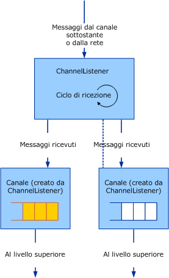

# Servizio: listener del canale e canali
Esistono tre categorie di oggetti del canale: canali, listener del canale e channel factory.I canali sono l'interfaccia tra l'applicazione e lo stack dei canali.I listener del canale sono responsabili della creazione di canali sul lato che riceve \(o in ascolto\), in genere in risposta a un messaggio in arrivo nuovo o a una connessione.I channel factory sono responsabili della creazione di canali sul lato di invio per iniziare la comunicazione con un endpoint.  
  
## Listener del canale e canali  
 I listener del canale sono responsabili della creazione di canali e della ricezione di messaggi dal livello inferiore o dalla rete.I messaggi ricevuti sono recapitati al livello superiore utilizzando un canale creato dal listener del canale.  
  
 Nel diagramma seguente è illustrato il processo di ricezione dei messaggi e del loro recapito al livello superiore.  
  
   
Listener di canale che riceve messaggi e li recapita al livello superiore tramite canali.  
  
 Il processo può essere rappresentato concettualmente come una coda all'interno di ogni canale, anche se l'implementazione non utilizza effettivamente una coda.Un listener del canale è responsabile della ricezione di messaggi dal livello inferiore o dalla rete e del loro inserimento nella coda.Il canale è responsabile del recupero dei messaggi dalla coda e della consegna dei messaggi al livello superiore quando questo richiede un messaggio, ad esempio chiamando `Receive` sul canale.  
  
 [!INCLUDE[indigo2](../../../../includes/indigo2-md.md)] fornisce supporti di classi di base per questo processo.Per un diagramma delle classi di supporto del canale descritte in questo argomento, vedere [Panoramica sul modello dei canali](../../../../docs/framework/wcf/extending/channel-model-overview.md).  
  
-   La classe <xref:System.ServiceModel.Channels.CommunicationObject> implementa <xref:System.ServiceModel.ICommunicationObject> e attiva la macchina a stati descritta nel passaggio 2 di [Sviluppo di canali](../../../../docs/framework/wcf/extending/developing-channels.md).  
  
-   La classe <xref:System.ServiceModel.Channels.ChannelManagerBase> implementa <xref:System.ServiceModel.Channels.CommunicationObject> e fornisce una classe di base unificata per <xref:System.ServiceModel.Channels.ChannelFactoryBase> e <xref:System.ServiceModel.Channels.ChannelListenerBase>.La classe <xref:System.ServiceModel.Channels.ChannelManagerBase> opera unitamente alla classe <xref:System.ServiceModel.Channels.ChannelBase>, una classe di base che implementa l'interfaccia <xref:System.ServiceModel.Channels.IChannel>.  
  
-   La classe ``<xref:System.ServiceModel.Channels.ChannelFactoryBase> implementa <xref:System.ServiceModel.Channels.ChannelManagerBase> e <xref:System.ServiceModel.Channels.IChannelFactory> e consolida gli overload `CreateChannel` in un unico metodo astratto `OnCreateChannel`.  
  
-   La classe <xref:System.ServiceModel.Channels.ChannelListenerBase> implementa <xref:System.ServiceModel.Channels.IChannelListener>.Si occupa della gestione dello stato di base.  
  
 La discussione seguente è basata sull'esempio di [Trasporto UDP](../../../../docs/framework/wcf/samples/transport-udp.md).  
  
## Creazione di un listener del canale  
 Il Listener Canale Udp `` implementato nell'esempio deriva dalla classe <xref:System.ServiceModel.Channels.ChannelListenerBase>.Utilizza un solo socket UDP per ricevere datagrammi.Il metodo `OnOpen` riceve dati utilizzando il socket UDP in un ciclo asincrono.I dati vengono quindi convertiti in messaggi utilizzando il sistema di codifica messaggi:  
  
```  
message = UdpConstants.MessageEncoder.ReadMessage(  
  new ArraySegment<byte>(buffer, 0, count),   
  bufferManager  
);  
```  
  
 Poiché lo stesso canale del datagramma rappresenta messaggi in arrivo da un certo numero di origini, `UdpChannelListener` è un listener singleton.Esiste al massimo un elemento <xref:System.ServiceModel.Channels.IChannel>`` attivo associato a questo listener alla volta.Nell'esempio ne viene generato un altro solo se un canale restituito dal metodo <xref:System.ServiceModel.Channels.ChannelListenerBase%601.AcceptChannel%2A> viene successivamente eliminato.Quando un messaggio viene ricevuto, viene accodato in questo canale singleton.  
  
### UdpInputChannel  
 La classe `UdpInputChannel` implementa <xref:System.ServiceModel.Channels.IInputChannel>.È composta da una coda di messaggi in arrivo popolata dal socket di `UdpChannelListener`.La coda di questi messaggi viene annullata dal metodo <xref:System.ServiceModel.Channels.IInputChannel.Receive%2A>.