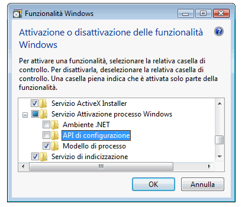
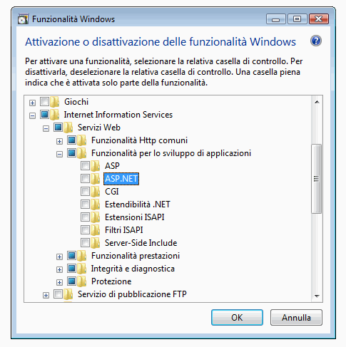
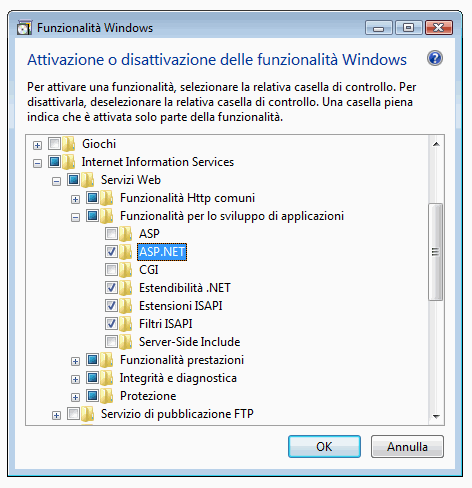
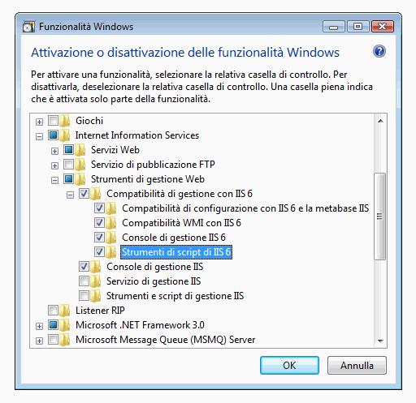

# Configurazione di Internet Information Services 7.0 per Windows Communication Foundation
Internet Information Services \(IIS\) 7.0 dispone di una progettazione modulare che consente di installare in modo selettivo i componenti necessari.Questa progettazione si basa sulla nuova tecnologia di componentizzazione basata su manifesti introdotta in [!INCLUDE[wv](../../../../includes/wv-md.md)].Sono disponibili più di 40 componenti di [!INCLUDE[iisver](../../../../includes/iisver-md.md)] con funzionalità autonome, che possono essere installati in modo indipendente.I professionisti IT possono così personalizzare con facilità l'installazione in base alle esigenze.In questo argomento viene illustrato come configurare [!INCLUDE[iisver](../../../../includes/iisver-md.md)] per l'utilizzo con [!INCLUDE[indigo1](../../../../includes/indigo1-md.md)] e come determinare i componenti necessari.  
  
## Installazione minima: installazione di WAS  
 L'installazione minima dell'intero pacchetto di [!INCLUDE[iisver](../../../../includes/iisver-md.md)] prevede l'installazione del servizio Attivazione processo Windows \(WAS, Windows Process Activation Service\).Tale servizio è una funzionalità autonoma nonché la sola funzionalità di [!INCLUDE[iisver](../../../../includes/iisver-md.md)] disponibile per tutti i sistemi operativi [!INCLUDE[wv](../../../../includes/wv-md.md)] \(Home Basic, Home Premium, Business, Ultimate ed Enterprise\).  
  
 In Pannello di controllo, scegliere **Programmi**, quindi fare clic su **Attivazione o disattivazione delle funzionalità Windows** presente in **Programmi e funzionalità**; il componente WAS è riportato nell'elenco come illustrato nell'immagine seguente.  
  
   
  
 Questa funzionalità presenta i sottocomponenti seguenti:  
  
-   Ambiente .NET  
  
-   API di configurazione  
  
-   Modello di processo  
  
 Se si seleziona il nodo principale di WAS, per impostazione predefinita viene selezionato solo il sottonodo **Modello di processo**.Si noti che con questa installazione verrà installato solo il servizio WAS poiché non è disponibile alcun supporto per un server Web.  
  
 Per il funzionamento di [!INCLUDE[indigo2](../../../../includes/indigo2-md.md)] o di qualsiasi applicazione [!INCLUDE[vstecasp](../../../../includes/vstecasp-md.md)], selezionare la casella di controllo **Ambiente .NET**.Questo significa che sono necessari tutti i componenti WAS per il corretto funzionamento di [!INCLUDE[indigo2](../../../../includes/indigo2-md.md)] e [!INCLUDE[vstecasp](../../../../includes/vstecasp-md.md)].Questi verranno selezionati automaticamente una volta installati tali componenti.  
  
## IIS 7.0: installazione predefinita  
 Selezionando la funzionalità **Internet Information Services**, verranno automaticamente selezionati alcuni sottonodi, come illustrato nell'immagine seguente.  
  
   
  
 Questa è l'installazione predefinita di [!INCLUDE[iisver](../../../../includes/iisver-md.md)].Con essa è possibile utilizzare [!INCLUDE[iisver](../../../../includes/iisver-md.md)] per gestire contenuto statico \(ad esempio pagine HTML e altro contenuto\).Non è tuttavia possibile eseguire applicazioni [!INCLUDE[vstecasp](../../../../includes/vstecasp-md.md)] o CGI o ospitare servizi [!INCLUDE[indigo2](../../../../includes/indigo2-md.md)].  
  
## IIS 7.0: installazione con supporto ASP.NET  
 È necessario installare [!INCLUDE[vstecasp](../../../../includes/vstecasp-md.md)] perché [!INCLUDE[vstecasp](../../../../includes/vstecasp-md.md)] possa essere eseguito in IIS 7.0..Dopo avere selezionato **ASP.NET**, verrà visualizzata la schermata seguente.  
  
   
  
 Si tratta dell'ambiente minimo per il funzionamento delle applicazioni [!INCLUDE[indigo2](../../../../includes/indigo2-md.md)] e [!INCLUDE[vstecasp](../../../../includes/vstecasp-md.md)] in [!INCLUDE[iisver](../../../../includes/iisver-md.md)].  
  
## IIS 7.0: installazione con componenti compatibilità gestione IIS 6.0  
 Quando si installa [!INCLUDE[iisver](../../../../includes/iisver-md.md)] in un sistema con Visual Studio 2005 o alcuni altri script o strumenti di automazione \(ad esempio Adsutil.vbs\) che configurano applicazioni virtuali che utilizzano l'API della metabase di [!INCLUDE[iis601](../../../../includes/iis601-md.md)], assicurarsi di selezionare **Strumenti di script** di [!INCLUDE[iis601](../../../../includes/iis601-md.md)].In questo modo verranno selezionati automaticamente gli altri sottonodi di **Compatibilità di gestione** con [!INCLUDE[iis601](../../../../includes/iis601-md.md)].Nell'illustrazione seguente viene mostrata la schermata visualizzata dopo l'esecuzione di questa operazione.  
  
   
  
 Con questa installazione si ottiene la disponibilità di tutto quanto necessario per utilizzare le funzionalità [!INCLUDE[iisver](../../../../includes/iisver-md.md)],[!INCLUDE[vstecasp](../../../../includes/vstecasp-md.md)] e [!INCLUDE[indigo2](../../../../includes/indigo2-md.md)] e i relativi esempi sul Web.  
  
## Limiti di richiesta.  
 In [!INCLUDE[wv](../../../../includes/wv-md.md)] con IIS 7 il valore predefinito delle impostazioni `maxUri` e `maxQueryStringSize` è stato modificato.Per impostazione predefinita, il filtro di richiesta in IIS 7.0 consente una lunghezza dell'URL di 4096 caratteri e una lunghezza della stringa di query di 2048 caratteri.Per modificare questi valori predefiniti, aggiungere il codice XML seguente al file App.config:  
  
 `<system.webServer>`  
  
 `<security>`  
  
 `<requestFiltering>`  
  
 `<requestLimits maxUrl=”8192” maxQueryString=”8192” />`  
  
 `</requestFiltering>`  
  
 `</security>`  
  
 `</system.webServer>`  
  
## Vedere anche  
 [Architettura di attivazione WAS](../../../../docs/framework/wcf/feature-details/was-activation-architecture.md)   
 [Configurazione WAS per l'utilizzo con WCF](../../../../docs/framework/wcf/feature-details/configuring-the-wpa--service-for-use-with-wcf.md)   
 [Procedura: installare e configurare componenti di attivazione WCF](../../../../docs/framework/wcf/feature-details/how-to-install-and-configure-wcf-activation-components.md)   
 [Funzionalità di hosting di AppFabric](http://go.microsoft.com/fwlink/?LinkId=201276)