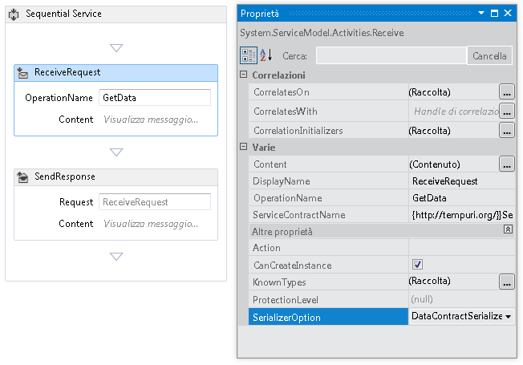
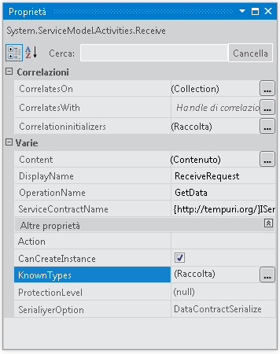
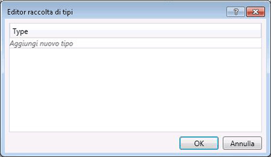

# Configurazione della serializzazione in un servizio del flusso di lavoro
I servizi del flusso di lavoro sono servizi [!INCLUDE[indigo1](../../../../includes/indigo1-md.md)] che quindi dispongono della facoltà di utilizzare <xref:System.Runtime.Serialization.DataContractSerializer> \(impostazione predefinita\) o <xref:System.Xml.Serialization.XmlSerializer>.Durante la scrittura dei servizi non del flusso di lavoro, il tipo di serializzatore da utilizzare viene specificato nel contratto del servizio o dell'operazione.Quando si creano servizi del flusso di lavoro di [!INCLUDE[indigo2](../../../../includes/indigo2-md.md)], non si specificano questi contratti nel codice, piuttosto si generano durante il runtime dall'inferenza del contratto.[!INCLUDE[crabout](../../../../includes/crabout-md.md)] inferenza del contratto, vedere  [Utilizzo di contratti nel flusso di lavoro](../../../../docs/framework/wcf/feature-details/using-contracts-in-workflow.md).Il serializzatore viene specificato tramite la proprietà <xref:System.ServiceModel.Activities.Receive.SerializerOption%2A>che può essere impostata come mostrato nella finestra di progettazione nell'illustrazione seguente.  
  
   
  
 Il serializzatore può essere impostato anche nel codice, come mostrato nell'esempio seguente.  
  
```  
Receive approveExpense = new Receive  
            {  
                OperationName = "ApproveExpense",  
                CanCreateInstance = true,  
                ServiceContractName = "FinanceService",  
                SerializerOption = SerializerOption.DataContractSerializer,  
                Content = ReceiveContent.Create(new OutArgument<Expense>(expense))  
            };  
  
```  
  
 È possibile specificare tipi noti anche sui servizi del flusso di lavoro.[!INCLUDE[crabout](../../../../includes/crabout-md.md)] tipi noti, vedere [Tipi conosciuti di contratto dati](../../../../docs/framework/wcf/feature-details/data-contract-known-types.md).È possibile specificare i tipi noti nella finestra di progettazione o nel codice.Per specificare i tipi noti nella finestra di progettazione, fare clic sul pulsante con i puntini di sospensione accanto alla proprietà KnownTypes nella finestra delle proprietà per un'attività <xref:System.ServiceModel.Activities.Receive>, come mostrato nell'illustrazione seguente.  
  
   
  
 Viene visualizzato l'editor della raccolta dei tipi che consente di cercare e specificare i tipi noti.  
  
   
  
 Fare clic sul collegamento **Aggiungi nuovo tipo** e utilizzare il menu a discesa per selezionare o cercare un tipo da aggiungere alla raccolta dei tipi noti.Per specificare i tipi noti nel codice, utilizzare la proprietà <xref:System.ServiceModel.Activities.Receive.KnownTypes%2A>, come mostrato nell'esempio riportato di seguito.  
  
```  
Receive approveExpense = new Receive  
            {  
                OperationName = "ApproveExpense",  
                CanCreateInstance = true,  
                ServiceContractName = "FinanceService",  
                SerializerOption = SerializerOption.DataContractSerializer,  
                Content = ReceiveContent.Create(new OutArgument<Expense>(expense))  
            };  
            approveExpense.KnownTypes.Add(typeof(Travel));  
            approveExpense.KnownTypes.Add(typeof(Meal));  
  
```  
  
 Per vedere un esempio di codice completo che mostra come configurare la serializzazione per un servizio del flusso di lavoro, vedere [Formattazione di messaggi nei servizi flusso di lavoro](../../../../docs/framework/windows-workflow-foundation/samples/formatting-messages-in-workflow-services.md).