# Creazione di un servizio flusso di lavoro a esecuzione prolungata
In questo argomento viene descritto come creare un servizio di flusso di lavoro a esecuzione prolungata.  L'esecuzione di tali servizi può durare molto tempo.  A un certo punto, è possibile che il flusso di lavoro diventi inattivo a causa dell'attesa di informazioni aggiuntive.  In tal caso, il flusso di lavoro viene salvato in modo permanente in un database SQL e rimosso dalla memoria.  Quando le informazioni aggiuntive diventano disponibili, l'istanza del flusso di lavoro viene caricata di nuovo in memoria e ne viene continuata l'esecuzione.  In questo scenario viene implementato un sistema di ordini molto semplificato.  Per avviare la procedura di ordine, dal client viene inviato un messaggio iniziale al servizio di flusso di lavoro che, a sua volta,  consente la restituzione di un ID ordine al client.  A questo punto, a causa dell'attesa di un altro messaggio inviato dal client, il servizio di flusso di lavoro diventa inattivo e viene salvato in modo permanente in un database SQL Server.  Quando dal client viene inviato il messaggio successivo per ordinare un elemento, il servizio di flusso di lavoro viene caricato di nuovo in memoria consentendo il completamento dell'elaborazione dell'ordine.  Nell'esempio di codice viene restituita una stringa in cui viene indicato che l'elemento è stato aggiunto all'ordine.  L'esempio di codice non è stato ideato per corrispondere a un'applicazione reale della tecnologia, ma piuttosto per fornire un esempio semplice in cui vengono illustrati i servizi di flusso di lavoro a esecuzione prolungata. In questo argomento si presuppone che l'utente sia in grado di creare progetti e soluzioni di [!INCLUDE[vs_current_long](../../../../includes/vs-current-long-md.md)].  
  
## Prerequisiti  
 Per utilizzare questa procedura dettagliata è necessario aver installato i software seguenti:  
  
1.  Microsoft SQL Server 2008  
  
2.  [!INCLUDE[vs_current_long](../../../../includes/vs-current-long-md.md)]  
  
3.  Microsoft [!INCLUDE[netfx_current_long](../../../../includes/netfx-current-long-md.md)]  
  
4.  È necessario conoscere WCF e [!INCLUDE[vs_current_long](../../../../includes/vs-current-long-md.md)], nonché essere in grado di creare progetti e soluzioni.  
  
### Per impostare il database SQL  
  
1.  Per salvare in modo permanente le istanze del servizio di flusso di lavoro è necessario disporre di Microsoft SQL Server e configurare un database per archiviare le istanze del flusso di lavoro salvate in modo permanente.  Eseguire Microsoft SQL Server Management Studio facendo clic sul pulsante **Start**, selezionando **Tutti i programmi**, **Microsoft SQL Server 2008**, quindi **Microsoft SQL Server Management Studio**.  
  
2.  Fare clic sul pulsante **Connetti** per accedere all'istanza di SQL Server  
  
3.  Fare clic con il pulsante destro del mouse su **Database** nella visualizzazione albero e selezionare **Nuovo database** per creare un nuovo database denominato `SQLPersistenceStore`.  
  
4.  Eseguire il file di script SqlWorkflowInstanceStoreSchema.sql presente nella directory C:\\Windows\\Microsoft.NET\\Framework\\v4.0\\SQL\\en del database SQLPersistenceStore per configurare gli schemi del database necessari.  
  
5.  Eseguire il file di script SqlWorkflowInstanceStoreLogic.sql presente nella directory C:\\Windows\\Microsoft.NET\\Framework\\v4.0\\SQL\\en del database SQLPersistenceStore per configurare la logica del database necessaria.  
  
### Per creare il servizio di flusso di lavoro ospitato dal Web  
  
1.  Creare una soluzione di [!INCLUDE[vs_current_long](../../../../includes/vs-current-long-md.md)] vuota e denominarla `OrderProcessing`.  
  
2.  Aggiungere un nuovo progetto Applicazione di servizi flusso di lavoro [!INCLUDE[indigo2](../../../../includes/indigo2-md.md)] denominato `OrderService` alla soluzione.  
  
3.  Nella finestra di dialogo delle proprietà del progetto selezionare la scheda **Web**.  
  
    1.  In **Azione di avvio** selezionare **Pagina specifica**, quindi specificare `Service1.xamlx`.  
  
           
  
    2.  In **Server** selezionare **Usa server Web IIS locale**.  
  
         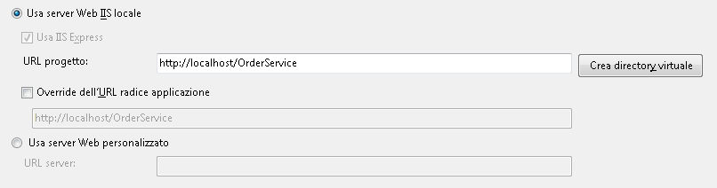  
  
        > [!WARNING]
        >  Per effettuare tale impostazione, è necessario eseguire [!INCLUDE[vs_current_long](../../../../includes/vs-current-long-md.md)] in modalità amministratore.  
  
         Questi due passaggi consentono di configurare il progetto del servizio di flusso di lavoro che deve essere ospitato da IIS.  
  
4.  Se non è già aperto, aprire `Service1.xamlx` ed eliminare le attività **ReceiveRequest** e **SendResponse** esistenti.  
  
5.  Selezionare l'attività **Sequential Service**, fare clic sul collegamento **Variabili** e aggiungere le variabili mostrate nell'immagine seguente.  In questo modo verranno aggiunte alcune variabili che saranno utilizzate successivamente nel servizio di flusso di lavoro.  
  
    > [!NOTE]
    >  Se CorrelationHandle non è presente nell'elenco a discesa Tipo di variabile, selezionare **Cerca tipi** nell'elenco a discesa.  Digitare CorrelationHandle nella casella **Nome tipo**, selezionare CorrelationHandle nella casella di riepilogo e fare clic su **OK**.  
  
     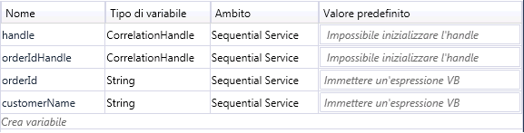  
  
6.  Trascinare un modello di attività **ReceiveAndSendReply** nell'attività **Sequential Service**.  Un messaggio inviato da un client verrà ricevuto da questo set di attività tramite cui, a sua volta, verrà restituita una risposta.  
  
    1.  Selezionare l'attività **Receive** e impostare le proprietà evidenziate nell'immagine seguente.  
  
         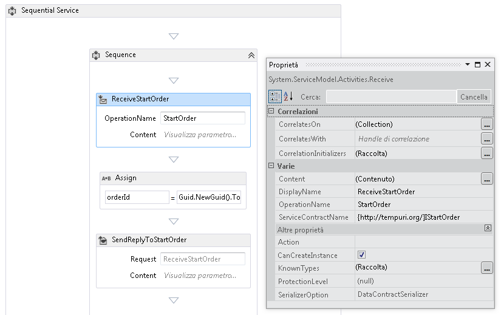  
  
         La proprietà DisplayName consente di impostare il nome visualizzato per l'attività Receive nella finestra di progettazione.  Le proprietà ServiceContractName e OperationName specificano il nome del contratto di servizio e della relativa operazione implementati dall'attività Receive.  [!INCLUDE[crabout](../../../../includes/crabout-md.md)]lla modalità di utilizzo dei contratti nei servizi di flusso di lavoro, vedere [Utilizzo di contratti nel flusso di lavoro](../../../../docs/framework/wcf/feature-details/using-contracts-in-workflow.md).  
  
    2.  Fare clic sul collegamento **Definisci** nell'attività **ReceiveStartOrder** e impostare le proprietà mostrate nell'immagine seguente.  Si noti che il pulsante di opzione **Parametri** è selezionato, mentre un parametro denominato `p_customerName` è associato alla variabile `customerName`.  In questo modo, l'attività **Receive** viene configurata per ricevere dati e associare questi ultimi alle variabili locali.  
  
         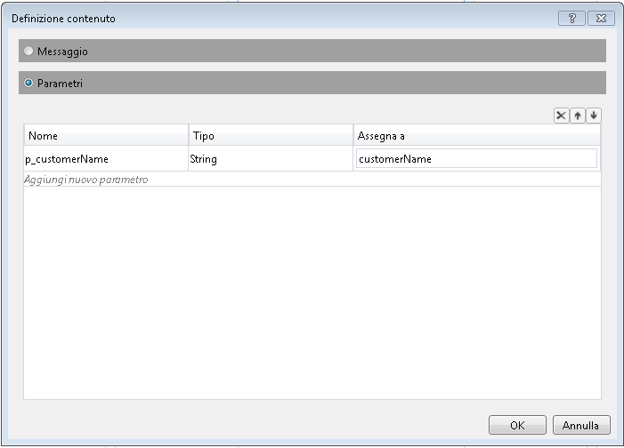  
  
    3.  Selezionare l'attività **SendReplyToReceive** e impostare la proprietà evidenziata mostrata nell'immagine seguente.  
  
         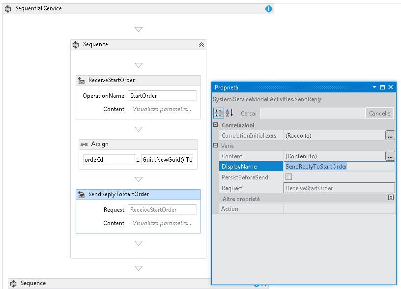  
  
    4.  Fare clic sul collegamento **Definisci** nell'attività **SendReplyToStartOrder** e impostare le proprietà mostrate nell'immagine seguente.  Si noti che il pulsante di opzione **Parametri** è selezionato, mentre un parametro denominato `p_orderId` è associato alla variabile `orderId`.  Questa impostazione consente di specificare che tramite l'attività SendReplyToStartOrder verrà restituito un valore di tipo stringa al chiamante.  
  
         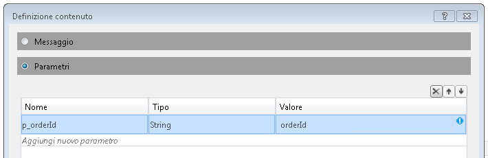  
  
        > [!NOTE]
    5.  Trascinare un'attività Assign tra le attività **Receive** e **SendReply** e impostare le proprietà come mostrato nell'immagine seguente:  
  
         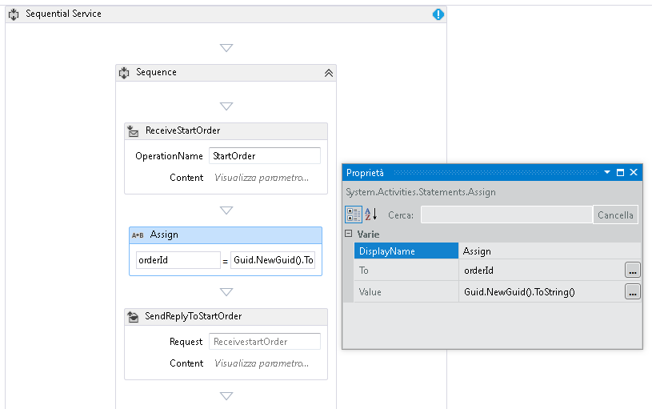  
  
         In questo modo viene creato un nuovo ID ordine e il valore viene inserito nella variabile orderId.  
  
    6.  Selezionare l'attività **ReplyToStartOrder**.  Nella finestra delle proprietà fare clic sul pulsante con i puntini di sospensione per **CorrelationInitializers**.  Selezionare il collegamento **Aggiungi inizializzatore**, immettere `orderIdHandle` nella casella di testo dell'inizializzatore, selezionare l'inizializzatore correlazione query per il tipo di correlazione, quindi scegliere p\_orderId nella casella a discesa Query XPATH.  Queste impostazioni sono mostrate nell'immagine seguente.  Fare clic su **OK**.  Tale operazione consente di inizializzare una correlazione tra il client e questa istanza del servizio di flusso di lavoro.  Quando viene ricevuto un messaggio contenente questo ID ordine, viene indirizzato a questa istanza del servizio di flusso di lavoro.  
  
         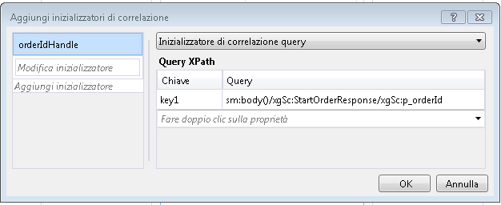  
  
7.  Trascinare un'altra attività **ReceiveAndSendReply** alla fine del flusso di lavoro \(all'esterno della **Sequenza** contenente le prime attività **Receive** e **SendReply**\).  Un secondo messaggio inviato dal client verrà ricevuto dal flusso di lavoro tramite cui, a sua volta, verrà fornita una risposta.  
  
    1.  Selezionare la **Sequenza** contenente le attività **Receive** e **SendReply** appena aggiunte e fare clic sul pulsante **Variabili**.  Aggiungere la variabile evidenziata nell'immagine seguente:  
  
         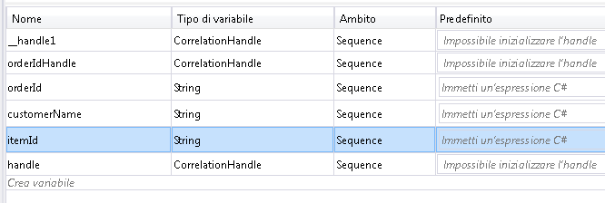  
  
    2.  Selezionare l'attività **Receive** e impostare le proprietà mostrate nell'immagine seguente:  
  
         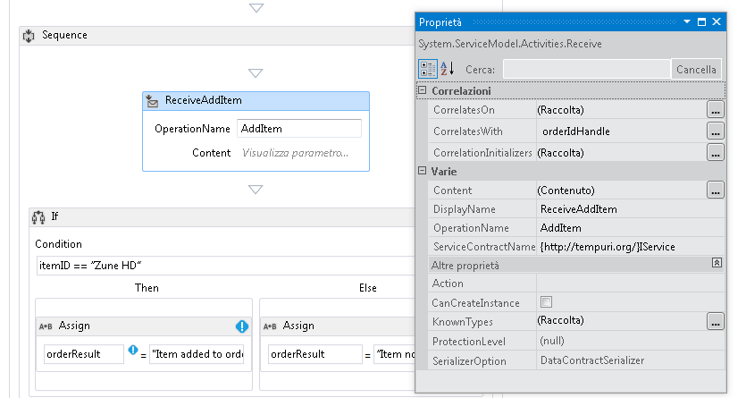  
  
    3.  Fare clic sul collegamento **Definisci** nell'attività **ReceiveAddItem** e aggiungere i parametri mostrati nell'immagine seguente. In questo modo l'attività Receive viene configurata per accettare due parametri, l'ID ordine e l'ID dell'elemento ordinato.  
  
         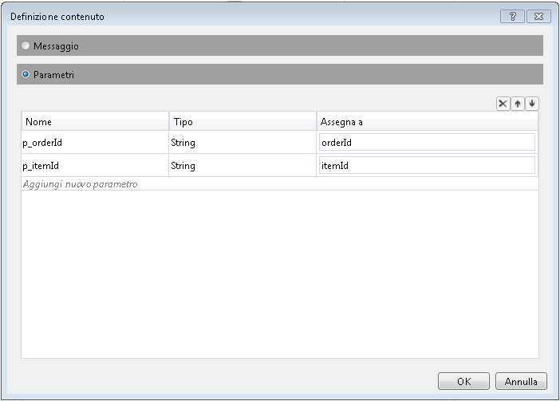  
  
    4.  Fare clic sul pulsante con i puntini di sospensione **CorrelateOn** e immettere `orderIdHandle`.  In **Query XPath** fare clic sulla freccia a discesa e selezionare `p_orderId`.  In questo modo la correlazione viene configurata sulla seconda attività Receive.  [!INCLUDE[crabout](../../../../includes/crabout-md.md)]lla correlazione, vedere [Correlazione](../../../../docs/framework/wcf/feature-details/correlation.md).  
  
         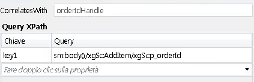  
  
    5.  Trascinare un'attività **If** immediatamente dopo l'attività **ReceiveAddItem**.  Il comportamento di questa attività è uguale a quello di un'istruzione IF.  
  
        1.  Impostare la proprietà **Condition** su `itemId==”Zune HD” (itemId=”Zune HD” for Visual Basic)`  
  
        2.  Trascinare un'attività **Assign** nella sezione **Then** e un'altra nella sezione **Else**, quindi impostare le proprietà delle attività **Assign** come mostrato nell'immagine seguente.  
  
             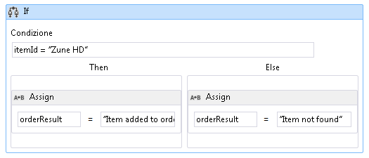  
  
             Se la condizione è `true`, verrà eseguita la sezione **Then**.  Se la condizione è `false`, verrà eseguita la sezione **Else**.  
  
        3.  Selezionare l'attività **SendReplyToReceive** e impostare la proprietà **DisplayName** mostrata nell'immagine seguente.  
  
             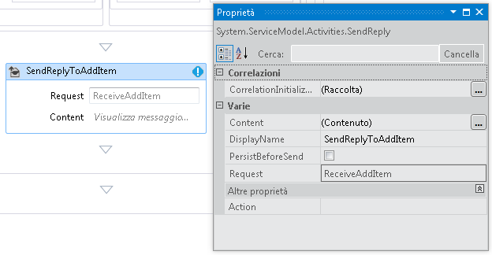  
  
        4.  Fare clic sul collegamento **Definisci** nell'attività **SetReplyToAddItem** e configurarlo come mostrato nell'immagine seguente.  In questo modo l'attività **SendReplyToAddItem** viene configurata per restituire il valore nella variabile `orderResult`.  
  
             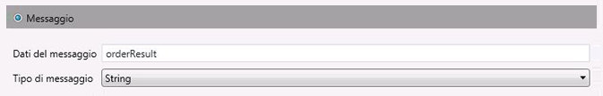  
  
8.  Aprire il file web.config e aggiungere gli elementi seguenti nella sezione \<behavior\> per abilitare il salvataggio permanente del flusso di lavoro.  
  
    ```xml  
    <sqlWorkflowInstanceStore connectionString="Data Source=your-machine\SQLExpress;Initial Catalog=SQLPersistenceStore;Integrated Security=True;Asynchronous Processing=True" instanceEncodingOption="None" instanceCompletionAction="DeleteAll" instanceLockedExceptionAction="BasicRetry" hostLockRenewalPeriod="00:00:30" runnableInstancesDetectionPeriod="00:00:02" />  
              <workflowIdle timeToUnload="0"/>  
  
    ```  
  
    > [!WARNING]
    >  Assicurarsi di sostituire l'host e il nome dell'istanza di SQL Server nel frammento di codice precedente.  
  
9. Compilare la soluzione.  
  
### Per creare un'applicazione client e chiamare il servizio di flusso di lavoro  
  
1.  Aggiungere un nuovo progetto di applicazione console denominato `OrderClient` alla soluzione.  
  
2.  Aggiungere riferimenti agli assembly seguenti al progetto `OrderClient`  
  
    1.  System.ServiceModel.dll  
  
    2.  System.ServiceModel.Activities.dll  
  
3.  Aggiungere un riferimento al servizio di flusso di lavoro e specificare `OrderService` come spazio dei nomi.  
  
4.  Nel metodo `Main()` del progetto client aggiungere il codice seguente:  
  
    ```  
    static void Main(string[] args)  
    {  
       // Send initial message to start the workflow service  
       Console.WriteLine("Sending start message");  
       StartOrderClient startProxy = new StartOrderClient();  
       string orderId = startProxy.StartOrder("Kim Abercrombie");  
  
       // The workflow service is now waiting for the second message to be sent  
       Console.WriteLine("Workflow service is idle...");  
       Console.WriteLine("Press [ENTER] to send an add item message to reactivate the workflow service...");  
       Console.ReadLine();  
  
       // Send the second message  
       Console.WriteLine("Sending add item message");  
       AddItemClient addProxy = new AddItemClient();  
       AddItem item = new AddItem();  
       item.p_itemId = "Zune HD";  
       item.p_orderId = orderId;  
  
       string orderResult = addProxy.AddItem(item);  
       Console.WriteLine("Service returned: " + orderResult);  
    }  
  
    ```  
  
5.  Compilare la soluzione ed eseguire l'applicazione `OrderClient`.  Nel client verrà visualizzato il testo seguente:  
  
    ```Output  
  
                  Sending start message  
    Workflow service is idle...  Press [ENTER] to send an add item message to reactivate the workflow service...    
    ```  
  
6.  Per verificare che il servizio di flusso di lavoro sia stato salvato in modo permanente, avviare SQL Server Management Studio facendo clic sul menu **Start**, selezionando **Tutti i programmi**, **Microsoft SQL Server 2008**, **SQL Server Management Studio**.  
  
    1.  Nel riquadro di sinistra espandere **Database**, **SQLPersistenceStore**, **Visualizzazioni**, fare clic con il pulsante destro del mouse su **System.Activities.DurableInstancing.Instances**, quindi selezionare **Seleziona le prime 1000 righe**.  Nel riquadro **Risultati** verificare che sia elencata almeno un'istanza.  Se durante l'esecuzione si è verificata un'eccezione potrebbero essere presenti altre istanze di esecuzioni precedenti.  È possibile eliminare le righe esistenti facendo clic con il pulsante destro del mouse su **System.Activities.DurableInstancing.Instances**, selezionando **Modifica le prime 200 righe**, premendo il pulsante **Esegui**, selezionando tutte le righe nel riquadro dei risultati e scegliendo **Elimina**.  Per verificare che l'istanza visualizzata nel database sia l'istanza creata dall'applicazione, controllare che la visualizzazione delle istanze sia vuota prima di eseguire il client.  Quando il client è in esecuzione, eseguire di nuovo la query \(Seleziona le prime 1000 righe\) e verificare che sia stata aggiunta una nuova istanza.  
  
7.  Premere INVIO per inviare il messaggio relativo all'aggiunta di elementi al servizio di flusso di lavoro.  Nel client verrà visualizzato il testo seguente:  
  
    ```Output  
  
                  Sending add item message  
    Service returned: Item added to order  
    Premere un tasto qualsiasi per continuare.  .  .    
    ```  
  
## Vedere anche  
 [Servizi flusso di lavoro](../../../../docs/framework/wcf/feature-details/workflow-services.md)