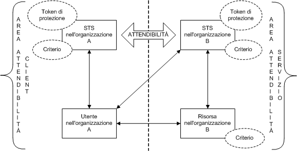
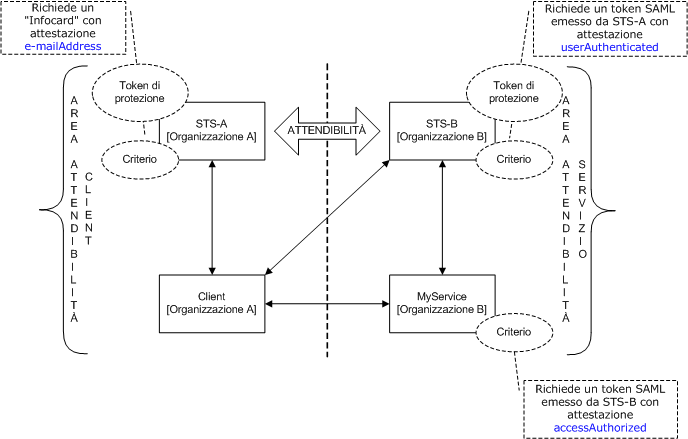
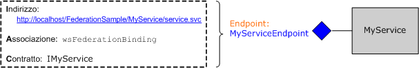
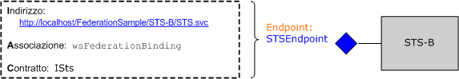
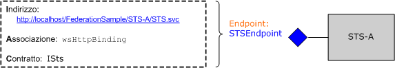

# Federazione
In questo argomento viene illustrato brevemente il concetto di sicurezza federata.Viene inoltre descritto il supporto [!INCLUDE[indigo1](../../../../includes/indigo1-md.md)] per la distribuzione di architetture di sicurezza federata.Per un'applicazione di esempio sulla federazione, vedere [Esempio di federazione](../../../../docs/framework/wcf/samples/federation-sample.md).  
  
## Definizione di sicurezza federata  
 La protezione federata consente di separare con precisione il servizio al quale sta accedendo un client dalle procedure pertinenti di autenticazione e di autorizzazione.La protezione federata consente inoltre la collaborazione attraverso più sistemi, reti e organizzazioni in diverse aree di attendibilità.  
  
 [!INCLUDE[indigo2](../../../../includes/indigo2-md.md)] fornisce il supporto per creare e distribuire sistemi distribuiti che utilizzano la protezione federata.  
  
### Elementi di un'architettura di sicurezza federata  
 L'architettura di sicurezza federata è composta da tre elementi principali, come descritto nella tabella seguente.  
  
|Elemento|Descrizione|  
|--------------|-----------------|  
|Dominio\/area|Una singola unità di amministrazione di sicurezza o attendibilità.Un dominio tipico potrebbe includere una sola organizzazione.|  
|Federazione|Una raccolta di domini che hanno stabilito una relazione di trust.Il livello di attendibilità può variare, ma in genere include l'autenticazione e quasi sempre l'autorizzazione.Una federazione tipica potrebbe includere numerose organizzazioni che hanno stabilito una relazione di trust per l'accesso condiviso a un set di risorse.|  
|Servizio Token di sicurezza \(STS, Security Token Service\)|Servizio Web che rilascia token di sicurezza, ovvero, fa asserzioni basate su evidenze che considera attendibili, a chiunque lo consideri attendibile.Questa è la base della negoziazione di attendibilità tra domini.|  
  
### Scenario di esempio  
 Nella figura seguente viene illustrato un esempio di sicurezza federata.  
  
   
  
 In questo scenario sono incluse due organizzazioni: A e B.L'organizzazione B ha una risorsa Web \(un servizio Web\) che alcuni utenti dell'organizzazione A ritengono preziosa.  
  
> [!NOTE]
>  In questa sezione, vengono utilizzati indifferentemente i termini *risorsa*, *servizio* e *servizio Web*.  
  
 L'organizzazione B richiede in genere che un utente dell'organizzazione A fornisca un tipo valido di autenticazione prima di accedere al servizio.Potrebbe inoltre richiedere che l'utente venga autorizzato ad accedere alla risorsa specifica in questione.Un modo per risolvere questo problema e consentire agli utenti dell'organizzazione A di accedere alla risorsa nell'organizzazione B è il seguente:  
  
-   Gli utenti dell'organizzazione A registrano le proprie credenziali \(un nome utente e una password\) presso l'organizzazione B.  
  
-   Durante l'accesso alla risorsa, gli utenti dell'organizzazione A presentano le proprie credenziali all'organizzazione B e vengono autenticati prima di accedere alla risorsa.  
  
 Questo approccio ha tre grandi inconvenienti:  
  
-   L'organizzazione B deve gestire le credenziali degli utenti dell'organizzazione A, oltre a quelle dei propri utenti locali.  
  
-   Gli utenti dell'organizzazione A devono mantenere un set aggiuntivo di credenziali \(ovvero, ricordare un nome utente e una password in più\), oltre a quelle normalmente utilizzate per accedere alle risorse all'interno dell'organizzazione A.Ciò incoraggia la pratica dell'utilizzo dello stesso nome utente e della stessa password in più siti del servizio, il che non è una misura efficace di sicurezza.  
  
-   L'architettura non si adatta, in quanto più organizzazioni percepiscono la risorsa dell'organizzazione B come di un qualche valore.  
  
 Un approccio alternativo, che risolve gli inconvenienti menzionati in precedenza, consiste nell'utilizzare la protezione federata.In questo approccio, le organizzazioni A e B stabiliscono una relazione di trust e utilizzano il servizio token di sicurezza \(STS, Security Token Service\) per consentire la negoziazione della relazione di trust stabilita.  
  
 In un'architettura di sicurezza federata, gli utenti dell'organizzazione A sanno che se vogliono accedere al servizio Web dell'organizzazione B devono presentare un token di sicurezza valido dall'STS dell'organizzazione B, che autentica e autorizza il loro accesso al servizio specifico.  
  
 Quando contattano l'STS B, gli utenti ricevono un altro livello di riferimento indiretto dal criterio associato a STS.Devono presentare un token di sicurezza valido da STS A \(ovvero, l'area di attendibilità del client\) prima che STS B possa rilasciare loro un token di sicurezza.Si tratta di un corollario della relazione di trust stabilita tra le due organizzazioni e implica che l'organizzazione B non deve gestire le identità degli utenti dell'organizzazione A.In pratica, STS B in genere ha `issuerAddress` e `issuerMetadataAddress` Null.[!INCLUDE[crdefault](../../../../includes/crdefault-md.md)][Procedura: configurare un emittente locale](../../../../docs/framework/wcf/feature-details/how-to-configure-a-local-issuer.md).In tal caso, il client consulta criteri locali per individuare STS A.Questa configurazione è chiamata *federazione dell'area di autenticazione principale* e si adatta meglio perché STS B non deve conservare informazioni su STS A.  
  
 Gli utenti contattano quindi l'STS dell'organizzazione A e ottengono un token di sicurezza presentando le credenziali di autenticazione che utilizzano normalmente per accedere a qualsiasi altra risorsa all'interno dell'organizzazione A.In tal modo, si evita loro di dover conservare più set di credenziali o utilizzare lo stesso set di credenziali in più siti del servizio.  
  
 Una volta ottenuto un token di sicurezza da STS A, gli utenti lo presentano a STS B.L'organizzazione B procede per eseguire l'autorizzazione delle richieste degli utenti e rilascia loro un token di sicurezza preso dal proprio set di token di sicurezza.Gli utenti possono presentare quindi il proprio token alla risorsa dell'organizzazione B e accedere al servizio.  
  
## Supporto per la protezione federata in WCF  
 [!INCLUDE[indigo2](../../../../includes/indigo2-md.md)] fornisce un supporto chiavi in mano per la distribuzione di architetture di sicurezza federata tramite [\<wsFederationHttpBinding\>](../../../../docs/framework/configure-apps/file-schema/wcf/wsfederationhttpbinding.md).  
  
 L'elemento [\<wsFederationHttpBinding\>](../../../../docs/framework/configure-apps/file-schema/wcf/wsfederationhttpbinding.md) offre un'associazione sicura, affidabile e interoperativa che comporta l'utilizzo di HTTP come meccanismo di trasporto sottostante per lo stile di comunicazione request\/reply, utilizzando testo e XML come formato wire per la codifica.  
  
 L'utilizzo di [\<wsFederationHttpBinding\>](../../../../docs/framework/configure-apps/file-schema/wcf/wsfederationhttpbinding.md) in uno scenario di sicurezza federata può essere separato in due fasi logicamente indipendenti, come descritto nelle sezioni seguenti.  
  
### Fase 1: Progettazione  
 Durante la fase di progettazione, il client utilizza [Strumento ServiceModel Metadata Utility Tool \(Svcutil.exe\)](../../../../docs/framework/wcf/servicemodel-metadata-utility-tool-svcutil-exe.md) per leggere il criterio esposto dall'endpoint del servizio e raccogliere i requisiti di autenticazione e autorizzazione del servizio.Vengono costruiti proxy adatti per creare il modello di comunicazione di sicurezza federata seguente nel client:  
  
-   Ottenere un token di sicurezza da STS nell'area di attendibilità del client.  
  
-   Presentare il token a STS nell'area di attendibilità del servizio.  
  
-   Ottenere un token di sicurezza da STS nell'area di attendibilità del servizio.  
  
-   Presentare il token al servizio per accedere ad esso.  
  
### Fase 2: Runtime  
 Durante la fase runtime, il client crea un'istanza di un oggetto della classe client [!INCLUDE[indigo2](../../../../includes/indigo2-md.md)] e fa una chiamata utilizzando il client [!INCLUDE[indigo2](../../../../includes/indigo2-md.md)].Il framework sottostante di [!INCLUDE[indigo2](../../../../includes/indigo2-md.md)] gestisce i passaggi menzionati in precedenza nel modello di comunicazione di sicurezza federata e consente al client di utilizzare facilmente il servizio.  
  
## Implementazione di esempio utilizzando WCF  
 Nella figura seguente viene illustrata un'implementazione di esempio per un'architettura di sicurezza federata utilizzando il supporto nativo da [!INCLUDE[indigo2](../../../../includes/indigo2-md.md)].  
  
   
  
### Esempio MyService  
 Il servizio `MyService` espone un singolo endpoint tramite `MyServiceEndpoint`.Nella figura seguente vengono illustrati l'indirizzo, l'associazione e il contratto associati all'endpoint.  
  
   
  
 L'endpoint del servizio `MyServiceEndpoint` utilizza [\<wsFederationHttpBinding\>](../../../../docs/framework/configure-apps/file-schema/wcf/wsfederationhttpbinding.md) e richiede un token Security Assertions Markup Language \(SAML\) valido con un'attestazione `accessAuthorized` rilasciata da STS B.Questo è specificato in modo dichiarativo nella configurazione del servizio.  
  
```  
<system.serviceModel>  
  <services>  
    <service type="FederationSample.MyService"      
        behaviorConfiguration='MyServiceBehavior'>  
        <endpoint address=""  
            binding=" wsFederationHttpBinding"  
            bindingConfiguration='MyServiceBinding'  
            contract="Federation.IMyService" />  
   </service>  
  </services>  
  
  <bindings>  
    <wsFederationHttpBinding>  
    <!-- This is the binding used by MyService. It redirects   
    clients to STS-B. -->  
      <binding name='MyServiceBinding'>  
        <security mode="Message">  
           <message issuedTokenType=  
"http://docs.oasis-open.org/wss/oasis-wss-saml-token-profile-1.1#SAMLV1.1">  
           <issuer address="http://localhost/FederationSample/STS-B/STS.svc" />  
            <issuerMetadata   
           address=  
"http://localhost/FederationSample/STS-B/STS.svc/mex" />  
         <requiredClaimTypes>  
            <add claimType="http://tempuri.org:accessAuthorized" />  
         </requiredClaimTypes>  
        </message>  
      </security>  
      </binding>  
    </wsFederationHttpBinding>  
  </bindings>  
  
  <behaviors>  
    <behavior name='MyServiceBehavior'>  
      <serviceAuthorization   
operationRequirementType="FederationSample.MyServiceOperationRequirement, MyService" />  
       <serviceCredentials>  
         <serviceCertificate findValue="CN=FederationSample.com"  
         x509FindType="FindBySubjectDistinguishedName"  
         storeLocation='LocalMachine'  
         storeName='My' />  
      </serviceCredentials>  
    </behavior>  
  </behaviors>  
</system.serviceModel>  
```  
  
> [!NOTE]
>  In relazione alle attestazioni richieste da `MyService`, è opportuno tenere presente un fattore importante.La seconda figura indica che `MyService` richiede un token SAML con l'attestazione `accessAuthorized`.Per essere più precisi, viene specificato il tipo di attestazione richiesto da `MyService`.Il nome completo di questo tipo di attestazione è http:\/\/tempuri.org:accessAuthorized \(insieme allo spazio dei nomi associato\), utilizzato nel file di configurazione del servizio.Il valore di questa attestazione indica la sua presenza e si presuppone che sia impostato su `true` da STS B.  
  
 In fase di esecuzione, questo criterio viene imposto dalla classe `MyServiceOperationRequirement` implementata come parte di `MyService`.  
  
 [!code-csharp[C_Federation#0](../../../../samples/snippets/csharp/VS_Snippets_CFX/c_federation/cs/source.cs#0)]
 [!code-vb[C_Federation#0](../../../../samples/snippets/visualbasic/VS_Snippets_CFX/c_federation/vb/source.vb#0)]  
[!code-csharp[C_Federation#1](../../../../samples/snippets/csharp/VS_Snippets_CFX/c_federation/cs/source.cs#1)]
[!code-vb[C_Federation#1](../../../../samples/snippets/visualbasic/VS_Snippets_CFX/c_federation/vb/source.vb#1)]  
  
#### STS B  
 Nella figura seguente viene illustrato STS B.Come dichiarato precedentemente, un servizio token di sicurezza \(STS\) è anche un servizio Web a cui possono essere associati endpoint, criteri e così via.  
  
   
  
 STS B espone un singolo endpoint, chiamato `STSEndpoint` che può essere utilizzato per richiedere token di sicurezza.Nello specifico, STS B rilascia token SAML con l'attestazione `accessAuthorized`, che può essere presentata al sito del servizio `MyService` per accedere al servizio.STS B richiede tuttavia che gli utenti presentino un token SAML valido rilasciato da STS A, contenente l'attestazione `userAuthenticated`.Questo è specificato in modo dichiarativo nella configurazione STS.  
  
```  
<system.serviceModel>  
  <services>  
    <service type="FederationSample.STS_B" behaviorConfiguration=  
     "STS-B_Behavior">  
    <endpoint address=""  
              binding="wsFederationHttpBinding"  
              bindingConfiguration='STS-B_Binding'  
      contract="FederationSample.ISts" />  
    </service>  
  </services>  
  <bindings>  
    <wsFederationHttpBinding>  
    <!-- This is the binding used by STS-B. It redirects clients to   
         STS-A. -->  
      <binding name='STS-B_Binding'>  
        <security mode='Message'>  
          <message issuedTokenType="http://docs.oasis-open.org/wss/oasis-wss-saml-token-profile-1.1#SAMLV1.1">  
          <issuer address='http://localhost/FederationSample/STS-A/STS.svc' />  
          <issuerMetadata address='http://localhost/FederationSample/STS-A/STS.svc/mex'/>  
          <requiredClaimTypes>  
            <add claimType='http://tempuri.org:userAuthenticated'/>  
          </requiredClaimTypes>  
          </message>  
        </security>  
    </binding>  
   </wsFederationHttpBinding>  
  </bindings>  
  <behaviors>  
  <behavior name='STS-B_Behavior'>  
    <serviceAuthorization   operationRequirementType='FederationSample.STS_B_OperationRequirement, STS_B' />  
    <serviceCredentials>  
      <serviceCertificate findValue='CN=FederationSample.com'  
      x509FindType='FindBySubjectDistinguishedName'  
       storeLocation='LocalMachine'  
       storeName='My' />  
     </serviceCredentials>  
   </behavior>  
  </behaviors>  
</system.serviceModel>  
```  
  
> [!NOTE]
>  Anche qui l'attestazione `userAuthenticated` è il tipo di attestazione richiesto da STS B.Il nome completo di questo tipo di attestazione è http:\/\/tempuri.org:userAuthenticated \(insieme allo spazio dei nomi associato\), utilizzato nel file di configurazione di STS.Il valore di questa attestazione indica la sua presenza e si presuppone che sia impostato su `true` da STS A.  
  
 In fase di esecuzione, questo criterio viene imposto dalla classe `STS_B_OperationRequirement` implementata come parte di STS B.  
  
 [!code-csharp[C_Federation#2](../../../../samples/snippets/csharp/VS_Snippets_CFX/c_federation/cs/source.cs#2)]
 [!code-vb[C_Federation#2](../../../../samples/snippets/visualbasic/VS_Snippets_CFX/c_federation/vb/source.vb#2)]  
  
 Se il controllo di accesso è chiaro, STS B rilascia un token SAML con l'attestazione `accessAuthorized`.  
  
 [!code-csharp[C_Federation#3](../../../../samples/snippets/csharp/VS_Snippets_CFX/c_federation/cs/source.cs#3)]
 [!code-vb[C_Federation#3](../../../../samples/snippets/visualbasic/VS_Snippets_CFX/c_federation/vb/source.vb#3)]  
  
#### STS A  
 Nella figura seguente viene illustrato STS A.  
  
   
  
 Anche STS A, come STS B, è un servizio Web che rilascia token di sicurezza ed espone a tale fine un solo endpoint.Utilizza tuttavia un'associazione diversa \(`wsHttpBinding`\) e richiede che gli utenti presentino una [!INCLUDE[infocard](../../../../includes/infocard-md.md)] valida con un'attestazione `emailAddress`.In risposta, rilascia token SAML con l'attestazione `userAuthenticated`.Questo è specificato in modo dichiarativo nella configurazione del servizio.  
  
```  
<system.serviceModel>  
  <services>  
    <service type="FederationSample.STS_A" behaviorConfiguration="STS-A_Behavior">  
      <endpoint address=""  
                binding="wsHttpBinding"  
                bindingConfiguration="STS-A_Binding"  
                contract="FederationSample.ISts">  
       <identity>  
       <certificateReference findValue="CN=FederationSample.com"    
                       x509FindType="FindBySubjectDistinguishedName"  
                       storeLocation="LocalMachine"   
                       storeName="My" />  
       </identity>  
    <endpoint>  
  </service>  
</services>  
  
<bindings>  
  <wsHttpBinding>  
  <!-- This is the binding used by STS-A. It requires users to present  
   a CardSpace. -->  
    <binding name='STS-A_Binding'>  
      <security mode='Message'>  
        <message clientCredentialType="CardSpace" />  
      </security>  
    </binding>  
  </wsHttpBinding>  
</bindings>  
  
<behaviors>  
  <behavior name='STS-A_Behavior'>  
    <serviceAuthorization operationRequirementType=  
     "FederationSample.STS_A_OperationRequirement, STS_A" />  
      <serviceCredentials>  
  <serviceCertificate findValue="CN=FederationSample.com"  
                     x509FindType='FindBySubjectDistinguishedName'  
                     storeLocation='LocalMachine'  
                     storeName='My' />  
      </serviceCredentials>  
    </behavior>  
  </behaviors>  
</system.serviceModel>  
```  
  
 In fase di esecuzione, questo criterio viene imposto dalla classe `STS_A_OperationRequirement` implementata come parte di STS A.  
  
 [!code-csharp[C_Federation#4](../../../../samples/snippets/csharp/VS_Snippets_CFX/c_federation/cs/source.cs#4)]
 [!code-vb[C_Federation#4](../../../../samples/snippets/visualbasic/VS_Snippets_CFX/c_federation/vb/source.vb#4)]  
  
 Se l'accesso è `true`, STS A rilascia un token SAML con l'attestazione `userAuthenticated`.  
  
 [!code-csharp[C_Federation#5](../../../../samples/snippets/csharp/VS_Snippets_CFX/c_federation/cs/source.cs#5)]
 [!code-vb[C_Federation#5](../../../../samples/snippets/visualbasic/VS_Snippets_CFX/c_federation/vb/source.vb#5)]  
  
### Client nell'organizzazione A  
 Nella figura seguente viene illustrato il client nell'organizzazione A, insieme ai passaggi necessari per eseguire una chiamata al servizio `MyService`.A fini di completezza, sono inclusi anche gli altri componenti funzionali.  
  
   
  
## Riepilogo  
 La protezione federata offre una divisione netta della responsabilità e contribuisce a creare architetture del servizio sicure e scalabili.Come piattaforma per la creazione e distribuzione di applicazioni distribuite, [!INCLUDE[indigo2](../../../../includes/indigo2-md.md)] fornisce supporto nativo per implementare la protezione federata.  
  
## Vedere anche  
 [Sicurezza](../../../../docs/framework/wcf/feature-details/security.md)