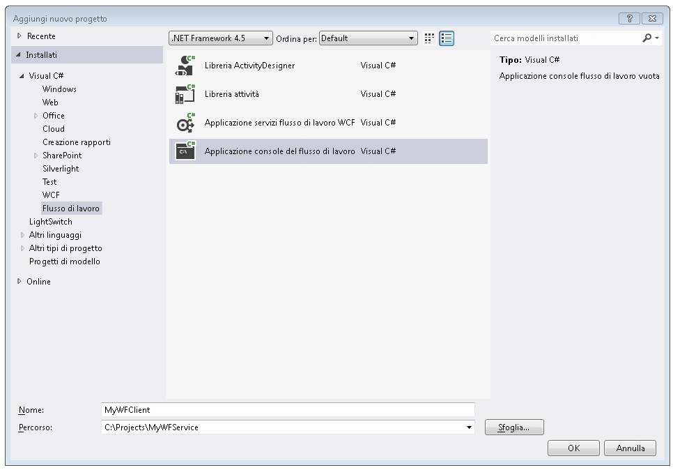
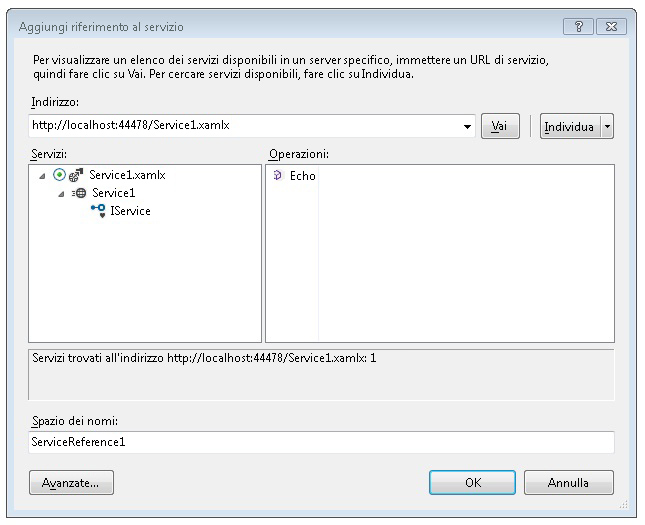
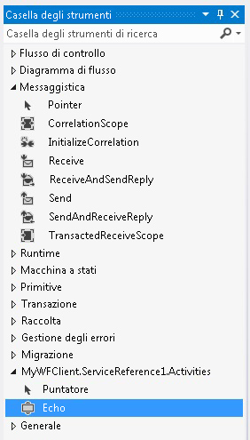
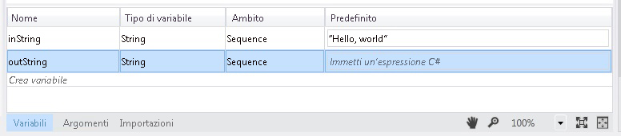
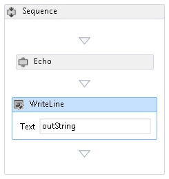
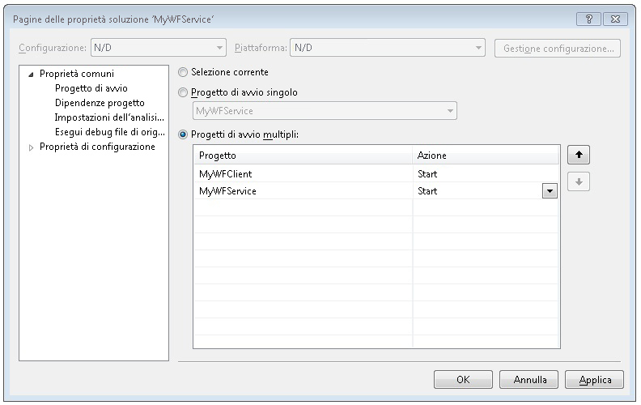

# Procedura: accesso a un servizio da un&#39;applicazione flusso di lavoro
In questo argomento viene descritto come chiamare un servizio flusso di lavoro da un'applicazione console del flusso di lavoro.Dipende dal completamento dell'argomento [Procedura: creare un servizio flusso di lavoro con attività di messaggistica](../../../../docs/framework/wcf/feature-details/how-to-create-a-workflow-service-with-messaging-activities.md).Sebbene in questo argomento venga descritto come chiamare un servizio flusso di lavoro da un'applicazione flusso di lavoro, gli stessi metodi possono essere utilizzati per chiamare qualsiasi servizio [!INCLUDE[indigo1](../../../../includes/indigo1-md.md)] da un'applicazione flusso di lavoro.  
  
### Creare un progetto di applicazione console del flusso di lavoro  
  
1.  Avviare [!INCLUDE[vs_current_long](../../../../includes/vs-current-long-md.md)].  
  
2.  Caricare il progetto MyWFService creato nell'argomento [Procedura: creare un servizio flusso di lavoro con attività di messaggistica](../../../../docs/framework/wcf/feature-details/how-to-create-a-workflow-service-with-messaging-activities.md).  
  
3.  Fare clic con il pulsante destro del mouse sulla soluzione **MyWFService** in **Esplora soluzioni** e scegliere **Aggiungi**, **Nuovo progetto**.Selezionare **Flusso di lavoro** in **Modelli installati** e **Applicazione console flusso di lavoro** dall'elenco dei tipi di progetto.Assegnare al progetto il nome MyWFClient e utilizzare il percorso predefinito, come illustrato nella figura seguente.  
  
       
  
     Fare clic sul pulsante **OK** per chiudere la finestra di dialogo **Aggiungi nuovo progetto**.  
  
4.  Una volta creato il progetto, nella finestra di progettazione verrà aperto il file Workflow1.xaml.Fare clic sulla scheda **Casella degli strumenti** per aprire la casella degli strumenti se non è già aperta e fare clic sull'icona della puntina da disegno per tenere aperta la finestra della casella degli strumenti.  
  
5.  Premere CTRL\+F5 per compilare e avviare il servizio.Come in precedenza, viene avviato il server di sviluppo ASP.NET e in Internet Explorer viene visualizzata la pagina della Guida relativa a WCF.Tenere presente l'URI di questa pagina, in quanto sarà necessario utilizzarlo nel passaggio successivo.  
  
       
  
6.  Fare clic con il pulsante destro del mouse sul progetto **MyWFClient** in **Esplora soluzioni** e scegliere **Aggiungi riferimento al servizio**.Fare clic sul pulsante **Individua** per cercare qualsiasi servizio nella soluzione corrente.Fare clic sul triangolo accanto a Service1.xamlx nell'elenco dei servizi.Fare clic sul triangolo accanto a Service1 per elencare i contratti implementati dal servizio Service1.Espandere il nodo **Service1** nell'elenco **Servizi**.L'operazione Echo viene visualizzata nell'elenco **Operazioni**, come illustrato nella figura seguente.  
  
       
  
     Mantenere lo spazio dei nomi predefinito e fare clic su **OK** per chiudere la finestra di dialogo **Aggiungi riferimento al servizio**.Verrà visualizzata la finestra di dialogo indicata di seguito.  
  
       
  
     Scegliere **OK** per chiudere la finestra di dialogo.Premere quindi CTRL\+MAIUSC\+B per compilare la soluzione.Nella casella degli strumenti è stata aggiunta una nuova sezione denominata **MyWFClient.ServiceReference1.Activities**.Espandere questa sezione e notare l'attività Eco aggiunta, come illustrato nella figura seguente.  
  
       
  
7.  Trascinare un'attività <xref:System.ServiceModel.Activities.Sequence> nell'area di progettazione.Si trova nella sezione **Flusso di controllo** della casella degli strumenti.  
  
8.  Con l'attività <xref:System.ServiceModel.Activities.Sequence> in stato attivo, fare clic sul collegamento **Variabili** e aggiungere una variabile di stringa denominata `inString`.Associare alla variabile un valore predefinito di `"Hello, world"` e una variabile di stringa denominata `outString`, come indicato nel diagramma seguente.  
  
       
  
9. Trascinare un'attività **Eco** in <xref:System.ServiceModel.Activities.Sequence>.Associare nella finestra delle proprietà l'argomento \_string alla variabile `inString` e l'argomento `out_string` alla variabile outString, come illustrato nella figura seguente.Viene passato il valore della variabile `inString` all'operazione e quindi il valore restituito si inserisce nella variabile `outString`.  
  
       
  
10. Trascinare un'attività **WriteLine** al di sotto dell'attività **Echo** per visualizzare la stringa restituita dalla chiamata del servizio.L'attività **WriteLine** si trova nel nodo **Primitive** della casella degli strumenti.Associare l'argomento **Testo** dell'attività **WriteLine** alla variabile `outString` digitando `outString` nella casella di testo nell'attività **WriteLine**.Il flusso di lavoro viene ora visualizzato come illustrato nella figura seguente.  
  
       
  
11. Fare clic con il pulsante destro del mouse sulla soluzione MyWFService e scegliere **Imposta progetti di avvio**.Selezionare il pulsante di opzione **Progetti di avvio multipli** e **Avvia** per ogni progetto nella colonna **Azione**, come illustrato nella figura seguente.  
  
       
  
12. Premere CTRL\+F5 per avviare il servizio e il client.Il server di sviluppo ASP.NET ospita il servizio, Internet Explorer visualizza la pagina della Guida relativa a WCF e l'applicazione flusso di lavoro client viene avviata in una finestra della console e visualizza la stringa restituita dal servizio \("Hello, world"\).  
  
## Vedere anche  
 [Servizi flusso di lavoro](../../../../docs/framework/wcf/feature-details/workflow-services.md)   
 [Procedura: creare un servizio flusso di lavoro con attività di messaggistica](../../../../docs/framework/wcf/feature-details/how-to-create-a-workflow-service-with-messaging-activities.md)   
 [Utilizzo di un servizio WCF da un flusso di lavoro in un progetto Web](http://go.microsoft.com/fwlink/?LinkId=207725)