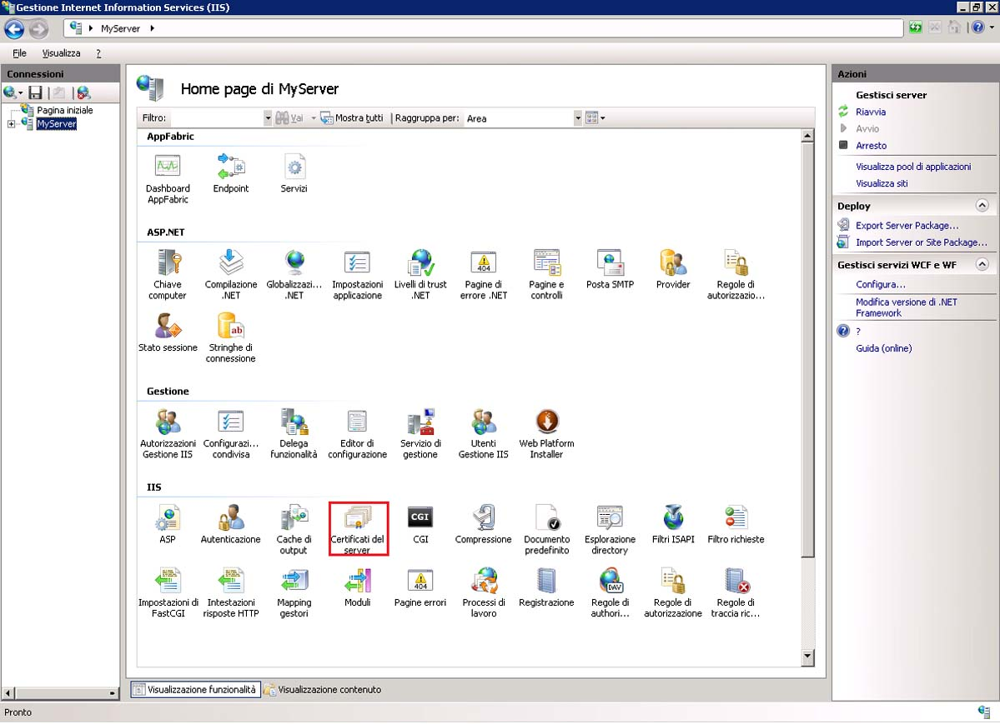
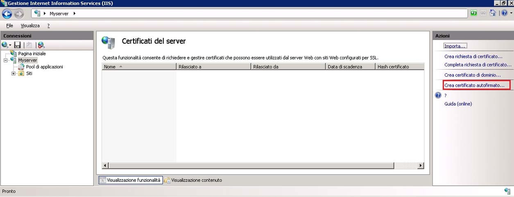
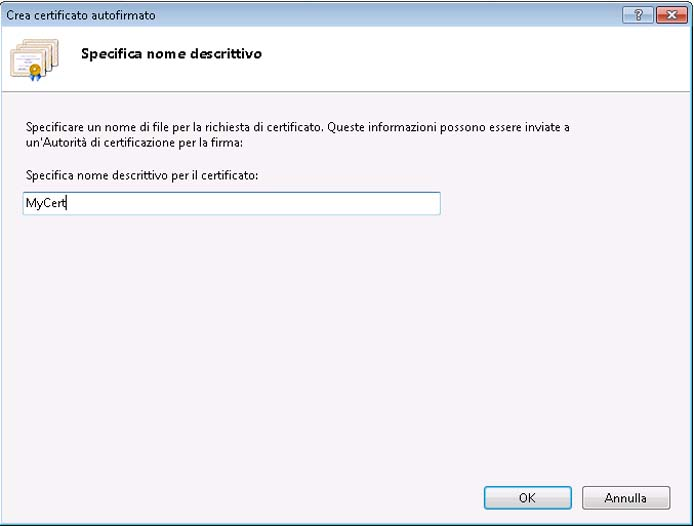
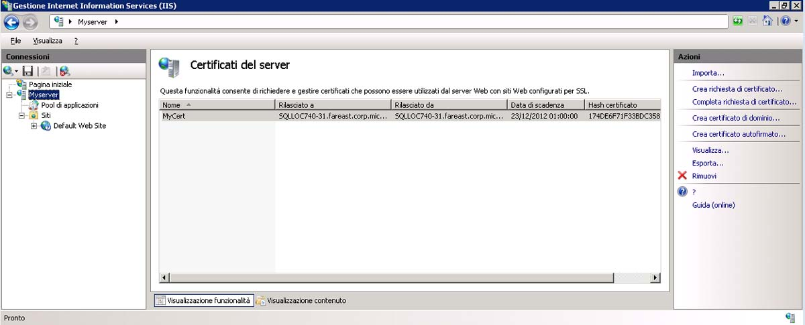
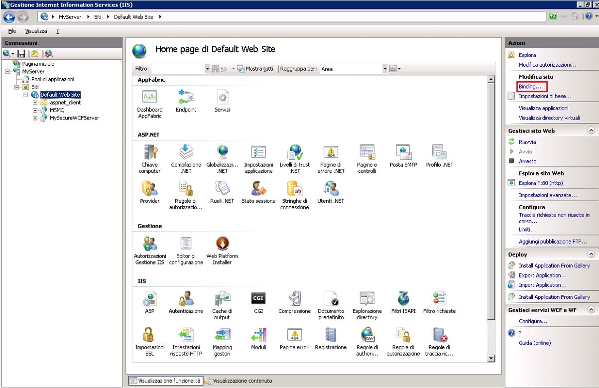
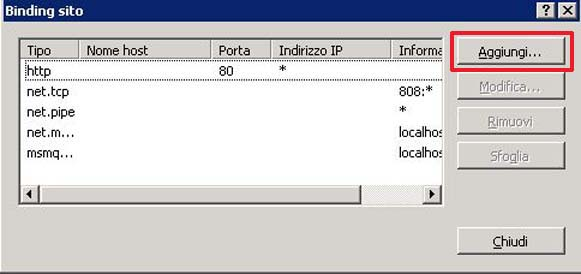
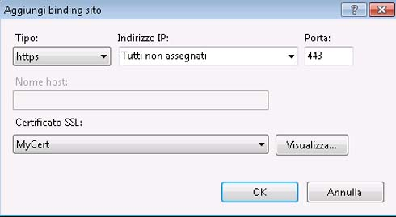
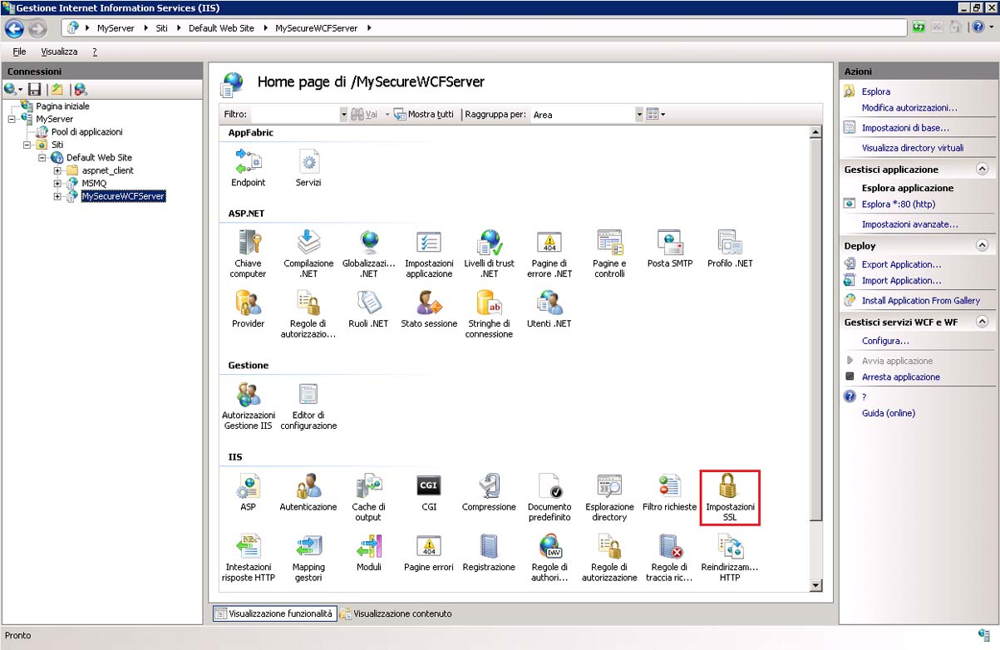
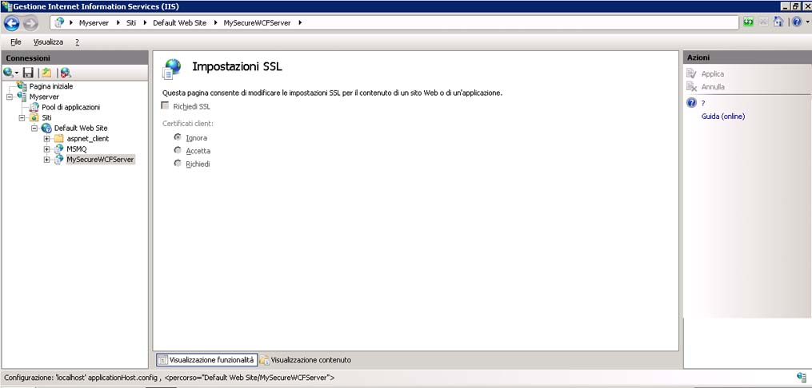

# Procedura: configurare un servizio WCF ospitato da IIS con SSL
In questo argomento viene descritto come configurare l'uso della sicurezza del trasporto HTTP in un servizio WCF ospitato da IIS.  La sicurezza del trasporto HTTP richiede che un certificato SSL sia registrato con IIS.  Se non si dispone di un certificato SSL, è possibile usare IIS per generare un certificato di prova.  Sarà quindi necessario aggiungere un binding SSL al sito Web e configurare le proprietà di autenticazione del sito Web.  Infine sarà necessario configurare l'uso di HTTPS da parte del servizio WCF.  
  
### Creazione di un certificato autofirmato  
  
1.  Aprire Gestione Internet Information Services \(inetmgr.exe\) e selezionare il nome del computer nella visualizzazione albero a sinistra.  Sul lato destro della schermata selezionare Certificati server.  
  
       
  
2.  Nella finestra Certificati server fare clic sul collegamento **Crea certificato autofirmato** .  
  
       
  
3.  Immettere un nome descrittivo per il certificato autofirmato e fare clic su **OK**.  
  
       
  
     I dettagli del certificato autofirmato appena creato vengono ora visualizzati nella finestra **Certificati server**.  
  
       
  
     Il certificato generato viene installato nell'archivio Autorità di certificazione radice disponibile nell'elenco locale.  
  
### Aggiungere il binding SSL  
  
1.  In Gestione Internet Information Services espandere la cartella **Siti**, quindi la cartella **Sito Web predefinito** nella visualizzazione albero sul lato sinistro della schermata.  
  
2.  Fare clic sul collegamento **Binding** nella sezione **Azioni** nella parte superiore destra della finestra.  
  
       
  
3.  Nella finestra Binding sito fare clic sul pulsante **Aggiungi**.  
  
       
  
4.  Nella finestra di dialogo **Aggiungi binding sito** selezionare HTTPS per il tipo e il nome descrittivo del certificato autofirmato appena creato.  
  
       
  
### Configurare la directory virtuale per SSL  
  
1.  In Gestione Internet Information Services selezionare la directory virtuale contenente il servizio protetto WCF.  
  
2.  Nel riquadro centrale della finestra selezionare **Impostazioni SSL** nella sezione di IIS.  
  
       
  
3.  Nel riquadro Impostazioni SSL selezionare la casella di controllo **Richiedi SSL** e fare clic sul collegamento **Applica** nella sezione **Azioni** sul lato destro della schermata.  
  
       
  
### Configurare il servizio WCF per la sicurezza del trasporto HTTP  
  
1.  Nel file web.config del servizio WCF configurare l'uso della sicurezza del trasporto da parte del binding HTTP come illustrato nel codice XML seguente.  
  
    ```  
    <bindings>  
          <basicHttpBinding>  
            <binding name="secureHttpBinding">  
              <security mode="Transport">  
                <transport clientCredentialType="None"/>  
              </security>  
            </binding>  
          </basicHttpBinding>  
        </bindings>  
  
    ```  
  
2.  Specificare il servizio e il relativo endpoint come illustrato nel codice XML seguente.  
  
    ```  
    <services>  
          <service name="MySecureWCFService.Service1">  
            <endpoint address=""  
                      binding="basicHttpBinding"  
                      bindingConfiguration="secureHttpBinding"  
                      contract="MySecureWCFService.IService1"/>  
  
            <endpoint address="mex"  
                      binding="mexHttpsBinding"  
                      contract="IMetadataExchange" />  
          </service>  
        </services>  
  
    ```  
  
## Esempio  
 Di seguito è riportato un esempio completo di un file web.config per un servizio WCF in cui è usata la sicurezza del trasporto HTTP  
  
```  
<?xml version="1.0"?>  
<configuration>  
  
  <system.web>  
    <compilation debug="true" targetFramework="4.0" />  
  </system.web>  
  <system.serviceModel>  
    <services>  
      <service name="MySecureWCFService.Service1">  
        <endpoint address=""  
                  binding="basicHttpBinding"  
                  bindingConfiguration="secureHttpBinding"  
                  contract="MySecureWCFService.IService1"/>  
  
        <endpoint address="mex"  
                  binding="mexHttpsBinding"  
                  contract="IMetadataExchange" />  
      </service>  
    </services>  
    <bindings>  
      <basicHttpBinding>  
        <binding name="secureHttpBinding">  
          <security mode="Transport">  
            <transport clientCredentialType="None"/>  
          </security>  
        </binding>  
      </basicHttpBinding>  
    </bindings>  
    <behaviors>  
      <serviceBehaviors>  
        <behavior>  
          <!-- To avoid disclosing metadata information, set the value below to false and remove the metadata endpoint above before deployment -->  
          <serviceMetadata httpsGetEnabled="true"/>  
          <!-- To receive exception details in faults for debugging purposes, set the value below to true.  Set to false before deployment to avoid disclosing exception information -->  
          <serviceDebug includeExceptionDetailInFaults="false"/>  
        </behavior>  
      </serviceBehaviors>  
    </behaviors>  
    <serviceHostingEnvironment multipleSiteBindingsEnabled="true" />  
  </system.serviceModel>  
 <system.webServer>  
    <modules runAllManagedModulesForAllRequests="true"/>  
  </system.webServer>  
  
</configuration>  
  
```  
  
<!-- TODO: review snippet reference  [!CODE [Microsoft.Win32.RegistryKey#4](Microsoft.Win32.RegistryKey#4)]  -->  
  
## Vedere anche  
 [Host in Internet Information Services](../../../../docs/framework/wcf/feature-details/hosting-in-internet-information-services.md)   
 [Istruzioni per l'hosting su IIS \(Internet Information Services\)](../../../../docs/framework/wcf/samples/internet-information-service-hosting-instructions.md)   
 [Procedure consigliate per l'hosting in Internet Information Services \(IIS\)](../../../../docs/framework/wcf/feature-details/internet-information-services-hosting-best-practices.md)   
 [Hosting IIS mediante il codice inline](../../../../docs/framework/wcf/samples/iis-hosting-using-inline-code.md)