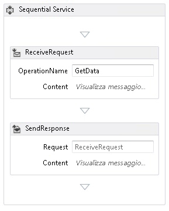
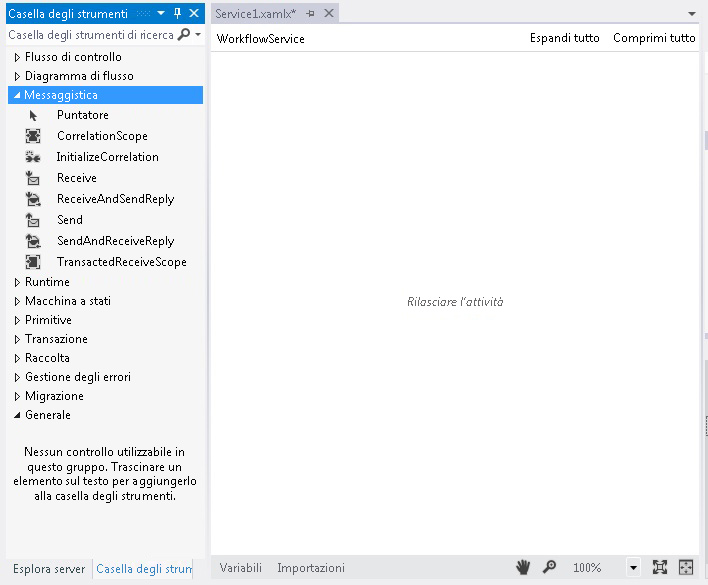
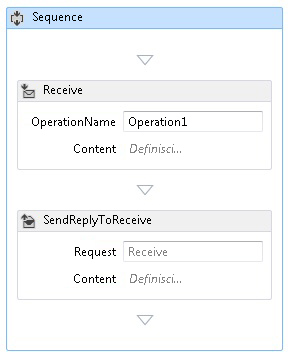
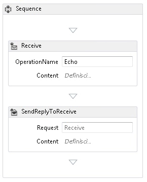
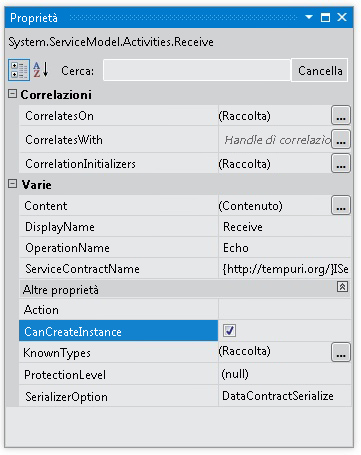
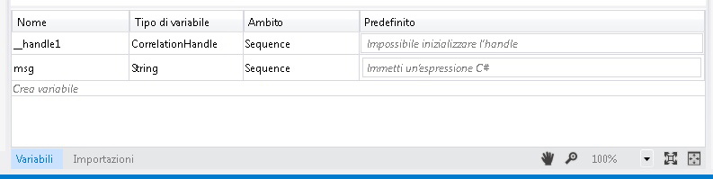
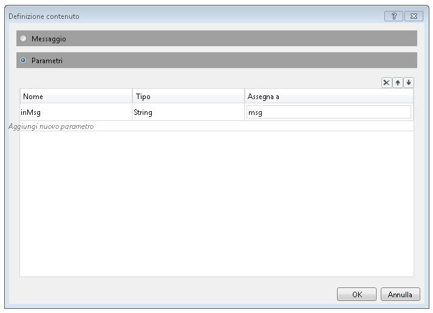
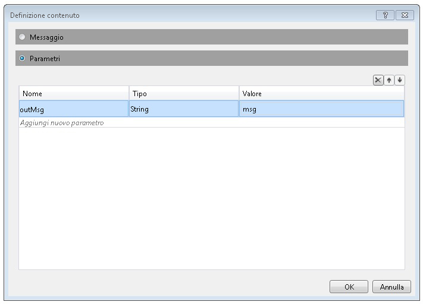

# Procedura: creare un servizio flusso di lavoro con attivit&#224; di messaggistica
In questo argomento viene illustrato come creare un semplice servizio flusso di lavoro usando le attività di messaggistica.  L'argomento è incentrato sui meccanismi di creazione di un servizio flusso di lavoro in cui il servizio è costituito esclusivamente da attività di messaggistica.  In servizi reali i flussi di lavoro contengono molte altre attività.  Il servizio implementa un'operazione denominata Echo che acquisisce una stringa e la restituisce al chiamante.  Questo è il primo di una serie di due argomenti.  Nell'argomento successivo, [Procedura: accesso a un servizio da un'applicazione flusso di lavoro](../../../../docs/framework/wcf/feature-details/how-to-access-a-service-from-a-workflow-application.md), viene illustrato come creare un'applicazione flusso di lavoro in grado di chiamare il servizio creato in questo argomento.  
  
### Per creare un progetto di servizio flusso di lavoro  
  
1.  Avviare [!INCLUDE[vs_current_long](../../../../includes/vs-current-long-md.md)].  
  
2.  Scegliere **Nuovo** dal menu **File**, quindi fare clic su **Progetto** per visualizzare la finestra di dialogo **Nuovo progetto**.  Selezionare **Flusso di lavoro** dall'elenco dei modelli installati e **Applicazione di servizi flusso di lavoro WCF** dall'elenco dei tipi di progetto.  Denominare il progetto `MyWFService` e usare il percorso predefinito, come illustrato nella figura seguente.  
  
     Fare clic sul pulsante **OK** per chiudere la finestra di dialogo **Nuovo progetto**.  
  
3.  Una volta creato il progetto, nella finestra di progettazione verrà aperto il file Service1.xamlx, come illustrato nella figura seguente.  
  
       
  
     Fare clic con il pulsante destro del mouse sull'attività con etichetta **Servizio sequenziale** e scegliere **Elimina**.  
  
### Per implementare il servizio flusso di lavoro  
  
1.  Selezionare la scheda **Casella degli strumenti** sul lato sinistro della schermata per visualizzare la casella degli strumenti e fare clic sull'icona della puntina da disegno per mantenere aperta la finestra.  Espandere la sezione **Messaggi** della casella degli strumenti per visualizzare le attività di messaggistica e i relativi modelli, come illustrato nella figura seguente.  
  
       
  
2.  Trascinare un modello **ReceiveAndSendReply** in Progettazione flussi di lavoro.  Verrà creata un'attività <xref:System.ServiceModel.Activities.Sequence> con un'attività **Receive** seguita da un'attività <xref:System.ServiceModel.Activities.SendReply>, come illustrato nella figura seguente.  
  
       
  
     La proprietà <xref:System.ServiceModel.Activities.SendReply> dell'attività <xref:System.ServiceModel.Activities.SendReply.Request%2A> è impostata su `Receive`, il nome dell'attività <xref:System.ServiceModel.Activities.Receive> a cui risponde l'attività <xref:System.ServiceModel.Activities.SendReply>.  
  
3.  Nell'attività <xref:System.ServiceModel.Activities.Receive> digitare `Echo` nella casella di testo con etichetta **OperationName**.  In questo modo viene definito il nome dell'operazione implementata dal servizio.  
  
       
  
4.  Con l'attività <xref:System.ServiceModel.Activities.Receive> selezionata, aprire la finestra delle proprietà, se non è già aperta, scegliendo **Finestra Proprietà** dal menu **Visualizza**.  Scorrere la finestra delle proprietà fino a individuare **CanCreateInstance** e selezionare la casella di controllo, come illustrato nella figura seguente.  Questa impostazione consente all'host del servizio flusso di lavoro di creare, se necessario, una nuova istanza del servizio dopo la ricezione di un messaggio.  
  
       
  
5.  Selezionare l'attività <xref:System.ServiceModel.Activities.Sequence> e fare clic sul pulsante **Variabili** nell'angolo inferiore sinistro della finestra di progettazione.  Verrà visualizzato l'editor delle variabili.  Fare clic sul collegamento **Crea variabile** per aggiungere una variabile in cui archiviare la stringa inviata all'operazione.  Assegnare alla variabile il nome `msg` e impostarne il tipo su Stringa, come illustrato nella figura seguente.  
  
       
  
     Fare nuovamente clic sul pulsante **Variabili** per chiudere l'editor delle variabili.  
  
6.  Fare clic sul collegamento **Definisci** nella casella di testo **Contenuto** nell'attività <xref:System.ServiceModel.Activities.Receive> per visualizzare la finestra di dialogo per la definizione  del contenuto.  Selezionare il pulsante di opzione **Parametri**, fare clic sul collegamento **Aggiungi nuovo parametro**, digitare `inMsg` nella casella di testo **Nome**, selezionare **Stringa** nell'elenco a discesa **Tipo** e digitare `msg` nella casella di testo **Assegna a**, come illustrato nella figura seguente.  
  
       
  
     In questo modo viene specificato che l'attività Receive riceve il parametro stringa e che i dati sono associati alla variabile `msg`.  Fare clic su **OK** per chiudere la finestra di dialogo per la definizione del contenuto.  
  
7.  Fare clic sul collegamento **Definisci** nella casella **Contenuto** nell'attività <xref:System.ServiceModel.Activities.SendReply> per visualizzare la finestra di dialogo per la definizione del contenuto.  Selezionare il pulsante di opzione **Parametri**, fare clic sul collegamento **Aggiungi nuovo parametro**, digitare `msg` nella casella di testo **Nome**, selezionare **Stringa** nell'elenco a discesa **Tipo** e digitare `msg` nella casella di testo **Valore**, come illustrato nella figura seguente.  
  
       
  
     In questo modo viene specificato che l'attività <xref:System.ServiceModel.Activities.SendReply> invia un messaggio o un tipo di contratto messaggio e che i dati sono associati alla variabile `msg`.  Poiché si tratta di un'attività <xref:System.ServiceModel.Activities.SendReply>, i dati in `msg` vengono usati per popolare il messaggio inviato in risposta al client da parte dell'attività.  Fare clic su **OK** per chiudere la finestra di dialogo per la definizione del contenuto.  
  
8.  Salvare e compilare la soluzione scegliendo **Compila soluzione** dal menu **Compila**.  
  
## Configurare il progetto di servizio flusso di lavoro  
 Il servizio flusso di lavoro è completo.  Contenuto della sezione viene illustrato come configurare la soluzione del servizio flusso di lavoro per agevolarne l'hosting e l'esecuzione.  Questa soluzione usa il server di sviluppo ASP.NET per ospitare il servizio.  
  
#### Per impostare le opzioni di avvio del progetto  
  
1.  In **Esplora soluzioni** fare clic con il pulsante destro del mouse su **MyWFService** e scegliere **Proprietà** per visualizzare la finestra di dialogo **Proprietà progetto**.  
  
2.  Selezionare la scheda **Web** e **Pagina specifica** in **Azione di avvio**, quindi digitare `Service1.xamlx` nella casella di testo, come illustrato nella figura seguente.  
  
       
  
     In questo modo, il servizio definito in Service1.xamlx viene ospitato nel server di sviluppo ASP.NET.  
  
3.  Premere CTRL\+F5 per avviare il servizio.  L'icona del server di sviluppo ASP.NET verrà visualizzata nel lato inferiore destro del desktop, come illustrato nella figura seguente.  
  
       
  
     In Internet Explorer verrà inoltre visualizzata la pagina della Guida del servizio WCF relativa al servizio.  
  
       
  
4.  Passare all'argomento [Procedura: accesso a un servizio da un'applicazione flusso di lavoro](../../../../docs/framework/wcf/feature-details/how-to-access-a-service-from-a-workflow-application.md) per creare un client flusso di lavoro in grado di chiamare questo servizio.  
  
## Vedere anche  
 [Servizi flusso di lavoro](../../../../docs/framework/wcf/feature-details/workflow-services.md)   
 [Panoramica dell'hosting dei servizi flusso di lavoro](../../../../docs/framework/wcf/feature-details/hosting-workflow-services-overview.md)   
 [Attività di messaggistica](../../../../docs/framework/wcf/feature-details/messaging-activities.md)