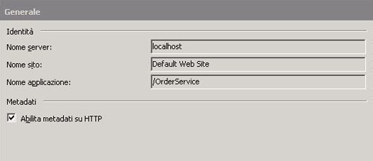
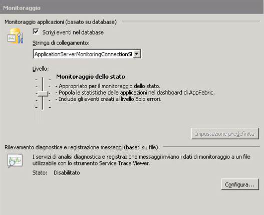
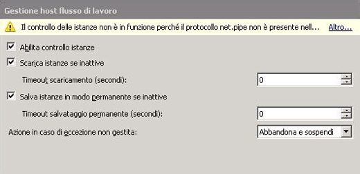
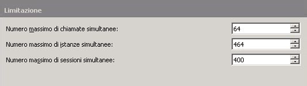
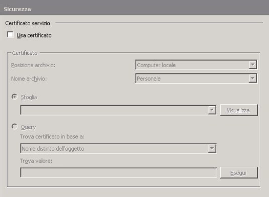
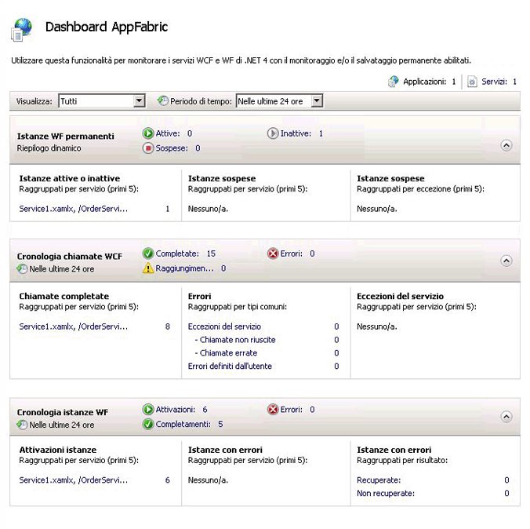
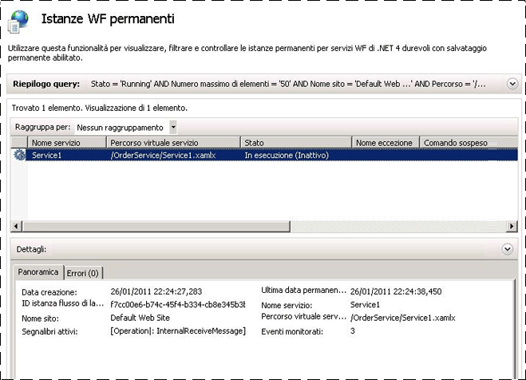

# Procedura: ospitare un servizio di flusso di lavoro con Windows Server AppFabric
L'hosting di servizi di flusso di lavoro in AppFabric è simile all'hosting in IIS\/WAS.L'unica differenza consiste nel fatto che tramite gli strumenti di AppFabric sono garantiti la distribuzione, il monitoraggio e la gestione dei servizi di flusso di lavoro.In questo argomento viene utilizzato il servizio di flusso di lavoro creato nella sezione [Creazione di un servizio flusso di lavoro a esecuzione prolungata](../../../../docs/framework/wcf/feature-details/creating-a-long-running-workflow-service.md)in cui viene presentata la procedura dettagliata per la creazione di un servizio di flusso di lavoro.In questo argomento verrà invece illustrato come ospitare il servizio di flusso di lavoro mediante AppFabric.[!INCLUDE[crabout](../../../../includes/crabout-md.md)] Windows Server AppFabric, vedere [Windows Server AppFabric](http://go.microsoft.com/fwlink/?LinkID=193037&clcid=0x409).Prima di completare i passaggi seguenti, assicurarsi di aver installato Windows Server AppFabric.A tal fine, aprire Internet Information Services \(inetmgr.exe\), fare clic sul nome del server nella vista **Connessioni**, fare clic su Siti, quindi su **Sito Web predefinito**.Nella parte destra della schermata dovrebbe essere visualizzata una sezione denominata **AppFabric**.Se tale sezione non viene visualizzata \(controllare nella parte superiore del riquadro di destra\), AppFabric non è installato.[!INCLUDE[crabout](../../../../includes/crabout-md.md)] installazione di Windows Server AppFabric, vedere [Installazione di Windows Server App Fabric](http://go.microsoft.com/fwlink/?LinkId=193136).  
  
### Creazione di un servizio di flusso di lavoro semplice  
  
1.  Aprire [!INCLUDE[vs_current_long](../../../../includes/vs-current-long-md.md)] e caricare la soluzione OrderProcessing creata nell'argomento [Creazione di un servizio flusso di lavoro a esecuzione prolungata](../../../../docs/framework/wcf/feature-details/creating-a-long-running-workflow-service.md).  
  
2.  Fare clic con il pulsante destro del mouse sul progetto **OrderService**, selezionare **Proprietà**, quindi la scheda **Web**.  
  
3.  Nella sezione **Azione di avvio** della pagina delle proprietà selezionare **Pagina specifica** e digitare Service1.xamlx nella casella di modifica.  
  
4.  Nella sezione **Server** della pagina delle proprietà selezionare **Usa server Web IIS locale** e digitare l'URL seguente: `http://localhost/OrderService`.  
  
5.  Fare clic sul pulsante **Crea directory virtuale**.In questo modo verrà creata una nuova directory virtuale e verrà configurato il progetto per copiare i file necessari nella directory virtuale quando il progetto viene compilato.In alternativa, è possibile copiare manualmente il file con estensione xamlx, il file web.config e qualsiasi DLL necessaria per la directory virtuale.  
  
### Configurazione di un servizio di flusso di lavoro ospitato in Windows Server AppFabric  
  
1.  Aprire Gestione Internet Information Services \(inetmgr.exe\).  
  
2.  Passare alla directory virtuale OrderService nel riquadro **Connessioni**.  
  
3.  Fare clic con il pulsante destro del mouse su OrderService e selezionare **Gestisci servizi WCF e WF**, quindi **Configura**.Verrà visualizzata la finestra di dialogo **Configura WCF e WF per l'applicazione**.  
  
4.  Selezionare la scheda **Generale** per visualizzare informazioni generali sull'applicazione come mostrato nella schermata seguente.  
  
       
  
5.  Selezionare la scheda **Monitoraggio**.In questo modo verranno visualizzate diverse impostazioni di monitoraggio come mostrato nella schermata seguente.  
  
       
  
     [!INCLUDE[crabout](../../../../includes/crabout-md.md)] configurazione del monitoraggio del servizio di flusso di lavoro in AppFabric, vedere [Configurazione del monitoraggio](http://go.microsoft.com/fwlink/?LinkId=193153).  
  
6.  Selezionare la scheda **Salvataggio permanente flusso di lavoro**.In questo modo è possibile configurare l'applicazione per utilizzare il provider di salvataggio permanente predefinito di AppFabric come mostrato nella schermata seguente.  
  
       
  
     [!INCLUDE[crabout](../../../../includes/crabout-md.md)] configurazione del salvataggio permanente del flusso di lavoro in Windows Server AppFabric, vedere [Configurazione del salvataggio permanente del flusso di lavoro](http://go.microsoft.com/fwlink/?LinkId=193148).  
  
7.  Selezionare la scheda **Gestione host flusso di lavoro**.In questo modo è possibile specificare il momento in cui le istanze del servizio di flusso di lavoro inattive devono essere scaricate e salvate in modo permanente come mostrato nella schermata seguente.  
  
       
  
     [!INCLUDE[crabout](../../../../includes/crabout-md.md)] configurazione della gestione host del flusso di lavoro, vedere [Configurazione di Gestione host flusso di lavoro](http://go.microsoft.com/fwlink/?LinkId=193151).  
  
8.  Selezionare la scheda **Avvio automatico**.In questo modo è possibile specificare impostazioni di avvio automatico per i servizi di flusso di lavoro nell'applicazione come mostrato nella schermata seguente.  
  
       
  
     [!INCLUDE[crabout](../../../../includes/crabout-md.md)] configurazione dell'avvio automatico, vedere [Configurazione dell'avvio automatico](http://go.microsoft.com/fwlink/?LinkId=193150).  
  
9. Selezionare la scheda **Limitazione**.In questo modo è possibile configurare impostazioni di limitazione per il servizio di flusso di lavoro come mostrato nella schermata seguente.  
  
       
  
     [!INCLUDE[crabout](../../../../includes/crabout-md.md)] configurazione della limitazione, vedere [Configurazione della limitazione](http://go.microsoft.com/fwlink/?LinkId=193149).  
  
10. Selezionare la scheda **Sicurezza**.In questo modo è possibile configurare impostazioni di sicurezza per l'applicazione come mostrato nella schermata seguente.  
  
       
  
     [!INCLUDE[crabout](../../../../includes/crabout-md.md)] configurazione della sicurezza con Windows Server AppFabric, vedere [Configurazione della sicurezza](http://go.microsoft.com/fwlink/?LinkId=193152).  
  
### Utilizzo di Windows Server AppFabric  
  
1.  Compilare la soluzione per copiare i file necessari nella directory virtuale.  
  
2.  Fare clic con il pulsante destro del mouse sul progetto OrderClient e selezionare **Debug**, quindi **Avvia nuova istanza** per avviare l'applicazione client.  
  
3.  Verrà eseguito il client e in Visual Studio verrà visualizzata una finestra di dialogo **Avviso di sicurezza connessione**. Fare clic sul pulsante **Non connettere**.In questo modo non viene effettuata la connessione di Visual Studio al processo IIS per l'esecuzione del debug.  
  
4.  L'applicazione client consentirà di chiamare immediatamente il servizio di flusso di lavoro e successivamente si verificherà un periodo di attesa.Il servizio di flusso di lavoro diventerà inattivo e sarà salvato in modo permanente.Tale condizione può essere verificata avviando Internet Information Services \(inetmgr.exe\), passando a OrderService nel riquadro Connessioni e selezionandolo.Successivamente, fare clic sull'icona del dashboard di AppFabric nel riquadro di destra.In Istanze WF permanenti si osserverà la presenza di un'istanza del servizio di flusso di lavoro salvato in modo permanente come mostrato nella schermata seguente.  
  
       
  
     In **Cronologia istanze WF** sono elencate le informazioni sul servizio di flusso di lavoro, ad esempio il numero di attivazioni del servizio di flusso di lavoro, il numero di completamenti dell'istanza del servizio di flusso di lavoro e il numero di istanze del flusso di lavoro con errori.In Istanze attive o inattive viene visualizzato un collegamento; facendo clic su di esso verranno visualizzate ulteriori informazioni sulle istanze del flusso di lavoro inattive come mostrato nella schermata seguente.  
  
       
  
     Per ulteriori informazioni sulle funzionalità di Windows Server AppFabric e sul relativo utilizzo, vedere [Funzionalità di hosting di AppFabric](http://go.microsoft.com/fwlink/?LinkID=193143&clcid=0x409)  
  
## Vedere anche  
 [Creazione di un servizio flusso di lavoro a esecuzione prolungata](../../../../docs/framework/wcf/feature-details/creating-a-long-running-workflow-service.md)   
 [Funzionalità di hosting di AppFabric](http://go.microsoft.com/fwlink/?LinkId=193143)   
 [Installazione di Windows Server AppFabric](http://go.microsoft.com/fwlink/?LinkId=193136)   
 [Windows Server AppFabric](http://go.microsoft.com/fwlink/?LinkID=193037&clcid=0x409)