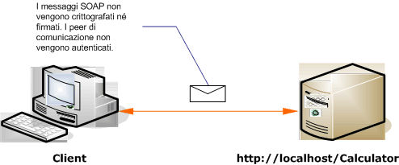

# Client e servizio non protetti in Internet
Nell'illustrazione seguente è mostrato un esempio di un client [!INCLUDE[indigo1](../../../../includes/indigo1-md.md)] pubblico non protetto e di un servizio.  
  
   
  
|Caratteristica|Descrizione|  
|--------------------|-----------------|  
|Modalità di sicurezza|Nessuna|  
|Trasporto|HTTP|  
|Associazione|<xref:System.ServiceModel.BasicHttpBinding> nel codice o l'elemento [\<basicHttpBinding\>](../../../../docs/framework/configure-apps/file-schema/wcf/basichttpbinding.md) nella configurazione.|  
|Interoperabilità|Con servizi e client dei servizi Web esistenti|  
|Autenticazione|Nessuna|  
|Integrità|Nessuna|  
|Riservatezza|Nessuna|  
  
## Servizio  
 Il codice e la configurazione seguenti devono essere eseguiti in modo indipendente.Eseguire una delle operazioni seguenti:  
  
-   Creare un servizio autonomo utilizzando il codice senza alcuna configurazione.  
  
-   Creare un servizio utilizzando la configurazione fornita, ma non definire alcun endpoint.  
  
### Codice  
 Nel codice seguente viene illustrato come creare un endpoint senza protezione.Per impostazione predefinita, nell'elemento <xref:System.ServiceModel.BasicHttpBinding> la modalità di sicurezza è impostata su <xref:System.ServiceModel.BasicHttpSecurityMode>.  
  
 [!code-csharp[C_UnsecuredService#1](../../../../samples/snippets/csharp/VS_Snippets_CFX/c_unsecuredservice/cs/source.cs#1)]
 [!code-vb[C_UnsecuredService#1](../../../../samples/snippets/visualbasic/VS_Snippets_CFX/c_unsecuredservice/vb/source.vb#1)]  
  
### Configurazione del servizio  
 Nel codice seguente viene impostato lo stesso endpoint utilizzando la configurazione.  
  
```  
<?xml version="1.0" encoding="utf-8"?>  
<configuration>  
  <system.serviceModel>  
    <behaviors />  
    <services>  
      <service behaviorConfiguration="" name="ServiceModel.Calculator">  
        <endpoint address="http://localhost/Calculator"   
                  binding="basicHttpBinding"  
                  bindingConfiguration="Basic_Unsecured"   
                  name="BasicHttp_ICalculator"  
                  contract="ServiceModel.ICalculator" />  
      </service>  
    </services>  
    <bindings>  
      <basicHttpBinding>  
        <binding name="Basic_Unsecured" />  
      </basicHttpBinding>  
    </bindings>  
    <client />  
  </system.serviceModel>  
</configuration>  
```  
  
## Client  
 Il codice e la configurazione seguenti devono essere eseguiti in modo indipendente.Eseguire una delle operazioni seguenti:  
  
-   Creare un client autonomo utilizzando il codice \(e il codice client\).  
  
-   Creare un client che non definisce alcun indirizzo di endpoint.Utilizzare invece il costruttore client che accetta il nome della configurazione come argomento.Ad esempio:  
  
     [!code-csharp[C_SecurityScenarios#0](../../../../samples/snippets/csharp/VS_Snippets_CFX/c_securityscenarios/cs/source.cs#0)]
     [!code-vb[C_SecurityScenarios#0](../../../../samples/snippets/visualbasic/VS_Snippets_CFX/c_securityscenarios/vb/source.vb#0)]  
  
### Codice  
 Nel codice seguente è mostrato un client [!INCLUDE[indigo2](../../../../includes/indigo2-md.md)] di base che accede a un endpoint non protetto.  
  
 [!code-csharp[C_UnsecuredClient#1](../../../../samples/snippets/csharp/VS_Snippets_CFX/c_unsecuredclient/cs/source.cs#1)]
 [!code-vb[C_UnsecuredClient#1](../../../../samples/snippets/visualbasic/VS_Snippets_CFX/c_unsecuredclient/vb/source.vb#1)]  
  
### Configurazione del client  
 Il codice seguente consente di configurare il client.  
  
```  
<?xml version="1.0" encoding="utf-8"?>  
<configuration>  
  <system.serviceModel>  
    <bindings>  
      <basicHttpBinding>  
        <binding name="BasicHttpBinding_ICalculator" >  
          <security mode="None">  
          </security>  
        </binding>  
      </basicHttpBinding>  
    </bindings>  
    <client>  
      <endpoint address="http://localhost/Calculator/Unsecured"  
          binding="basicHttpBinding"   
          bindingConfiguration="BasicHttpBinding_ICalculator"  
          contract="ICalculator"   
          name="BasicHttpBinding_ICalculator" />  
    </client>  
  </system.serviceModel>  
</configuration>  
```  
  
## Vedere anche  
 [Scenari di sicurezza comuni](../../../../docs/framework/wcf/feature-details/common-security-scenarios.md)   
 [Cenni preliminari sulla sicurezza](../../../../docs/framework/wcf/feature-details/security-overview.md)   
 [Modello di sicurezza per Windows Server App Fabric](http://go.microsoft.com/fwlink/?LinkID=201279&clcid=0x409)