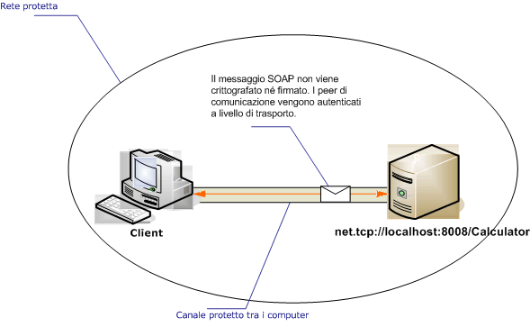

# Client e servizio Intranet non protetti
La figura seguente illustra un servizio [!INCLUDE[indigo1](../../../../includes/indigo1-md.md)] di base sviluppato per fornire informazioni su una rete privata protetta a un'applicazione [!INCLUDE[indigo2](../../../../includes/indigo2-md.md)].  La protezione non è necessaria perché i dati sono di scarsa importanza, la rete è considerata naturalmente protetta o la protezione viene fornita da un livello sottostante l'infrastruttura [!INCLUDE[indigo2](../../../../includes/indigo2-md.md)].  
  
   
  
|Caratteristica|Descrizione|  
|--------------------|-----------------|  
|Modalità di sicurezza|None|  
|Trasporto|TCP|  
|Binding|<xref:System.ServiceModel.NetTcpBinding>|  
|Interoperabilità|Solo [!INCLUDE[indigo2](../../../../includes/indigo2-md.md)]|  
|Autenticazione|None|  
|Integrità|None|  
|Riservatezza|None|  
  
## Servizio  
 Il codice e la configurazione seguenti devono essere eseguiti in modo indipendente.  Eseguire una delle operazioni seguenti:  
  
-   Creare un servizio autonomo usando il codice senza alcuna configurazione.  
  
-   Creare un servizio usando la configurazione fornita, ma non definire alcun endpoint.  
  
### Codice  
 Il codice seguente illustra come creare un endpoint senza protezione.  
  
 [!code-csharp[C_UnsecuredService#2](../../../../samples/snippets/csharp/VS_Snippets_CFX/c_unsecuredservice/cs/source.cs#2)]
 [!code-vb[C_UnsecuredService#2](../../../../samples/snippets/visualbasic/VS_Snippets_CFX/c_unsecuredservice/vb/source.vb#2)]  
  
### Configurazione  
 Il codice seguente imposta lo stesso endpoint usando la configurazione.  
  
```  
<?xml version="1.0" encoding="utf-8"?>  
<configuration>  
  <system.serviceModel>  
    <behaviors />  
    <services>  
      <service behaviorConfiguration=""   
               name="ServiceModel.Calculator">  
        <endpoint address="net.tcp://localhost:8008/Calculator"   
                  binding="netTcpBinding"  
                  bindingConfiguration="tcp_Unsecured"   
                  name="netTcp_ICalculator"  
                  contract="ServiceModel.ICalculator" />  
      </service>  
    </services>  
    <bindings>  
      <netTcpBinding>  
        <binding name="tcp_Unsecured">  
          <security mode="None" />  
        </binding>  
      </netTcpBinding>  
    </bindings>  
    <client />  
  </system.serviceModel>  
</configuration>  
```  
  
## Client  
 Il codice e la configurazione seguenti devono essere eseguiti in modo indipendente.  Eseguire una delle operazioni seguenti:  
  
-   Creare un client autonomo usando il codice \(e il codice client\).  
  
-   Creare un client che non definisce alcun indirizzo di endpoint.  Usare invece il costruttore client che accetta il nome della configurazione come argomento.  Ad esempio:  
  
     [!code-csharp[C_SecurityScenarios#0](../../../../samples/snippets/csharp/VS_Snippets_CFX/c_securityscenarios/cs/source.cs#0)]
     [!code-vb[C_SecurityScenarios#0](../../../../samples/snippets/visualbasic/VS_Snippets_CFX/c_securityscenarios/vb/source.vb#0)]  
  
### Codice  
 Il codice seguente mostra un client [!INCLUDE[indigo2](../../../../includes/indigo2-md.md)] di base che accede a un endpoint non protetto usando il protocollo TCP.  
  
 [!code-csharp[C_UnsecuredClient#2](../../../../samples/snippets/csharp/VS_Snippets_CFX/c_unsecuredclient/cs/source.cs#2)]
 [!code-vb[C_UnsecuredClient#2](../../../../samples/snippets/visualbasic/VS_Snippets_CFX/c_unsecuredclient/vb/source.vb#2)]  
  
### Configurazione  
 Il codice di configurazione seguente è relativo al client:  
  
```  
<?xml version="1.0" encoding="utf-8"?>  
<configuration>  
  <system.serviceModel>  
    <bindings>  
      <netTcpBinding>  
        <binding name="NetTcpBinding_ICalculator" >  
          <security mode="None">  
          </security>  
        </binding>  
      </netTcpBinding>  
    </bindings>  
    <client>  
      <endpoint address="net.tcp://machineName:8008/Calculator "  
                binding="netTcpBinding"   
                bindingConfiguration="NetTcpBinding_ICalculator"  
                contract="ICalculator"   
                name="NetTcpBinding_ICalculator" />  
    </client>  
  </system.serviceModel>  
</configuration>  
```  
  
## Vedere anche  
 <xref:System.ServiceModel.NetTcpBinding>   
 [Cenni preliminari sulla sicurezza](../../../../docs/framework/wcf/feature-details/security-overview.md)   
 [Modello di sicurezza per Windows Server AppFabric](http://go.microsoft.com/fwlink/?LinkID=201279&clcid=0x409)