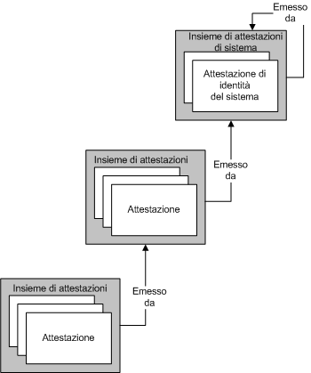
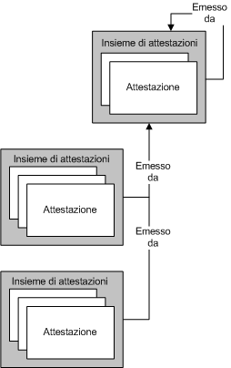
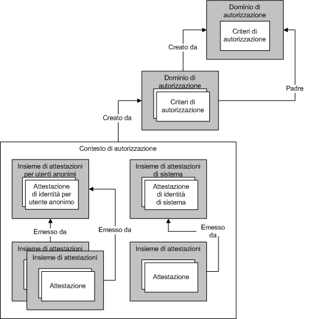

# Gestione di attestazioni e autorizzazioni con il modello di identit&#224;
L'autorizzazione è il processo volto a determinare quali entità dispongono delle autorizzazioni per modificare, visualizzare o altrimenti accedere a una risorsa del computer.In un'azienda, ad esempio, è possibile che l'accesso ai file dei dipendenti sia consentito solo ai responsabili.In [!INCLUDE[indigo1](../../../../includes/indigo1-md.md)] sono supportati due meccanismi per l'esecuzione del processo di autorizzazione.Il primo meccanismo consente di controllare l'autorizzazione utilizzando costrutti Common Language Runtime \(CLR\) esistenti.Il secondo è un modello basato sulle attestazioni definito *modello di identità*.In [!INCLUDE[indigo2](../../../../includes/indigo2-md.md)] viene utilizzato il modello di identità per creare attestazioni dai messaggi in ingresso; le classi di tale modello possono essere estese per supportare nuovi tipi di attestazione per schemi di autorizzazione personalizzati.In questo argomento viene presentata una panoramica dei principali concetti di programmazione del modello di identità, nonché un elenco delle classi più importanti utilizzate da tale funzionalità.  
  
## Scenari del modello di identità  
 Negli scenari seguenti viene illustrato l'utilizzo del modello di identità.  
  
### Scenario 1: supporto di attestazioni di identità, ruolo e gruppo  
 Gli utenti inviano i messaggi a un servizio Web.I requisiti del servizio Web per il controllo dell'accesso prevedono l'utilizzo di identità, ruoli o gruppi.Il mittente del messaggio viene mappato a un set di ruoli o gruppi.Le informazioni relative al ruolo o al gruppo vengono utilizzate per eseguire i controlli di accesso.  
  
### Scenario 2: supporto di attestazioni più dettagliate  
 Gli utenti inviano i messaggi a un servizio Web.I requisiti del servizio Web per il controllo dell'accesso prevedono un modello più dettagliato di quello basato su identità, ruoli o gruppo.Il servizio Web determina se un determinato utente può accedere a una particolare risorsa protetta utilizzando il modello basato su attestazioni più dettagliate.Ad esempio, a un utente potrebbe essere consentito leggere determinate informazioni, come quelle relative agli stipendi, a cui altri utenti non hanno accesso.  
  
### Scenario 3: mapping di attestazioni di tipo diverso  
 Un utente invia un messaggio a un servizio Web.Le sue credenziali possono essere specificate in vari modi differenti, ovvero certificato X.509, token del nome utente o token Kerberos.Il servizio Web deve eseguire le verifiche per il controllo di accesso nello stesso modo, indipendentemente dal tipo di credenziali dell'utente.Se nel tempo vengono supportati tipi di credenziali aggiuntivi, è necessario che il sistema si evolva di conseguenza.  
  
### Scenario 4: determinazione dell'accesso a più risorse  
 Un servizio Web tenta di accedere a più risorse.Il servizio determina a quali risorse protette ha accesso un determinato utente confrontando le attestazioni associate all'utente con le attestazioni necessarie per accedere alle risorse.  
  
## Termini del modello di identità  
 Nell'elenco seguente vengono riportate le definizioni dei termini chiave utilizzati per descrivere i concetti del modello di identità.  
  
 Criteri di autorizzazione  
 Set di regole per l'esecuzione del mapping di un set di attestazioni di input a un set di attestazioni di output.A seguito della valutazione dei criteri di autorizzazione, i set di attestazioni vengono aggiunti a un contesto di valutazione e successivamente a un contesto di autorizzazione.  
  
 Contesto di autorizzazione  
 Insieme di set di attestazioni con zero o più proprietà.Risultato della valutazione di uno o più criteri di autorizzazione.  
  
 Attestazione  
 Combinazione di tipo di attestazione, diritto e valore.  
  
 Set di attestazioni  
 Set di attestazioni emesse da un particolare emittente.  
  
 Tipo di attestazione  
 Tipo dell'attestazione.Le attestazioni definite dall'API del modello di identità sono proprietà della classe <xref:System.IdentityModel.Claims.Claim.ClaimType%2A>.Esempi di tipi di attestazione forniti dal sistema sono <xref:System.IdentityModel.Claims.ClaimTypes.Dns%2A>, <xref:System.IdentityModel.Claims.ClaimTypes.Email%2A>, <xref:System.IdentityModel.Claims.ClaimTypes.Hash%2A>, <xref:System.IdentityModel.Claims.ClaimTypes.Name%2A>, <xref:System.IdentityModel.Claims.ClaimTypes.Rsa%2A>, <xref:System.IdentityModel.Claims.ClaimTypes.Sid%2A>, <xref:System.IdentityModel.Claims.ClaimTypes.Spn%2A>, <xref:System.IdentityModel.Claims.ClaimTypes.System%2A>, <xref:System.IdentityModel.Claims.ClaimTypes.Thumbprint%2A>, <xref:System.IdentityModel.Claims.ClaimTypes.Uri%2A> e <xref:System.IdentityModel.Claims.ClaimTypes.X500DistinguishedName%2A>.  
  
 Contesto di valutazione  
 Contesto in cui viene valutato un criterio di autorizzazione.Contiene proprietà e set di attestazioni.Al termine della valutazione, diventa la base del contesto di autorizzazione.  
  
 Attestazione di identità  
 Attestazione il cui diritto è un'identità.  
  
 Emittente  
 Set di attestazioni contenente almeno un'attestazione di identità e che si considera abbia emesso un altro set di attestazioni.  
  
 Proprietà  
 Set di informazioni associate a un contesto di valutazione o di autorizzazione.  
  
 Risorsa protetta  
 Risorsa presente nel sistema di cui è possibile l'accesso, l'utilizzo o la manipolazione solo se vengono prima soddisfatti determinati requisiti.  
  
 Diritto  
 Funzionalità su una risorsa.I diritti definiti dall'API del modello di identità sono proprietà della classe <xref:System.IdentityModel.Claims.Rights>.Esempi di diritti forniti dal sistema sono <xref:System.IdentityModel.Claims.Rights.Identity%2A> e <xref:System.IdentityModel.Claims.Rights.PossessProperty%2A>.  
  
 Valore  
 Elemento su cui viene attestato un diritto.  
  
## Attestazioni  
 Il modello di identità è un sistema basato su attestazioni.Tali attestazioni descrivono le funzionalità associate a un'entità nel sistema, spesso un utente di tale sistema.Il set di attestazioni associato a una determinata entità può essere considerato come una chiave.Le particolari attestazioni definiscono la forma della chiave, analogamente a una chiave utilizzata per aprire la serratura di una porta.Le attestazioni vengono utilizzate per accedere alle risorse.L'accesso a una data risorsa protetta viene determinato confrontando le attestazioni necessarie per accedere alla risorsa con le attestazioni associate all'entità che ne tenta l'accesso.  
  
 Un'attestazione è l'espressione di un diritto rispetto a un particolare valore.Un diritto può riguardare, ad esempio, la lettura, la scrittura o l'esecuzione. Un valore potrebbe essere un database, un file, una cassetta postale o una proprietà.Le attestazioni dispongono inoltre di un tipo.La combinazione di tipo di attestazione e diritto fornisce il meccanismo che consente di specificare le funzionalità in relazione al valore.Ad esempio, un'attestazione di tipo "File", con diritto di lettura sul valore "Biography.doc" indica che l'entità a cui è associata dispone di accesso in lettura al file Biography.doc.Un'attestazione di tipo "Name" con diritto "PossessProperty" sul valore "Martin" indica che l'entità a cui è associata possiede una proprietà Name con il valore "Martin".  
  
 Sebbene nell'ambito del modello di identità siano definiti vari tipi di attestazioni e diritti, il sistema è estensibile, consentendo in questo modo ai vari sistemi basati sull'infrastruttura del modello di identità di definire tipi di attestazione e diritti aggiuntivi in base alle esigenze.  
  
### Attestazioni di identità  
 Un particolare diritto è quello dell'identità.Le attestazioni che possiedono questo diritto effettuano una dichiarazione sull'identità dell'entità.Ad esempio, un'attestazione di tipo "nome dell'entità utente" \(UPN\) con valore "qualcuno@esempio.com" e un diritto di identità indica una determinata identità in un particolare dominio.  
  
#### Attestazione di identità System  
 Il modello di identità definisce un sola attestazione di identità, ovvero System.L'attestazione di identità System indica che un'entità è l'applicazione corrente o il sistema.  
  
### Set di attestazioni  
 Il modello delle attestazioni che rappresentano l'identità è importante perché le attestazioni vengono sempre emesse da un'entità presente nel sistema, anche se tale entità è fondamentalmente un concetto indipendente.Le attestazioni vengono raggruppate in un set e ogni set ha un'emittente.Un emittente è un set di attestazioni.Tale relazione ricorsiva deve alla fine avere termine e qualsiasi set di attestazioni può essere il proprio emittente.  
  
 Nella figura seguente viene illustrato un esempio di tre set di attestazioni, in cui un set di attestazioni ha come emittente un altro set di attestazioni, che a sua volta ha come emittente il set di attestazioni System.I set di attestazioni formano pertanto una gerarchia che può avere una profondità arbitraria.  
  
   
  
 Più set di attestazioni possono avere come emittente lo stesso set di attestazioni, come illustrato nella figura seguente.  
  
   
  
 Ad eccezione di un set di attestazioni che è il proprio emittente, il modello di identità non fornisce alcun supporto che consenta ai set di attestazioni di formare un ciclo.Pertanto non potrà mai verificarsi una situazione in cui il set di attestazioni A viene emesso da set di attestazioni B che viene emesso dal set di attestazioni A.Inoltre, il modello di identità non fornisce alcun supporto che consenta ai set di attestazioni di avere più emittenti.Se due o più emittenti devono emettere un determinato set di attestazioni, è necessario utilizzare più set di attestazioni, ognuno contenente le stesse attestazioni, ma con emittenti diversi.  
  
### Origine delle attestazioni  
 Le attestazioni possono derivare da varie origini.Un'origine di attestazioni comune è costituita dalle credenziali fornite da un utente, ad esempio come parte di un messaggio inviato a un servizio Web.Il sistema convalida tali attestazioni, che quindi diventano parte di un set di attestazioni associate all'utente.Anche altri componenti del sistema possono essere origini di attestazioni, tra cui il sistema operativo, lo stack di rete, l'ambiente di runtime o l'applicazione.I servizi remoti possono anch'essi costituire un'origine di attestazioni.  
  
### Criteri di autorizzazione  
 Nel modello di identità, le attestazioni vengono generate come parte del processo di valutazione dei criteri di autorizzazione.Un criterio di autorizzazione esamina il set \(eventualmente vuoto\) di attestazioni esistenti e può scegliere di aggiungere attestazioni aggiuntive in base alle attestazioni già presenti e ad informazioni aggiuntive a sua disposizione.In questo modo viene fornita la base per il mapping tra le attestazioni.La presenza o l'assenza di attestazioni nel sistema influisce sul comportamento di un criterio di autorizzazione per quanto riguarda l'aggiunta di attestazioni aggiuntive.  
  
 Ad esempio, il criterio di autorizzazione ha accesso a un database in cui sono contenute le date di nascita delle varie entità che utilizzano il sistema.Tali informazioni vengono utilizzate dal criterio di autorizzazione per aggiungere un'attestazione "Over18" al contesto.Si noti che tale attestazione non rivela alcuna informazioni sull'entità se non il fatto che sia maggiorenne.L'interpretazione dell'attestazione 'Over18' dipende dalla comprensione della semantica di tale attestazione.Il criterio di autorizzazione che ha aggiunto l'attestazione comprende tale semantica a un certo livello.Il codice che esamina successivamente le attestazioni risultanti dalla valutazione del criterio deve anch'esso essere informato di tale semantica.  
  
 È possibile che un determinato criterio di autorizzazione debba essere sottoposto più volte a valutazione perché, siccome altri criteri di autorizzazione aggiungono attestazioni, tale criterio di autorizzazione potrebbe aggiungere ancora altre attestazioni.Il modello di identità è progettato per proseguire la valutazione fino a quando non vengono più aggiunte al contesto altre attestazioni da parte di tutti i criteri di autorizzazione attivi.Questa valutazione continuativa dei criteri di valutazione evita la necessità di applicare un ordine di valutazione specifico per quanto riguarda i criteri di autorizzazione; essi possono essere infatti valutati in qualsiasi ordine.Ad esempio, se il criterio X aggiunge solo l'attestazione Z se il criterio A ha aggiunto l'attestazione B, se X viene per primo sottoposto a valutazione, non aggiunge inizialmente l'attestazione Z.Successivamente, viene valutato A che aggiunge l'attestazione B.X viene quindi valutato una seconda volta e ora aggiunge l'attestazione Z.  
  
 Per un dato sistema possono essere attivi molti criteri di autorizzazione.  
  
### Un macchina per la produzione di chiavi  
 La valutazione di un gruppo di criteri di autorizzazione associati è simile all'utilizzo di una macchina che produce chiavi.Ciascun criterio di autorizzazione viene valutato e vengono generati i set di attestazioni, componendo in questo la forma della chiave.Una volta completata la forma della chiave, la si può utilizzare per tentare di aprire delle serrature.La forma della chiave viene archiviata in un "contesto di autorizzazione" creato da un gestore autorizzazioni.  
  
### Contesto di autorizzazione  
 Un gestore autorizzazioni valuta i vari criteri di autorizzazione come descritto, generando come risultato un contesto di autorizzazione \(un insieme di set di attestazioni e di alcune proprietà associate\).Il contesto di autorizzazione può quindi essere esaminato per determinare le attestazioni presenti al suo interno e le relazioni tra queste varie attestazioni \(ad esempio, il set di attestazioni emittente\) e infine confrontarle con i requisiti che devono essere soddisfatti per accedere a una risorsa.  
  
### Serrature  
 Se un contesto di autorizzazione \(un set di attestazioni\) costituisce una chiave, i requisiti che devono essere soddisfatti per accedere a una particolare risorsa protetta costituiscono la serratura in cui deve entrare la chiave.Il modello di identità non formalizza il modo in cui tali requisiti vengono espressi, ma essi implicano, data la natura basata su attestazioni del sistema, il confronto tra le attestazioni presenti nel contesto di autorizzazione e il set di attestazioni necessarie.  
  
### Riepilogo  
 Il modello di identità si basa sul concetto di attestazioni.Le attestazioni vengono raggruppate in set e aggregate in un contesto di autorizzazione.Un contesto di autorizzazione contiene un set di attestazioni ed è il risultato della valutazione di uno o più criteri di autorizzazione associati a un gestore autorizzazioni.Questi set di attestazioni possono quindi essere esaminati per determinare se i requisiti di accesso sono stati soddisfatti.Nella figura seguente vengono illustrate le relazioni tra questi vari concetti del modello di identità.  
  
   
  
## WCF e modello di identità  
 [!INCLUDE[indigo2](../../../../includes/indigo2-md.md)] utilizza l'infrastruttura del modello di identità come base per il processo di autorizzazione.In [!INCLUDE[indigo2](../../../../includes/indigo2-md.md)], la classe <xref:System.ServiceModel.Description.ServiceAuthorizationBehavior> consente di specificare i criteri di *autorizzazione* come parte di un servizio.Tali criteri di autorizzazione sono definiti *criteri di autorizzazione esterni*e possono eseguire l'elaborazione delle attestazioni in base a criteri locali o mediante interazioni con un servizio remoto.Il gestore autorizzazioni, rappresentato dalla classe <xref:System.ServiceModel.ServiceAuthorizationManager>, valuta i criteri di autorizzazione esterni unitamente ai criteri di autorizzazione che riconoscono i vari tipi di credenziali \(token\) e inserisce in quello che viene definito *contesto di autorizzazione* le attestazioni appropriate a un messaggio in ingresso.Il contesto di autorizzazione è rappresentato dalla classe <xref:System.IdentityModel.Policy.AuthorizationContext>.  
  
## Programmazione del modello di identità  
 Nella tabella seguente viene descritto il modello a oggetti utilizzato per programmare le estensioni del modello di identità.Queste classi sono tutte contenute nello spazio dei nomi <xref:System.IdentityModel.Policy> o <xref:System.IdentityModel.Claims>.  
  
|Classe|Descrizione|  
|------------|-----------------|  
|Componente di autorizzazione|Classe del modello di identità che implementa l'interfaccia <xref:System.IdentityModel.Policy.IAuthorizationComponent>.|  
|<xref:System.IdentityModel.Policy.IAuthorizationComponent>|Interfaccia che fornisce una sola proprietà stringa in sola lettura, ovvero Id.Il valore di questa proprietà è univoco per ogni istanza presente nel sistema che implementa questa interfaccia.|  
|<xref:System.IdentityModel.Policy.AuthorizationContext>|*Componente di autorizzazione* contenete un set di istanze `ClaimSet` con zero o più proprietà; risultato della valutazione di uno o più criteri di autorizzazione.|  
|<xref:System.IdentityModel.Claims.Claim>|Combinazione di tipo di attestazione, diritto e valore.Le parti relative al diritto e al valore sono vincolate dal tipo di attestazione.|  
|<xref:System.IdentityModel.Claims.ClaimSet>|Classe base astratta.Raccolta di istanze `Claim`.|  
|<xref:System.IdentityModel.Claims.DefaultClaimSet>|Classe sealed.Implementazione della classe `ClaimSet`.|  
|<xref:System.IdentityModel.Policy.EvaluationContext>|Classe base astratta.Passata a un criterio di autorizzazione durante la valutazione dei criteri.|  
|<xref:System.IdentityModel.Policy.IAuthorizationPolicy>|Interfaccia derivata da `IAuthorizationComponent` e implementata dalle classi dei criteri di autorizzazione.|  
|<xref:System.IdentityModel.Claims.Rights>|Classe statica contenente i valori dei diritti predefiniti.|  
  
 Per la programmazione del modello di identità vengono inoltre utilizzate le classi seguenti, che però non si trovano nello spazio dei nomi <xref:System.IdentityModel.Policy> o <xref:System.IdentityModel.Claims>.  
  
|Classe|Descrizione|  
|------------|-----------------|  
|<xref:System.ServiceModel.ServiceAuthorizationManager>|Classe che fornisce un metodo, ovvero <xref:System.ServiceModel.ServiceAuthorizationManager.CheckAccessCore%2A>, per eseguire i controlli dell'autorizzazione basata sulle attestazioni per ogni operazione di un servizio.È necessario derivare dalla classe ed eseguire l'override del metodo.|  
|<xref:System.ServiceModel.Description.ServiceAuthorizationBehavior>|Classe sealed che fornisce varie proprietà relative al comportamento di un servizio in relazione all'autorizzazione.|  
|<xref:System.ServiceModel.ServiceSecurityContext>|Classe che fornisce il contesto di sicurezza, tra cui il contesto di autorizzazione, per l'operazione attualmente in esecuzione o che sta per essere eseguita.Un'istanza di questa classe fa parte di <xref:System.ServiceModel.OperationContext>.|  
  
### Membri significativi  
 Per creare nuovi tipi di attestazione vengono comunemente utilizzati i membri seguenti.  
  
|Membro|Descrizione|  
|------------|-----------------|  
|<xref:System.ServiceModel.ServiceAuthorizationManager.CheckAccessCore%2A>|Questo metodo viene implementato dalle classi derivate per eseguire controlli di accesso basati sulle attestazioni prima dell'esecuzione delle operazioni di un servizio.Tutte le informazioni contenute nell'oggetto <xref:System.ServiceModel.OperationContext> fornito o altrove possono essere esaminate per le decisioni relative al controllo di accesso.Se <xref:System.ServiceModel.ServiceAuthorizationManager.CheckAccessCore%2A> restituisce `true`, l'accesso viene concesso e l'operazione può essere eseguita.Se `CheckAccessCore` restituisce `false`, l'accesso viene negato e l'operazione non viene eseguita.Per un esempio, vedere [Procedura: creare un gestore autorizzazioni personalizzato per un servizio](../../../../docs/framework/wcf/extending/how-to-create-a-custom-authorization-manager-for-a-service.md).|  
|<xref:System.ServiceModel.Description.ServiceAuthorizationBehavior.ServiceAuthorizationManager%2A>|Restituisce la classe <xref:System.ServiceModel.ServiceAuthorizationManager> per il servizio.<xref:System.ServiceModel.ServiceAuthorizationManager> è responsabile delle decisioni di autorizzazione.|  
|<xref:System.ServiceModel.Description.ServiceAuthorizationBehavior.ExternalAuthorizationPolicies%2A>|Raccolta dei criteri di autorizzazione personalizzati specificati per il servizio.Tali criteri vengono valutati in aggiunta a quelli associati alle credenziali nei messaggi in ingresso.|  
  
## Vedere anche  
 <xref:System.IdentityModel.Policy.AuthorizationContext>   
 <xref:System.IdentityModel.Claims.Claim>   
 <xref:System.IdentityModel.Policy.EvaluationContext>   
 <xref:System.IdentityModel.Policy.IAuthorizationComponent>   
 <xref:System.IdentityModel.Policy.IAuthorizationPolicy>   
 <xref:System.IdentityModel.Claims.Rights>   
 <xref:System.IdentityModel.Claims>   
 <xref:System.IdentityModel.Policy>   
 <xref:System.IdentityModel.Tokens>   
 <xref:System.IdentityModel.Selectors>   
 [Attestazioni e token](../../../../docs/framework/wcf/feature-details/claims-and-tokens.md)   
 [Attestazioni e negazioni di accesso alle risorse](../../../../docs/framework/wcf/feature-details/claims-and-denying-access-to-resources.md)   
 [Creazione di attestazioni e valori delle risorse](../../../../docs/framework/wcf/feature-details/claim-creation-and-resource-values.md)   
 [Procedura: creare un'attestazione personalizzata](../../../../docs/framework/wcf/extending/how-to-create-a-custom-claim.md)   
 [Procedura: confrontare le attestazioni](../../../../docs/framework/wcf/extending/how-to-compare-claims.md)   
 [Procedura: creare un criterio di autorizzazione personalizzato](../../../../docs/framework/wcf/extending/how-to-create-a-custom-authorization-policy.md)   
 [Procedura: creare un gestore autorizzazioni personalizzato per un servizio](../../../../docs/framework/wcf/extending/how-to-create-a-custom-authorization-manager-for-a-service.md)   
 [Cenni preliminari sulla sicurezza](../../../../docs/framework/wcf/feature-details/security-overview.md)   
 [Autorizzazione](../../../../docs/framework/wcf/feature-details/authorization-in-wcf.md)