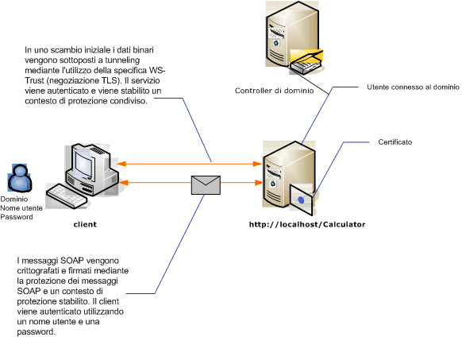

# Protezione dei messaggi tramite client con tipo di credenziale UserName
Nella figura seguente sono illustrati un servizio e un client [!INCLUDE[indigo1](../../../../includes/indigo1-md.md)] protetti tramite protezione a livello di messaggio.Il servizio viene autenticato con un certificato X.509.Il client esegue l'autenticazione utilizzando un nome utente e una password.  
  
 Per un'applicazione di esempio, vedere [Sicurezza dei messaggi tramite nome utente](../../../../docs/framework/wcf/samples/message-security-user-name.md).  
  
   
  
|Caratteristica|Descrizione|  
|--------------------|-----------------|  
|Modalità di sicurezza|Messaggio|  
|Interoperabilità|Solo [!INCLUDE[indigo1](../../../../includes/indigo1-md.md)]|  
|Autenticazione \(server\)|La negoziazione iniziale richiede l'autenticazione server|  
|Autenticazione \(client\)|Nome utente\/password|  
|Integrità|Sì, utilizzando un contesto di sicurezza condiviso|  
|Riservatezza|Sì, utilizzando un contesto di sicurezza condiviso|  
|Trasporto|HTTP|  
|Associazione|<xref:System.ServiceModel.WSHttpBinding>|  
  
## Servizio  
 Il codice e la configurazione seguenti devono essere eseguiti in modo indipendente.Eseguire una delle operazioni seguenti:  
  
-   Creare un servizio autonomo utilizzando il codice senza alcuna configurazione.  
  
-   Creare un servizio utilizzando la configurazione fornita, ma non definire alcun endpoint.  
  
### Codice  
 Nel codice seguente viene illustrato come creare un endpoint del servizio che utilizza la protezione del messaggio.  
  
 [!code-csharp[C_SecurityScenarios#9](../../../../samples/snippets/csharp/VS_Snippets_CFX/c_securityscenarios/cs/source.cs#9)]
 [!code-vb[C_SecurityScenarios#9](../../../../samples/snippets/visualbasic/VS_Snippets_CFX/c_securityscenarios/vb/source.vb#9)]  
  
### Configurazione  
 Invece del codice, è possibile utilizzare la configurazione seguente:  
  
```  
<?xml version="1.0" encoding="utf-8"?>  
<configuration>  
  <system.serviceModel>  
    <behaviors>  
      <serviceBehaviors>  
        <behavior name="ServiceCredentialsBehavior">  
          <serviceCredentials>  
            <serviceCertificate findValue="Contoso.com"   
                                storeLocation="LocalMachine"  
                                storeName="My"     
                                x509FindType="FindBySubjectName" />  
          </serviceCredentials>  
        </behavior>  
      </serviceBehaviors>  
    </behaviors>  
    <services>  
      <service behaviorConfiguration="ServiceCredentialsBehavior"  
               name="ServiceModel.Calculator">  
        <endpoint address="http://localhost/Calculator"  
                  binding="wsHttpBinding"  
                  bindingConfiguration="MessageAndUserName"  
                  name="SecuredByTransportEndpoint"  
                  contract="ServiceModel.ICalculator" />  
      </service>  
    </services>  
    <bindings>  
      <wsHttpBinding>  
        <binding name="MessageAndUserName">  
          <security mode="Message">              
            <message clientCredentialType="UserName" />  
          </security>  
        </binding>  
      </wsHttpBinding>  
    </bindings>  
    <client />  
  </system.serviceModel>  
</configuration>  
```  
  
## Client  
  
### Codice  
 Il codice seguente crea il client.L'associazione riguarda la protezione della modalità messaggio e il tipo di credenziale client è impostato su `UserName`.Il nome utente e la password possono essere specificati solo tramite codice \(non è configurabile\).Il codice per restituire il nome utente e la password non è riportato qui perché deve essere eseguito a livello di applicazione.Utilizzare, ad esempio, una finestra di dialogo Windows Form per chiedere all'utente i dati.  
  
 [!code-csharp[C_SecurityScenarios#16](../../../../samples/snippets/csharp/VS_Snippets_CFX/c_securityscenarios/cs/source.cs#16)]
 [!code-vb[C_SecurityScenarios#16](../../../../samples/snippets/visualbasic/VS_Snippets_CFX/c_securityscenarios/vb/source.vb#16)]  
  
### Configurazione  
 Il codice seguente configura il client.L'associazione riguarda la protezione della modalità messaggio e il tipo di credenziale client è impostato su `UserName`.Il nome utente e la password possono essere specificati solo tramite codice \(non è configurabile\).  
  
```  
<?xml version="1.0" encoding="utf-8"?>  
<configuration>  
  <system.serviceModel>  
    <bindings>  
      <wsHttpBinding>  
        <binding name="WSHttpBinding_ICalculator" >  
          <security mode="Message">  
            <message clientCredentialType="UserName" />  
          </security>  
        </binding>  
      </wsHttpBinding>  
    </bindings>  
    <client>  
      <endpoint address="http://machineName/Calculator"   
                binding="wsHttpBinding"  
                bindingConfiguration="WSHttpBinding_ICalculator"   
                contract="ICalculator"  
                name="WSHttpBinding_ICalculator">  
        <identity>  
          <dns value ="Contoso.com" />  
        </identity>  
      </endpoint>  
    </client>  
  </system.serviceModel>  
</configuration>  
```  
  
## Vedere anche  
 [Cenni preliminari sulla sicurezza](../../../../docs/framework/wcf/feature-details/security-overview.md)   
 [Sicurezza dei messaggi tramite nome utente](../../../../docs/framework/wcf/samples/message-security-user-name.md)   
 [Identità del servizio e autenticazione](../../../../docs/framework/wcf/feature-details/service-identity-and-authentication.md)   
 [\<identità\>](../../../../docs/framework/configure-apps/file-schema/wcf/identity.md)   
 [Modello di sicurezza per Windows Server App Fabric](http://go.microsoft.com/fwlink/?LinkID=201279&clcid=0x409)