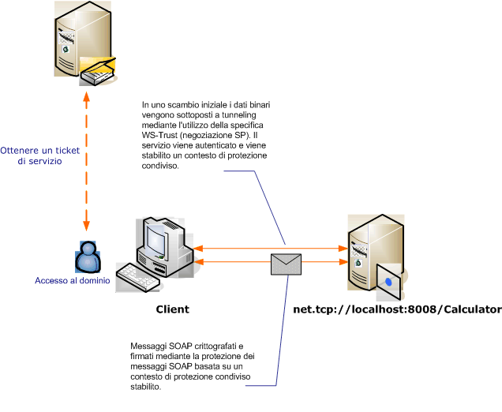

# Protezione dei messaggi con un client Windows
In questo scenario vengono illustrati un client e un server [!INCLUDE[indigo1](../../../../includes/indigo1-md.md)] protetti dalla modalità di sicurezza dei messaggi.Il client e il servizio vengono autenticati utilizzando le credenziali di Windows.  
  
   
  
|Caratteristica|Descrizione|  
|--------------------|-----------------|  
|Modalità di sicurezza|Messaggio|  
|Interoperabilità|Solo [!INCLUDE[indigo2](../../../../includes/indigo2-md.md)]|  
|Autenticazione \(server\)|Autenticazione reciproca del server e del client|  
|Autenticazione \(client\)|Autenticazione reciproca del server e del client|  
|Integrità|Sì, utilizzando un contesto di sicurezza condiviso|  
|Riservatezza|Sì, utilizzando un contesto di sicurezza condiviso|  
|Trasporto|NET.TCP|  
|Associazione|<xref:System.ServiceModel.NetTcpBinding>|  
  
## Servizio  
 Il codice e la configurazione seguenti devono essere eseguiti in modo indipendente.Eseguire una delle operazioni seguenti:  
  
-   Creare un servizio autonomo utilizzando il codice senza alcuna configurazione.  
  
-   Creare un servizio utilizzando la configurazione fornita, ma non definire alcun endpoint.  
  
### Codice  
 Nel codice seguente viene illustrato come creare un endpoint del servizio che utilizza la protezione dei messaggi per stabilire un contesto protetto con un computer Windows.  
  
 [!code-csharp[C_SecurityScenarios#11](../../../../samples/snippets/csharp/VS_Snippets_CFX/c_securityscenarios/cs/source.cs#11)]
 [!code-vb[C_SecurityScenarios#11](../../../../samples/snippets/visualbasic/VS_Snippets_CFX/c_securityscenarios/vb/source.vb#11)]  
  
### Configurazione  
 Per configurare il servizio, è possibile utilizzare la configurazione seguente anziché il codice:  
  
```  
<?xml version="1.0" encoding="utf-8"?>  
<configuration>  
  <system.serviceModel>  
    <services>  
      <service behaviorConfiguration=""  
               name="ServiceModel.Calculator">  
        <endpoint address="net.tcp://localhost:8008/Calculator"  
                  binding="netTcpBinding"  
                  bindingConfiguration="Windows"  
                  name="WindowsOverMessage"  
                  contract="ServiceModel.ICalculator" />  
      </service>  
    </services>  
    <bindings>  
      <netTcpBinding>  
        <binding name="Windows">  
          <security mode="Message">  
            <message clientCredentialType="Windows" />  
          </security>  
        </binding>  
      </netTcpBinding>  
    </bindings>  
    <client />  
  </system.serviceModel>  
</configuration>  
```  
  
## Client  
 Il codice e la configurazione seguenti devono essere eseguiti in modo indipendente.Eseguire una delle operazioni seguenti:  
  
-   Creare un client autonomo utilizzando il codice \(e il codice client\).  
  
-   Creare un client che non definisce alcun indirizzo di endpoint.Utilizzare invece il costruttore client che accetta il nome della configurazione come argomento.Ad esempio:  
  
     [!code-csharp[C_SecurityScenarios#0](../../../../samples/snippets/csharp/VS_Snippets_CFX/c_securityscenarios/cs/source.cs#0)]
     [!code-vb[C_SecurityScenarios#0](../../../../samples/snippets/visualbasic/VS_Snippets_CFX/c_securityscenarios/vb/source.vb#0)]  
  
### Codice  
 Il codice seguente crea un client.L'associazione riguarda la protezione della modalità messaggio e il tipo di credenziale client è impostato su `Windows`.  
  
 [!code-csharp[C_SecurityScenarios#18](../../../../samples/snippets/csharp/VS_Snippets_CFX/c_securityscenarios/cs/source.cs#18)]
 [!code-vb[C_SecurityScenarios#18](../../../../samples/snippets/visualbasic/VS_Snippets_CFX/c_securityscenarios/vb/source.vb#18)]  
  
### Configurazione  
 Per impostare le proprietà client viene utilizzata la configurazione seguente.  
  
```  
<?xml version="1.0" encoding="utf-8"?>  
<configuration>  
  <system.serviceModel>  
    <bindings>  
      <netTcpBinding>  
        <binding name="NetTcpBinding_ICalculator" >  
         <security mode="Message">  
            <message clientCredentialType="Windows" />  
          </security>  
        </binding>  
      </netTcpBinding>  
    </bindings>  
    <client>  
      <endpoint address="net.tcp://machineName:8008/Calculator"   
                binding="netTcpBinding"  
                bindingConfiguration="NetTcpBinding_ICalculator"  
                contract="ICalculator"  
                name="NetTcpBinding_ICalculator">          
      </endpoint>  
    </client>  
  </system.serviceModel>  
</configuration>  
```  
  
## Vedere anche  
 [Cenni preliminari sulla sicurezza](../../../../docs/framework/wcf/feature-details/security-overview.md)   
 [Modello di sicurezza per Windows Server App Fabric](http://go.microsoft.com/fwlink/?LinkID=201279&clcid=0x409)