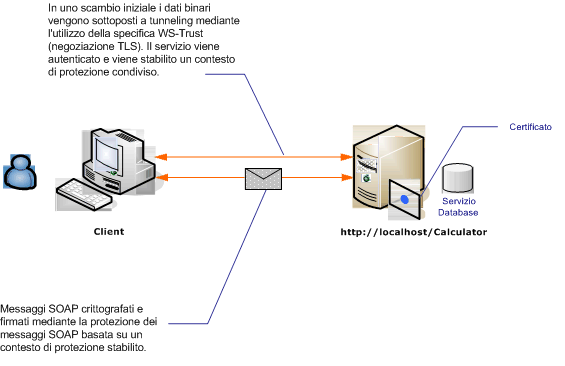

# Protezione dei messaggi con un client anonimo
Nello scenario seguente vengono illustrati un client e un servizio protetti tramite la protezione dei messaggi [!INCLUDE[indigo1](../../../../includes/indigo1-md.md)].  Tra gli obiettivi di progettazione c'è quello di usare la sicurezza dei messaggi invece che la sicurezza del trasporto, così che in futuro sia possibile supportare un modello basato su attestazioni più avanzate.  [!INCLUDE[crabout](../../../../includes/crabout-md.md)]ll'uso di attestazioni avanzate per l'autorizzazione, vedere [Gestione di attestazioni e autorizzazioni con il modello di identità](../../../../docs/framework/wcf/feature-details/managing-claims-and-authorization-with-the-identity-model.md).  
  
 Per un'applicazione di esempio, vedere [Sicurezza dei messaggi anonima](../../../../docs/framework/wcf/samples/message-security-anonymous.md).  
  
   
  
|Caratteristica|Descrizione|  
|--------------------|-----------------|  
|Modalità di sicurezza|Messaggio|  
|Interoperabilità|Solo [!INCLUDE[indigo2](../../../../includes/indigo2-md.md)]|  
|Autenticazione \(server\)|La negoziazione iniziale richiede l'autenticazione server, ma non l'autenticazione client|  
|Autenticazione \(client\)|None|  
|Integrità|Sì, usando un contesto di sicurezza condiviso|  
|Riservatezza|Sì, usando un contesto di sicurezza condiviso|  
|Trasporto|HTTP|  
  
## Servizio  
 Il codice e la configurazione seguenti devono essere eseguiti in modo indipendente.  Eseguire una delle operazioni seguenti:  
  
-   Creare un servizio autonomo usando il codice senza alcuna configurazione.  
  
-   Creare un servizio usando la configurazione fornita, ma non definire alcun endpoint.  
  
### Codice  
 Nel codice seguente viene illustrato come creare un endpoint del servizio che usa la protezione del messaggio.  
  
 [!code-csharp[C_SecurityScenarios#8](../../../../samples/snippets/csharp/VS_Snippets_CFX/c_securityscenarios/cs/source.cs#8)]
 [!code-vb[C_SecurityScenarios#8](../../../../samples/snippets/visualbasic/VS_Snippets_CFX/c_securityscenarios/vb/source.vb#8)]  
  
### Configurazione  
 Invece del codice, è possibile usare la configurazione seguente:  L'elemento di comportamento del servizio viene usato per specificare un certificato che viene usato per autenticare il servizio sul client.  L'elemento servizio deve specificare il comportamento usando l'attributo `behaviorConfiguration`.  L'elemento associazione specifica che il tipo di credenziale client è `None`, consentendo ai client anonimi di usare il servizio.  
  
```  
<?xml version="1.0" encoding="utf-8"?>  
<configuration>  
  <system.serviceModel>  
    <behaviors>  
      <serviceBehaviors>  
        <behavior name="ServiceCredentialsBehavior">  
          <serviceCredentials>  
            <serviceCertificate findValue="contoso.com"   
                                storeLocation="LocalMachine"  
                                storeName="My" />  
          </serviceCredentials>  
        </behavior>  
      </serviceBehaviors>  
    </behaviors>  
    <services>  
      <service behaviorConfiguration="ServiceCredentialsBehavior"   
               name="ServiceModel.Calculator">  
        <endpoint address="http://localhost/Calculator"   
                  binding="wsHttpBinding"  
                  bindingConfiguration="WSHttpBinding_ICalculator"   
                  name="CalculatorService"  
                  contract="ServiceModel.ICalculator" />  
      </service>  
    </services>  
    <bindings>  
      <wsHttpBinding>  
        <binding name="WSHttpBinding_ICalculator" >  
          <security mode="Message">  
            <message clientCredentialType="None" />  
          </security>  
        </binding>  
      </wsHttpBinding>  
    </bindings>  
    <client />  
  </system.serviceModel>  
</configuration>  
```  
  
## Client  
 Il codice e la configurazione seguenti devono essere eseguiti in modo indipendente.  Eseguire una delle operazioni seguenti:  
  
-   Creare un client autonomo usando il codice \(e il codice client\).  
  
-   Creare un client che non definisce alcun indirizzo di endpoint.  Usare invece il costruttore client che accetta il nome della configurazione come argomento.  Ad esempio:  
  
     [!code-csharp[C_SecurityScenarios#0](../../../../samples/snippets/csharp/VS_Snippets_CFX/c_securityscenarios/cs/source.cs#0)]
     [!code-vb[C_SecurityScenarios#0](../../../../samples/snippets/visualbasic/VS_Snippets_CFX/c_securityscenarios/vb/source.vb#0)]  
  
### Codice  
 Nel codice seguente viene creata un'istanza del client.  L'associazione usa la protezione in modalità messaggio e il tipo di credenziale client è impostato su Nessuno.  
  
 [!code-csharp[C_SecurityScenarios#15](../../../../samples/snippets/csharp/VS_Snippets_CFX/c_securityscenarios/cs/source.cs#15)]
 [!code-vb[C_SecurityScenarios#15](../../../../samples/snippets/visualbasic/VS_Snippets_CFX/c_securityscenarios/vb/source.vb#15)]  
  
### Configurazione  
 Nel codice seguente viene configurato il client.  
  
```  
<?xml version="1.0" encoding="utf-8"?>  
<configuration>  
  <system.serviceModel>  
    <bindings>  
      <wsHttpBinding>  
        <binding name="WSHttpBinding_ICalculator" >  
          <security mode="Message">  
            <message clientCredentialType="None" />  
          </security>  
        </binding>  
      </wsHttpBinding>  
    </bindings>  
    <client>  
      <endpoint address="http://machineName/Calculator"  
        binding="wsHttpBinding"  
        bindingConfiguration="WSHttpBinding_ICalculator"   
        contract="ICalculator"  
        name="WSHttpBinding_ICalculator">  
        <identity>  
          <dns value="contoso.com" />  
        </identity>  
      </endpoint>  
    </client>  
  </system.serviceModel>  
</configuration>  
```  
  
## Vedere anche  
 [Cenni preliminari sulla sicurezza](../../../../docs/framework/wcf/feature-details/security-overview.md)   
 [Protezione delle applicazioni distribuite](../../../../docs/framework/wcf/feature-details/distributed-application-security.md)   
 [Sicurezza dei messaggi anonima](../../../../docs/framework/wcf/samples/message-security-anonymous.md)   
 [Identità del servizio e autenticazione](../../../../docs/framework/wcf/feature-details/service-identity-and-authentication.md)   
 [Modello di sicurezza per Windows Server AppFabric](http://go.microsoft.com/fwlink/?LinkID=201279&clcid=0x409)