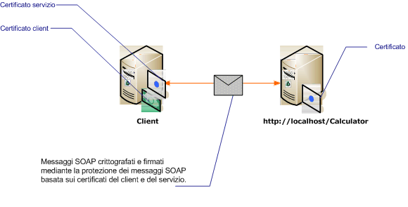

# Protezione dei messaggi con certificati reciproci
Nello scenario seguente sono illustrati un client e un servizio [!INCLUDE[indigo1](../../../../includes/indigo1-md.md)] protetti tramite la protezione a livello di messaggio.Il client e il servizio sono autenticati mediante certificati.  
  
 Questo scenario è interoperativo perché utilizza WS\-Security con la specifica X.509 Certificate Token Profile.  
  
> [!NOTE]
>  Nello scenario non viene eseguita la negoziazione del certificato del servizio.È necessario che il certificato del servizio venga fornito al client prima di qualsiasi comunicazione.Il certificato del server può essere distribuito con l'applicazione o fornito in una comunicazione fuori banda.  
  
   
  
|Caratteristica|Descrizione|  
|--------------------|-----------------|  
|Modalità di sicurezza|Messaggio|  
|Interoperabilità|Sì, con WS\-Security e client e servizi compatibili con X.509 Certificate Token Profile.|  
|Autenticazione|Autenticazione reciproca del server e del client.|  
|Integrità|Sì|  
|Riservatezza|Sì|  
|Trasporto|HTTP|  
|Associazione|<xref:System.ServiceModel.WSHttpBinding>|  
  
## Servizio  
 Il codice e la configurazione seguenti devono essere eseguiti in modo indipendente.Eseguire una delle operazioni seguenti:  
  
-   Creare un servizio autonomo utilizzando il codice senza alcuna configurazione.  
  
-   Creare un servizio utilizzando la configurazione fornita, ma non definire alcun endpoint.  
  
### Codice  
 Nel codice seguente viene illustrato come creare un endpoint del servizio che utilizza la protezione del messaggio.Il servizio richiede un certificato per identificarsi.  
  
 [!code-csharp[C_SecurityScenarios#13](../../../../samples/snippets/csharp/VS_Snippets_CFX/c_securityscenarios/cs/source.cs#13)]
 [!code-vb[C_SecurityScenarios#13](../../../../samples/snippets/visualbasic/VS_Snippets_CFX/c_securityscenarios/vb/source.vb#13)]  
  
### Configurazione  
 Per creare lo stesso servizio, è possibile utilizzare la configurazione seguente anziché il codice.  
  
```  
<?xml version="1.0" encoding="utf-8"?>  
<configuration>  
  <system.serviceModel>  
    <behaviors>  
      <serviceBehaviors>  
        <behavior name="serviceCredentialBehavior">  
          <serviceCredentials>  
            <serviceCertificate findValue="Contoso.com"   
                                storeLocation="LocalMachine"  
                                storeName="My"   
                                x509FindType="FindBySubjectName" />  
          </serviceCredentials>  
        </behavior>  
      </serviceBehaviors>  
    </behaviors>  
    <services>  
      <service behaviorConfiguration="serviceCredentialBehavior"   
               name="ServiceModel.Calculator">  
        <endpoint address="http://localhost/Calculator"   
                  binding="wsHttpBinding"  
                  bindingConfiguration="InteropCertificateBinding"  
                  name="WSHttpBinding_ICalculator"  
                  contract="ServiceModel.ICalculator" />  
      </service>  
    </services>  
    <bindings>  
      <wsHttpBinding>  
        <binding name="InteropCertificateBinding">  
          <security mode="Message">  
            <message clientCredentialType="Certificate"  
                     negotiateServiceCredential="false"  
                     establishSecurityContext="false" />  
          </security>  
        </binding>  
      </wsHttpBinding>  
    </bindings>  
    <client />  
  </system.serviceModel>  
</configuration>  
```  
  
## Client  
 Il codice e la configurazione seguenti devono essere eseguiti in modo indipendente.Eseguire una delle operazioni seguenti:  
  
-   Creare un client autonomo utilizzando il codice \(e il codice client\).  
  
-   Creare un client che non definisce alcun indirizzo di endpoint.Utilizzare invece il costruttore client che accetta il nome della configurazione come argomento.Ad esempio:  
  
     [!code-csharp[C_SecurityScenarios#0](../../../../samples/snippets/csharp/VS_Snippets_CFX/c_securityscenarios/cs/source.cs#0)]
     [!code-vb[C_SecurityScenarios#0](../../../../samples/snippets/visualbasic/VS_Snippets_CFX/c_securityscenarios/vb/source.vb#0)]  
  
### Codice  
 Il codice seguente crea il client.La modalità di sicurezza è impostata su Message e il tipo di credenziale client è impostato su Certificate.  
  
 [!code-csharp[C_SecurityScenarios#20](../../../../samples/snippets/csharp/VS_Snippets_CFX/c_securityscenarios/cs/source.cs#20)]
 [!code-vb[C_SecurityScenarios#20](../../../../samples/snippets/visualbasic/VS_Snippets_CFX/c_securityscenarios/vb/source.vb#20)]  
  
### Configurazione  
 Il codice seguente consente di configurare il client.È necessario specificare un certificato client utilizzando l'elemento [\<certificatoClient\>](../../../../docs/framework/configure-apps/file-schema/wcf/clientcertificate-of-clientcredentials-element.md).Il certificato del servizio, inoltre, viene specificato utilizzando [\<certificatoPredefinito\>](../../../../docs/framework/configure-apps/file-schema/wcf/defaultcertificate-element.md).  
  
```  
<?xml version="1.0" encoding="utf-8"?>  
<configuration>  
  <system.serviceModel>  
    <behaviors>  
      <endpointBehaviors>  
        <behavior name="ClientCredentialsBehavior">  
          <clientCredentials>  
            <clientCertificate findValue="Cohowinery.com"   
                 storeLocation="CurrentUser"  
                 storeName="My"  
                 x509FindType="FindBySubjectName" />  
            <serviceCertificate>  
              <defaultCertificate findValue="Contoso.com"   
                                  storeLocation="CurrentUser"  
                                  storeName="TrustedPeople"  
                                  x509FindType="FindBySubjectName" />  
            </serviceCertificate>  
          </clientCredentials>  
        </behavior>  
      </endpointBehaviors>  
    </behaviors>  
    <bindings>  
      <wsHttpBinding>  
        <binding name="WSHttpBinding_ICalculator" >  
          <security mode="Message">  
            <message clientCredentialType="Certificate"   
                     negotiateServiceCredential="false"  
                     establishSecurityContext="false" />  
          </security>  
        </binding>  
      </wsHttpBinding>  
    </bindings>  
    <client>  
      <endpoint address="http://machineName/Calculator"   
                behaviorConfiguration="ClientCredentialsBehavior"  
                binding="wsHttpBinding"   
                bindingConfiguration="WSHttpBinding_ICalculator"  
                contract="ICalculator"  
                name="WSHttpBinding_ICalculator">  
        <identity>  
          <certificate encodedValue="Encoded_Value_Not_Shown" />  
        </identity>  
      </endpoint>  
    </client>  
  </system.serviceModel>  
</configuration>  
```  
  
## Vedere anche  
 [Cenni preliminari sulla sicurezza](../../../../docs/framework/wcf/feature-details/security-overview.md)   
 [modello di sicurezza per Windows Server App Fabric](http://go.microsoft.com/fwlink/?LinkID=201279&clcid=0x409)   
 [procedura di creazione e installazione di certificati temporanei in WCF per la sicurezza del trasporto durante lo sviluppo](http://go.microsoft.com/fwlink/?LinkId=244264)