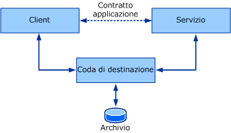
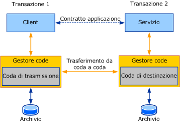

# Panoramica delle code
Contenuto della sezione vengono introdotti i concetti generali e fondamentali alla base delle comunicazioni in coda.  Nelle sezioni successive verrà illustrato in dettaglio come i concetti dell'accodamento descritti in questa sezione si applicano a [!INCLUDE[indigo1](../../../../includes/indigo1-md.md)].  
  
## Concetti di base dell'accodamento  
 Durante la progettazione di un'applicazione distribuita, è importante scegliere il trasporto giusto per la comunicazione tra i servizi e i client.  Molti fattori influiscono sul tipo di trasporto da usare.  Un fattore importante, ovvero l'isolamento tra il servizio, il client e il trasporto, impone l'uso di un trasporto in coda o un trasporto diretto, ad esempio TCP o HTTP.  A causa della natura dei trasporti diretti quali TCP e HTTP, la comunicazione si arresta completamente se il servizio o il client smette di funzionare o in caso di errore nella rete.  Il servizio, il client e la rete devono essere in esecuzione contemporaneamente per consentire il funzionamento dell'applicazione.  I trasporti in coda forniscono l'isolamento, ovvero se si verifica un errore nel servizio o nel client oppure nei collegamenti di comunicazione tra questi, il client e servizio possono continuare a funzionare.  
  
 Le code assicurano una comunicazione affidabile anche in caso di errori nelle parti in comunicazione o nella rete.  I messaggi scambiati tra le parti in comunicazione vengono acquisiti e recapitati dalle code.  In genere le code sono associate a qualche tipo di archivio che può essere volatile o durevole.  Le code archiviano i messaggi di un client per conto di un servizio e in un secondo momento li inoltrano al servizio.  Poiché le code di riferimento indiretto forniscono un isolamento garantito delle parti rispetto agli errori, questo rappresenta il meccanismo di comunicazione preferito per i sistemi a elevata disponibilità e i servizi non connessi.  Il riferimento indiretto comporta tuttavia un elevato costo di latenza.  La *latenza* è l'intervallo di tempo tra il momento in cui il client invia un messaggio e il momento in cui il servizio lo riceve.  Di conseguenza, quando il messaggio è stato inviato, non è possibile stabilire quando tale messaggio verrà elaborato.  La maggior parte delle applicazioni in coda deve gestire una latenza elevata.  Nella figura seguente viene mostrato un modello concettuale della comunicazione in coda.  
  
   
  
 Modello concettuale della comunicazione in coda  
  
 In realtà, la coda è un concetto distribuito  e, pertanto, può essere locale a una delle parti o remota a entrambe le parti.  In genere, la coda è locale rispetto al servizio.  In questa configurazione, il client non può dipendere dalla disponibilità della connessione alla coda remota.  In modo analogo, la coda deve essere disponibile indipendentemente dalla disponibilità del servizio che legge dalla coda.  Un gestore delle code gestisce una raccolta di code  ed è responsabile per l'accettazione dei messaggi inviati alle code da altri gestori delle code.  È inoltre responsabile per la gestione della connettività a code remote e del trasferimento di messaggi a tali code remote.  Per garantire la disponibilità delle code nonostante gli errori dell'applicazione client o di servizio, il gestore delle code in genere viene eseguito come servizio esterno.  
  
 Quando un client invia un messaggio a una coda, lo indirizza alla coda di destinazione, che è la coda gestita dal gestore delle code del servizio.  Il gestore delle code sul client invia il messaggio a una coda di trasmissione \(o in uscita\),  ovvero una coda sul gestore delle code client che archivia i messaggi destinati alla trasmissione alla coda di destinazione.  Il gestore delle code cerca quindi un percorso per il gestore delle code proprietario della coda di destinazione e trasferisce ad esso il messaggio.  Per assicurare una comunicazione affidabile, i gestori delle code implementano un protocollo di trasferimento affidabile che consente di impedire la perdita di dati.  Il gestore delle code di destinazione accetta i messaggi indirizzati alle code di destinazione di cui è proprietario e archivia i messaggi.  Il servizio invia una richiesta per leggere dalla coda di destinazione, quindi il gestore delle code recapita il messaggio all'applicazione di destinazione.  Nella figura seguente viene mostrata la comunicazione tra le quattro parti.  
  
   
  
 Comunicazione in coda in uno scenario di distribuzione tipico  
  
 In questo modo, il gestore delle code fornisce l'isolamento necessario per consentire eventuali errori nel mittente e nel destinatario senza influire sulla comunicazione effettiva.  Il vantaggio dell'ulteriore riferimento indiretto fornito dalle code consente a più istanze dell'applicazione di leggere dalla stessa coda, in modo che il lavoro delle farm tra i nodi raggiunge velocità effettive più elevate.  Di conseguenza, le code vengono spesso usate per soddisfare requisiti di maggiore scalabilità e velocità effettiva.  
  
## Code e transazioni  
 Le transazioni consentono di raggruppare un set di operazioni in modo che se si verifica un errore in un'operazione, tutte le operazioni avranno esito negativo.  Per un esempio di come usare transazioni, si supponga che una persona utilizzi lo sportello bancomat per trasferire 1.000 euro dal conto di risparmio al conto corrente.  Questo passaggio comporta le operazioni seguenti:  
  
-   Prelievo di 1.000 euro dal conto di risparmio.  
  
-   Deposito di 1.000 euro nel conto corrente.  
  
 Se la prima operazione riesce e vengono prelevati 1.000 euro dal conto di risparmio ma la seconda operazione non riesce, i 1.000 euro vengono persi perché sono già stati prelevati dal conto di risparmio.  Per preservare un stato valido dei conti, se un'operazione non riesce, entrambe le operazioni devono avere esito negativo.  
  
 Nella messaggistica transazionale, i messaggi possono essere inviati alla coda e ricevuti dalla coda nell'ambito di una transazione.  Pertanto, se un messaggio viene inviato in una transazione e viene eseguito il rollback della transazione, è come se il messaggio non fosse mai stato inviato alla coda.  In modo analogo, se un messaggio viene ricevuto in una transazione e viene eseguito il rollback della transazione, è come se il messaggio non fosse mai stato ricevuto.  Il messaggio rimane nella coda per poter essere letto.  
  
 A causa della latenza elevata, quando si invia un messaggio non è possibile sapere quanto tempo impiega per raggiungere la coda di destinazione, né quanto tempo impiega il servizio per elaborare il messaggio.  Per questo motivo, non è consigliabile usare una singola transazione per inviare il messaggio, ricevere il messaggio e quindi elaborarlo.  Ciò crea una transazione di cui non viene eseguito il commit per un periodo di tempo indeterminato.  Quando un client e un servizio comunicano tramite una coda usando una transazione, vengono usate due transazioni: una sul client e una sul servizio.  Nella figura seguente vengono mostrati i limiti della transazione in una tipica comunicazione in coda.  
  
   
  
 Comunicazione in coda che mostra transazioni distinte per l'acquisizione e il recapito  
  
 La transazione client elabora e invia il messaggio.  Quando viene eseguito il commit della transazione, il messaggio si trova nella coda di trasmissione.  Sul servizio, la transazione legge il messaggio dalla coda di destinazione, elabora il messaggio e quindi esegue il commit della transazione.  Se si verifica un errore durante l'elaborazione, viene eseguito il rollback del messaggio e viene posizionato nella coda di destinazione.  
  
## Comunicazione asincrona mediante le code  
 Le code offrono un mezzo di comunicazione asincrono.  Le applicazioni che inviano messaggi usando le code non possono aspettare che il messaggio venga ricevuto ed elaborato dal destinatario a causa della latenza elevata introdotta dal gestore delle code.  I messaggi possono restare nella coda per un tempo molto più lungo di quello previsto dall'applicazione.  Per evitare questo problema, l'applicazione può specificare un valore di durata \(TTL\) sul messaggio.  Questo valore specifica per quanto tempo il messaggio deve rimanere nella coda di trasmissione.  Se questo valore viene superato e il messaggio non è ancora stato inviato alla coda di destinazione, può essere trasferito a una coda dei messaggi non recapitabili.  
  
 Quando il mittente invia un messaggio, se l'operazione di invio viene restituita ciò implica che il messaggio ha raggiunto solo la coda di trasmissione del mittente.  Di conseguenza, se si verifica un errore nella trasmissione del messaggio alla coda di destinazione, l'applicazione di origine non può individuarlo immediatamente.  Per rilevare tali errori, il messaggio non recapitato viene trasferito alla coda dei messaggi non recapitabili.  
  
 Qualsiasi errore, ad esempio un messaggio che non riesce a raggiungere la coda di destinazione o la scadenza della durata del messaggio, deve essere elaborato separatamente.  Non è insolito, pertanto, che le applicazioni in coda scrivano due set di logica:  
  
-   La normale logica del client e del servizio per l'invio e la ricezione dei messaggi.  
  
-   La logica di compensazione per gestire i messaggi dalla trasmissione o dal recapito non riusciti.  
  
 Nelle sezioni seguenti vengono esaminati questi concetti.  
  
## Programmazione della coda dei messaggi non recapitabili  
 Le code dei messaggi non recapitabili contengono messaggi che non sono riusciti a raggiungere la coda di destinazione per vari motivi,  ad esempio i messaggi scadono oppure problemi di connettività impediscono il trasferimento del messaggio alla coda di destinazione.  
  
 In genere, un'applicazione può leggere i messaggi da una coda dei messaggi non recapitabili a livello di sistema, determinare il problema e agire di conseguenza, ad esempio correggendo gli errori e inviando nuovamente il messaggio oppure prendendone nota.  
  
## Programmazione della coda dei messaggi non elaborabili  
 Quando un messaggio raggiunge la coda di destinazione, è possibile che il servizio non riesca ripetutamente a elaborare il messaggio.  Ad esempio, un'applicazione legge un messaggio dalla coda in una transazione e dopo aver aggiornato un database può scoprire che è stato disconnesso temporaneamente.  In questo caso, viene eseguito il rollback della transazione, viene creata una transazione e il messaggio viene letto nuovamente dalla coda.  Un secondo tentativo può riuscire o meno.  In alcuni casi, a seconda della causa dell'errore, il recapito del messaggio all'applicazione può non riuscire ripetutamente.  In questo caso, il messaggio viene considerato "non elaborabile" e viene spostato in una coda non elaborabile che può essere letta da un'applicazione che gestisce i messaggi non elaborabili.  
  
## Vedere anche  
 [Accodamento in WCF](../../../../docs/framework/wcf/feature-details/queuing-in-wcf.md)   
 [Accodamento in WCF](../../../../docs/framework/wcf/feature-details/queuing-in-wcf.md)   
 [Sessioni e code](../../../../docs/framework/wcf/samples/sessions-and-queues.md)   
 [Code di messaggi non recapitabili](../../../../docs/framework/wcf/samples/dead-letter-queues.md)   
 [Comunicazione volatile in coda](../../../../docs/framework/wcf/samples/volatile-queued-communication.md)   
 [Da Windows Communication Foundation a Accodamento messaggi](../../../../docs/framework/wcf/samples/wcf-to-message-queuing.md)   
 [Installazione accodamento messaggi \(MSMQ\)](../../../../docs/framework/wcf/samples/installing-message-queuing-msmq.md)   
 [Message Queuing Integration Binding Samples](http://msdn.microsoft.com/it-it/997d11cb-f2c5-4ba0-9209-92843d4d0e1a)   
 [Accodamento messaggi in Windows Communication Foundation](../../../../docs/framework/wcf/samples/message-queuing-to-wcf.md)   
 [Sicurezza dei messaggi nell'accodamento messaggi](../../../../docs/framework/wcf/samples/message-security-over-message-queuing.md)