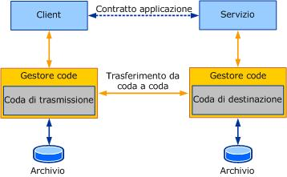

# Protezione dei messaggi mediante protezione a livello di messaggio
In questa sezione viene descritta la protezione del messaggio [!INCLUDE[indigo2](../../../../includes/indigo2-md.md)] in caso di utilizzo di <xref:System.ServiceModel.NetMsmqBinding>.  
  
> [!NOTE]
>  Prima di leggere l'argomento, è consigliabile leggere [Concetti sulla protezione](../../../../docs/framework/wcf/feature-details/security-concepts.md).  
  
 Nell'illustrazione seguente è rappresentato un modello concettuale della comunicazione in coda che utilizza [!INCLUDE[indigo2](../../../../includes/indigo2-md.md)].L'illustrazione e la terminologia vengono utilizzate nella spiegazione  
  
 dei concetti della protezione del trasporto.  
  
   
  
 Durante l'invio di messaggi in coda mediante [!INCLUDE[indigo2](../../../../includes/indigo2-md.md)], il messaggio [!INCLUDE[indigo2](../../../../includes/indigo2-md.md)] viene allegato come corpo del messaggio MSMQ \(Accodamento messaggi\).Mentre la protezione del trasporto protegge l'intero messaggio MSMQ, la protezione del messaggio, o SOAP, protegge il corpo del messaggio MSMQ.  
  
 Il concetto chiave della protezione del messaggio consiste nel fatto che il client protegge il messaggio per l'applicazione ricevente \(servizio\), a differenza dalla protezione del trasporto in cui il client protegge il messaggio per la coda di destinazione.In tale contesto, Accodamento messaggi non svolge alcun ruolo nella protezione del messaggio [!INCLUDE[indigo2](../../../../includes/indigo2-md.md)] con la protezione del messaggio.  
  
 La protezione del messaggio [!INCLUDE[indigo2](../../../../includes/indigo2-md.md)] aggiunge intestazioni di sicurezza al messaggio [!INCLUDE[indigo2](../../../../includes/indigo2-md.md)] che si integrano con infrastrutture di sicurezza esistenti, ad esempio un certificato o il protocollo Kerberos.  
  
## Tipo di credenziali del messaggio  
 Mediante la protezione del messaggio il servizio e il client possono presentare credenziali per autenticarsi reciprocamente.È possibile selezionare la protezione del messaggio impostando la modalità <xref:System.ServiceModel.NetMsmqBinding.Security%2A> su `Message` o `Both` \(ovvero per utilizzare sia la protezione del trasporto che la protezione del messaggio\).  
  
 Il servizio può utilizzare la proprietà <xref:System.ServiceModel.ServiceSecurityContext.Current%2A> per controllare la credenziale utilizzata per autenticare il client,nonché per ulteriori controlli di autorizzazione che il servizio scelga di implementare.  
  
 In questa sezione vengono illustrati i diversi tipi di credenziali e viene spiegato come utilizzarli con le code.  
  
### Certificato  
 Il tipo di credenziale del certificato utilizza un certificato X.509 per identificare il servizio e il client.  
  
 In uno scenario tipico il client e il servizio ricevono un certificato valido rilasciato da un'autorità di certificazione attendibile.La connessione viene quindi stabilita, il client autentica la validità del servizio utilizzando il certificato del servizio per decidere se il servizio è attendibile.Analogamente il servizio utilizza il certificato del client per verificare l'attendibilità del client.  
  
 In considerazione del fatto che le code funzionano spesso in modalità disconnessa, il client e il servizio potrebbero non essere in linea contemporaneamentee potrebbero doversi scambiare i certificati fuori banda.Il client, in particolare, poiché detiene il certificato del servizio \(che può essere collegato a un'autorità di certificazione\) nell'archivio attendibile, deve appurare di avere stabilito la comunicazione con il servizio corretto.Per autenticare il client, il servizio utilizza il certificato X.509 allegato al messaggio e cerca una corrispondenza con il certificato esistente nell'archivio.Anche in questo caso il certificato deve essere collegato a un'autorità di certificazione.  
  
 Nei computer che eseguono Windows i certificati sono contenuti in vari tipi di archivio.[!INCLUDE[crabout](../../../../includes/crabout-md.md)] diversi archivi, vedere [Archivi certificati](http://go.microsoft.com/fwlink/?LinkId=87787).  
  
### Windows  
 Il tipo di credenziale del messaggio di Windows utilizza il protocollo Kerberos.  
  
 Il protocollo Kerberos è un meccanismo di sicurezza che esegue l'autenticazione degli utenti in un dominio e consente agli utenti autenticati di stabilire una connessione protetta con le altre entità del dominio.  
  
 Il problema dell'utilizzo del protocollo Kerberos per la comunicazione in coda consiste nel fatto che i ticket che contengono l'identità client distribuita dal centro distribuzione chiavi \(KDC, Key Distribution Center\) hanno una durata limitata.Al ticket Kerberos è associata una *durata* che indica la validità del ticket.Per questa ragione e in considerazione della latenza elevata non è possibile avere la certezza che il token sia ancora valido per il servizio che autentica il client.  
  
 Si noti che in caso di utilizzo di questo tipo di credenziale, il servizio deve essere in esecuzione nell'account SERVIZIO.  
  
 Il protocollo Kerberos viene utilizzato per impostazione predefinita durante la scelta della credenziale del messaggio.[!INCLUDE[crdefault](../../../../includes/crdefault-md.md)][Kerberos, il protocollo per la protezione distribuita in Windows 2000](http://go.microsoft.com/fwlink/?LinkId=87790) \(il contenuto potrebbe essere in inglese\).  
  
### Nome utente\/password  
 Mediante questa proprietà il client può eseguire l'autenticazione nel server utilizzando una password di nome utente nell'intestazione di sicurezza del messaggio.  
  
### IssuedToken  
 Il client può utilizzare il servizio token di sicurezza per rilasciare un token che può quindi essere allegato al messaggio affinché il servizio autentichi il client.  
  
## Utilizzo della protezione del trasporto e del messaggio  
 In caso di utilizzo della protezione del trasporto e della protezione del messaggio, il certificato utilizzato per proteggere il messaggio sia a livello di trasporto che a livello di messaggio SOAP deve essere lo stesso.  
  
## Vedere anche  
 [Protezione dei messaggi mediante protezione del trasporto](../../../../docs/framework/wcf/feature-details/securing-messages-using-transport-security.md)   
 [Sicurezza dei messaggi nell'accodamento messaggi](../../../../docs/framework/wcf/samples/message-security-over-message-queuing.md)   
 [Concetti sulla protezione](../../../../docs/framework/wcf/feature-details/security-concepts.md)   
 [Protezione di servizi e client](../../../../docs/framework/wcf/feature-details/securing-services-and-clients.md)