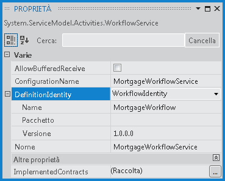
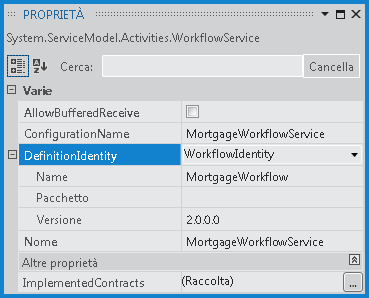

# Gestione di pi&#249; versioni in WorkflowServiceHost
Il controllo delle versioni side\-by\-side di <xref:System.ServiceModel.Activities.WorkflowServiceHost> introdotto in [!INCLUDE[net_v45](../../../../includes/net-v45-md.md)] fornisce la possibilità di ospitare più versioni di un servizio di flusso di lavoro in un unico endpoint.  La funzionalità side\-by\-side consente di configurare un servizio di flusso di lavoro in modo che le sue nuove istanze vengano create con la nuova definizione del flusso di lavoro, mentre le istanze in esecuzione vengono completate con la definizione esistente.  In questo argomento viene fornita una panoramica dell'esecuzione side\-by\-side del servizio di flusso di lavoro usando <xref:System.ServiceModel.Activities.WorkflowServiceHost>.  
  
> [!NOTE]
>  Per scaricare un esempio e guardare un video sulla procedura dettagliata della gestione di più versioni del servizio del flusso di lavoro, vedere [Gestione di più versioni con un servizio del flusso di lavoro Xamlx ospitato dal Web](http://go.microsoft.com/fwlink/?LinkId=393746).  
  
## Hosting di più versioni in un servizio di flusso di lavoro  
 <xref:System.ServiceModel.Activities.WorkflowServiceHost> contiene due proprietà che possono essere configurate per consentire l'esecuzione side\-by\-side di più versioni di un flusso di lavoro: <xref:System.ServiceModel.Activities.WorkflowServiceHost.SupportedVersions%2A> e <xref:System.ServiceModel.Activities.WorkflowService.DefinitionIdentity%2A>.  La proprietà <xref:System.ServiceModel.Activities.WorkflowServiceHost.SupportedVersions%2A> contiene le versioni supportate del servizio di flusso di lavoro e la proprietà <xref:System.ServiceModel.Activities.WorkflowService.DefinitionIdentity%2A> viene usata per identificare in modo univoco ogni servizio di flusso di lavoro.  Questa operazione viene effettuata associando un oggetto <xref:System.Activities.WorkflowIdentity> al servizio di flusso di lavoro.  <xref:System.Activities.WorkflowIdentity> contiene tre informazioni di identificazione.  Le proprietà <xref:System.Activities.WorkflowIdentity.Name%2A> e <xref:System.Activities.WorkflowIdentity.Version%2A> contengono un nome e un oggetto <xref:System.Version> e sono obbligatorie, mentre la proprietà <xref:System.Activities.WorkflowIdentity.Package%2A> è facoltativa e può essere usata per specificare una stringa aggiuntiva che contiene informazioni quali il nome dell'assembly o altre informazioni desiderate.  A ogni servizio di flusso di lavoro contenuto nella raccolta <xref:System.ServiceModel.Activities.WorkflowServiceHost.SupportedVersions%2A> deve essere associato un oggetto <xref:System.Activities.WorkflowIdentity> univoco.  Un oggetto <xref:System.Activities.WorkflowIdentity> è univoco se una qualsiasi delle tre relative proprietà è diversa da un altro oggetto <xref:System.Activities.WorkflowIdentity>.  Un oggetto <xref:System.Activities.WorkflowIdentity> `null` è un valore consentito per <xref:System.ServiceModel.Activities.WorkflowService.DefinitionIdentity%2A>, tuttavia solo una versione precedente di un servizio di flusso di lavoro può avere <xref:System.Activities.WorkflowIdentity> `null`.  
  
> [!IMPORTANT]
>  <xref:System.Activities.WorkflowIdentity> non deve contenere eventuali informazioni identificabili personalmente \(PII\).  <xref:System.Activities.WorkflowIdentity> si compone di tre parti: <xref:System.Activities.WorkflowIdentity.Name%2A> \(<xref:System.String>\), <xref:System.Activities.WorkflowIdentity.Version%2A> \(<xref:System.Version>\) e <xref:System.Activities.WorkflowIdentity.Package%2A> \(<xref:System.String>\).  Le informazioni su <xref:System.Activities.WorkflowIdentity> usate per creare un'istanza vengono generate a tutti i servizi di rilevamento configurati in vari punti del ciclo di vita di attività dal runtime.  La verifica di WF non ha alcun meccanismo per nascondere i PII \(dati riservati dell'utente\).  Di conseguenza, un'istanza di <xref:System.Activities.WorkflowIdentity> non deve contenere dati di PII poiché verrebbe generata dal runtime nei record di rilevamento e può essere visibile agli utenti con accesso alla visualizzazione dei record di rilevamento.  
  
### Regole per l'hosting di più versioni di un servizio di flusso di lavoro  
 Quando un utente aggiunge un'ulteriore versione a <xref:System.ServiceModel.Activities.WorkflowServiceHost>, è necessario soddisfare diverse condizioni affinché un servizio di flusso di lavoro possa essere ospitato con lo stesso set di endpoint e la medesima descrizione.  Se una delle versioni aggiuntive non soddisfa queste condizioni, <xref:System.ServiceModel.Activities.WorkflowServiceHost> genera un'eccezione quando viene chiamato `Open`.  Ogni definizione di flusso di lavoro fornita all'host come versione aggiuntiva deve soddisfare i requisiti seguenti \(dove la versione principale è la definizione del servizio di flusso di lavoro fornita al costruttore host\).  La versione aggiuntiva del flusso di lavoro deve soddisfare i requisiti seguenti:  
  
-   Disporre della stessa proprietà <xref:System.ServiceModel.Activities.WorkflowService.Name%2A> della versione principale del servizio di flusso di lavoro.  
  
-   Non disporre di alcuna attività <xref:System.ServiceModel.Activities.Receive> o <xref:System.ServiceModel.Activities.SendReply> in <xref:System.ServiceModel.Activities.WorkflowService.Body%2A> che non sia presente anche nella versione principale e, nel caso, tali attività devono corrispondere al contratto dell'operazione.  
  
-   Disporre di una proprietà <xref:System.ServiceModel.Activities.WorkflowService.DefinitionIdentity%2A> univoca.  Una sola definizione di flusso di lavoro può avere <xref:System.ServiceModel.Activities.WorkflowService.DefinitionIdentity%2A> `null`.  
  
 Alcune modifiche sono consentite.  Gli elementi seguenti possono essere diversi tra una versione e l'altra:  
  
-   <xref:System.ServiceModel.Activities.WorkflowService.DefinitionIdentity%2A> può avere un nome e un pacchetto diversi rispetto alla versione principale.  
  
-   Il valore di <xref:System.ServiceModel.Activities.WorkflowService.AllowBufferedReceive%2A> può essere diverso rispetto alla versione principale.  
  
-   Il valore di <xref:System.ServiceModel.Activities.WorkflowService.ConfigurationName%2A> può essere diverso rispetto alla versione principale.  
  
-   Il valore di <xref:System.ServiceModel.Activities.WorkflowService.ImplementedContracts%2A> può essere diverso rispetto alla versione principale.  
  
### Configurazione di DefinitionIdentity  
 Quando un servizio di flusso di lavoro viene creato usando Progettazione flussi di lavoro, la proprietà <xref:System.ServiceModel.Activities.WorkflowService.DefinitionIdentity%2A> viene impostata nella finestra **Proprietà**.  Fare clic all'esterno dell'attività radice del servizio nella finestra di progettazione per selezionare il servizio di flusso di lavoro e scegliere **Finestra Proprietà** nel menu **Visualizza**.  Selezionare **WorkflowIdentity** nell'elenco a discesa visualizzato accanto alla proprietà **DefinitionIdentity**, quindi espandere e specificare le proprietà <xref:System.Activities.WorkflowIdentity> desiderate.  Nell'esempio seguente la proprietà <xref:System.ServiceModel.Activities.WorkflowService.DefinitionIdentity%2A> è configurata con la proprietà <xref:System.Activities.WorkflowIdentity.Name%2A> `MortgageWorkflow` e la proprietà <xref:System.Activities.WorkflowIdentity.Version%2A> `1.0.0.0`.  La proprietà <xref:System.Activities.WorkflowIdentity.Package%2A> è facoltativa e in questo esempio è `null`.  
  
   
  
 Quando un servizio di flusso di lavoro è self\-hosted, la proprietà <xref:System.ServiceModel.Activities.WorkflowService.DefinitionIdentity%2A> viene configurata quando il servizio di flusso di lavoro viene costruito.  Nell'esempio seguente, la proprietà <xref:System.ServiceModel.Activities.WorkflowService.DefinitionIdentity%2A> viene configurata con gli stessi valori dell'esempio precedente, cioè con la proprietà <xref:System.Activities.WorkflowIdentity.Name%2A> `MortgageWorkflow` e la proprietà <xref:System.Activities.WorkflowIdentity.Name%2A> `1.0.0.0`.  
  
```csharp  
WorkflowService service = new WorkflowService  
{  
    Name = "MortgageWorkflowService",  
    Body = new MortgageWorkflow(),  
    DefinitionIdentity = new WorkflowIdentity  
    {  
        Name = "MortgageWorkflow",  
        Version = new Version(1, 0, 0, 0)  
    }  
};  
  
```  
  
```vb  
Dim service As New WorkflowService  
With service  
    .Name = "MortgageWorkflowService"  
    .Body = New MortgageWorkflow  
    .DefinitionIdentity = New WorkflowIdentity With _  
    { _  
        .Name = "MortgageWorkflow", _  
        .Version = New Version(1, 0, 0, 0) _  
    }  
End With  
```  
  
 La proprietà <xref:System.ServiceModel.Activities.WorkflowService.DefinitionIdentity%2A> non è necessaria, anche se solo una versione del servizio di flusso di lavoro può avere <xref:System.ServiceModel.Activities.WorkflowService.DefinitionIdentity%2A> **null**.  
  
> [!NOTE]
>  Questa condizione è utile se il servizio è stato distribuito inizialmente senza una proprietà <xref:System.ServiceModel.Activities.WorkflowService.DefinitionIdentity%2A> configurata e, successivamente, viene creata una versione aggiornata.  
  
### Aggiunta di una nuova versione a un servizio di flusso di lavoro ospitato sul Web  
 Il primo passaggio della configurazione di una nuova versione di un servizio di flusso di lavoro in un servizio ospitato sul Web consiste nel creare una nuova cartella nella cartella `App_Code`, denominandola come il file del servizio.  Se il file `xamlx` del servizio è denominato `MortgageWorkflow.xamlx`, la cartella deve essere denominata `MortgageWorkflow`.  Inserire una copia del file `xamlx` del servizio originale in questa cartella e assegnarle un nuovo nome, ad esempio `MortgageWorkflowV1.xamlx`.  Apportare le modifiche desiderate al servizio principale, aggiornare la relativa proprietà <xref:System.ServiceModel.Activities.WorkflowService.DefinitionIdentity%2A>, quindi distribuire il servizio.  Nell'esempio seguente, la proprietà <xref:System.ServiceModel.Activities.WorkflowService.DefinitionIdentity%2A> è stata aggiornata con la proprietà <xref:System.Activities.WorkflowIdentity.Name%2A> `MortageWorkflow` e la proprietà <xref:System.Activities.WorkflowIdentity.Version%2A> `2.0.0.0`.  
  
   
  
 Quando il servizio viene riavviato, la versione precedente verrà aggiunta automaticamente alla raccolta <xref:System.ServiceModel.Activities.WorkflowServiceHost.SupportedVersions%2A> poiché si trova nella sottocartella `App_Code` designata.  Si noti che se la versione principale del servizio di flusso di lavoro ha una proprietà <xref:System.ServiceModel.Activities.WorkflowService.DefinitionIdentity%2A> `null`, le versioni precedenti non verranno aggiunte.  Una versione può avere una proprietà <xref:System.ServiceModel.Activities.WorkflowService.DefinitionIdentity%2A> `null`, tuttavia se sono presenti più versioni, la versione principale non deve essere quella con la proprietà <xref:System.ServiceModel.Activities.WorkflowService.DefinitionIdentity%2A> `null`, altrimenti le versioni precedenti non verranno aggiunte alla raccolta <xref:System.ServiceModel.Activities.WorkflowServiceHost.SupportedVersions%2A>.  
  
### Aggiunta di una nuova versione a un servizio di flusso di lavoro self\-hosted  
 Quando si aggiunge una nuova versione a un servizio di flusso di lavoro self\-hosted, l'oggetto <xref:System.ServiceModel.Activities.WorkflowServiceHost> viene configurato con la versione principale del servizio di flusso di lavoro e le versioni precedenti devono essere aggiunte in modo esplicito alla raccolta <xref:System.ServiceModel.Activities.WorkflowServiceHost.SupportedVersions%2A>.  Nell'esempio seguente un oggetto <xref:System.ServiceModel.Activities.WorkflowServiceHost> viene configurato con un servizio di flusso di lavoro principale che usa una definizione del flusso di lavoro `MortgageWorkflowV2` e un servizio di flusso di lavoro configurato con una definizione del flusso di lavoro `MortgageWorkflowV1` viene aggiunto alla raccolta <xref:System.ServiceModel.Activities.WorkflowServiceHost.SupportedVersions%2A>.  Ogni servizio di flusso di lavoro è configurato con una proprietà <xref:System.ServiceModel.Activities.WorkflowService.DefinitionIdentity%2A> univoca che riflette la versione della definizione del flusso di lavoro.  
  
```csharp  
// Create the primary version of the workflow service.  
WorkflowService serviceV2 = new WorkflowService  
{  
    Name = "MortgageWorkflowService",  
    Body = new MortgageWorkflowV2(),  
    DefinitionIdentity = new WorkflowIdentity  
    {  
        Name = "MortgageWorkflow",  
        Version = new Version(2, 0, 0, 0)  
    }  
};  
  
// Configure the WorkflowServiceHost with the current version  
// of the workflow service. This code requires Administrator  
// privileges to function correctly. If running from Visual  
// Studio, Visual Studio must be run with Administrator privileges.  
WorkflowServiceHost host = new WorkflowServiceHost(serviceV2,   
    new Uri("http://localhost:8080/MortgageWorkflowService"));  
  
// Create the previous version of the workflow service.  
WorkflowService serviceV1 = new WorkflowService  
{  
    Name = "MortgageWorkflowService",  
    Body = new MortgageWorkflowV1(),  
    DefinitionIdentity = new WorkflowIdentity  
    {  
        Name = "MortgageWorkflow",  
        Version = new Version(1, 0, 0, 0)  
    }  
};  
  
// Add the previous version of the service to the SupportedVersions collection.  
host.SupportedVersions.Add(serviceV1);  
  
```  
  
```vb  
'Create the primary version of the workflow service  
Dim serviceV2 As New WorkflowService  
With serviceV2  
    .Name = "MortgageWorkflowService"  
    .Body = New MortgageWorkflowV2  
    .DefinitionIdentity = New WorkflowIdentity With _  
    { _  
        .Name = "MortgageWorkflow", _  
        .Version = New Version(2, 0, 0, 0) _  
    }  
End With  
  
'Configure the WorkflowServiceHost with the current version  
'of the workflow service. This code requires Administrator  
'privileges to function correctly. If running from Visual  
'Studio, Visual Studio must be run with Administrator privileges.  
  
Dim host As New WorkflowServiceHost(serviceV2, _  
    New Uri("http://localhost:8080/MortgageWorkflowService"))  
  
'Create the previous version of the workflow service.  
Dim serviceV1 As New WorkflowService  
With serviceV1  
    .Name = "MortgageWorkflowService"  
    .Body = New MortgageWorkflowV1  
    .DefinitionIdentity = New WorkflowIdentity With _  
    { _  
        .Name = "MortgageWorkflow", _  
        .Version = New Version(1, 0, 0, 0) _  
    }  
End With  
  
'Add the previous version of the service to the SupportedVersions collection.  
host.SupportedVersions.Add(serviceV1)  
```