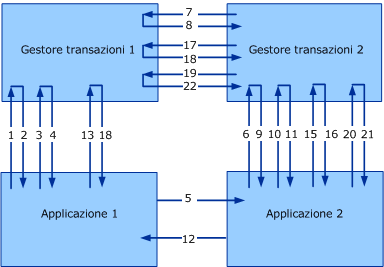

# Protocolli di transazione versione 1.0
[!INCLUDE[indigo1](../../../../includes/indigo1-md.md)] versione 1 implementa la versione 1.0 dei protocolli WS\-Atomic Transaction e WS\-Coordination.[!INCLUDE[crabout](../../../../includes/crabout-md.md)] versione 1.1, vedere [Protocolli di transazione](../../../../docs/framework/wcf/feature-details/transaction-protocols.md).  
  
|Specifica\/documento|Collegamento|  
|--------------------------|------------------|  
|WS\-Coordination|http:\/\/msdn.microsoft.com\/ws\/2005\/08\/ws\-coordination\/|  
|WS\-AtomicTransaction|http:\/\/msdn.microsoft.com\/ws\/2005\/08\/ws\-atomictransaction\/|  
  
 Su queste specifiche del protocollo è richiesta l'interoperabilità a due livelli: tra le applicazioni e tra i gestori delle transazioni \(vedere la figura seguente\).Le specifiche descrivono dettagliatamente i formati dei messaggi e lo scambio di messaggi per entrambi i livelli di interoperabilità.Alcune protezioni, affidabilità e codifiche per lo scambio tra le applicazioni si applicano come per il normale scambio tra applicazioni.Perché, tuttavia, sia possibile l'interoperabilità tra i gestori delle transazioni, è necessario che vi sia un accordo sull'associazione interessata dato che in genere non è configurata dall'utente.  
  
 In questo argomento vengono illustrate una composizione della specifica WS\-Atomic Transaction \(WS\-AT\) con protezione e l'associazione protetta per la comunicazione tra i gestori di transazioni.L'approccio descritto in questo documento è stato testato con successo con altre implementazioni di WS\-AT e WS\-Coordination, compresi IBM, IONA, Sun Microsystems e altri.  
  
 Nella figura seguente è riportata l'interoperabilità tra due gestori di transazioni, Gestore transazioni 1 e Gestore transazioni 2 e due applicazioni, Applicazione 1 e Applicazione 2.  
  
   
  
 Si consideri un tipico scenario WS\-Coordination\/WS\-Atomic Transaction con un Iniziatore \(I\) e un Partecipante \(P\).Sia l'Iniziatore che il Partecipante hanno gestori transazioni \(ITM e PTM, rispettivamente\).In questo argomento, il commit in due fasi viene chiamato 2PC.  
  
|||  
|-|-|  
|1.CreateCoordinationContext|12.Risposta al messaggio dell'applicazione|  
|2.CreateCoordinationContextResponse|13.Commit \(completamento\)|  
|3.Register \(completamento\)|14.Preparare \(2PC\)|  
|4.RegisterResponse|15.Preparare \(2PC\)|  
|5.Messaggio dell'applicazione|16.Prepared \(2PC\)|  
|6.CreateCoordinationContext con Context|17.Prepared \(2PC\)|  
|7.Register \(durevole\)|18.Committed \(completamento\)|  
|8.RegisterResponse|19.Commit \(2PC\)|  
|9.CreateCoordinationContextResponse|20.Commit \(2PC\)|  
|10.Register \(durevole\)|21.Committed \(2PC\)|  
|11.RegisterResponse|22.Committed \(2PC\)|  
  
 In questo documento vengono illustrate una composizione della specifica WS\-AtomicTransaction con protezione e l'associazione protetta per la comunicazione tra i gestori di transazioni.L'approccio descritto in questo documento è stato testato con successo con altre implementazioni di WS\-AT e WS\-Coordination.  
  
 Nella figura e nella tabella vengono illustrate quattro classi di messaggi dal punto di vista della protezione:  
  
-   Messaggi di attivazione \(CreateCoordinationContext e CreateCoordinationContextResponse\).  
  
-   Messaggi di registrazione \(Register e RegisterResponse\)  
  
-   Messaggi di protocollo \(Prepare, Rollback, Commit, Aborted e così via\).  
  
-   Messaggi dell'applicazione.  
  
 Le prime tre classi di messaggi sono considerate messaggi del gestore transazioni e la loro configurazione dell'associazione viene descritta in "Scambio di messaggi dell'applicazione", più avanti in questo argomento.La quarta classe di messaggi riguarda i messaggi da applicazione ad applicazione e viene descritta nella sezione "Esempi di messaggi", più avanti in questo argomento.In questa sezione vengono illustrati i binding del protocollo utilizzati per ognuna di queste classi da [!INCLUDE[indigo2](../../../../includes/indigo2-md.md)].  
  
 In questo documento vengono utilizzati gli spazi dei nomi XML e i relativi prefissi associati seguenti.  
  
|Prefisso|URI dello spazio dei nomi|  
|--------------|-------------------------------|  
|s11|http:\/\/schemas.xmlsoap.org\/soap\/envelope|  
|wsa|http:\/\/www.w3.org\/2004\/08\/addressing|  
|wscoor|http:\/\/schemas.xmlsoap.org\/ws\/2004\/10\/wscoor|  
|wsat|http:\/\/schemas.xmlsoap.org\/ws\/2004\/10\/wsat|  
|t|http:\/\/schemas.xmlsoap.org\/ws\/2005\/02\/trust|  
|o|http:\/\/docs.oasis\-open.org\/wss\/2004\/01\/oasis\-200401\-wss\-wssecurity\-secext\-1.0.xsd|  
|xsd|http:\/\/www.w3.org\/2001\/XMLSchema|  
  
## Associazioni dei gestori transazioni  
 R1001: i gestori transazioni devono utilizzare SOAP 1.1 e WS\-Addressing 2004\/08 per gli scambi di messaggi WS\-Atomic Transaction e WS\-Coordination.  
  
 I messaggi dell'applicazione non sono vincolati a queste associazioni e vengono descritti più avanti.  
  
### Associazione HTTP dei gestori transazioni  
 L'associazione HTTPS dei gestori transazioni si basa unicamente sulla protezione del trasporto per ottenere la protezione e stabilire relazioni di trust tra ogni coppia mittente\-destinatario nella struttura della transazione.  
  
#### Configurazione di trasporto HTTPS  
 I certificati X.509 sono utilizzati per stabilire l'identità del gestore transazioni.L'autenticazione client\/server è obbligatoria, mentre l'autorizzazione client\/server viene lasciata come dettaglio di implementazione:  
  
-   R1111: i certificati X.509 presentati sulla rete devono avere un nome soggetto che corrisponde al nome di dominio completo \(FQDN\) del computer di origine.  
  
-   B1112: perché i controlli del nome soggetto X.509 abbiano esito positivo, il DNS deve essere funzionale tra ogni coppia mittente\-destinatario nel sistema.  
  
#### Attivazione e configurazione dell'associazione di registrazione  
 [!INCLUDE[indigo2](../../../../includes/indigo2-md.md)] richiede un'associazione duplex request\/reply con correlazione su HTTPS.Per ulteriori informazioni sulla correlazione e descrizioni dei modelli di scambio dei messaggi request\/reply, vedere WS\-Atomic Transaction, Sezione 8.  
  
#### Configurazione del binding del protocollo 2PC  
 [!INCLUDE[indigo2](../../../../includes/indigo2-md.md)] supporta messaggi unidirezionali \(datagramma\) su HTTPS.La correlazione tra i messaggi viene lasciata come dettaglio di implementazione.  
  
 B2131: le implementazioni devono supportare `wsa:ReferenceParameters` come descritto in WS\-Addressing per ottenere la correlazione dei messaggi 2PC di [!INCLUDE[indigo2](../../../../includes/indigo2-md.md)].  
  
### Associazione di sicurezza mista del gestore transazioni  
 Questa è un'associazione alternativa \(modalità mista\) che utilizza la protezione del trasporto assieme al modello del token emesso WS\-Coordination allo scopo di stabilire l'identità.L'attivazione e la registrazione sono gli unici elementi che differiscono tra le due associazioni.  
  
#### Configurazione di trasporto HTTPS  
 I certificati X.509 sono utilizzati per stabilire l'identità del gestore transazioni.L'autenticazione client\/server è obbligatoria, mentre l'autorizzazione client\/server viene lasciata come dettaglio di implementazione.  
  
#### Configurazione dell'associazione dei messaggi di attivazione  
 I messaggi di attivazione in genere non partecipano all'interoperabilità perché si verificano normalmente tra un'applicazione e il suo gestore transazioni locale.  
  
 B1221: [!INCLUDE[indigo2](../../../../includes/indigo2-md.md)] utilizza associazioni HTTPS duplex \(descritte in [Protocolli di messaggistica](../../../../docs/framework/wcf/feature-details/messaging-protocols.md)\) per i messaggi di attivazione.I messaggi di richiesta e risposta sono correlati utilizzando WS\-Addressing 2004\/08.  
  
 Nella specifica WS\-Atomic Transaction, Sezione 8, vengono descritti più dettagliatamente la correlazione e i modelli di scambio dei messaggi.  
  
-   R1222: alla ricezione di un `CreateCoordinationContext`, il coordinatore deve emettere un `SecurityContextToken` con il segreto `STx` associato.Tale token viene restituito in un'intestazione `t:IssuedTokens` dopo la specifica WS\-Trust.  
  
-   R1223: se l'attivazione si verifica all'interno di un contesto di coordinamento esistente, l'intestazione `t:IssuedTokens` con il `SecurityContextToken` associato al contesto esistente deve propagarsi sul messaggio `CreateCoordinationContext`.  
  
 Per la connessione con il messaggio `wscoor:CreateCoordinationContextResponse` in uscita, è necessario che venga generata una nuova intestazione `t:IssuedTokens`.  
  
#### Configurazione dell'associazione dei messaggi di registrazione  
 B1231: [!INCLUDE[indigo2](../../../../includes/indigo2-md.md)] utilizza l'associazione HTTPS duplex \(descritta in [Protocolli di messaggistica](../../../../docs/framework/wcf/feature-details/messaging-protocols.md)\).I messaggi di richiesta e risposta sono correlati utilizzando WS\-Addressing 2004\/08.  
  
 In WS\-AtomicTransaction, Sezione 8, vengono descritti più dettagliatamente la correlazione e i modelli di scambio dei messaggi.  
  
 R1232: i messaggi `wscoor:Register` in uscita devono utilizzare la modalità di autenticazione `IssuedTokenOverTransport` descritta in [Protocolli di sicurezza](../../../../docs/framework/wcf/feature-details/security-protocols.md).  
  
 L'elemento `wsse:Timestamp` deve essere firmato utilizzando il `SecurityContextToken``STx` emesso.Questa firma è una prova del possesso del token associato a una particolare transazione ed è utilizzata per autenticare l'inserimento di un partecipante nella transazione.Il messaggio RegistrationResponse viene inviato su HTTPS.  
  
#### Configurazione del binding del protocollo 2PC  
 [!INCLUDE[indigo2](../../../../includes/indigo2-md.md)] supporta messaggi unidirezionali \(datagramma\) su HTTPS.La correlazione tra i messaggi viene lasciata come dettaglio di implementazione.  
  
 B2131: le implementazioni devono supportare `wsa:ReferenceParameters` come descritto in WS\-Addressing per ottenere la correlazione dei messaggi 2PC di [!INCLUDE[indigo2](../../../../includes/indigo2-md.md)].  
  
## Scambio di messaggi dell'applicazione  
 Le applicazioni possono utilizzare qualsiasi particolare associazione per i messaggi da applicazione ad applicazione, a condizione che l'associazione soddisfi i requisiti di sicurezza seguenti:  
  
-   R2001: i messaggi da applicazione ad applicazione devono propagarsi nell'intestazione `t:IssuedTokens` insieme al `CoordinationContext` nell'intestazione del messaggio.  
  
-   R2002: è necessario fornire l'integrità e la riservatezza di `t:IssuedToken`.  
  
 L'intestazione `CoordinationContext` contiene `wscoor:Identifier`.Mentre la definizione di `xsd:AnyURI` consente di utilizzare URI sia assoluti che relativi. [!INCLUDE[indigo2](../../../../includes/indigo2-md.md)] supporta solo `wscoor:Identifiers` che sono URI assoluti.  
  
 Se `wscoor:Identifier` del `wscoor:CoordinationContext` è un URI relativo, i servizi [!INCLUDE[indigo2](../../../../includes/indigo2-md.md)] transazionali restituiranno degli errori.  
  
## Esempi di messaggi  
  
### Messaggi di richiesta\/risposta CreateCoordinationContext  
 I messaggi seguenti seguono un modello richiesta\/risposta.  
  
#### CreateCoordinationContext  
  
```  
<s:Envelope>  
  <s:Header>  
    <a:Action>http://.../ws/2004/10/wscoor/CreateCoordinationContext</Action>  
    <a:MessageID>urn:uuid:069f5104-fd88-4264-9f99-60032a82854e</MessageID>  
    <a:ReplyTo>  
      <Address>https://...</a:Address>  
    </a:ReplyTo>  
    <a:To>https://...</a:To>  
    <wsse:Security>  
      <u:Timestamp>  
        <wsu:Created>2005-12-15T23:36:09.921Z</u:Created>  
        <wsu:Expires>2005-12-15T23:41:09.921Z</u:Expires>  
      </u:Timestamp>  
    </wsse:Security>  
  </s:Header>  
  <s:Body xmlns:s="http://schemas.xmlsoap.org/soap/envelope/">  
    <wscoor:CreateCoordinationContext>  
      <wscoor:CoordinationType>...</wscoor:CoordinationType>  
    </wscoor:CreateCoordinationContext>  
  </s:Body>  
</s11:Envelope>  
  
```  
  
#### CreateCoordinationContextResponse  
  
```  
<s:Envelope>  
  <!-- Data below is shown in the clear for  
       illustration purposes only. -->  
  <s:Header>  
    <a:Action>./ws/2004/10/wscoor/CreateCoordinationContextResponse </a:Action>  
    <a:RelatesTo>urn:uuid:069f5104-fd88-4264-9f99-60032a82854e</a:RelatesTo>  
    <a:To s:mustUnderstand="1">https://... </a:To>  
    <t:IssuedTokens>  
 <wst:RequestSecurityTokenResponse     
    xmlns:wsse="http://docs.oasis-open.org/wss/2004/01/oasis-200401-wss-wssecurity-secext-1.0.xsd"  
    xmlns:wssu="http://docs.oasis-open.org/wss/2004/01/oasis-200401-wss-wssecurity-utility-1.0.xsd"   
    xmlns:wst="http://schemas.xmlsoap.org/ws/2005/02/trust"  
    xmlns:wsc="http://schemas.xmlsoap.org/ws/2005/02/sc"  
    xmlns:wsp="http://schemas.xmlsoap.org/ws/2004/09/policy">  
    <wst:TokenType>http://schemas.xmlsoap.org/ws/2005/02/sc/sct</wst:TokenType>  
    <wst:RequestedSecurityToken>  
      <wsc:SecurityContextToken>  
        <wssu:Identifier>  
          http://fabrikam123.com/SCTi  
        </wssu:Identifier>  
      </wsc:SecurityContextToken>   
    </wst:RequestedSecurityToken>  
    <wsp:AppliesTo>  
        http://fabrikam123.com/CCi  
    </wsp:AppliesTo>    
    <wst:RequestedAttachedReference>  
      <wsse:SecurityTokenReference >  
        <wsse:Reference   
           ValueType="http://schemas.xmlsoap.org/ws/2005/02/sc/sct"  
           URI="http://fabrikam123.com/SCTi"/>  
      </wsse:SecurityTokenReference>  
    </wst:RequestedAttachedReference>  
    <wst:RequestedUnattachedReference>  
      <wsse:SecurityTokenReference>  
        <wsse:Reference   
          ValueType="http://schemas.xmlsoap.org/ws/2005/02/sc/sct"  
          URI="http://fabrikam123.com/SCTi"/>  
      </wsse:SecurityTokenReference>  
    </wst:RequestedUnattachedReference>  
    <wst:RequestedProofToken>  
      <wst:BinarySecret   
        Type="http://schemas.xmlsoap.org/ws/2005/02/trust/SymmetricKey">  
        <!-- base64 encoded value -->  
      </wst:BinarySecret>  
    </wst:RequestedProofToken>  
    <wst:Lifetime>  
      <wssu:Created>2005-10-24T20:19:26.526Z</wssu:Created>  
      <wssu:Expires>2005-10-25T06:24:26.526Z</wssu:Expires>  
    </wst:Lifetime>  
    <wst:KeySize>256</wst:KeySize>  
</wst:RequestSecurityTokenResponse>  
    </t:IssuedTokens>  
    <o:Security xmlns:o="http://docs.oasis-open.org/wss/2004/01/oasis-200401-wss-wssecurity-secext-1.0.xsd">  
      <u:Timestamp u:Id="_0">  
        <u:Created>2005-12-15T23:36:12.015Z</u:Created>  
        <u:Expires>2005-12-15T23:41:12.015Z</u:Expires>  
      </u:Timestamp>  
    </o:Security>  
  </s:Header>  
  <s:Body>  
    <wscoor:CreateCoordinationContextResponse>  
      <wscoor:CoordinationContext>  
        <wscoor:Identifier>  
     http://fabrikam123.com/CCi  
      </wscoor:Identifier>  
        <wscoor:Expires>...</wscoor:Expires>  
        <wscoor:CoordinationType>...</wscoor:CoordinationType>  
        <wscoor:RegistrationService>  
          <a:Address>https://...</a:Address>  
          <a:ReferenceParameters>  
             ...  
          </a:ReferenceParameters>  
        </wscoor:RegistrationService>  
      </wscoor:CoordinationContext>  
    </wscoor:CreateCoordinationContextResponse>  
  </s:Body>  
</s:Envelope>  
  
```  
  
### Messaggi di registrazione  
 I messaggi seguenti sono messaggi di registrazione.  
  
#### Registro  
  
```  
<s:Envelope>  
  <s:Header>  
    <a:Action>http://schemas.xmlsoap.org/ws/2004/10/wscoor/Register</a:Action>  
    <a:MessageID>urn:uuid:ed418b86-a75e-4aea-9d4e-a5d0cb5c088e</a:MessageID>  
    <a:ReplyTo>  
      <a:Address>https://...</a:Address>        
    </a:ReplyTo>  
    <a:To>https://...</a:To>  
    <wsse:Security   
      s:mustUnderstand="1"   
      xmlns:wsse="http://docs.oasis-open.org/wss/2004/01/oasis-200401-wss-wssecurity-secext-1.0.xsd"  
      xmlns:wssu="http://docs.oasis-open.org/wss/2004/01/oasis-200401-wss-wssecurity-utility-1.0.xsd">  
      <wssu:Timestamp wssu:Id="_0" >  
        <wssu:Created>2005-12-15T23:36:13.827Z</wssu:Created>  
        <wssu:Expires>2005-12-15T23:41:13.827Z</wssu:Expires>  
      </wssu:Timestamp>  
      <wsc:SecurityContextToken>  
      <wssu:Identifier>  
          http://fabrikam123.com/SCTi  
      </wssu:Identifier>  
      </wsc:SecurityContextToken>  
      <!-- supporting signature over the timestamp -->  
      <wsse:Signature xmlns:ds="http://www.w3.org/2000/09/xmldsig#">  
        <ds:SignedInfo>  
          <ds:CanonicalizationMethod Algorithm="http://www.w3.org/2001/10/xml-exc-c14n#"/>  
          <ds:SignatureMethod Algorithm="http://www.w3.org/2000/09/xmldsig#hmac-sha1"/>  
          <ds:Reference URI="#_0">  
            <ds:Transforms>  
              <ds:Transform Algorithm="http://www.w3.org/2001/10/xml-exc-c14n#"/>  
            </ds:Transforms>  
            <ds:DigestMethod Algorithm="http://www.w3.org/2000/09/xmldsig#sha1"/>  
            <ds:DigestValue>  
              alRzyhjLgoUOYoh8cx4n75eTcUk=  
            </ds:DigestValue>  
          </ds:Reference>  
        </ds:SignedInfo>  
        <ds:SignatureValue>YZYjnVvSOVasAQqQxaaviTSWtqI=</ds:SignatureValue>  
        <ds:KeyInfo>  
          <wsse:SecurityTokenReference  
            xmlns:wsse="http://docs.oasis-open.org/wss/2004/01/oasis-200401-wss-wssecurity-secext-1.0.xsd">  
            <wsse:Reference   
              URI="http://fabrikam123.com/SCTi"/>  
          </wsse:SecurityTokenReference>  
        </ds:KeyInfo>  
      </wsse:Signature>  
    </wsse:Security>  
  </s:Header>  
  <s:Body xmlns:s="http://schemas.xmlsoap.org/soap/envelope/">  
    <wscoor:Register>  
      <wscoor:ProtocolIdentifier>...</wscoor:ProtocolIdentifier>  
      <wscoor:ParticipantProtocolService>  
        <a:Address>https://... </a:Address>  
      </wscoor:ParticipantProtocolService>  
    </wscoor:Register>  
  </s:Body>  
</s:Envelope>  
  
```  
  
#### RegisterResponse  
  
```  
<s:Envelope>  
  <s:Header>  
    <a:Action>  
      http://schemas.xmlsoap.org/ws/2004/10/wscoor/RegisterResponse  
    </a:Action>  
    <a:MessageID>urn:uuid:ed418b86-a75e-4aea-9d4e-a5d0cb5c088d</a:MessageID>  
    <a:RelatesTo>  
      urn:uuid:ed418b86-a75e-4aea-9d4e-a5d0cb5c088e        
    </a:RelatesTo>  
    <a:To>https://...</a:To>  
    <wsse:Security   
      s:mustUnderstand="1"   
      xmlns:wsse="http://docs.oasis-open.org/wss/2004/01/oasis-200401-wss-wssecurity-secext-1.0.xsd"  
      xmlns:wssu="http://docs.oasis-open.org/wss/2004/01/oasis-200401-wss-wssecurity-utility-1.0.xsd">  
      <wssu:Timestamp>  
        <wssu:Created>2005-12-15T23:36:13.827Z</wssu:Created>  
        <wssu:Expires>2005-12-15T23:41:13.827Z</wssu:Expires>  
      </wssu:Timestamp>  
    </wsse:Security>  
  </s:Header>  
  <s:Body xmlns:s="http://schemas.xmlsoap.org/soap/envelope/">  
    <wscoor:RegisterResponse>  
      <wscoor:CoordinatorProtocolService>  
        <a:Address>https://...</a:Address>  
        <a:ReferenceParameters>  
          ...  
        </a:ReferenceParameters>  
      </wscoor:CoordinatorProtocolService>  
    </wscoor:RegisterResponse>  
  </s:Body>  
</s:Envelope>  
  
```  
  
### Messaggi del protocollo di commit a due fasi  
 Il messaggio seguente si riferisce al protocollo di commit a due fasi \(2PC\).  
  
#### Commit  
  
```  
<s:Envelope>  
  <s:Header>  
    <a:Action>http://.../ws/2004/10/wsat/Commit</a:Action>  
    <a:To>https://...</a:To>  
    <wsse:Security   
      s:mustUnderstand="1"   
      xmlns:wsse="http://docs.oasis-open.org/wss/2004/01/oasis-200401-wss-wssecurity-secext-1.0.xsd"  
      xmlns:wssu="http://docs.oasis-open.org/wss/2004/01/oasis-200401-wss-wssecurity-utility-1.0.xsd">  
      <wssu:Timestamp wssu:Id="_0" >  
        <wssu:Created>2005-12-15T23:36:13.827Z</wssu:Created>  
        <wssu:Expires>2005-12-15T23:41:13.827Z</wssu:Expires>  
      </wssu:Timestamp>  
   </wsse:Security>  
  </s:Header>  
  <s:Body xmlns:s="http://schemas.xmlsoap.org/soap/envelope/">  
    <wsat:Commit />  
  </s:Body>  
</s:Envelope>  
  
```  
  
### Messaggi dell'applicazione  
 I messaggi seguenti sono messaggi dell'applicazione.  
  
#### Messaggio dell'applicazione \- Richiesta  
  
```  
<s:Envelope>  
  <s:Header>  
<!-- Addressing headers, all signed-->  
    <wsse:Security s:mustUnderstand="1">  
      <wssu:Timestamp wssu:Id="timestamp">   
        <wssu:Created>2005-10-25T06:29:18.703Z</wssu:Created>  
        <wssu:Expires>2005-10-25T06:34:18.703Z</wssu:Expires>  
      </wssu:Timestamp>  
      <wsse:BinarySecurityToken   
          wssu:Id="IA_Certificate"   
          ValueType="...#X509v3"   
          EncodingType="...#Base64Binary">  
        <!-- IA certificate -->  
      </wsse:BinarySecurityToken>  
      <e:EncryptedKey Id="encrypted_key">  
            <!-- ephemeral key encrypted for PA certificate -->    
        <e:ReferenceList xmlns:e="http://www.w3.org/2001/04/xmlenc#">  
          <e:DataReference URI="#encrypted_body"/>  
          <e:DataReference URI="#encrypted_CCi"/>  
          <e:DataReference URI="#encrypted_issuedtokens"/>  
        </e:ReferenceList>  
      </e:EncryptedKey>  
      <Signature xmlns="http://www.w3.org/2000/09/xmldsig#">  
        <!-- signature over Addressing headers, Timestamp, and Body -->  
      </Signature>  
    </wsse:Security>  
    <wsse11:EncryptedHeader >  
     <!-- encrypted wscoor:CoordinationContext header containing CCi -->  
    </wsse11:EncryptedHeader>  
    <wsse11:EncryptedHeader   
      <!-- encrypted wst:IssuedTokens header containing SCTi -->  
      <!-- wst:IssuedTokens header is taken verbatim from message #2 above, omitted for brevity -->  
    </wsse11:EncryptedHeader>  
  </s:Header>  
  <s:Body wssu:Id="body">  
    <!-- encrypted content of the Body element of the application message -->      
    <e:EncryptedData Id="encrypted_body"   
           Type="http://www.w3.org/2001/04/xmlenc#Content"   
           xmlns:e="http://www.w3.org/2001/04/xmlenc#">  
...  
    </e:EncryptedData>  
  </s:Body>  
</s:Envelope>  
```