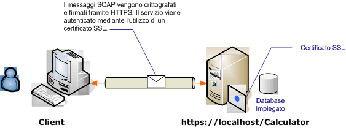

# Protezione del trasporto con un client anonimo
In questo scenario [!INCLUDE[indigo1](../../../../includes/indigo1-md.md)] viene utilizzata la protezione del trasporto \(HTTPS\) per garantirne la riservatezza e l'integrità.È necessario che il server sia autenticato con un certificato SSL \(Secure Sockets Layer\) e che il client ritenga attendibile il certificato del server.Il client non viene autenticato da alcun meccanismo ed è pertanto anonimo.  
  
 Per un'applicazione di esempio, vedere [Sicurezza del trasporto WS](../../../../docs/framework/wcf/samples/ws-transport-security.md).[!INCLUDE[crabout](../../../../includes/crabout-md.md)] sicurezza del trasporto, vedere [Panoramica sulla sicurezza del trasporto](../../../../docs/framework/wcf/feature-details/transport-security-overview.md).  
  
 [!INCLUDE[crabout](../../../../includes/crabout-md.md)] utilizzo di un certificato con un servizio, vedere [Utilizzo dei certificati](../../../../docs/framework/wcf/feature-details/working-with-certificates.md) e [Procedura: configurare una porta con un certificato SSL](../../../../docs/framework/wcf/feature-details/how-to-configure-a-port-with-an-ssl-certificate.md).  
  
   
  
|Caratteristica|Descrizione|  
|--------------------|-----------------|  
|Modalità di sicurezza|Trasporto|  
|Interoperabilità|Con i servizi Web e i client esistenti|  
|Autenticazione \(server\)<br /><br /> Autenticazione \(client\)|Sì<br /><br /> A livello di applicazione \(nessun supporto [!INCLUDE[indigo2](../../../../includes/indigo2-md.md)] \)|  
|Integrità|Sì|  
|Riservatezza|Sì|  
|Transport|HTTPS|  
|Associazione|<xref:System.ServiceModel.WsHttpBinding>|  
  
## Servizio  
 Il codice e la configurazione seguenti devono essere eseguiti in modo indipendente.Eseguire una delle operazioni seguenti:  
  
-   Creare un servizio autonomo utilizzando il codice senza alcuna configurazione.  
  
-   Creare un servizio utilizzando la configurazione fornita, ma non definire alcun endpoint.  
  
### Codice  
 Nel codice seguente viene illustrato come creare un endpoint utilizzando la protezione del trasporto:  
  
 [!code-csharp[c_SecurityScenarios#5](../../../../samples/snippets/csharp/VS_Snippets_CFX/c_securityscenarios/cs/source.cs#5)]
 [!code-vb[c_SecurityScenarios#5](../../../../samples/snippets/visualbasic/VS_Snippets_CFX/c_securityscenarios/vb/source.vb#5)]  
  
### Configurazione  
 Nel codice seguente viene impostato lo stesso endpoint utilizzando la configurazione.Il client non viene autenticato da alcun meccanismo ed è pertanto anonimo.  
  
```  
<?xml version="1.0" encoding="utf-8"?>  
<configuration>  
  <system.serviceModel>  
    <services>  
      <service name="ServiceModel.Calculator">  
        <endpoint address="http://localhost/Calculator"   
                  binding="wsHttpBinding"  
                  bindingConfiguration="WSHttpBinding_ICalculator"   
                  name="SecuredByTransportEndpoint"  
                  contract="ServiceModel.ICalculator" />  
      </service>  
    </services>  
    <bindings>  
      <wsHttpBinding>  
        <binding name="WSHttpBinding_ICalculator">  
          <security mode="Transport">  
            <transport clientCredentialType="None" />  
          </security>  
        </binding>  
      </wsHttpBinding>  
    </bindings>  
    <client />  
  </system.serviceModel>  
</configuration>  
```  
  
## Client  
 Il codice e la configurazione seguenti devono essere eseguiti in modo indipendente.Eseguire una delle operazioni seguenti:  
  
-   Creare un client autonomo utilizzando il codice \(e il codice client\).  
  
-   Creare un client che non definisce alcun indirizzo di endpoint.Utilizzare invece il costruttore client che accetta il nome della configurazione come argomento.Ad esempio:  
  
     [!code-csharp[C_SecurityScenarios#0](../../../../samples/snippets/csharp/VS_Snippets_CFX/c_securityscenarios/cs/source.cs#0)]
     [!code-vb[C_SecurityScenarios#0](../../../../samples/snippets/visualbasic/VS_Snippets_CFX/c_securityscenarios/vb/source.vb#0)]  
  
### Codice  
 [!code-csharp[c_SecurityScenarios#6](../../../../samples/snippets/csharp/VS_Snippets_CFX/c_securityscenarios/cs/source.cs#6)]
 [!code-vb[c_SecurityScenarios#6](../../../../samples/snippets/visualbasic/VS_Snippets_CFX/c_securityscenarios/vb/source.vb#6)]  
  
### Configurazione  
 Per configurare il servizio, è possibile utilizzare la configurazione seguente anziché il codice.  
  
```  
<configuration>  
  <system.serviceModel>  
    <bindings>  
      <wsHttpBinding>  
        <binding name="WSHttpBinding_ICalculator" >  
          <security mode="Transport">  
            <transport clientCredentialType="None" />  
          </security>  
        </binding>  
      </wsHttpBinding>  
    </bindings>  
    <client>  
      <endpoint address="https://machineName/Calculator"   
                binding="wsHttpBinding"  
                bindingConfiguration="WSHttpBinding_ICalculator"   
                contract="ICalculator"  
                name="WSHttpBinding_ICalculator" />  
    </client>  
  </system.serviceModel>  
</configuration>  
```  
  
## Vedere anche  
 [Cenni preliminari sulla sicurezza](../../../../docs/framework/wcf/feature-details/security-overview.md)   
 [Sicurezza del trasporto WS](../../../../docs/framework/wcf/samples/ws-transport-security.md)   
 [Panoramica sulla sicurezza del trasporto](../../../../docs/framework/wcf/feature-details/transport-security-overview.md)   
 [Modello di sicurezza per Windows Server App Fabric](http://go.microsoft.com/fwlink/?LinkID=201279&clcid=0x409)