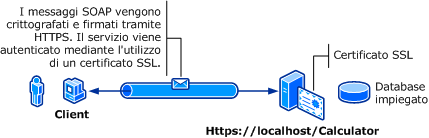

# Protezione del trasporto con l&#39;autenticazione di base
Nella figura seguente viene illustrato un servizio e un client [!INCLUDE[indigo1](../../../../includes/indigo1-md.md)].  Il server richiede un certificato X.509 valido che possa essere usato per SSL \(Secure Sockets Layer\) e i client devono ritenere attendibile il certificato del server.  Il servizio Web dispone già di un'implementazione SSL usabile.  [!INCLUDE[crabout](../../../../includes/crabout-md.md)] abilitazione dell'autenticzione di base in Internet Information Services \(IIS\), vedere [http:\/\/go.microsoft.com\/fwlink\/?LinkId\=83822](http://go.microsoft.com/fwlink/?LinkId=83822).  
  
   
  
|Caratteristica|Descrizione|  
|--------------------|-----------------|  
|Modalità di sicurezza|Trasporto|  
|Interoperabilità|Con servizi e client di servizi Web esistenti|  
|Autenticazione \(server\)<br /><br /> Autenticazione \(client\)|Sì \(usando HTTPS\)<br /><br /> Sì \(usando nome utente\/password\).|  
|Integrità|Sì|  
|Riservatezza|Sì|  
|Trasporto|HTTPS|  
|Binding|<xref:System.ServiceModel.WSHttpBinding>|  
  
## Servizio  
 Il codice e la configurazione seguenti devono essere eseguiti in modo indipendente.  Eseguire una delle operazioni seguenti:  
  
-   Creare un servizio autonomo usando il codice senza alcuna configurazione.  
  
-   Creare un servizio usando la configurazione fornita, ma non definire alcun endpoint.  
  
### Codice  
 Nel codice seguente viene illustrato come creare un endpoint del servizio che usa un nome utente del dominio di Windows e una password per la protezione del trasferimento.  Si noti che il servizio richiede un certificato X.509 per autenticare il client.  Per altre informazioni, vedere [Utilizzo dei certificati](../../../../docs/framework/wcf/feature-details/working-with-certificates.md) e [Procedura: configurare una porta con un certificato SSL](../../../../docs/framework/wcf/feature-details/how-to-configure-a-port-with-an-ssl-certificate.md).  
  
 [!code-csharp[C_SecurityScenarios#1](../../../../samples/snippets/csharp/VS_Snippets_CFX/c_securityscenarios/cs/source.cs#1)]
 [!code-vb[C_SecurityScenarios#1](../../../../samples/snippets/visualbasic/VS_Snippets_CFX/c_securityscenarios/vb/source.vb#1)]  
  
## Configurazione  
 Gli elementi seguenti configurano un servizio per l'uso dell'autenticazione di base con protezione a livello di trasporto:  
  
```  
<?xml version="1.0" encoding="utf-8"?>  
<configuration>  
    <system.serviceModel>  
        <bindings>  
            <wsHttpBinding>  
                <binding name="UsernameWithTransport">  
                    <security mode="Transport">  
                        <transport clientCredentialType="Basic" />  
                    </security>  
                </binding>  
            </wsHttpBinding>  
        </bindings>  
        <services>  
            <service name="BasicAuthentication.Calculator">  
                <endpoint address="https://localhost/Calculator"  
                          binding="wsHttpBinding"   
                          bindingConfiguration="UsernameWithTransport"  
                          name="BasicEndpoint"   
                          contract="BasicAuthentication.ICalculator" />  
            </service>  
        </services>  
    </system.serviceModel>  
</configuration>  
```  
  
## Client  
  
### Codice  
 Nell'esempio di codice seguente viene mostrato il codice client che include il nome utente e la password.  Si noti che l'utente deve fornire un nome utente e una password di Windows validi.  Il codice per restituire il nome utente e la password non è incluso.  Usare una finestra di dialogo o un'altra interfaccia per eseguire una query per ottenere tali informazioni dall'utente.  
  
> [!NOTE]
>  Nome utente e password possono essere impostati solo tramite codice.  
  
 [!code-csharp[C_SecurityScenarios#2](../../../../samples/snippets/csharp/VS_Snippets_CFX/c_securityscenarios/cs/source.cs#2)]
 [!code-vb[C_SecurityScenarios#2](../../../../samples/snippets/visualbasic/VS_Snippets_CFX/c_securityscenarios/vb/source.vb#2)]  
  
### Configurazione  
 Nel codice seguente viene mostrata la configurazione client.  
  
> [!NOTE]
>  Non è possibile usare la configurazione per impostare il nome utente e la password.  La configurazione mostrata deve essere ampliata usando il codice per impostare il nome utente e la password.  
  
```  
<?xml version="1.0" encoding="utf-8"?>  
<configuration>  
  <system.serviceModel>  
    <bindings>  
      <wsHttpBinding>  
        <binding name="WSHttpBinding_ICalculator" >  
          <security mode="Transport">  
            <transport clientCredentialType="Basic" />  
          </security>  
        </binding>  
      </wsHttpBinding>  
    </bindings>  
    <client>  
      <endpoint address="https://machineName/Calculator"   
                binding="wsHttpBinding"  
                bindingConfiguration="WSHttpBinding_ICalculator"   
                contract="ICalculator"  
                name="WSHttpBinding_ICalculator" />  
    </client>  
  </system.serviceModel>  
</configuration>  
```  
  
## Vedere anche  
 <xref:System.ServiceModel.ClientBase%601.ClientCredentials%2A>   
 <xref:System.ServiceModel.Security.UserNamePasswordClientCredential>   
 [Utilizzo dei certificati](../../../../docs/framework/wcf/feature-details/working-with-certificates.md)   
 [Procedura: configurare una porta con un certificato SSL](../../../../docs/framework/wcf/feature-details/how-to-configure-a-port-with-an-ssl-certificate.md)   
 [Cenni preliminari sulla sicurezza](../../../../docs/framework/wcf/feature-details/security-overview.md)   
 [\<credenzialiClient\>](../../../../docs/framework/configure-apps/file-schema/wcf/clientcredentials.md)   
 [Modello di sicurezza per Windows Server AppFabric](http://go.microsoft.com/fwlink/?LinkID=201279&clcid=0x409)