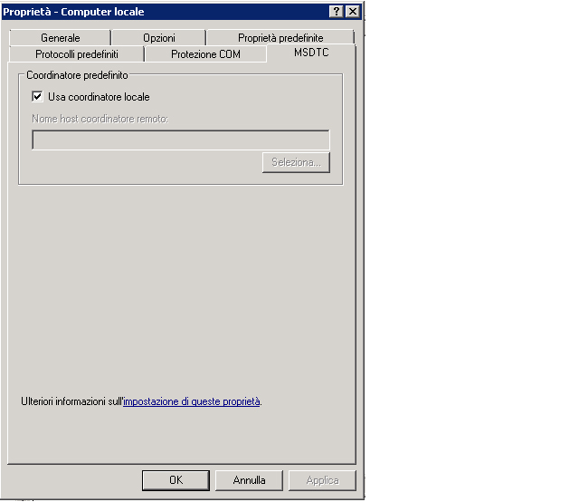
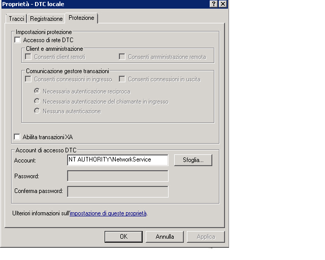

# Risoluzione dei problemi relativi ai messaggi in coda
In questa sezione sono contenute domande frequenti e informazioni per la risoluzione dei problemi relativi all'utilizzo delle code in [!INCLUDE[indigo1](../../../../includes/indigo1-md.md)].  
  
## Domande frequenti  
 **D:** È stato installato l'hotfix MSMQ con la versione Beta 1 di [!INCLUDE[indigo2](../../../../includes/indigo2-md.md)].È necessario rimuovere l'hotfix?  
  
 **R:** Sì.Questo hotfix non è più supportato.[!INCLUDE[indigo2](../../../../includes/indigo2-md.md)] ora funziona con MSMQ senza la necessità di hotfix.  
  
 **D:** Per MSMQ sono disponibili due associazioni: <xref:System.ServiceModel.NetMsmqBinding> e <xref:System.ServiceModel.MsmqIntegration.MsmqIntegrationBinding>.Quando è opportuno utilizzare l'una o l'altra?  
  
 **R:** Utilizzare <xref:System.ServiceModel.NetMsmqBinding> quando si desidera utilizzare MSMQ come trasporto per le comunicazioni in coda tra due applicazioni [!INCLUDE[indigo2](../../../../includes/indigo2-md.md)].Utilizzare <xref:System.ServiceModel.MsmqIntegration.MsmqIntegrationBinding> quando si desidera utilizzare le applicazioni MSMQ esistenti per comunicare con nuove applicazioni [!INCLUDE[indigo2](../../../../includes/indigo2-md.md)].  
  
 **D:** È necessario aggiornare MSMQ per utilizzare le associazioni <xref:System.ServiceModel.NetMsmqBinding> e `MsmqIntegration`?  
  
 **R:** No.Entrambe le associazioni funzionano con MSMQ 3.0 in [!INCLUDE[wxp](../../../../includes/wxp-md.md)] e [!INCLUDE[ws2003](../../../../includes/ws2003-md.md)].Alcune funzionalità delle associazioni divengono disponibili quando si esegue l'aggiornamento a MSMQ 4.0 in [!INCLUDE[wv](../../../../includes/wv-md.md)].  
  
 **D:** Quali funzionalità delle associazioni <xref:System.ServiceModel.NetMsmqBinding> e <xref:System.ServiceModel.MsmqIntegration.MsmqIntegrationBinding> sono disponibili in MSMQ 4.0, ma non in MSMQ 3.0?  
  
 **R:** Le funzionalità seguenti sono disponibili in MSMQ 4.0, ma non in MSMQ 3.0:  
  
-   Le code di messaggi non recapitabili personalizzate sono supportate solo in MSMQ 4.0.  
  
-   MSMQ 3.0 e 4.0 gestiscono i messaggi non elaborabili in modo diverso.  
  
-   La lettura transazionale remota è supportata solo in MSMQ 4.0.  
  
 [!INCLUDE[crdefault](../../../../includes/crdefault-md.md)] [Differenze nelle funzionalità di accodamento in Windows Vista, Windows Server 2003 e Windows XP](../../../../docs/framework/wcf/feature-details/diff-in-queue-in-vista-server-2003-windows-xp.md).  
  
 **D:** È possibile utilizzare MSMQ 3.0 per un lato di una comunicazione in coda e MSMQ 4.0 per l'altro?  
  
 **R:** Sì.  
  
 **D:** Per integrare applicazioni MSMQ esistenti con nuovi client o server [!INCLUDE[indigo2](../../../../includes/indigo2-md.md)]è necessario aggiornare entrambi i lati dell'infrastruttura MSMQ?  
  
 **R:** No.Non è necessario eseguire l'aggiornamento a MSMQ 4.0 in entrambi i lati.  
  
## Risoluzione dei problemi  
 In questa sezione sono contenute risposte per la risoluzione della maggior parte dei problemi frequenti.Alcuni problemi costituiti da limitazioni note sono descritti anche nelle note sulla versione.  
  
 **D:** Tentando di utilizzare una coda privata viene generata l'eccezione seguente: `System.InvalidOperationException`: URL non valido.L'URL per la coda non può contenere il carattere '$'.Utilizzare la sintassi in net.msmq:\/\/machine\/private\/queueName per indirizzare una coda privata.  
  
 **R:** Controllare l'URI \(Uniform Resource Identifier\) della coda nella configurazione e nel codice.Non utilizzare il carattere "$" nell'URI.Per indirizzare, ad esempio, una coda privata denominata OrdersQueue, specificare l'URI come segue: net.msmq:\/\/localhost\/private\/ordersQueue.  
  
 **D:** Chiamando `ServiceHost.Open()` nell'applicazione in coda viene generata l'eccezione seguente: `System.ArgumentException`: Un indirizzo di base non può contenere una stringa di query URI.Perché?  
  
 **R:** Controllare l'URI della coda nel file di configurazione e nel codice.Mentre le code MSMQ supportano l'utilizzo del carattere '?', gli URI interpretano questo carattere come l'inizio di una query di stringa.Per evitare questo problema, utilizzare nomi di coda che non contengono caratteri '?'.  
  
 **D:** L'invio è riuscito, ma per il destinatario non viene richiamata alcuna operazione del servizio.Perché?  
  
 **R:** Per determinare quale sia la risposta pertinente al caso, esaminare l'elenco di controllo seguente:  
  
-   Controllare che i requisiti della coda transazionale siano compatibili con le garanzie specificate.Tenere presenti i principi seguenti:  
  
    -   A una coda transazionale è possibile inviare solo messaggi durevoli \(datagrammi e sessioni\) con garanzia "una sola volta" \(<xref:System.ServiceModel.MsmqBindingBase.ExactlyOnce%2A> \= `true`\).  
  
    -   È possibile inviare sessioni solo con assicurazioni "una sola volta".  
  
    -   È necessaria una transazione per ricevere messaggi da una coda transazionale in una sessione.  
  
    -   È possibile inviare o ricevere messaggi volatili o durevoli \(solo datagrammi\) senza alcuna garanzia \(<xref:System.ServiceModel.MsmqBindingBase.ExactlyOnce%2A> \= `false`\) solo in una coda non transazionale.  
  
-   Controllare la coda dei messaggi non recapitabili.Se sono presenti messaggi, determinare perché non sono stati recapitati.  
  
-   Verificare la connettività o eventuali problemi di indirizzamento delle code in uscita.  
  
 **D:** È stata specificata una coda di messaggi non recapitabili personalizzata, ma quando si avvia l'applicazione mittente, viene generata un'eccezione che indica che la coda dei messaggi non recapitabili non è stata trovata o che l'applicazione mittente non dispone delle autorizzazioni per la coda dei messaggi non recapitabili.Perché si verifica questa situazione?  
  
 **R:** L'URI della coda dei messaggi non recapitabili personalizzata deve includere "localhost" o il nome del computer nel primo segmento, ad esempio net.msmq:\/\/localhost\/private\/coda MsgNonRecapitabiliApp.  
  
 **D:** È sempre necessario definire una coda dei messaggi non recapitabili personalizzata o esiste una coda di questo tipo predefinita?  
  
 **R:** Se le garanzie sono "una sola volta", \(<xref:System.ServiceModel.MsmqBindingBase.ExactlyOnce%2A> \= `true`\) e non si specifica una coda dei messaggi non recapitabili personalizzata, l'impostazione predefinita è una coda transazionale a livello di sistema.  
  
 Se non vi sono garanzie \(<xref:System.ServiceModel.MsmqBindingBase.ExactlyOnce%2A> \= `false`\) per impostazione predefinita non è disponibile alcuna funzionalità di coda dei messaggi non recapitabili.  
  
 **D:** Il servizio genera un'eccezione in SvcHost.Open con il messaggio "I requisiti di EndpointListener non possono essere soddisfatti da ListenerFactory".Perché?  
  
 R.Controllare il contratto di servizio.È possibile avere dimenticato di inserire "IsOneWay \=`true`" in tutte le operazioni del servizio.Le code supportano solo operazioni del servizio unidirezionali.  
  
 **D:** La coda contiene messaggi, ma non viene richiamata alcuna operazione del servizio.Da che cosa è causato il problema?  
  
 **R:** Determinare se l'host del servizio è in stato di errore.È possibile eseguire questo controllo analizzando la traccia o implementando `IErrorHandler`.L'host del servizio, per impostazione predefinita, entra in stato di errore se viene rilevato un messaggio non elaborabile.  
  
 **D:** La coda contiene messaggi, ma il servizio in coda sull'host Web non si attiva.Perché?  
  
 **R:** La ragione più comune sono le autorizzazioni.  
  
1.  Assicurarsi che il processo `NetMsmqActivator` sia in esecuzione e che all'identità del processo `NetMsmqActivator` sia concessa l'autorizzazione alla lettura e alla scrittura sulla coda.  
  
2.  Se `NetMsmqActivator` sta controllando le code in un computer remoto, assicurarsi che `NetMsmqActivator` non sia in esecuzione con un token di accesso con restrizioni.Per eseguire `NetMsmqActivator` con un token di accesso senza restrizioni:  
  
    ```  
    sc sidtype NetMsmqActivator unrestricted  
    ```  
  
 Per problemi non correlati alla protezione relativi a host Web vedere: [Sito Web che ospita un'applicazione in coda](../../../../docs/framework/wcf/feature-details/web-hosting-a-queued-application.md).  
  
 **D:** Qual è il modo più facile per accedere alle sessioni?  
  
 **R:** Impostare AutoComplete\=`true` sull'operazione corrispondente all'ultimo messaggio della sessione e AutoComplete\=`false` su tutte le operazioni del servizio rimanenti.  
  
 **D:** Dov'è possibile trovare risposte a domande frequenti su MSMQ?  
  
 **R:** [!INCLUDE[crabout](../../../../includes/crabout-md.md)] MSMQ, vedere [Accodamento messaggi Microsoft](http://go.microsoft.com/fwlink/?LinkId=87810).  
  
 **D:** Perché il servizio genera un'eccezione `ProtocolException` in caso di lettura da una coda contenente sia messaggi della sessione sia messaggi del datagramma in coda?  
  
 **R:** Esiste una differenza fondamentale nel modo in cui vengono composti i messaggi della sessione e i messaggi del datagramma in coda.Per questo motivo, un servizio che prevede di leggere un messaggio della sessione in coda non può ricevere un messaggio del datagramma in coda e un servizio che prevede di leggere un messaggio del datagramma in coda non può ricevere un messaggio della sessione.Eseguendo il tentativo di leggere entrambi tipi di messaggi dalla stessa coda viene generata l'eccezione seguente:  
  
```  
System.ServiceModel.MsmqPoisonMessageException: The transport channel detected a poison message. This occurred because the message exceeded the maximum number of delivery attempts or because the channel detected a fundamental problem with the message. The inner exception may contain additional information.   
---> System.ServiceModel.ProtocolException: An incoming MSMQ message contained invalid or unexpected .NET Message Framing information in its body. The message cannot be received. Ensure that the sender is using a compatible service contract with a matching SessionMode.  
```  
  
 La coda dei messaggi non recapitabili di sistema, così come quella personalizzata, è particolarmente interessata dal problema se un'applicazione invia sia messaggi della sessione sia messaggi del datagramma in coda dallo stesso computer.Se non è possibile inviare correttamente un messaggio, questo viene spostato nella coda dei messaggi non recapitabili.In queste circostanze è possibile che nella coda dei messaggi non recapitabili siano presenti sia messaggi della sessione sia messaggi del datagramma.Non vi è modo di separare i due tipi di messaggi in fase di esecuzione quando viene letta una coda, pertanto le applicazioni non devono inviare messaggi della sessione e messaggi del datagramma in coda dallo stesso computer.  
  
### Risoluzione dei problemi specifici dell'integrazione con MSMQ  
 **D:** Quando viene inviato un messaggio o quando viene aperto l'host del servizio viene generato un errore che indica che lo schema è errato.Perché?  
  
 **R:** Quando si utilizza l'associazione di integrazione MSMQ è necessario utilizzare lo schema msmq.formatname.Ad esempio, msmq.formatname:DIRECT\=OS:.\\private$\\OrdersQueue.Ma quando si specifica la coda dei messaggi non recapitabili personalizzata è necessario utilizzare lo schema net.msmq.  
  
 **D:** Quando si utilizza un nome di formato pubblico o privato e si apre l'host del servizio in [!INCLUDE[wv](../../../../includes/wv-md.md)], viene generato un errore.Perché?  
  
 **R:** Il canale di integrazione di [!INCLUDE[indigo2](../../../../includes/indigo2-md.md)] in [!INCLUDE[wv](../../../../includes/wv-md.md)] esegue un controllo per verificare se sia possibile aprire una coda secondaria per la coda dell'applicazione principale per la gestione dei messaggi non elaborabili.Il nome della coda secondaria deriva da un URI msmq.formatname passato al listener.Il nome della coda secondaria in MSMQ può essere solo un nome in formato diretto.Per questo motivo viene generato l'errore.Modificare l'URI della coda in modo che il nome sia in un formato diretto.  
  
 **D:** Quando si riceve un messaggio da un'applicazione MSMQ, il messaggio rimane nella coda e non viene letto dall'applicazione [!INCLUDE[indigo2](../../../../includes/indigo2-md.md)] ricevente.Perché?  
  
 **R:** Controllare che il messaggio disponga di un corpo.Se è privo di corpo viene ignorato dal canale di integrazione con MSMQ.Implementare `IErrorHandler` per ricevere notifica delle eccezioni e controllare le tracce.  
  
### Risoluzione dei problemi correlati alla protezione  
 **D:** Quando si esegue l'esempio che utilizza un'associazione predefinita in modalità gruppo di lavoro, i messaggi sembrano essere inviati, ma non vengono mai ricevuti dal destinatario.  
  
 **R:** Per impostazione predefinita, i messaggi vengono firmati utilizzando un certificato interno a MSMQ per il quale è necessario il servizio di directory Active Directory.In modalità gruppo di lavoro, poiché Active Directory non è disponibile, viene generato un errore nella firma del messaggio.Il messaggio arriva quindi alla coda dei messaggi non recapitabili e come causa dell'errore viene indicato, ad esempio, "firma errata".  
  
 La soluzione alternativa consiste nel disattivare la sicurezza.Per eseguire questa operazione, impostare <xref:System.ServiceModel.NetMsmqSecurity.Mode%2A> \= <xref:System.ServiceModel.NetMsmqSecurityMode> per consentire il funzionamento in modalità gruppo di lavoro.  
  
 Un'altra soluzione alternativa è ottenere <xref:System.ServiceModel.MsmqTransportSecurity> dalla proprietà <xref:System.ServiceModel.NetMsmqSecurity.Transport%2A> e impostarlo su <xref:System.ServiceModel.MsmqAuthenticationMode>, quindi impostare il certificato client.  
  
 Un'ulteriore soluzione alternativa consiste nell'installare MSMQ unitamente all'integrazione con Active Directory.  
  
 **D:** Quando in Active Directory si invia un messaggio con un'associazione predefinita \(protezione del trasporto attivata\) a una coda, viene visualizzato un messaggio che indica che il certificato interno non è stato trovato.Com'è possibile risolvere il problema?  
  
 **R:** Significa che è necessario rinnovare il certificato del mittente in Active Directory.A tale scopo, aprire il **Pannello di controllo**, fare doppio clic su **Strumenti di amministrazione**, scegliere **Gestione computer** e fare clic con il pulsante destro del mouse su **MSMQ**, quindi selezionare **Proprietà**.Scegliere la scheda **Certificato utente** e fare clic sul pulsante **Rinnova**.  
  
 **D:** Quando si invia un messaggio utilizzando <xref:System.ServiceModel.MsmqAuthenticationMode> e specificando il certificato da utilizzare, viene generato un messaggio che indica che il certificato non è valido.Com'è possibile risolvere il problema?  
  
 **R:** Non è possibile utilizzare un archivio di certificati del computer locale con la modalità certificati.È necessario copiare il certificato dall'archivio dei certificati del computer all'archivio dell'utente corrente utilizzando lo snap\-in Certificati.Per ottenere lo snap\-in Certificati:  
  
1.  Fare clic sul pulsante **Start**, scegliere **Esegui**, digitare `mmc`, quindi scegliere **OK**.  
  
2.  In **Microsoft Management Console** aprire il menu **File** e selezionare **Aggiungi\/Rimuovi snap\-in**.  
  
3.  Nella finestra di dialogo **Aggiungi\/Rimuovi snap\-in** scegliere **Aggiungi**.  
  
4.  Nella finestra di dialogo **Aggiungi snap\-in autonomo** selezionare Certificati e fare clic su **Aggiungi**  
  
5.  Nella finestra di dialogo **Snap\-in certificati** selezionare **Account dell'utente** e fare clic su **Avanti**.  
  
6.  In seguito aggiungere un secondo snap\-in Certificati procedendo come descritto in precedenza, ma questa volta selezionare **Account del computer** e fare clic **su Avanti**.  
  
7.  Selezionare **Computer locale** e fare clic su **Fine**.È ora possibile trascinare i certificati dall'archivio del computer all'archivio dell'utente corrente.  
  
 **D:** Quando il servizio legge una coda in un altro computer in modalità gruppo di lavoro viene generata un'eccezione "accesso negato".  
  
 **R:** In modalità gruppo di lavoro, per accedere alla coda, un'applicazione remota deve disporre delle autorizzazioni di accesso a tale coda.Aggiungere l'"accesso anonimo" all'elenco di controllo dell'accesso \(ACL\) della coda e concedergli l'autorizzazione alla lettura.  
  
 **D:** Quando un client del servizio di rete \(o qualsiasi client che non dispone di un account di dominio\) invia un messaggio in coda, l'invio non riesce perché il certificato non viene ritenuto valido.Com'è possibile risolvere il problema?  
  
 **R:** Controllare la configurazione dell'associazione.Per l'associazione predefinita è attivata la protezione del trasporto MSMQ per la firma del messaggio.Disattivarla.  
  
### Ricezioni transazionali remote  
 **D:** Quando nel computer A è presente una coda e nel computer B è presente il servizio [!INCLUDE[indigo2](../../../../includes/indigo2-md.md)] che legge i messaggi da una coda \(scenario di ricezione transazionale remota\), i messaggi in coda non vengono letti.Le informazioni di analisi indicano che la ricezione non è riuscita con la generazione di un messaggio che informa dell'impossibilità di importare la transazione. Che cosa è possibile fare per risolvere il problema?  
  
 **R:** Le ragioni possibili sono tre:  
  
-   In modalità di dominio per la ricezione transazionale remota è necessario l'accesso alla rete di Microsoft Distributed Transaction Coordinator \(MSDTC\).Per attivarlo è possibile utilizzare **Aggiungi\/Rimuovi componenti**.  
  
       
  
-   Verificare la modalità di autenticazione per la comunicazione con il gestore transazioni.In modalità gruppo di lavoro è necessario selezionare "Nessuna autenticazione".In modalità di dominio è necessario selezionare "Necessaria autenticazione reciproca".  
  
       
  
-   Verificare che MSDTC sia nell'elenco di eccezioni nelle impostazioni di **Firewall connessione Internet**.  
  
-   Assicurarsi di utilizzare [!INCLUDE[wv](../../../../includes/wv-md.md)].MSMQ con [!INCLUDE[wv](../../../../includes/wv-md.md)] supporta la lettura transazionale remota.MSMQ con le versioni precedenti di Windows non supporta la lettura transazionale remota.  
  
 **D:** Quando il servizio che legge dalla coda è un servizio di rete, ad esempio in un host Web, perché viene generata un'eccezione di accesso negato durante la lettura della coda?  
  
 **R:** L'accesso in lettura al servizio di rete deve essere aggiunto all'ACL della coda per assicurare che un servizio di rete possa leggerla.  
  
 **D:** È possibile utilizzare il servizio di attivazione di MSMQ per attivare le applicazioni in base ai messaggi in una coda presente in un computer remoto?  
  
 **R:** Sì.A questo scopo, è necessario configurare il servizio di attivazione MSMQ in modo che venga eseguito come servizio di rete e aggiungere l'accesso al servizio di rete alla coda nel computer remoto.  
  
## Utilizzo di associazioni MSMQ personalizzate con ReceiveContext abilitato  
 Quando si utilizza un'associazione MSMQ personalizzata con <xref:System.ServiceModel.Channels.ReceiveContext> abilitato, per elaborare un messaggio in arrivo verrà utilizzato un thread del pool poiché il componente MSMQ nativo non supporta il completamento I\/O per ricezioni di <xref:System.ServiceModel.Channels.ReceiveContext> asincrone.Questa situazione si verifica perché l'elaborazione di tale messaggio utilizza transazioni interne per <xref:System.ServiceModel.Channels.ReceiveContext> e MSMQ non supporta l'elaborazione asincrona.Per risolvere questo problema, è possibile aggiungere un oggetto <xref:System.ServiceModel.Description.SynchronousReceiveBehavior> all'endpoint per forzare l'elaborazione asincrona o impostare <xref:System.ServiceModel.Description.DispatcherSynchronizationBehavior.MaxPendingReceives%2A> su 1.