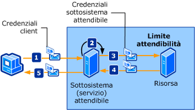

# Sottosistema attendibile
Un client accede a uno o più servizi Web distribuiti in una rete.I servizi Web sono progettati per far sì che l'accesso alle risorse aggiuntive \(ad esempio database o altri servizi Web\) sia incapsulato nella logica di business del servizio Web.Queste risorse devono essere protette da accessi non autorizzati.Nella figura seguente viene illustrato un processo di sottosistema attendibile.  
  
   
  
 Nei passaggi seguenti viene descritto il processo di sottosistema attendibile:  
  
1.  Il client invia una richiesta al sottosistema attendibile, insieme alle credenziali.  
  
2.  Il sottosistema attendibile autentica e autorizza l'utente.  
  
3.  Il sottosistema attendibile invia un messaggio di richiesta alla risorsa remota.La richiesta è accompagnata dalle credenziali per il sottosistema attendibile \(o per l'account del servizio in cui viene eseguito il processo del sottosistema attendibile\).  
  
4.  La risorsa back\-end autentica e autorizza il sottosistema attendibile.Elabora quindi la richiesta e invia una risposta al sottosistema attendibile.  
  
5.  Il sottosistema attendibile elabora la risposta e invia la propria risposta al client.  
  
|Caratteristica|Descrizione|  
|--------------------|-----------------|  
|Modalità di sicurezza|Messaggio|  
|Interoperabilità|Solo [!INCLUDE[indigo1](../../../../includes/indigo1-md.md)].|  
|Autenticazione \(servizio\)|Il servizio del token di sicurezza autentica e autorizza i client.|  
|Autenticazione \(client\)|Il sottosistema attendibile autentica il client e la risorsa autentica il servizio del sottosistema attendibile.|  
|Integrità|Sì|  
|Riservatezza|Sì|  
|Trasporto|HTTP tra il client e il servizio del sottosistema attendibile.<br /><br /> NET.TCP tra il servizio del sottosistema attendibile e la risorsa \(servizio back\-end\).|  
|Associazione|<xref:System.ServiceModel.WSHttpBinding> e <xref:System.ServiceModel.NetTcpBinding>[\<wsFederationHttpBinding\>](../../../../docs/framework/configure-apps/file-schema/wcf/wsfederationhttpbinding.md)|  
  
## Risorsa \(servizio back\-end\)  
  
### Codice  
 Nel codice seguente viene illustrato come creare un endpoint del servizio per la risorsa che utilizza la protezione del trasporto sul protocollo di trasporto TCP.  
  
 [!code-csharp[TrustedSubSystemsResource#1](../../../../samples/snippets/csharp/VS_Snippets_CFX/trustedsubsystemsresource/cs/source.cs#1)]
 [!code-vb[TrustedSubSystemsResource#1](../../../../samples/snippets/visualbasic/VS_Snippets_CFX/trustedsubsystemsresource/vb/source.vb#1)]  
  
### Configurazione  
 Nella configurazione seguente viene impostato lo stesso endpoint che utilizza la configurazione.  
  
```  
<?xml version="1.0" encoding="utf-8" ?>  
<configuration>  
  <system.serviceModel>  
    <services>  
      <service name="Microsoft.ServiceModel.Samples.BackendService"  
               behaviorConfiguration="BackendServiceBehavior">  
        <endpoint address="net.tcp://localhost.com:8001/BackendService"  
                  binding="customBinding"  
                  bindingConfiguration="Binding1"  
                  contract="Microsoft.ServiceModel.Samples.ICalculator"/>  
      </service>  
    </services>  
    <bindings>  
      <customBinding>  
        <binding name="Binding1">  
          <security authenticationMode="UserNameOverTransport"/>  
          <windowsStreamSecurity/>  
          <tcpTransport/>  
        </binding>  
      </customBinding>  
    </bindings>  
    <behaviors>  
      <serviceBehaviors>  
        <behavior name="BackendServiceBehavior">  
          <serviceCredentials>  
            <userNameAuthentication userNamePasswordValidationMode="Custom"  
                                    customUserNamePasswordValidatorType="Microsoft.ServiceModel.Samples.MyUserNamePasswordValidator, BackendService"/>  
          </serviceCredentials>  
        </behavior>  
      </serviceBehaviors>  
    </behaviors>  
  </system.serviceModel>  
</configuration>  
```  
  
## Sottosistema attendibile  
  
### Codice  
 Nel codice seguente viene illustrato come creare un endpoint del servizio per il sottosistema attendibile che utilizza la protezione del messaggio sul protocollo HTTP e un nome utente e una password per l'autenticazione.  
  
 [!code-csharp[TrustedSubSystems#1](../../../../samples/snippets/csharp/VS_Snippets_CFX/trustedsubsystems/cs/source.cs#1)]
 [!code-vb[TrustedSubSystems#1](../../../../samples/snippets/visualbasic/VS_Snippets_CFX/trustedsubsystems/vb/source.vb#1)]  
  
 Nel codice seguente viene illustrato un servizio in un sottosistema attendibile che comunica con un servizio back\-end utilizzando la protezione del trasporto sul protocollo di trasporto TCP.  
  
 [!code-csharp[TrustedSubSystems#2](../../../../samples/snippets/csharp/VS_Snippets_CFX/trustedsubsystems/cs/source.cs#2)]
 [!code-vb[TrustedSubSystems#2](../../../../samples/snippets/visualbasic/VS_Snippets_CFX/trustedsubsystems/vb/source.vb#2)]  
  
### Configurazione  
 Nella configurazione seguente viene impostato lo stesso endpoint che utilizza la configurazione.Si notino le due associazioni: una protegge il servizio ospitato nel sottosistema attendibile e l'altra comunica tra il sottosistema attendibile e il servizio back\-end.  
  
```  
<?xml version="1.0" encoding="utf-8" ?>  
<configuration>  
  <system.serviceModel>  
    <services>  
      <service name="Microsoft.ServiceModel.Samples.FacadeService"  
               behaviorConfiguration="FacadeServiceBehavior">  
        <host>  
          <baseAddresses>  
            <add baseAddress="http://localhost:8000/FacadeService"/>  
          </baseAddresses>  
        </host>  
        <endpoint address="http://localhost:8000/FacadeService"  
                  binding="wsHttpBinding"  
                  bindingConfiguration="Binding1"  
                  contract="Microsoft.ServiceModel.Samples.ICalculator"/>  
      </service>  
    </services>  
    <client>  
      <endpoint name=""   
                address="net.tcp://contoso.com:8001/BackendService"  
                binding="customBinding"  
                bindingConfiguration="ClientBinding"  
                contract="Microsoft.ServiceModel.Samples.ICalculator"/>  
    </client>  
    <bindings>  
      <wsHttpBinding>  
        <binding name="Binding1">  
          <security mode="Message">  
            <message clientCredentialType="UserName"/>  
          </security>  
        </binding>  
      </wsHttpBinding>  
      <customBinding>  
        <binding name="ClientBinding">  
          <security authenticationMode="UserNameOverTransport"/>  
          <windowsStreamSecurity/>  
          <tcpTransport/>  
        </binding>  
      </customBinding>  
    </bindings>  
    <behaviors>  
      <serviceBehaviors>  
        <behavior name="FacadeServiceBehavior">  
          <serviceMetadata httpGetEnabled="True"/>  
          <serviceCredentials>  
            <serviceCertificate findValue="Contoso.com"  
                                storeLocation="LocalMachine"  
                                storeName="My"  
                                x509FindType="FindBySubjectName" />  
            <userNameAuthentication userNamePasswordValidationMode="Custom"  
                                    customUserNamePasswordValidatorType="Microsoft.ServiceModel.Samples.MyUserNamePasswordValidator, FacadeService"/>  
          </serviceCredentials>  
        </behavior>  
      </serviceBehaviors>  
    </behaviors>  
  </system.serviceModel>  
</configuration>  
```  
  
## Client  
  
### Codice  
 Nel codice seguente viene illustrato come creare il client che comunica con il sottosistema attendibile utilizzando la protezione del messaggio sul protocollo HTTP e un nome utente e una password per l'autenticazione.  
  
 [!code-csharp[TrustedSubSystemsClient#1](../../../../samples/snippets/csharp/VS_Snippets_CFX/trustedsubsystemsclient/cs/source.cs#1)]
 [!code-vb[TrustedSubSystemsClient#1](../../../../samples/snippets/visualbasic/VS_Snippets_CFX/trustedsubsystemsclient/vb/source.vb#1)]  
  
### Configurazione  
 Nel codice seguente viene configurato il client in modo che utilizzi la protezione del messaggio sul protocollo HTTP e un nome utente e una password per l'autenticazione.Il nome utente e la password possono essere specificati solo tramite codice \(non è configurabile\).  
  
```  
<?xml version="1.0" encoding="utf-8" ?>  
<configuration>  
  <system.serviceModel>  
    <client>  
        <endpoint name=""   
                  address="http://www.cohowinery.com:8000/FacadeService"  
                  binding="wsHttpBinding"  
                  bindingConfiguration="Binding1"  
                  behaviorConfiguration="ClientUserNameBehavior"  
                  contract="Microsoft.ServiceModel.Samples.ICalculator"/>  
    </client>  
    <bindings>  
      <wsHttpBinding>  
        <binding name="Binding1">  
          <security mode="Message">  
            <message clientCredentialType="UserName"/>  
          </security>  
        </binding>  
      </wsHttpBinding>  
    </bindings>  
    <behaviors>  
      <endpointBehaviors>  
        <behavior name="ClientUserNameBehavior">  
          <clientCredentials>  
            <serviceCertificate>  
              <authentication certificateValidationMode="PeerOrChainTrust"/>  
            </serviceCertificate>  
          </clientCredentials>  
        </behavior>  
      </endpointBehaviors>  
    </behaviors>  
  </system.serviceModel>  
</configuration>  
```  
  
## Vedere anche  
 [Cenni preliminari sulla sicurezza](../../../../docs/framework/wcf/feature-details/security-overview.md)   
 [Modello di sicurezza per Windows Server App Fabric](http://go.microsoft.com/fwlink/?LinkID=201279&clcid=0x409)