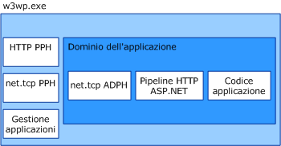

# Architettura di attivazione WAS
In questo argomento vengono definiti e illustrati i componenti del servizio di attivazione dei processi di Windows \(noto anche come WAS\).  
  
## Componenti di attivazione  
 WAS è costituito da numerosi componenti architettonici:  
  
-   Adattatori listener.Servizi di Windows che ricevono messaggi su specifici protocolli di rete e comunicano con WAS per indirizzare i messaggi in arrivo al processo di lavoro corretto.  
  
-   WAS.Servizio di Windows che gestisce la creazione e la durata dei processi di lavoro.  
  
-   File eseguibile del processo di lavoro generico \(w3wp.exe\).  
  
-   Gestore applicazioni.Gestisce la creazione e la durata dei domini applicazione che ospitano applicazioni all'interno del processo di lavoro.  
  
-   Gestori del protocollo.Componenti specifici del protocollo che vengono eseguiti nel processo di lavoro e gestiscono le comunicazioni tra il processo di lavoro e i singoli adattatori listener.Esistono due tipi di gestori del protocollo: del processo e AppDomain.  
  
 Quando WAS attiva un'istanza del processo di lavoro, carica i gestori del protocollo del processo necessari nel processo di lavoro e utilizza il gestore applicazioni per creare un dominio applicazione per ospitare l'applicazione.Il dominio applicazione carica il codice dell'applicazione e i gestori del protocollo AppDomain richiesti dai protocolli di rete utilizzati dall'applicazione.  
  
   
  
### Adattatori listener  
 Gli adattatori listener sono servizi di Windows singoli che implementano la logica di comunicazione di rete utilizzata per ricevere i messaggi tramite il protocollo di rete sul quale ascoltano.Nella tabella seguente sono elencati gli adattatori listener per i protocolli [!INCLUDE[indigo1](../../../../includes/indigo1-md.md)].  
  
|Nome del servizio dell’adattatore listener|Protocollo|Note|  
|------------------------------------------------|----------------|----------|  
|W3SVC|http|Componente comune che fornisce l’attivazione HTTP per IIS 7.0 e per [!INCLUDE[indigo2](../../../../includes/indigo2-md.md)].|  
|NetTcpActivator|net.tcp|Dipende dal servizio NetTcpPortSharing.|  
|NetPipeActivator|net.pipe||  
|NetMsmqActivator|net.msmq|Per utilizzo con applicazioni di accodamento messaggi basate su [!INCLUDE[indigo2](../../../../includes/indigo2-md.md)].|  
|NetMsmqActivator|msmq.formatname|Fornisce la compatibilità delle applicazioni di accodamento messaggi esistenti con le versioni precedenti.|  
  
 Gli adattatori listener per protocolli specifici vengono registrati durante l'installazione nel file applicationHost.config, come illustrato nell'esempio XML seguente.  
  
```  
<system.applicationHost>  
    <listenerAdapters>  
        <add name="http" />  
        <add name="net.tcp"   
          identity="S-1-5-80-3579033775-2824656752-1522793541-1960352512-462907086" />  
         <add name="net.pipe"   
           identity="S-1-5-80-2943419899-937267781-4189664001-1229628381-3982115073" />  
          <add name="net.msmq"   
            identity="S-1-5-80-89244771-1762554971-1007993102-348796144-2203111529" />  
           <add name="msmq.formatname"   
             identity="S-1-5-80-89244771-1762554971-1007993102-348796144-2203111529" />  
    </listenerAdapters>  
</system.applicationHost>  
```  
  
### Gestori del protocollo  
 I gestori del processo e del protocollo AppDomain per protocolli specifici vengono registrati nel file Web.config a livello di computer.  
  
```  
<system.web>  
   <protocols>  
      <add name="net.tcp"   
        processHandlerType=  
         "System.ServiceModel.WasHosting.TcpProcessProtocolHandler"  
        appDomainHandlerType=  
         "System.ServiceModel.WasHosting.TcpAppDomainProtocolHandler"  
        validate="false" />  
      <add name="net.pipe"   
        processHandlerType=  
         "System.ServiceModel.WasHosting.NamedPipeProcessProtocolHandler"  
          appDomainHandlerType=  
           "System.ServiceModel.WasHosting.NamedPipeAppDomainProtocolHandler”/>  
      <add name="net.msmq"  
        processHandlerType=  
         "System.ServiceModel.WasHosting.MsmqProcessProtocolHandler"  
        appDomainHandlerType=  
         "System.ServiceModel.WasHosting.MsmqAppDomainProtocolHandler"  
        validate="false" />  
   </protocols>  
</system.web>  
```  
  
## Vedere anche  
 [Configurazione WAS per l'utilizzo con WCF](../../../../docs/framework/wcf/feature-details/configuring-the-wpa--service-for-use-with-wcf.md)   
 [Funzionalità di hosting di AppFabric](http://go.microsoft.com/fwlink/?LinkId=201276)