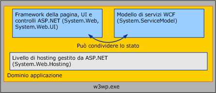

# Servizi WCF e ASP.NET
In questo argomento vengono illustrati l'hosting di servizi [!INCLUDE[indigo1](../../../../includes/indigo1-md.md)] affiancati ad ASP.NET e la modalità di compatibilità ASP.NET.  
  
## Hosting di WCF affiancato ad ASP.NET  
 I servizi [!INCLUDE[indigo2](../../../../includes/indigo2-md.md)] ospitati in Internet Information Services \(IIS\) possono trovarsi con pagine ASPX e servizi Web ASMX all'interno di un solo dominio applicazione comune.  ASP.NET prevede servizi di infrastruttura comuni, quali la gestione del dominio dell'applicazione e la compilazione dinamica del runtime HTTP [!INCLUDE[indigo2](../../../../includes/indigo2-md.md)] e ASP.NET.  La configurazione predefinita per [!INCLUDE[indigo2](../../../../includes/indigo2-md.md)] è quella affiancata ad ASP.NET.  
  
   
  
 Il runtime HTTP ASP.NET gestisce richieste ASP.NET ma non partecipa all'elaborazione delle richieste destinate a servizi [!INCLUDE[indigo2](../../../../includes/indigo2-md.md)], anche se questi servizi sono ospitati nello stesso AppDomain del contenuto ASP.NET.  Il modello di servizi [!INCLUDE[indigo2](../../../../includes/indigo2-md.md)] intercetta invece i messaggi indirizzati a servizi [!INCLUDE[indigo2](../../../../includes/indigo2-md.md)] e li instrada tramite lo stack di trasporto\/canale [!INCLUDE[indigo2](../../../../includes/indigo2-md.md)].  
  
 I risultati del modello affiancato sono i seguenti:  
  
-   ASP.NET e i servizi [!INCLUDE[indigo2](../../../../includes/indigo2-md.md)] possono condividere lo stato dell'AppDomain.  Poiché i due framework possono coesistere nello stesso AppDomain, [!INCLUDE[indigo2](../../../../includes/indigo2-md.md)] può condividere anche lo stato dell'AppDomain con ASP.NET \(inclusi variabili statiche, eventi e così via\).  
  
-   I servizi [!INCLUDE[indigo2](../../../../includes/indigo2-md.md)] si comportano coerentemente, indipendentemente dall'ambiente host e dal trasporto.  Il runtime HTTP ASP.NET è intenzionalmente accoppiato all'ambiente host IIS\/ASP.NET e alla comunicazione HTTP.  Al contrario., [!INCLUDE[indigo2](../../../../includes/indigo2-md.md)] è progettato per comportarsi coerentemente in diversi ambienti host \([!INCLUDE[indigo2](../../../../includes/indigo2-md.md)] si comporta coerentemente all'interno e all'esterno di IIS\) e trasporti \(un servizio ospitato in IIS 7.0 e versioni successive ha un comportamento coerente in tutti gli endpoint che espone, anche se alcuni di questi usano protocolli diversi da HTTP\).  
  
-   All'interno di un AppDomain, le funzionalità implementate dal runtime HTTP si applicano al contenuto ASP.NET ma non a [!INCLUDE[indigo2](../../../../includes/indigo2-md.md)].  Molte funzionalità specifiche di HTTP della piattaforma dell'applicazione ASP.NET non si applicano ai servizi [!INCLUDE[indigo2](../../../../includes/indigo2-md.md)] ospitati in un AppDomain con contenuto ASP.NET.  Ne sono esempi le seguenti:  
  
    -   HttpContext: la proprietà <xref:System.Web.HttpContext.Current%2A> è sempre `null` quando vi si accede da un servizio [!INCLUDE[indigo2](../../../../includes/indigo2-md.md)].  In alternativa, usare <xref:System.ServiceModel.OperationContext.Current.RequestContext>.  
  
    -   Autorizzazione basata su file: il modello di sicurezza [!INCLUDE[indigo2](../../../../includes/indigo2-md.md)] non consente l'elenco di controllo di accesso \(ACL\) applicato al file con estensione svc quando si decide se la richiesta di un servizio è autorizzata.  
  
    -   Autorizzazione URL basata sulla configurazione: allo stesso modo, il modello di sicurezza [!INCLUDE[indigo2](../../../../includes/indigo2-md.md)] non segue alcuna regola di autorizzazione basata su URL specificata nell'elemento di configurazione \<authorization\> di System.Web.  Queste impostazioni vengono ignorate per [!INCLUDE[indigo2](../../../../includes/indigo2-md.md)], se un servizio risiede in un spazio URL protetto da regole di autorizzazione URL ASP.NET.  
  
    -   Estensibilità di HttpModule: l'infrastruttura di hosting [!INCLUDE[indigo2](../../../../includes/indigo2-md.md)] intercetta le richieste [!INCLUDE[indigo2](../../../../includes/indigo2-md.md)] quando viene generato l'evento <xref:System.Web.HttpApplication.PostAuthenticateRequest> e non restituisce elaborazione alla pipeline HTTP ASP.NET.  I moduli codificati per intercettare richieste in fasi successive della pipeline non intercettano richieste [!INCLUDE[indigo2](../../../../includes/indigo2-md.md)].  
  
    -   Rappresentazione ASP.NET: per impostazione predefinita, le richieste [!INCLUDE[indigo2](../../../../includes/indigo2-md.md)] vengono sempre eseguite come identità del processo IIS, anche se ASP.NET è impostato per consentire la rappresentazione mediante l'opzione di configurazione \<identity impersonate\=”true” \/\> di System.Web.  
  
 Queste restrizioni si applicano solo ai servizi [!INCLUDE[indigo2](../../../../includes/indigo2-md.md)] ospitati nell'applicazione IIS.  Il comportamento del contenuto ASP.NET non viene influenzato dalla presenza di [!INCLUDE[indigo2](../../../../includes/indigo2-md.md)].  
  
 Le applicazioni [!INCLUDE[indigo2](../../../../includes/indigo2-md.md)] che richiedono funzionalità tradizionalmente fornite dalla pipeline HTTP dovrebbero considerare l'uso di equivalenti di [!INCLUDE[indigo2](../../../../includes/indigo2-md.md)], indipendenti dall'host e dal trasporto:  
  
-   <xref:System.ServiceModel.OperationContext> anziché <xref:System.Web.HttpContext>.  
  
-   <xref:System.ServiceModel.Description.ServiceAuthorizationBehavior> invece dell'autorizzazione file\/URL ASP.NET.  
  
-   <xref:System.ServiceModel.Dispatcher.IDispatchMessageInspector> o canali su più livelli personalizzati invece di moduli HTTP.  
  
-   Rappresentazione di ogni operazione mediante [!INCLUDE[indigo2](../../../../includes/indigo2-md.md)] invece della rappresentazione di System.Web.  
  
 In alternativa, è possibile considerare l'esecuzione dei servizi in modalità di compatibilità ASP.NET di [!INCLUDE[indigo2](../../../../includes/indigo2-md.md)].  
  
## Hosting dei servizi WCF in modalità di compatibilità ASP.NET  
 Sebbene il modello [!INCLUDE[indigo2](../../../../includes/indigo2-md.md)] sia progettato per comportarsi in modo coerente in diversi ambienti host e trasporti, sono frequenti gli scenari in cui un'applicazione non richiede tale grado di flessibilità.  La modalità di compatibilità ASP.NET di [!INCLUDE[indigo2](../../../../includes/indigo2-md.md)] è adatta agli scenari che non richiedono la possibilità di hosting all'esterno di IIS o di comunicazione su protocolli diversi da HTTP, ma in cui vengono usate tutte le funzionalità della piattaforma dell'applicazione Web ASP.NET.  
  
 A differenza della configurazione affiancata predefinita, in cui l'infrastruttura di hosting [!INCLUDE[indigo2](../../../../includes/indigo2-md.md)] intercetta i messaggi [!INCLUDE[indigo2](../../../../includes/indigo2-md.md)] e li instrada fuori dalla pipeline HTTP, i servizi [!INCLUDE[indigo2](../../../../includes/indigo2-md.md)] in esecuzione in modalità di compatibilità ASP.NET partecipano completamente al ciclo di vita delle richieste HTTP ASP.NET.  In modalità di compatibilità, i servizi [!INCLUDE[indigo2](../../../../includes/indigo2-md.md)] usano la pipeline HTTP tramite un'implementazione <xref:System.Web.IHttpHandler>, analogamente alla al modo in cui vengono gestite le richieste di pagine ASPX e servizi Web ASMX.  Di conseguenza, [!INCLUDE[indigo2](../../../../includes/indigo2-md.md)] si comporta in modo identico ad ASMX in relazione alle funzionalità ASP.NET seguenti:  
  
-   I servizi <xref:System.Web.HttpContext>: [!INCLUDE[indigo2](../../../../includes/indigo2-md.md)] in esecuzione in modalità di compatibilità ASP.NET possono accedere a <xref:System.Web.HttpContext.Current%2A> e al relativo stato associato.  
  
-   Autorizzazione basata su file: i servizi [!INCLUDE[indigo2](../../../../includes/indigo2-md.md)] in esecuzione in modalità di compatibilità ASP.NET possono essere protetti collegando elenchi di controllo di accesso \(ACL\) al file system al file con estensione svc del servizio.  
  
-   Autorizzazione URL configurabile: le regole di autorizzazione URL ASP.NET vengono applicate alle richieste [!INCLUDE[indigo2](../../../../includes/indigo2-md.md)] quando il servizio [!INCLUDE[indigo2](../../../../includes/indigo2-md.md)] è in esecuzione in modalità di compatibilità ASP.NET.  
  
-   estensibilità di <xref:System.Web.HttpModuleCollection>: poiché i servizi [!INCLUDE[indigo2](../../../../includes/indigo2-md.md)] in esecuzione in modalità di compatibilità ASP.NET partecipano completamente al ciclo di vita delle richieste HTTP ASP.NET, qualsiasi modulo HTTP configurato nella pipeline HTTP è in grado di operare su richieste [!INCLUDE[indigo2](../../../../includes/indigo2-md.md)] prima e dopo la chiamata al servizio.  
  
-   Rappresentazione ASP.NET: i servizi [!INCLUDE[indigo2](../../../../includes/indigo2-md.md)] vengono eseguiti usando l'identità corrente del thread con rappresentazione ASP.NET, che potrebbe essere diversa dall'identità del processo IIS, se è stata attivata la rappresentazione ASP.NET per l'applicazione.  Se la rappresentazione ASP.NET e la rappresentazione [!INCLUDE[indigo2](../../../../includes/indigo2-md.md)] sono entrambe abilitate per una particolare operazione del servizio, l'implementazione del servizio verrà eseguita usando l'identità ottenuta da [!INCLUDE[indigo2](../../../../includes/indigo2-md.md)].  
  
 La modalità di compatibilità ASP.NET di [!INCLUDE[indigo2](../../../../includes/indigo2-md.md)] viene abilitata a livello dell'applicazione tramite la configurazione seguente, presente nel file Web.config dell'applicazione:  
  
```  
<system.serviceModel>  
    <serviceHostingEnvironment aspNetCompatibilityEnabled="true" />  
</system.serviceModel>  
```  
  
 Se non viene specificato, questo valore viene automaticamente impostato su `true`.  L'impostazione di questo valore su "`false`" indica che tutti i servizi [!INCLUDE[indigo2](../../../../includes/indigo2-md.md)] in esecuzione nell'applicazione non vengono eseguiti in modalità di compatibilità ASP.NET.  
  
 Poiché la modalità di compatibilità ASP.NET implica una semantica di elaborazione delle richieste sostanzialmente diversa dall'impostazione predefinita di [!INCLUDE[indigo2](../../../../includes/indigo2-md.md)], le singole implementazione del servizio hanno la possibilità di controllare se vengono eseguite all'interno di un'applicazione per cui è stata attivata la modalità di compatibilità ASP.NET.  I servizi possono usare <xref:System.ServiceModel.Activation.AspNetCompatibilityRequirementsAttribute> per indicare se supportano la modalità di compatibilità ASP.NET.  Il valore predefinito di questo attributo è <xref:System.ServiceModel.Activation.AspNetCompatibilityRequirementsMode>.  
  
 `[AspNetCompatibilityRequirements(RequirementsMode = AspNetCompatibilityRequirementsMode.Allowed)]`  
  
 `public class CalculatorService : ICalculatorSession`  
  
 `{//Implement calculator service methods.}`  
  
 Nella tabella seguente viene illustrato in che modo l'impostazione della modalità di compatibilità a livello di applicazione interagisce con il livello di supporto dichiarato del singolo servizio:  
  
|Impostazione della modalità di compatibilità a livello di applicazione|\[AspNetCompatibilityRequirementsMode\]<br /><br /> Impostazione|Risultato osservato|  
|----------------------------------------------------------------------------|--------------------------------------------------------------|-------------------------|  
|aspNetCompatibilityEnabled \= “`true`”|<xref:System.ServiceModel.Activation.AspNetCompatibilityRequirementsMode>|Servizio correttamente attivato.|  
|aspNetCompatibilityEnabled \= “`true`”|<xref:System.ServiceModel.Activation.AspNetCompatibilityRequirementsMode>|Servizio correttamente attivato.|  
|aspNetCompatibilityEnabled \= “`true`”|<xref:System.ServiceModel.Activation.AspNetCompatibilityRequirementsMode>|Errore di attivazione durante la ricezione di un messaggio da parte del servizio.|  
|aspNetCompatibilityEnabled \= “`false`”|<xref:System.ServiceModel.Activation.AspNetCompatibilityRequirementsMode>|Errore di attivazione durante la ricezione di un messaggio da parte del servizio.|  
|aspNetCompatibilityEnabled \= “`false`”|<xref:System.ServiceModel.Activation.AspNetCompatibilityRequirementsMode>|Servizio correttamente attivato.|  
|aspNetCompatibilityEnabled \= “`false`”|<xref:System.ServiceModel.Activation.AspNetCompatibilityRequirementsMode>|Servizio correttamente attivato.|  
  
> [!NOTE]
>  IIS 7.0 e WAS consentono ai servizi [!INCLUDE[indigo2](../../../../includes/indigo2-md.md)] di comunicare su protocolli diversi da HTTP.  Tuttavia, i servizi [!INCLUDE[indigo2](../../../../includes/indigo2-md.md)] in esecuzione in applicazioni con la modalità di compatibilità ASP.NET attivata non sono autorizzati a esporre endpoint non HTTP.  Tale configurazione genera un'eccezione di attivazione quando il servizio riceve il primo messaggio.  
  
 Per altre informazioni sull'abilitazione della modalità di compatibilità ASP.NET per i servizi [!INCLUDE[indigo2](../../../../includes/indigo2-md.md)], vedere l'oggetto <xref:System.ServiceModel.Activation.AspNetCompatibilityRequirementsMode> e l'esempio [Compatibilità con ASP.NET](../../../../docs/framework/wcf/samples/aspnet-compatibility.md).  
  
## Vedere anche  
 <xref:System.ServiceModel.Activation.AspNetCompatibilityRequirementsAttribute>   
 [Funzionalità di hosting di Windows Server AppFabric](http://go.microsoft.com/fwlink/?LinkId=201276)