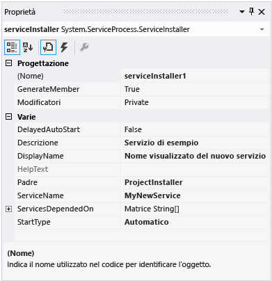
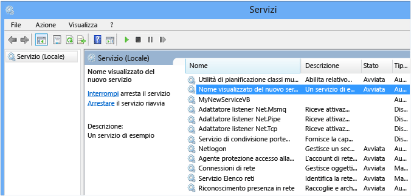
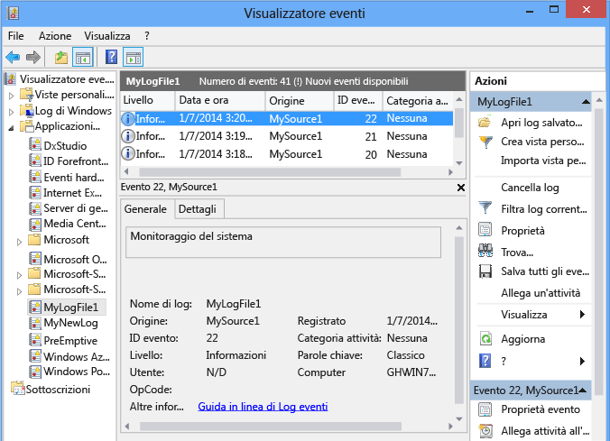

# Walkthrough: Creating a Windows Service Application in the Component Designer
Questo articolo illustra come creare una semplice applicazione del servizio Windows in Visual Studio che scrive messaggi in un log eventi. I passaggi di base da eseguire per la creazione e l'uso del servizio includono:  
  
1.  [Creazione di un servizio](#BK_CreateProject) usando il modello di progetto del **servizio Windows** e configurarlo. Tale modello crea automaticamente una classe che eredita da <xref:System.ServiceProcess.ServiceBase?displayProperty=fullName> e scrive la maggior parte del codice di base del servizio, ad esempio il codice per avviare il servizio.  
  
2.  [Aggiunta di funzionalità al servizio](#BK_WriteCode) per le routine <xref:System.ServiceProcess.ServiceBase.OnStart%2A> e <xref:System.ServiceProcess.ServiceBase.OnStop%2A> ed eseguire l'override degli altri metodi da ridefinire.  
  
3.  [Impostazione dello stato del servizio](#BK_SetStatus). Per impostazione predefinita, i servizi creati con <xref:System.ServiceProcess.ServiceBase?displayProperty=fullName> implementano solo un subset di flag di stato disponibili. Se le operazioni di avvio, sospensione e arresto del servizio richiedono molto tempo, è possibile implementare i valori di stato come Avvio in sospeso o Arresto in sospeso per indicare che è in corso un'operazione.  
  
4.  [Aggiunta di programmi di installazione al servizio](#BK_AddInstallers) per l'applicazione di servizio.  
  
5.  [Impostare i parametri di avvio](#BK_StartupParameters), specificare gli argomenti di avvio predefiniti e consentire agli utenti di eseguire l'override delle impostazioni predefinite quando avviano il servizio manualmente \(facoltativo\).  
  
6.  [Compilazione del servizio](#BK_Build).  
  
7.  [Installazione del servizio](#BK_Install) nel computer locale.  
  
8.  Accedere a Gestione controllo servizi di Windows e [Avvio ed esecuzione del servizio](#BK_StartService).  
  
9. [Disinstallazione di un servizio Windows](#BK_Uninstall).  
  
> [!WARNING]
>  Il modello di progetto Servizi Windows che è richiesto in questa procedura dettagliata non è disponibile nell'edizione Express di Visual Studio.  
  
 [!INCLUDE[note_settings_general](../../../includes/note-settings-general-md.md)]  
  
<a name="BK_CreateProject"></a>   
## Creazione di un servizio  
 Le prime operazioni da effettuare sono la creazione del progetto e l'impostazione dei valori necessari per garantire il corretto funzionamento del servizio.  
  
#### Per creare e configurare il servizio  
  
1.  Nella barra dei menu di Visual Studio scegliere **File**, **Nuovo**, **Progetto**.  
  
     Verrà visualizzata la finestra di dialogo **Nuovo progetto**.  
  
2.  Nell'elenco dei modelli di progetto di Visual Basic o Visual C\# scegliere **Servizio Windows** e assegnare al progetto il nome **MyNewService**. Scegliere **OK**.  
  
     Il modello di progetto aggiunge automaticamente una classe di componente denominata `Service1` che eredita dalla classe <xref:System.ServiceProcess.ServiceBase?displayProperty=fullName>.  
  
3.  Nel menu **Modifica** scegliere **Trova e sostituisci**, **Cerca nei file** \(scelta rapida da tastiera: CTRL\+MAIUSC\+F\). Modificare tutte le occorrenze di `Service1` in `MyNewService`. Sono presenti istanze in Service1.cs, Program.cs e Service1.Designer.cs \(o nei relativi equivalenti in VB\).  
  
4.  Nella finestra **Proprietà** per **Service1.cs \[Design\]** o **Service1.vb \[Design\]** impostare la proprietà <xref:System.ServiceProcess.ServiceBase.ServiceName%2A> e **\(Name\)** per `Service1` su **MyNewService**, se non è già impostata.  
  
5.  In Esplora soluzioni rinominare **Service1.cs** in **MyNewService.cs** o **Service1.vb** in **MyNewService.vb**.  
  
<a name="BK_WriteCode"></a>   
## Aggiunta di funzionalità al servizio  
 In questa sezione verrà aggiunto un log eventi personalizzato al servizio Windows. I log eventi non sono in alcun modo associati ai servizi Windows. In questa situazione il componente <xref:System.Diagnostics.EventLog> viene usato come un esempio del tipo di componente che è possibile aggiungere a un servizio Windows.  
  
#### Per aggiungere la funzionalità del log eventi personalizzato al servizio  
  
1.  In **Esplora soluzioni** aprire il menu di scelta rapida per **MyNewService.cs** o **MyNewService.vb**, quindi scegliere **Visualizza finestra di progettazione**.  
  
2.  Dalla sezione **Componenti** della **Casella degli strumenti** trascinare un componente <xref:System.Diagnostics.EventLog> nella finestra di progettazione.  
  
3.  In **Esplora soluzioni** aprire il menu di scelta rapida per **MyNewService.cs** o **MyNewService.vb**, quindi scegliere **Visualizza codice**.  
  
4.  Aggiungere una dichiarazione per l'oggetto **eventLog** oggetto nella classe `MyNewService` subito dopo la riga che dichiara la variabile `components`:  
  
     [!code-csharp[VbRadconService#16](../../../samples/snippets/csharp/VS_Snippets_VBCSharp/VbRadconService/CS/MyNewService.cs#16)]
     [!code-vb[VbRadconService#16](../../../samples/snippets/visualbasic/VS_Snippets_VBCSharp/VbRadconService/VB/MyNewService.vb#16)]  
  
5.  Aggiungere o modificare il costruttore in modo da definire un log eventi personalizzato:  
  
     [!code-csharp[VbRadconService#2](../../../samples/snippets/csharp/VS_Snippets_VBCSharp/VbRadconService/CS/MyNewService.cs#2)]
     [!code-vb[VbRadconService#2](../../../samples/snippets/visualbasic/VS_Snippets_VBCSharp/VbRadconService/VB/MyNewService.vb#2)]  
  
#### Per definire quello che accade quando il servizio viene avviato  
  
-   Nell'editor di codice individuare il metodo <xref:System.ServiceProcess.ServiceBase.OnStart%2A> di cui è stato eseguito automaticamente l'override al momento della creazione del progetto e sostituire il codice esistente con il codice seguente. In questo modo viene aggiunta una voce nel log eventi all'avvio dell'esecuzione del servizio:  
  
     [!code-csharp[VbRadconService#3](../../../samples/snippets/csharp/VS_Snippets_VBCSharp/VbRadconService/CS/MyNewService.cs#3)]
     [!code-vb[VbRadconService#3](../../../samples/snippets/visualbasic/VS_Snippets_VBCSharp/VbRadconService/VB/MyNewService.vb#3)]  
  
     Poiché le applicazioni di servizio sono progettate per un'esecuzione di lunga durata, generalmente eseguono operazioni di polling o di monitoraggio nel sistema. Il monitoraggio viene impostato nel metodo <xref:System.ServiceProcess.ServiceBase.OnStart%2A>. Il metodo <xref:System.ServiceProcess.ServiceBase.OnStart%2A>, tuttavia, non esegue effettivamente il monitoraggio. Il metodo <xref:System.ServiceProcess.ServiceBase.OnStart%2A> deve rispondere al sistema operativo dopo l'avvio del servizio, poiché Non deve entrare in un ciclo o bloccarsi. Per impostare un semplice meccanismo di polling, è possibile usare il componente <xref:System.Timers.Timer?displayProperty=fullName>. Nel metodo <xref:System.ServiceProcess.ServiceBase.OnStart%2A> impostare i parametri del componente e la proprietà <xref:System.Timers.Timer.Enabled%2A> su `true`. Il timer genera degli eventi nel codice periodicamente e, a quel punto, il servizio può svolgere la propria funzione di monitoraggio. A tale scopo, è possibile usare il codice seguente:  
  
    ```csharp  
    // Set up a timer to trigger every minute.  
    System.Timers.Timer timer = new System.Timers.Timer();  
    timer.Interval = 60000; // 60 seconds  
    timer.Elapsed += new System.Timers.ElapsedEventHandler(this.OnTimer);  
    timer.Start();  
    ```  
  
    ```vb  
    ' Set up a timer to trigger every minute.  
    Dim timer As System.Timers.Timer = New System.Timers.Timer()  
    timer.Interval = 60000 ' 60 seconds  
    AddHandler timer.Elapsed, AddressOf Me.OnTimer  
    timer.Start()  
    ```  
  
     Aggiungere il codice per gestire l'evento timer:  
  
    ```csharp  
    public void OnTimer(object sender, System.Timers.ElapsedEventArgs args)  
    {  
        // TODO: Insert monitoring activities here.  
        eventLog1.WriteEntry("Monitoring the System", EventLogEntryType.Information, eventId++);  
    }  
    ```  
  
    ```vb  
    Private Sub OnTimer(sender As Object, e As Timers.ElapsedEventArgs)  
        ' TODO: Insert monitoring activities here.  
        eventLog1.WriteEntry("Monitoring the System", EventLogEntryType.Information, eventId)  
        eventId = eventId + 1  
    End Sub  
    ```  
  
     Potrebbe essere necessario eseguire le attività usando un thread di lavoro in background invece di eseguire tutto il lavoro sul thread principale. Per un esempio, vedere la pagina di riferimento <xref:System.ServiceProcess.ServiceBase?displayProperty=fullName>.  
  
#### Per definire quello che accade quando il servizio viene interrotto  
  
-   Sostituire il codice del metodo <xref:System.ServiceProcess.ServiceBase.OnStop%2A> con il codice seguente. In questo modo viene aggiunta una voce nel log eventi all'arresto del servizio:  
  
     [!code-csharp[VbRadconService#4](../../../samples/snippets/csharp/VS_Snippets_VBCSharp/VbRadconService/CS/MyNewService.cs#4)]
     [!code-vb[VbRadconService#4](../../../samples/snippets/visualbasic/VS_Snippets_VBCSharp/VbRadconService/VB/MyNewService.vb#4)]  
  
 Nella sezione successiva è possibile eseguire l'override dei metodi <xref:System.ServiceProcess.ServiceBase.OnPause%2A>, <xref:System.ServiceProcess.ServiceBase.OnContinue%2A> e <xref:System.ServiceProcess.ServiceBase.OnShutdown%2A> per definire ulteriori operazioni di elaborazione del componente.  
  
#### Per definire altre azioni del servizio  
  
-   Individuare il metodo da gestire ed eseguirne l'override per definire le azioni desiderate.  
  
     L'esempio di codice seguente mostra come eseguire l'override del metodo <xref:System.ServiceProcess.ServiceBase.OnContinue%2A>:  
  
     [!code-csharp[VbRadconService#5](../../../samples/snippets/csharp/VS_Snippets_VBCSharp/VbRadconService/CS/MyNewService.cs#5)]
     [!code-vb[VbRadconService#5](../../../samples/snippets/visualbasic/VS_Snippets_VBCSharp/VbRadconService/VB/MyNewService.vb#5)]  
  
 Quando un servizio Windows viene installato mediante la classe <xref:System.Configuration.Install.Installer>, è necessario eseguire alcune azioni personalizzate. Visual Studio può creare questi programmi di installazione specificamente per un servizio Windows e aggiungerli al progetto.  
  
<a name="BK_SetStatus"></a>   
## Impostazione dello stato del servizio  
 I servizi segnalano il relativo stato in Gestione controllo servizi, in modo che gli utenti possano stabilire se un servizio funziona correttamente. Per impostazione predefinita, i servizi che ereditano da <xref:System.ServiceProcess.ServiceBase> segnalano un set limitato di impostazioni di stato, tra cui Arrestato, In pausa e in esecuzione. Se l'avvio di un servizio richiede un po' di tempo, potrebbe essere utile segnalare lo stato Avvio in sospeso. È anche possibile implementare le impostazioni di stato Avvio in sospeso e Arresto in sospeso aggiungendo il codice che chiama la [funzione SetServiceStatus](http://msdn.microsoft.com/library/windows/desktop/ms686241.aspx) di Windows.  
  
#### Per implementare lo stato in sospeso del servizio  
  
1.  Aggiungere un'istruzione `using` o una dichiarazione `Imports` allo spazio dei nomi <xref:System.Runtime.InteropServices?displayProperty=fullName> nel file MyNewService.cs o MyNewService.vb:  
  
    ```csharp  
    using System.Runtime.InteropServices;  
    ```  
  
    ```vb  
    Imports System.Runtime.InteropServices  
    ```  
  
2.  Aggiungere il codice seguente in MyNewService.cs per dichiarare i valori `ServiceState` e per aggiungere una struttura per lo stato da usare in una chiamata di pInvoke:  
  
    ```csharp  
    public enum ServiceState  
      {  
          SERVICE_STOPPED = 0x00000001,  
          SERVICE_START_PENDING = 0x00000002,  
          SERVICE_STOP_PENDING = 0x00000003,  
          SERVICE_RUNNING = 0x00000004,  
          SERVICE_CONTINUE_PENDING = 0x00000005,  
          SERVICE_PAUSE_PENDING = 0x00000006,  
          SERVICE_PAUSED = 0x00000007,  
      }  
  
      [StructLayout(LayoutKind.Sequential)]  
      public struct ServiceStatus  
      {  
          public long dwServiceType;  
          public ServiceState dwCurrentState;  
          public long dwControlsAccepted;  
          public long dwWin32ExitCode;  
          public long dwServiceSpecificExitCode;  
          public long dwCheckPoint;  
          public long dwWaitHint;  
      };  
    ```  
  
    ```vb  
    Public Enum ServiceState  
        SERVICE_STOPPED = 1  
        SERVICE_START_PENDING = 2  
        SERVICE_STOP_PENDING = 3  
        SERVICE_RUNNING = 4  
        SERVICE_CONTINUE_PENDING = 5  
        SERVICE_PAUSE_PENDING = 6  
        SERVICE_PAUSED = 7  
    End Enum  
  
    <StructLayout(LayoutKind.Sequential)>  
    Public Structure ServiceStatus  
        Public dwServiceType As Long  
        Public dwCurrentState As ServiceState  
        Public dwControlsAccepted As Long  
        Public dwWin32ExitCode As Long  
        Public dwServiceSpecificExitCode As Long  
        Public dwCheckPoint As Long  
        Public dwWaitHint As Long  
    End Structure  
    ```  
  
3.  A questo punto, nella classe `MyNewService` dichiarare la [funzione SetServiceStatus](http://msdn.microsoft.com/library/windows/desktop/ms686241.aspx) mediante pInvoke:  
  
    ```csharp  
    [DllImport("advapi32.dll", SetLastError=true)]  
            private static extern bool SetServiceStatus(IntPtr handle, ref ServiceStatus serviceStatus);  
  
    ```  
  
    ```vb  
    Declare Auto Function SetServiceStatus Lib "advapi32.dll" (ByVal handle As IntPtr, ByRef serviceStatus As ServiceStatus) As Boolean  
    ```  
  
4.  Per implementare lo stato Avvio in sospeso, aggiungere il codice seguente all'inizio del metodo <xref:System.ServiceProcess.ServiceBase.OnStart%2A>:  
  
    ```csharp  
    // Update the service state to Start Pending.  
    ServiceStatus serviceStatus = new ServiceStatus();  
    serviceStatus.dwCurrentState = ServiceState.SERVICE_START_PENDING;  
    serviceStatus.dwWaitHint = 100000;  
    SetServiceStatus(this.ServiceHandle, ref serviceStatus);  
    ```  
  
    ```vb  
    ' Update the service state to Start Pending.  
    Dim serviceStatus As ServiceStatus = New ServiceStatus()  
    serviceStatus.dwCurrentState = ServiceState.SERVICE_START_PENDING  
    serviceStatus.dwWaitHint = 100000  
    SetServiceStatus(Me.ServiceHandle, serviceStatus)  
    ```  
  
5.  Aggiungere il codice per impostare lo stato su In esecuzione alla fine del metodo <xref:System.ServiceProcess.ServiceBase.OnStart%2A>.  
  
    ```  
    // Update the service state to Running.  
    serviceStatus.dwCurrentState = ServiceState.SERVICE_RUNNING;  
    SetServiceStatus(this.ServiceHandle, ref serviceStatus);  
    ```  
  
    ```vb  
    ' Update the service state to Running.  
    serviceStatus.dwCurrentState = ServiceState.SERVICE_RUNNING  
    SetServiceStatus(Me.ServiceHandle, serviceStatus)  
    ```  
  
6.  Ripetere questa procedura per il metodo <xref:System.ServiceProcess.ServiceBase.OnStop%2A> \(facoltativo\).  
  
> [!CAUTION]
>  [Gestione controllo servizi](http://msdn.microsoft.com/library/windows/desktop/ms685150.aspx) usa i membri `dwWaitHint` e `dwCheckpoint` della [struttura SERVICE\_STATUS](http://msdn.microsoft.com/library/windows/desktop/ms685996.aspx) per determinare il tempo di attesa per l'avvio o l'arresto di un servizio Windows. Se l'esecuzione dei metodi <xref:System.ServiceProcess.ServiceBase.OnStart%2A> e <xref:System.ServiceProcess.ServiceBase.OnStop%2A> si prolunga, il servizio può richiedere più tempo chiamando di nuovo [SetServiceStatus](http://msdn.microsoft.com/library/windows/desktop/ms686241.aspx) con un valore `dwCheckPoint` incrementato.  
  
<a name="BK_AddInstallers"></a>   
## Aggiunta di programmi di installazione al servizio  
 Prima di eseguire un servizio Windows, è necessario installarlo, ovvero registrarlo con Gestione controllo servizi. È possibile aggiungere al progetto i programmi di installazione che gestiscono i dettagli di registrazione.  
  
#### Per creare i programmi di installazione per il servizio  
  
1.  In **Esplora soluzioni** aprire il menu di scelta rapida per **MyNewService.cs** o **MyNewService.vb**, quindi scegliere **Visualizza finestra di progettazione**.  
  
2.  Fare clic sullo sfondo della finestra di progettazione per selezionare il servizio anziché il suo contenuto.  
  
3.  Aprire il menu di scelta rapida per la finestra di progettazione \(se si sta usando un dispositivo di puntamento, fare clic con il pulsante destro del mouse all'interno della finestra\), quindi scegliere **Aggiungi programma di installazione**.  
  
     Per impostazione predefinita, al progetto viene aggiunta la classe di componente contenente due programmi di installazione. Il componente è denominato **ProjectInstaller** e i programmi di installazione in esso contenuti sono rispettivamente quello del servizio e quello del processo associato al servizio.  
  
4.  Nella visualizzazione **Progettazione** per **ProjectInstaller** scegliere **serviceInstaller1** per un progetto Visual C\# o su **ServiceInstaller1** per un progetto Visual Basic.  
  
5.  Nella finestra **Proprietà** verificare che la proprietà <xref:System.ServiceProcess.ServiceInstaller.ServiceName%2A> sia impostata su **MyNewService**.  
  
6.  Specificare un testo per la proprietà **Descrizione**, ad esempio "Servizio di esempio". Questo testo viene visualizzato nella finestra Servizi e consente all'utente di identificare il servizio e comprenderne la funzione.  
  
7.  Impostare la proprietà <xref:System.ServiceProcess.ServiceInstaller.DisplayName%2A> sul testo da visualizzare nella colonna **Nome** della finestra Servizi. Ad esempio, è possibile immettere "Nome visualizzato MyNewService". Questo nome può essere diverso dalla proprietà <xref:System.ServiceProcess.ServiceInstaller.ServiceName%2A>, che rappresenta il nome usato dal sistema \(ad esempio, quando si usa il comando `net start` per avviare il servizio\).  
  
8.  Impostare la proprietà <xref:System.ServiceProcess.ServiceInstaller.StartType%2A> su <xref:System.ServiceProcess.ServiceStartMode>.  
  
       
  
9. Nella finestra di progettazione scegliere **serviceProcessInstaller1** per un progetto Visual C\# o **ServiceProcessInstaller1** per un progetto Visual Basic. Impostare la proprietà <xref:System.ServiceProcess.ServiceProcessInstaller.Account%2A> su <xref:System.ServiceProcess.ServiceAccount>. In questo modo il servizio verrà installato ed eseguito su un account del servizio locale.  
  
    > [!IMPORTANT]
    >  L'account <xref:System.ServiceProcess.ServiceAccount> dispone di ampie autorizzazioni, tra cui la possibilità di scrivere nel log eventi. Usare questo account con attenzione, perché potrebbe aumentare il rischio di attacchi da parte di software dannoso. Per altre attività, è opportuno usare l'account <xref:System.ServiceProcess.ServiceAccount> che opera come utente senza privilegi nel computer locale e presenta credenziali anonime a tutti i server remoti. Questo esempio non riesce se si tenta di usare l'account <xref:System.ServiceProcess.ServiceAccount> perché sono necessarie le autorizzazioni per scrivere nel log eventi.  
  
     Per altre informazioni sui programmi di installazione, vedere [How to: Add Installers to Your Service Application](../../../docs/framework/windows-services/how-to-add-installers-to-your-service-application.md).  
  
<a name="BK_StartupParameters"></a>   
## Impostare i parametri di avvio  
 Un servizio Windows, come qualsiasi altro file eseguibile, può accettare gli argomenti della riga di comando o i parametri di avvio. Quando si aggiunge il codice ai parametri di avvio del processo, gli utenti possono avviare il servizio con i parametri di avvio personalizzati usando la finestra Servizi nel Pannello di controllo di Windows. Tuttavia, questi parametri di avvio non vengono mantenuti al successivo avvio del servizio. Per impostare i parametri di avvio in modo permanente, è possibile impostarli nel Registro di sistema, come illustrato in questa procedura.  
  
> [!NOTE]
>  Prima di decidere di aggiungere parametri di avvio, valutare se sia l'approccio migliore per passare informazioni al servizio. Anche se i parametri di avvio sono facili da usare e da analizzare e gli utenti possono facilmente eseguirne l'override, potrebbero essere più difficili da individuare e usare senza documentazione. In generale, se il servizio richiede diversi parametri di avvio, provare a usare il Registro di sistema o un file di configurazione. Ogni servizio Windows ha una voce nel Registro di sistema in HKLM\\System\\CurrentControlSet\\services. Nella chiave del servizio è possibile usare la sottochiave **Parametri** per archiviare le informazioni a cui il servizio può accedere. È possibile usare i file di configurazione dell'applicazione per un servizio Windows in modo analogo a come avviene per gli altri tipi di programmi. Per il codice di esempio, vedere <xref:System.Configuration.ConfigurationManager.AppSettings%2A>.  
  
#### Aggiunta di parametri di avvio  
  
1.  Nel metodo `Main` in Program.cs o in MyNewService.Designer.vb aggiungere un argomento per la riga di comando:  
  
    ```csharp  
    static void Main(string[] args)        {            ServiceBase[] ServicesToRun;            ServicesToRun = new ServiceBase[]             {                 new MyNewService(args)             };            ServiceBase.Run(ServicesToRun);        }  
    ```  
  
    ```vb  
    Shared Sub Main(ByVal cmdArgs() As String)        Dim ServicesToRun() As System.ServiceProcess.ServiceBase        ServicesToRun = New System.ServiceProcess.ServiceBase() {New MyNewServiceVB(cmdArgs)}        System.ServiceProcess.ServiceBase.Run(ServicesToRun)    End Sub  
    ```  
  
2.  Modificare il costruttore `MyNewService` come segue:  
  
    ```csharp  
    public MyNewService(string[] args)        {            InitializeComponent();            string eventSourceName = "MySource";            string logName = "MyNewLog";            if (args.Count() > 0)            {                eventSourceName = args[0];            }            if (args.Count() > 1)            {                logName = args[1];            }            eventLog1 = new System.Diagnostics.EventLog();            if (!System.Diagnostics.EventLog.SourceExists(eventSourceName))            {                System.Diagnostics.EventLog.CreateEventSource(                    eventSourceName, logName);            }            eventLog1.Source = eventSourceName;            eventLog1.Log = logName;        }  
    ```  
  
    ```vb  
    Public Sub New(ByVal cmdArgs() As String)        InitializeComponent()        Dim eventSourceName As String = "MySource"        Dim logName As String = "MyNewLog"        If (cmdArgs.Count() > 0) Then            eventSourceName = cmdArgs(0)        End If        If (cmdArgs.Count() > 1) Then            logName = cmdArgs(1)        End If        eventLog1 = New System.Diagnostics.EventLog()        If (Not System.Diagnostics.EventLog.SourceExists(eventSourceName)) Then            System.Diagnostics.EventLog.CreateEventSource(                eventSourceName, logName)        End If        eventLog1.Source = eventSourceName        eventLog1.Log = logName    End Sub  
    ```  
  
     Questo codice imposta l'origine evento e il nome log in base ai parametri di avvio forniti oppure usa i valori predefiniti se non vengono forniti argomenti.  
  
3.  Per specificare gli argomenti della riga di comando, aggiungere il codice seguente alla classe `ProjectInstaller` in ProjectInstaller.cs o ProjectInstaller.vb:  
  
    ```csharp  
    protected override void OnBeforeInstall(IDictionary savedState)        {            string parameter = "MySource1\" \"MyLogFile1";            Context.Parameters["assemblypath"] = "\"" + Context.Parameters["assemblypath"] + "\" \"" + parameter + "\"";            base.OnBeforeInstall(savedState);        }  
    ```  
  
    ```vb  
    Protected Overrides Sub OnBeforeInstall(ByVal savedState As IDictionary)        Dim parameter As String = "MySource1"" ""MyLogFile1"        Context.Parameters("assemblypath") = """" + Context.Parameters("assemblypath") + """ """ + parameter + """"        MyBase.OnBeforeInstall(savedState)    End Sub  
    ```  
  
     Questo codice modifica la chiave del Registro di sistema **ImagePath**, che in genere contiene il percorso completo dell'eseguibile per il servizio Windows, aggiungendo i valori dei parametri predefiniti. Le virgolette che racchiudono il percorso, e ogni singolo parametro, sono necessarie per il corretto avvio del servizio. Per modificare i parametri di avvio per questo servizio Windows, gli utenti possono modificare i parametri specificati nella chiave del Registro di sistema **ImagePath**, anche se l'approccio migliore consiste nell'eseguire la modifica a livello di codice ed esporre le funzionalità agli utenti in modo intuitivo, ad esempio in un'utilità di configurazione o gestione.  
  
<a name="BK_Build"></a>   
## Compilazione del servizio  
  
#### Per compilare il progetto di servizio  
  
1.  In **Esplora soluzioni** aprire il menu di scelta rapida per il progetto, quindi scegliere **Proprietà**. Verranno visualizzate le pagine delle proprietà per il progetto.  
  
2.  Nell'elenco **Oggetto di avvio** della scheda Applicazione scegliere **MyNewService.Program**.  
  
3.  In **Esplora soluzioni** aprire il menu di scelta rapida per il progetto, quindi scegliere **Compila** per compilare il progetto \(scelta rapida da tastiera: CTRL\+MAIUSC\+B\).  
  
<a name="BK_Install"></a>   
## Installazione del servizio  
 Una volta compilato il servizio Windows, è possibile installarlo. Per installare un servizio Windows, è necessario avere le credenziali amministrative nel computer in cui viene eseguita l'installazione.  
  
#### Per installare un servizio Windows  
  
1.  In Windows 7 e Windows Server aprire il **Prompt dei comandi per gli sviluppatori** negli **Strumenti di Visual Studio** nel menu **Start**. In Windows 8 o Windows 8.1 scegliere il riquadro **Strumenti di Visual Studio** nella schermata **Start**, quindi eseguire il Prompt dei comandi per gli sviluppatori con credenziali amministrative. Se si usa un mouse, fare clic con il pulsante destro del mouse su **Prompt dei comandi per gli sviluppatori**, quindi scegliere **Esegui come amministratore**.  
  
2.  Nella finestra del prompt dei comandi passare alla cartella che contiene l'output del progetto. Ad esempio, nella cartella Documenti passare a Visual Studio 2013\\Progetti\\MyNewService\\bin\\debug.  
  
3.  Immettere il comando seguente:  
  
    ```  
    installutil.exe MyNewService.exe  
    ```  
  
     Se il servizio viene installato correttamente, tramite il file installutil.exe verrà segnalato l'esito positivo. Se il sistema non riesce a trovare InstallUtil.exe, assicurarsi che sia presente nel computer in uso. Questo strumento viene installato con .NET Framework nella cartella `%WINDIR%\Microsoft.NET\Framework[64]\`*versione\_framework*. Ad esempio, per la versione a 32 bit di .NET Framework 4, 4.5, 4.5.1 o 4.5.2. il percorso predefinito è `C:\Windows\Microsoft.NET\Framework\v4.0.30319\InstallUtil.exe`.  
  
     Se il processo installutil.exe segnala un errore, controllare il log di installazione per determinarne il motivo. Per impostazione predefinita, il log è nella stessa cartella del file eseguibile del servizio. L'installazione potrebbe non riuscire se [RunInstallerAttribute Classe](../Topic/RunInstallerAttribute%20Class.md) non è presente nella classe `ProjectInstaller`, se l'attributo non è impostato su `true` o se la classe `ProjectInstaller` non è `pubblica`.  
  
     Per altre informazioni, vedere [How to: Install and Uninstall Services](../../../docs/framework/windows-services/how-to-install-and-uninstall-services.md).  
  
<a name="BK_StartService"></a>   
## Avvio ed esecuzione del servizio  
  
#### Per avviare e interrompere il servizio  
  
1.  In Windows aprire la schermata **Start** o il menu **Start**, quindi digitare `services.msc`.  
  
     Nella finestra **Servizi** ora dovrebbe essere visualizzato **MyNewService**.  
  
       
  
2.  Nella finestra **Servizi** aprire il menu di scelta rapida per il servizio, quindi scegliere **Avvia**.  
  
3.  Aprire il menu di scelta rapida per il servizio, quindi scegliere **Arresta**.  
  
4.  Dalla riga di comando è possibile usare i comandi `net start` `ServiceName` e `net stop` `ServiceName` per avviare e arrestare il servizio \(facoltativo\).  
  
#### Per verificare l'output del log eventi del servizio  
  
1.  In Visual Studio aprire **Esplora server** \(scelta rapida da tastiera: CTRL\+ALT\+S\) e accedere al nodo **Log eventi** per il computer locale.  
  
2.  Individuare l'elenco per **MyNewLog** \(o **MyLogFile1**, se è stata usata la procedura facoltativa per aggiungere gli argomenti della riga di comando\) ed espanderlo. Verranno visualizzate le voci per le due azioni \(avvio e arresto\) eseguite dal servizio.  
  
       
  
<a name="BK_Uninstall"></a>   
## Disinstallazione di un servizio Windows  
  
#### Per disinstallare il servizio  
  
1.  Aprire un prompt dei comandi per gli sviluppatori con credenziali amministrative.  
  
2.  Nella finestra del prompt dei comandi passare alla cartella che contiene l'output del progetto. Ad esempio, nella cartella Documenti passare a Visual Studio 2013\\Progetti\\MyNewService\\bin\\debug.  
  
3.  Immettere il comando seguente:  
  
    ```  
    installutil.exe /u MyNewService.exe  
    ```  
  
     Se il servizio viene disinstallato correttamente, tramite il file installutil.exe verrà segnalato che il servizio è stato rimosso correttamente. Per altre informazioni, vedere [How to: Install and Uninstall Services](../../../docs/framework/windows-services/how-to-install-and-uninstall-services.md).  
  
## Passaggi successivi  
 È possibile creare un programma di installazione autonomo che altri utenti possono usare per installare il servizio Windows, ma sono richiesti alcuni passaggi aggiuntivi. ClickOnce non supporta i servizi Windows, pertanto non è possibile usare Pubblicazione guidata. È possibile usare una versione completa di InstallShield, che è però non fornita da Microsoft. Per altre informazioni su InstallShield, vedere [InstallShield Limited Edition](../Topic/InstallShield%20Limited%20Edition.md). È inoltre possibile usare il [set di strumenti XML di Windows Installer](http://go.microsoft.com/fwlink/?LinkId=249067) per creare un programma di installazione per un servizio di Windows.  
  
 Per inviare comandi al servizio installato, è anche possibile usare il componente <xref:System.ServiceProcess.ServiceController>.  
  
 È possibile usare il programma di installazione per creare un log eventi durante l'installazione dell'applicazione, anziché in fase di esecuzione. Il log eventi verrà inoltre eliminato dal programma di installazione durante la disinstallazione dell'applicazione. Per altre informazioni, vedere la pagina di riferimento <xref:System.Diagnostics.EventLogInstaller>.  
  
## Vedere anche  
 [Windows Service Applications](../../../docs/framework/windows-services/index.md)   
 [Introduction to Windows Service Applications](../../../docs/framework/windows-services/introduction-to-windows-service-applications.md)   
 [How to: Debug Windows Service Applications](../../../docs/framework/windows-services/how-to-debug-windows-service-applications.md)   
 [How to: Access and Initialize Server Explorer\/Database Explorer](../Topic/How%20to:%20Access%20and%20Initialize%20Server%20Explorer-Database%20Explorer.md)   
 [Servizi \(Windows\)](http://msdn.microsoft.com/library/windows/desktop/ms685141.aspx)