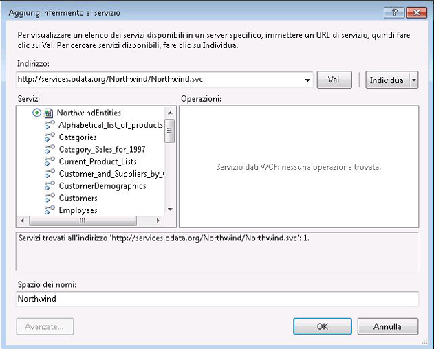

# Utilizzo di feed OData da un flusso di lavoro
WCF Data Services è un componente di [!INCLUDE[dnprdnshort](../../../includes/dnprdnshort-md.md)] che consente di creare servizi che usano Open Data Protocol \(OData\) per esporre e usare dati sul Web o su rete Intranet tramite la semantica REST \(Representational State Transfer\). In OData i dati vengono esposti come risorse indirizzabili tramite URI. Un'applicazione può interagire con un servizio dati basato su OData quando è in grado di inviare una richiesta HTTP e di elaborare il feed OData restituito da un servizio dati. In WCF Data Services sono inoltre disponibili librerie client che consentono di programmare in modo più completo quando si usano feed OData da applicazioni [!INCLUDE[dnprdnshort](../../../includes/dnprdnshort-md.md)]. In questo argomento viene fornita una panoramica sull'uso di un feed OData in un flusso di lavoro con e senza librerie client.  
  
## Utilizzo del servizio OData Northwind di esempio  
 Negli esempi di questo argomento viene usato il servizio dati Northwind di esempio disponibile all'indirizzo [http:\/\/services.odata.org\/Northwind\/Northwind.svc\/](http://go.microsoft.com/fwlink/?LinkID=187426). Il servizio viene fornito come parte di [OData SDK](http://go.microsoft.com/fwlink/?LinkID=185248) e consente di accedere in sola lettura al database Northwind di esempio. Se si desidera ottenere l'accesso in scrittura o un'istanza di WCF Data Services locale, seguire la procedura descritta in [Guida rapida \(WCF Data Services\)](http://go.microsoft.com/fwlink/?LinkID=131076) per creare un servizio OData locale che consenta di accedere al database Northwind. Se si eseguono le operazioni indicate nella guida rapida, sostituire l'URI locale a quello indicato nel codice di esempio in questo argomento.  
  
## Uso di un feed OData tramite le librerie client  
 In WCF Data Services sono disponibili librerie client che consentono di usare con più facilità un feed OData da applicazioni [!INCLUDE[dnprdnshort](../../../includes/dnprdnshort-md.md)] e client. Queste librerie semplificano l'invio e la ricezione di messaggi HTTP, oltre a convertire il payload del messaggio in oggetti CLR che rappresentano dati di entità. Le librerie client rendono disponibili le due classi principali <xref:System.Data.Services.Client.DataServiceContext> e <xref:System.Data.Services.Client.DataServiceQuery%601> che consentono di eseguire una query su un servizio dati e di usare quindi i dati di entità restituiti come oggetti CLR. Contenuto della sezione vengono descritti due approcci alla creazione di attività che usano le librerie client.  
  
### Aggiunta di un riferimento al servizio a WCF Data Services  
 Per generare le librerie client Northwind, è possibile usare la finestra di dialogo **Aggiungi riferimento al servizio** in [!INCLUDE[vs_current_long](../../../includes/vs-current-long-md.md)] per aggiungere un riferimento al servizio Northwind OData.  
  
   
  
 Si noti che non sono presenti operazioni del servizio esposte dal servizio stesso e che nell'elenco **Servizi** sono contenuti elementi che rappresentano le entità esposte dal servizio dati Northwind. Quando si aggiunge il riferimento al servizio, le classi verranno generate per queste entità e sarà possibile usarle nel codice client. Negli esempi di questo argomento vengono usate tali classi e la classe `NorthwindEntities` per eseguire le query.  
  
> [!NOTE]
>  [!INCLUDE[crdefault](../../../includes/crdefault-md.md)] [Generazione della libreria client del servizio dati \(WCF Data Services\)](http://go.microsoft.com/fwlink/?LinkID=191611).  
  
### Uso di metodi asincroni  
 Per risolvere possibili problemi di latenza che potrebbero verificarsi quando si accede a risorse sul Web, è consigliabile accedere a WCF Data Services in modo asincrono. Le librerie client di WCF Data Services includono metodi asincroni per richiamare query e [!INCLUDE[wf](../../../includes/wf-md.md)] fornisce la classe <xref:System.Activities.AsyncCodeActivity> per creare attività asincrone. È possibile scrivere attività derivate da <xref:System.Activities.AsyncCodeActivity> per sfruttare le classi [!INCLUDE[dnprdnshort](../../../includes/dnprdnshort-md.md)] che dispongono di metodi asincroni oppure è possibile inserire il codice da eseguire in modo asincrono in un metodo e richiamarlo usando un delegato. Contenuto della sezione vengono forniti due esempi di un'attività derivata <xref:System.Activities.AsyncCodeActivity>: in uno vengono usati i metodi asincroni delle librerie client di WCF Data Services e nell'altro viene usato un delegato.  
  
> [!NOTE]
>  [!INCLUDE[crdefault](../../../includes/crdefault-md.md)] [Operazioni asincrone \(WCF Data Services\)](http://go.microsoft.com/fwlink/?LinkId=193396) e [Creazione di attività asincrone](../../../docs/framework/windows-workflow-foundation//creating-asynchronous-activities-in-wf.md).  
  
### Uso di metodi asincroni di librerie client  
 La classe <xref:System.Data.Services.Client.DataServiceQuery%601> fornisce i metodi <xref:System.Data.Services.Client.DataServiceQuery%601.BeginExecute%2A> e <xref:System.Data.Services.Client.DataServiceQuery%601.EndExecute%2A> per l'esecuzione asincrona di una query su un servizio OData. Tali metodi possono essere chiamati da <xref:System.Activities.AsyncCodeActivity.BeginExecute%2A>, mentre <xref:System.Activities.AsyncCodeActivity.EndExecute%2A> esegue l'override di una classe <xref:System.Activities.AsyncCodeActivity> derivata. Quando viene restituito l'override <xref:System.Activities.AsyncCodeActivity> <xref:System.Activities.AsyncCodeActivity.BeginExecute%2A>, il flusso di lavoro può diventare inattivo \(ma non persistente\) e, dopo il completamento delle operazioni asincrone, il metodo <xref:System.Activities.AsyncCodeActivity.EndExecute%2A> viene richiamato dal runtime.  
  
 Nell'esempio seguente viene definita un'attività `OrdersByCustomer` che dispone di due argomenti di input. L'argomento `CustomerId` rappresenta il cliente che identifica gli ordini da restituire, mentre l'argomento `ServiceUri` rappresenta l'URI del servizio OData su cui eseguire una query. Poiché l'attività deriva da `AsyncCodeActivity<IEnumerable<Order>>`, è presente anche un argomento di output <xref:System.Activities.Activity%601.Result%2A> usato per restituire i risultati della query. L'override <xref:System.Activities.AsyncCodeActivity.BeginExecute%2A> crea una query LINQ che seleziona tutti gli ordini del cliente specificato. Tale query viene specificata come la proprietà <xref:System.Activities.AsyncCodeActivityContext.UserState%2A> dell'oggetto <xref:System.Activities.AsyncCodeActivityContext> passato e successivamente viene chiamato il metodo <xref:System.Data.Services.Client.DataServiceQuery%601.BeginExecute%2A> della query. Si noti che il callback e lo stato passati al metodo <xref:System.Data.Services.Client.DataServiceQuery%601.BeginExecute%2A> della query sono gli stessi passati al metodo <xref:System.Activities.AsyncCodeActivity.BeginExecute%2A> dell'attività. Dopo che la query è stata eseguita, viene richiamato il metodo <xref:System.Activities.AsyncCodeActivity.EndExecute%2A> dell'attività. Successivamente, la query viene recuperata da <xref:System.Activities.AsyncCodeActivityContext.UserState%2A> e viene chiamato il metodo <xref:System.Data.Services.Client.DataServiceQuery%601.EndExecute%2A> della query che restituisce un oggetto <xref:System.Collections.Generic.IEnumerable%601> del tipo di entità specificato, in questo caso `Order`. Poiché `IEnumerable<Order>` è il tipo generico di <xref:System.Activities.AsyncCodeActivity%601>, questo elemento `IEnumerable` viene impostato come <xref:System.Activities.Activity%601.Result%2A> <xref:System.Activities.OutArgument%601> dell'attività.  
  
 [!code-csharp[CFX_WCFDataServicesActivityExample#100](../../../samples/snippets/csharp/VS_Snippets_CFX/CFX_WCFDataServicesActivityExample/cs/Program.cs#100)]  
  
 Nell'esempio seguente l'attività `OrdersByCustomer` recupera un elenco di ordini per il cliente specificato e successivamente un'attività <xref:System.Activities.Statements.ForEach%601> enumera gli ordini restituiti e scrive la data di ogni ordine nella console.  
  
 [!code-csharp[CFX_WCFDataServicesActivityExample#10](../../../samples/snippets/csharp/VS_Snippets_CFX/CFX_WCFDataServicesActivityExample/cs/Program.cs#10)]  
  
 Quando questo flusso di lavoro viene richiamato, nella console vengono scritti i dati seguenti:  
  
 **Calling WCF Data Service...**   
**8\/25\/1997**   
**10\/3\/1997**   
**10\/13\/1997**   
**1\/15\/1998**   
**3\/16\/1998**   
**4\/9\/1998**    
> [!NOTE]
>  Se non è possibile stabilire una connessione al server OData, verrà generata un'eccezione analoga alla seguente:  
>   
>  Eccezione non gestita: System.InvalidOperationException: Errore durante l'elaborazione della richiesta. \-\-\-\> System.Net.WebException: Impossibile effettuare la connessione al server remoto \-\-\-\> System.Net.Sockets.SocketException: Tentativo di connessione non riuscito. Risposta non corretta della parte connessa dopo un intervallo di tempo oppure mancata risposta dall'host connesso.  
  
 Se è necessaria un'elaborazione aggiuntiva dei dati restituiti dalla query, è possibile usare l'override <xref:System.Activities.AsyncCodeActivity%601.EndExecute%2A> dell'attività. Sia <xref:System.Activities.AsyncCodeActivity%601.BeginExecute%2A> che <xref:System.Activities.AsyncCodeActivity%601.EndExecute%2A> vengono richiamati tramite il thread del flusso di lavoro e nessun codice in tali override viene eseguito in modo asincrono. Se l'elaborazione aggiuntiva è estesa o di lunga durata o se viene eseguito il paging dei risultati della query, è opportuno prendere in considerazione l'approccio discusso nella sezione seguente in cui viene usato un delegato per eseguire la query e completare l'elaborazione aggiuntiva in modo asincrono.  
  
### Uso di un delegato  
 Oltre a richiamare il metodo asincrono di una classe [!INCLUDE[dnprdnshort](../../../includes/dnprdnshort-md.md)], un'attività basata su <xref:System.Activities.AsyncCodeActivity> può definire anche la logica asincrona in uno dei relativi metodi. Questo metodo viene specificato tramite un delegato nell'override <xref:System.Activities.AsyncCodeActivity.BeginExecute%2A> dell'attività. Quando il metodo restituisce un risultato, il runtime richiama l'override <xref:System.Activities.AsyncCodeActivity.EndExecute%2A> dell'attività. In caso di chiamata di un servizio OData da un flusso di lavoro, il metodo può essere usato per eseguire una query sul servizio e completare eventuali elaborazioni aggiuntive.  
  
 Nell'esempio seguente viene definita un'attività `ListCustomers`. che esegue una query sul servizio dati Northwind di esempio e restituisce un elemento `List<Customer>` che contiene tutti i clienti del database Northwind. Il lavoro asincrono viene eseguito dal metodo `GetCustomers` che esegue una query sul servizio per tutti i clienti, li copia in un elemento `List<Customer>` e controlla se è stato eseguito il paging dei risultati. In caso affermativo, esegue una query sul servizio per la successiva pagina di risultati, li aggiunge all'elenco e continua fino a quando non sono stati recuperati tutti i dati del cliente.  
  
> [!NOTE]
>  [!INCLUDE[crabout](../../../includes/crabout-md.md)] esecuzione del paging in WCF Data Services, vedere[Procedura: caricare risultati di paging \(WCF Data Services\)](http://go.microsoft.com/fwlink/?LinkId=193452).  
  
 Una volta aggiunti tutti i clienti, viene restituito l'elenco. Il metodo `GetCustomers` viene specificato nell'override <xref:System.Activities.AsyncCodeActivity.BeginExecute%2A> dell'attività. Poiché il metodo restituisce un valore, viene creato un elemento `Func<string, List<Customer>>` per specificarlo.  
  
> [!NOTE]
>  Se il metodo che esegue il lavoro asincrono non restituisce un valore, viene usato un oggetto <xref:System.Action> anziché un oggetto <xref:System.Func>. Per esempi di creazione di attività asincrone usando entrambi gli approcci, vedere [Creazione di attività asincrone](../../../docs/framework/windows-workflow-foundation//creating-asynchronous-activities-in-wf.md).  
  
 Questo oggetto <xref:System.Func> viene assegnato a <xref:System.Activities.AsyncCodeActivityContext.UserState%2A>, quindi viene chiamato `BeginInvoke`. Poiché il metodo da richiamare non dispone dell'accesso all'ambiente di argomenti dell'attività, il valore dell'argomento `ServiceUri` viene passato come primo parametro, insieme con il callback e lo stato passati a <xref:System.Activities.AsyncCodeActivity.BeginExecute%2A>. Quando `GetCustomers` restituisce un risultato, il runtime richiama <xref:System.Activities.AsyncCodeActivity.EndExecute%2A>. Il codice in <xref:System.Activities.AsyncCodeActivity.EndExecute%2A> recupera il delegato da <xref:System.Activities.AsyncCodeActivityContext.UserState%2A>, chiama `EndInvoke` e restituisce il risultato, ovvero l'elenco di clienti restituito dal metodo `GetCustomers`.  
  
 [!code-csharp[CFX_WCFDataServicesActivityExample#200](../../../samples/snippets/csharp/VS_Snippets_CFX/CFX_WCFDataServicesActivityExample/cs/Program.cs#200)]  
  
 Nell'esempio seguente l'attività `ListCustomers` recupera un elenco di clienti e successivamente un'attività <xref:System.Activities.Statements.ForEach%601> li enumera e scrive il nome dell'azienda e del contatto di ogni cliente nella console.  
  
 [!code-csharp[CFX_WCFDataServicesActivityExample#20](../../../samples/snippets/csharp/VS_Snippets_CFX/CFX_WCFDataServicesActivityExample/cs/Program.cs#20)]  
  
 Quando questo flusso di lavoro viene richiamato, nella console vengono scritti i dati seguenti. Poiché la query restituisce numerosi clienti, in questo contesto viene visualizzata solo una parte dell'output.  
  
 **Calling WCF Data Service...**   
**Alfreds Futterkiste, Contact: Maria Anders**   
**Ana Trujillo Emparedados y helados, Contact: Ana Trujillo**   
**Antonio Moreno Taquería, Contact: Antonio Moreno**   
**Around the Horn, Contact: Thomas Hardy**   
**Berglunds snabbköp, Contact: Christina Berglund**   
**...**    
## Uso di un feed OData senza le librerie client  
 In OData i dati vengono esposti come risorse indirizzabili tramite URI. Tali URI vengono creati automaticamente quando si usano le librerie client, sebbene queste ultime non siano sempre necessarie. È infatti possibile accedere direttamente ai servizi OData senza usare le librerie client. In questo caso il percorso del servizio e i dati desiderati vengono specificati dagli URI e i risultati vengono restituiti nella risposta alla richiesta HTTP. Tali dati possono quindi essere elaborati o modificati nel modo desiderato. Per recuperare i risultati di una query OData, è possibile usare la classe <xref:System.Net.WebClient>. In questo esempio viene recuperato il nome del contatto per il cliente rappresentato dalla chiave ALFKI.  
  
 [!code-csharp[CFX_WCFDataServicesActivityExample#2](../../../samples/snippets/csharp/VS_Snippets_CFX/CFX_WCFDataServicesActivityExample/cs/Program.cs#2)]  
  
 Quando questo codice viene eseguito, nella console viene visualizzato l'output seguente:  
  
 **Raw data returned:**   
**\<?xml version\="1.0" encoding\="utf\-8" standalone\="yes"?\>**   
**\<ContactName xmlns\="http:\/\/schemas.microsoft.com\/ado\/2007\/08\/dataservices"\>Maria Anders\<\/ContactName\>**  In un flusso di lavoro il codice dell'esempio potrebbe essere incorporato nell'override <xref:System.Activities.CodeActivity.Execute%2A> di un'attività personalizzata basata su <xref:System.Activities.CodeActivity>, ma la stessa funzionalità può essere realizzata anche tramite l'attività <xref:System.Activities.Expressions.InvokeMethod%601>. L'attività <xref:System.Activities.Expressions.InvokeMethod%601> consente agli autori del flusso di lavoro di richiamare metodi statici e di istanza di una classe e dispone inoltre di un'opzione per richiamare il metodo specificato in modo asincrono. Nell'esempio seguente un'attività <xref:System.Activities.Expressions.InvokeMethod%601> viene configurata per chiamare il metodo <xref:System.Net.WebClient.DownloadString%2A> della classe <xref:System.Net.WebClient> e per restituire un elenco di clienti.  
  
 [!code-csharp[CFX_WCFDataServicesActivityExample#3](../../../samples/snippets/csharp/VS_Snippets_CFX/CFX_WCFDataServicesActivityExample/cs/Program.cs#3)]  
  
 <xref:System.Activities.Expressions.InvokeMethod%601> può chiamare sia metodi statici che di istanza di una classe. Poiché <xref:System.Net.WebClient.DownloadString%2A> è un metodo di istanza della classe <xref:System.Net.WebClient>, viene specificata una nuova istanza della classe <xref:System.Net.WebClient> per <xref:System.Activities.Expressions.InvokeMethod%601.TargetObject%2A>.`DownloadString` viene specificato come <xref:System.Activities.Expressions.InvokeMethod%601.MethodName%2A>, l'URI che contiene la query viene specificato nella raccolta <xref:System.Activities.Expressions.InvokeMethod%601.Parameters%2A> e il valore restituito viene assegnato al valore di <xref:System.Activities.Activity%601.Result%2A>. Il valore <xref:System.Activities.Expressions.InvokeMethod%601.RunAsynchronously%2A> viene impostato su `true` per indicare che la chiamata al metodo verrà eseguita in modo asincrono rispetto al flusso di lavoro. Nell'esempio seguente viene creato un flusso di lavoro che usa l'attività <xref:System.Activities.Expressions.InvokeMethod%601> per eseguire una query sul servizio dati Northwind di esempio per ottenere un elenco di ordini per un cliente specifico. Successivamente i dati restituiti vengono scritti nella console.  
  
 [!code-csharp[CFX_WCFDataServicesActivityExample#1](../../../samples/snippets/csharp/VS_Snippets_CFX/CFX_WCFDataServicesActivityExample/cs/Program.cs#1)]  
  
 Quando questo flusso di lavoro viene richiamato, nella console viene visualizzato l'output seguente. Poiché la query restituisce numerosi ordini, in questo contesto viene visualizzata solo una parte dell'output.  
  
 **Calling WCF Data Service...**   
**Raw data returned:**   
**\<?xml version\="1.0" encoding\="utf\-8" standalone\="yes"?\>**   
**\<feed**   
 **xml:base\="http:\/\/services.odata.org\/Northwind\/Northwind.svc\/"**   
 **xmlns:d\="http:\/\/schemas.microsoft.com\/ado\/2007\/08\/dataservices"**   
 **xmlns:m\="http:\/\/schemas.microsoft.com\/ado\/2007\/08\/dataservices\/metadata"**   
 **xmlns\="http:\/\/www.w3.org\/2005\/Atom"\>**   
 **\<title type\="text"\>Orders\<\/title\>**   
 **\<id\>http:\/\/services.odata.org\/Northwind\/Northwind.svc\/Customers\('ALFKI'\)\/Orders\<\/id\>**   
 **\<updated\>2010\-05\-19T19:37:07Z\<\/updated\>**   
 **\<link rel\="self" title\="Orders" href\="Orders" \/\>**   
 **\<entry\>**   
 **\<id\>http:\/\/services.odata.org\/Northwind\/Northwind.svc\/Orders\(10643\)\<\/id\>**   
 **\<title type\="text"\>\<\/title\>**   
 **\<updated\>2010\-05\-19T19:37:07Z\<\/updated\>**   
 **\<author\>**   
 **\<name \/\>**   
 **\<\/author\>**   
 **\<link rel\="edit" title\="Order" href\="Orders\(10643\)" \/\>**   
 **\<link rel\="http:\/\/schemas.microsoft.com\/ado\/2007\/08\/dataservices\/related\/Customer"**   
 **type\="application\/atom\+xml;type\=entry" title\="Customer" href\="Orders\(10643\)\/Customer" \/\>**   
**...**  L'esempio fornisce un metodo a disposizione degli autori delle applicazioni flusso di lavoro per usare i dati non elaborati restituiti da un servizio OData.[!INCLUDE[crabout](../../../includes/crabout-md.md)] l'accesso a WCF Data Services tramite gli URI, vedere [Accesso alle risorse del servizio dati \(WCF Data Services\)](http://go.microsoft.com/fwlink/?LinkId=193397) e [OData: convenzioni URI](http://go.microsoft.com/fwlink/?LinkId=185564).