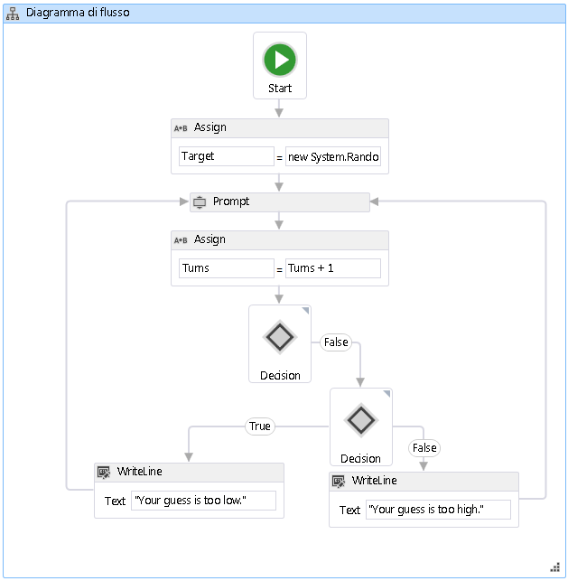

# Procedura: creare un flusso di lavoro del diagramma di flusso
I flussi di lavoro possono essere costruiti da attività incorporate e da attività personalizzate.In questo argomento viene illustrata in dettaglio la creazione di un flusso di lavoro in cui vengono utilizzate sia attività incorporate, ad esempio <xref:System.Activities.Statements.Flowchart>, sia attività personalizzate dell'argomento [Procedura: creare un'attività](../../../docs/framework/windows-workflow-foundation//how-to-create-an-activity.md) precedente.Il flusso di lavoro consente di modellare un gioco per determinare un numero.  
  
> [!NOTE]
>  Ogni argomento nell'Esercitazione introduttiva dipende dagli argomenti precedenti.Per completare questo argomento, è necessario completare prima [Procedura: creare un'attività](../../../docs/framework/windows-workflow-foundation//how-to-create-an-activity.md).  
  
> [!NOTE]
>  Per scaricare una versione completa dell'esercitazione, vedere [Windows Workflow Foundation \(WF45\) \- esercitazione introduttiva](http://go.microsoft.com/fwlink/?LinkID=248976).  
  
### Per creare il flusso di lavoro  
  
1.  Fare clic con il pulsante destro del mouse su **NumberGuessWorkflowActivities** in **Esplora soluzioni** e selezionare **Aggiungi**, **Nuovo elemento**.  
  
2.  Nel nodo **Installato**, **Elementi comuni**, selezionare **Flusso di lavoro**.Selezionare **Attività** dall'elenco **Flusso di lavoro**.  
  
3.  Digitare `FlowchartNumberGuessWorkflow` nella casella **Nome**, quindi fare clic su **Aggiungi**.  
  
4.  Trascinare un'attività **Flowchart** dalla sezione **Diagramma di flusso** della **Casella degli strumenti** e rilasciarla sull'etichetta **Rilasciare l'attività** nell'area di progettazione del flusso di lavoro.  
  
### Per creare variabili e argomenti del flusso di lavoro  
  
1.  Fare doppio clic su **FlowchartNumberGuessWorkflow.xaml** in **Esplora soluzioni** per visualizzare il flusso di lavoro nella finestra di progettazione nel caso non sia già visibile.  
  
2.  Fare clic su **Argomenti** nel lato inferiore sinistro della finestra di progettazione del flusso di lavoro per visualizzare il riquadro **Argomenti**.  
  
3.  Fare clic su **Crea argomento**.  
  
4.  Digitare `MaxNumber` nella casella **Nome**, selezionare **Interno** dall'elenco a discesa **Direzione**, selezionare **Int32** dall'elenco a discesa **Tipo di argomento**, quindi premere INVIO per salvare l'argomento.  
  
5.  Fare clic su **Crea argomento**.  
  
6.  Digitare `Turns` nella casella **Nome** che si trova sotto l'argomento `MaxNumber` appena aggiunto, selezionare **Esterno** dall'elenco a discesa **Direzione**, selezionare **Int32** dall'elenco a discesa **Tipo di argomento**, quindi premere INVIO.  
  
7.  Fare clic su **Argomenti** nel lato inferiore sinistro di ActivityDesigner per chiudere il riquadro **Argomenti**.  
  
8.  Fare clic su **Variabili** nel lato inferiore sinistro della finestra di progettazione del flusso di lavoro per visualizzare il riquadro **Variabili**.  
  
9. Fare clic su **Crea variabile**.  
  
    > [!TIP]
    >  Se non viene visualizzata la casella **Crea variabile**, fare clic sull'attività <xref:System.Activities.Statements.Flowchart> nella finestra di progettazione del flusso di lavoro per selezionarla.  
  
10. Digitare `Guess` nella casella **Nome**, selezionare **Int32** dall'elenco a discesa **Tipo di variabile**, quindi premere INVIO per salvare la variabile.  
  
11. Fare clic su **Crea variabile**.  
  
12. Digitare `Target` nella casella **Nome**, selezionare **Int32** dall'elenco a discesa **Tipo di variabile**, quindi premere INVIO per salvare la variabile.  
  
13. Fare clic su **Variabili** nel lato inferiore sinistro di ActivityDesigner per chiudere il riquadro **Variabili**.  
  
### Per aggiungere le attività del flusso di lavoro  
  
1.  Trascinare un'attività **Assign** dalla sezione **Primitive** della **Casella degli strumenti** e passarla sul nodo **Avvio**, che si trova nella parte superiore del diagramma di flusso.Quando l'attività **Assign** si trova sul nodo **Avvio** verranno visualizzati tre triangoli intorno al nodo **Avvio**.Rilasciare l'attività **Assign** sul triangolo che si trova direttamente sotto il nodo **Avvio**.In questo modo, i due elementi verranno collegati tra loro e l'attività **Assign** verrà designata come prima attività nel diagramma di flusso.  
  
    > [!NOTE]
    >  È possibile designare le attività come attività iniziali nel diagramma di flusso anche collegandole manualmente al nodo iniziale.A tale scopo, posizionare il mouse sul nodo **Avvio**, fare clic su uno dei rettangoli visualizzati quando il mouse si trova sul nodo **Avvio**, trascinare la linea di connessione sull'attività desiderata e rilasciarla su uno dei rettangoli visualizzati.È anche possibile definire un'attività come attività iniziale facendo clic con il pulsante destro del mouse su di essa e scegliendo **Imposta come StartNode**.  
  
2.  Digitare `Target` nella casella **A** e l'espressione seguente nella casella **Immettere un'espressione C\#** o **Immettere un'espressione VB**.  
  
    ```vb  
    New System.Random().Next(1, MaxNumber + 1)  
    ```  
  
    ```csharp  
    new System.Random().Next(1, MaxNumber + 1)  
    ```  
  
    > [!TIP]
    >  Se la finestra **Casella degli strumenti** non è visualizzata, scegliere **Casella degli strumenti** dal menu **Visualizza**.  
  
3.  Trascinare un'attività **Prompt** dalla sezione **NumberGuessWorkflowActivities** della **Casella degli strumenti**, rilasciarla sotto l'attività **Assign** del passaggio precedente e connettere l'attività **Prompt** all'attività **Assign**.Esistono tre modi per connettere le due attività.Il primo consiste nel connetterle quando si rilascia l'attività **Prompt** sul flusso di lavoro.Mentre si trascina l'attività **Prompt** verso il flusso di lavoro, posizionarla sopra l'attività **Assign** e rilasciarla su uno dei quattro triangoli che vengono visualizzati quando l'attività **Prompt** si trova sopra l'attività **Assign**.Il secondo modo consiste nel rilasciare l'attività **Prompt** sul flusso di lavoro in corrispondenza della posizione desiderata.Passare il mouse sull'attività **Assign** e trascinare uno dei rettangoli visualizzati fino all'attività **Prompt**.Trascinare il mouse in modo che la linea di connessione dall'attività **Assign** venga connessa a uno dei rettangoli dell'attività **Prompt** e rilasciare il pulsante del mouse.Il terzo modo è molto simile al primo eccetto per il fatto che invece di trascinare l'attività **Prompt** dalla **Casella degli strumenti**, la si trascina dalla propria posizione sull'area di progettazione del flusso di lavoro, la si posiziona sull'attività **Assign** e la si rilascia su uno dei triangoli visualizzati.  
  
4.  Nella **Finestra Proprietà** per l'attività **Prompt** digitare `"EnterGuess"`, incluse le virgolette, nella casella del valore della proprietà **BookmarkName**.Digitare `Guess` nella casella del valore della proprietà **Result** e digitare l'espressione seguente nella casella della proprietà **Text**.  
  
    ```vb  
    "Please enter a number between 1 and " & MaxNumber  
    ```  
  
    ```csharp  
    "Please enter a number between 1 and " + MaxNumber  
    ```  
  
    > [!TIP]
    >  Se la **Finestra proprietà** non è visualizzata, scegliere **Finestra Proprietà** dal menu **Visualizza**.  
  
5.  Trascinare un'attività **Assign** dalla sezione **Primitive** della **Casella degli strumenti** e connetterla utilizzando uno dei metodi descritti nel passaggio precedente in modo che si trovi sotto l'attività **Prompt**.  
  
6.  Digitare `Turns` nella casella **A** e `Turns + 1` nella casella **Immettere un'espressione C\#** o **Immettere un'espressione VB**.  
  
7.  Trascinare **FlowDecision** dalla sezione **Diagramma di flusso** della **Casella degli strumenti** e connetterla sotto l'attività **Assign**.Nella **Finestra proprietà** digitare l'espressione seguente nella casella del valore della proprietà **Condition**.  
  
    ```vb  
    Guess = Target  
    ```  
  
    ```csharp  
    Guess == Target  
    ```  
  
8.  Trascinare un'altra attività **FlowDecision** dalla **Casella degli strumenti** e rilasciarla sotto la prima.Connettere le due attività trascinando dal rettangolo con etichetta **False** nell'attività **FlowDecision** superiore al rettangolo all'inizio della seconda attività **FlowDecision**.  
  
    > [!TIP]
    >  Se non vengono visualizzate le etichette **True** e **False** su **FlowDecision**, passare il mouse su **FlowDecision**.  
  
9. Fare clic sulla seconda attività **FlowDecision** per selezionarla.Nella **Finestra proprietà** digitare l'espressione seguente nella casella del valore della proprietà **Condition**.  
  
    ```vb-c#  
    Guess < Target  
    ```  
  
10. Trascinare due attività **WriteLine** dalla sezione **Primitive** della **Casella degli strumenti** e rilasciarle in modo che siano affiancate sotto le due attività **FlowDecision**.Connettere l'azione **True** dell'attività **FlowDecision** inferiore all'attività **WriteLine** più a sinistra e l'azione **False** all'attività **WriteLine** più a destra.  
  
11. Fare clic sull'attività **WriteLine** più a sinistra per selezionarla e digitare l'espressione seguente nella casella del valore della proprietà **Text** nella **Finestra proprietà**.  
  
    ```vb-c#  
    "Your guess is too low."  
    ```  
  
12. Connettere **WriteLine** a sinistra dell'attività **Prompt** posizionata sopra.  
  
13. Fare clic sull'attività **WriteLine** più a destra per selezionarla e digitare l'espressione seguente nella casella del valore della proprietà **Text** nella **Finestra proprietà**.  
  
    ```vb-c#  
    "Your guess is too high."  
    ```  
  
14. Connettere l'attività **WriteLine** a destra dell'attività **Prompt** posizionata sopra.  
  
     Nell'esempio seguente viene illustrato il flusso di lavoro completato.  
  
       
  
### Per compilare il flusso di lavoro  
  
1.  Per compilare la soluzione, premere CTRL\+MAIUSC\+B.  
  
     Per istruzioni sull'esecuzione del flusso di lavoro, vedere l'argomento successivo [Procedura: eseguire un flusso di lavoro](../../../docs/framework/windows-workflow-foundation//how-to-run-a-workflow.md).Se è già stato completato il passaggio [Procedura: eseguire un flusso di lavoro](../../../docs/framework/windows-workflow-foundation//how-to-run-a-workflow.md) con uno stile di flusso di lavoro diverso e si desidera eseguirlo tramite il flusso di lavoro del diagramma di flusso da questo passaggio, andare alla sezione [Per compilare ed eseguire l'applicazione](../../../docs/framework/windows-workflow-foundation//how-to-run-a-workflow.md#BKMK_ToRunTheApplication) di [Procedura: eseguire un flusso di lavoro](../../../docs/framework/windows-workflow-foundation//how-to-run-a-workflow.md).  
  
## Vedere anche  
 <xref:System.Activities.Statements.Flowchart>   
 <xref:System.Activities.Statements.FlowDecision>   
 [Programmazione di Windows Workflow Foundation](../../../docs/framework/windows-workflow-foundation//programming.md)   
 [Progettazione di flussi di lavoro](../../../docs/framework/windows-workflow-foundation//designing-workflows.md)   
 [Esercitazione introduttiva](../../../docs/framework/windows-workflow-foundation//getting-started-tutorial.md)   
 [Procedura: creare un'attività](../../../docs/framework/windows-workflow-foundation//how-to-create-an-activity.md)   
 [Procedura: eseguire un flusso di lavoro](../../../docs/framework/windows-workflow-foundation//how-to-run-a-workflow.md)