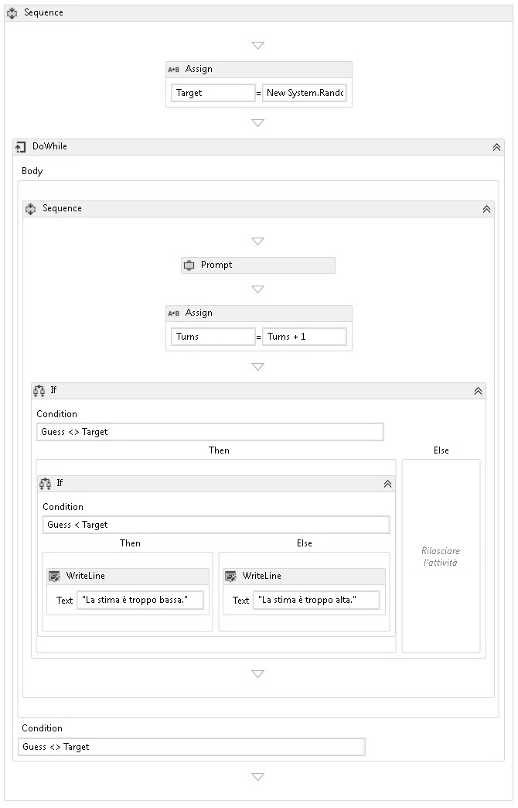

# Procedura: creare un flusso di lavoro sequenziale
I flussi di lavoro possono essere costruiti da attività incorporate e da attività personalizzate.In questo argomento viene illustrata in dettaglio la creazione di un flusso di lavoro in cui vengono utilizzate sia attività incorporate, ad esempio <xref:System.Activities.Statements.Sequence>, sia attività personalizzate dell'argomento [Procedura: creare un'attività](../../../docs/framework/windows-workflow-foundation//how-to-create-an-activity.md) precedente.Il flusso di lavoro consente di modellare un gioco per determinare un numero.  
  
> [!NOTE]
>  Ogni argomento nell'Esercitazione introduttiva dipende dagli argomenti precedenti.Per completare questo argomento, è necessario completare prima [Procedura: creare un'attività](../../../docs/framework/windows-workflow-foundation//how-to-create-an-activity.md).  
  
> [!NOTE]
>  Per scaricare una versione completa dell'esercitazione, vedere [Windows Workflow Foundation \(WF45\) \- esercitazione introduttiva](http://go.microsoft.com/fwlink/?LinkID=248976).  
  
### Per creare il flusso di lavoro  
  
1.  Fare clic con il pulsante destro del mouse su **NumberGuessWorkflowActivities** in **Esplora soluzioni** e selezionare **Aggiungi**, **Nuovo elemento**.  
  
2.  Nel nodo **Installato**, **Elementi comuni**, selezionare **Flusso di lavoro**.Selezionare **Attività** dall'elenco **Flusso di lavoro**.  
  
3.  Digitare `SequentialNumberGuessWorkflow` nella casella **Nome**, quindi fare clic su **Aggiungi**.  
  
4.  Trascinare un'attività **Sequence** dalla sezione **Flusso di controllo** della **Casella degli strumenti** e rilasciarla sull'etichetta **Rilasciare l'attività** nell'area di progettazione del flusso di lavoro.  
  
### Per creare variabili e argomenti del flusso di lavoro  
  
1.  Fare doppio clic su **SequentialNumberGuessWorkflow.xaml** in **Esplora soluzioni** per visualizzare il flusso di lavoro nella finestra di progettazione nel caso non sia già visibile.  
  
2.  Fare clic su **Argomenti** nel lato inferiore sinistro della finestra di progettazione del flusso di lavoro per visualizzare il riquadro **Argomenti**.  
  
3.  Fare clic su **Crea argomento**.  
  
4.  Digitare `MaxNumber` nella casella **Nome**, selezionare **Interno** dall'elenco a discesa **Direzione**, selezionare **Int32** dall'elenco a discesa **Tipo di argomento**, quindi premere INVIO per salvare l'argomento.  
  
5.  Fare clic su **Crea argomento**.  
  
6.  Digitare `Turns` nella casella **Nome** che si trova sotto l'argomento `MaxNumber` appena aggiunto, selezionare **Esterno** dall'elenco a discesa **Direzione**, selezionare **Int32** dall'elenco a discesa **Tipo di argomento**, quindi premere INVIO.  
  
7.  Fare clic su **Argomenti** nel lato inferiore sinistro di ActivityDesigner per chiudere il riquadro **Argomenti**.  
  
8.  Fare clic su **Variabili** nel lato inferiore sinistro della finestra di progettazione del flusso di lavoro per visualizzare il riquadro **Variabili**.  
  
9. Fare clic su **Crea variabile**.  
  
    > [!TIP]
    >  Se non viene visualizzata la casella **Crea variabile**, fare clic sull'attività **Sequence** nella finestra di progettazione del flusso di lavoro per selezionarla.  
  
10. Digitare `Guess` nella casella **Nome**, selezionare **Int32** dall'elenco a discesa **Tipo di variabile**, quindi premere INVIO per salvare la variabile.  
  
11. Fare clic su **Crea variabile**.  
  
12. Digitare `Target` nella casella **Nome**, selezionare **Int32** dall'elenco a discesa **Tipo di variabile**, quindi premere INVIO per salvare la variabile.  
  
13. Fare clic su **Variabili** nel lato inferiore sinistro di ActivityDesigner per chiudere il riquadro **Variabili**.  
  
### Per aggiungere le attività del flusso di lavoro  
  
1.  Trascinare un'attività **Assign** dalla sezione **Primitive** della **Casella degli strumenti** e rilasciarla sull'attività **Sequence**.Digitare `Target` nella casella **A** e l'espressione seguente nella casella **Immettere un'espressione C\#** o **Immettere un'espressione VB**.  
  
    ```vb  
    New System.Random().Next(1, MaxNumber + 1)  
    ```  
  
    ```csharp  
    new System.Random().Next(1, MaxNumber + 1)  
    ```  
  
    > [!TIP]
    >  Se la finestra **Casella degli strumenti** non è visualizzata, scegliere **Casella degli strumenti** dal menu **Visualizza**.  
  
2.  Trascinare un'attività **DoWhile** dalla sezione **Flusso di controllo** della **Casella degli strumenti** e rilasciarla sul flusso di lavoro in modo che si trovi sotto l'attività **Assign**.  
  
3.  Digitare l'espressione seguente nella casella del valore di proprietà **DoWhile** dell'attività **Condition**.  
  
    ```vb  
    Guess <> Target  
    ```  
  
    ```csharp  
    Guess != Target  
    ```  
  
     Un'attività <xref:System.Activities.Statements.DoWhile> esegue le proprie attività figlio e successivamente valuta <xref:System.Activities.Statements.DoWhile.Condition%2A>.Se <xref:System.Activities.Statements.DoWhile.Condition%2A> dà come risultato `True`, le attività in <xref:System.Activities.Statements.DoWhile> vengono eseguite nuovamente.In questo esempio, viene valutata l'ipotesi dell'utente e <xref:System.Activities.Statements.DoWhile> continua finché l'ipotesi non è corretta.  
  
4.  Trascinare un'attività **Prompt** dalla sezione **NumberGuessWorkflowActivities** della **Casella degli strumenti** e rilasciarla nell'attività **DoWhile** dal passaggio precedente.  
  
5.  Nella **Finestra Proprietà** digitare `"EnterGuess"`, incluse le virgolette, nella casella del valore della proprietà **BookmarkName** per l'attività **Prompt**.Digitare `Guess` nella casella del valore della proprietà **Result** e digitare l'espressione seguente nella casella della proprietà **Text**.  
  
    ```vb  
    "Please enter a number between 1 and " & MaxNumber  
    ```  
  
    ```csharp  
    "Please enter a number between 1 and " + MaxNumber  
    ```  
  
    > [!TIP]
    >  Se la **Finestra proprietà** non è visualizzata, scegliere **Finestra Proprietà** dal menu **Visualizza**.  
  
6.  Trascinare un'attività **Assign** dalla sezione **Primitive** della **Casella degli strumenti** e rilasciarla nell'attività **DoWhile** in modo che segua l'attività **Prompt**.  
  
    > [!NOTE]
    >  Quando si rilascia l'attività **Assign**, notare come la finestra di progettazione del flusso di lavoro aggiunge automaticamente un'attività **Sequence** per contenere sia l'attività **Prompt** che l'attività **Assign** appena aggiunta.  
  
7.  Digitare `Turns` nella casella **A** e `Turns + 1` nella casella **Immettere un'espressione C\#** o **Immettere un'espressione VB**.  
  
8.  Trascinare un'attività **If** dalla sezione **Flusso di controllo** della **Casella degli strumenti** e rilasciarla nell'attività **Sequence** in modo che segua l'attività **Assign** appena aggiunta.  
  
9. Digitare l'espressione seguente nella casella del valore di proprietà **Condition** dell'attività **If**.  
  
    ```vb  
    Guess <> Target  
    ```  
  
    ```csharp  
    Guess != Target  
    ```  
  
10. Trascinare un'altra attività **If** dalla sezione **Flusso di controllo** della **Casella degli strumenti** e rilasciarla nella sezione **Then** della prima attività **If**.  
  
11. Digitare l'espressione seguente nella casella del valore di proprietà **Condition** dell'attività **If** appena aggiunta.  
  
    ```vb-c#  
    Guess < Target  
    ```  
  
12. Trascinare due attività **WriteLine** dalla sezione **Primitive** della **Casella degli strumenti** e rilasciarle in modo che una si trovi nella sezione **Then** dell'attività **If** appena aggiunta e l'altra si trovi nella sezione **Else**.  
  
13. Fare clic sull'attività **WriteLine** nella sezione **Then** per selezionarla, quindi digitare la seguente espressione nella casella del valore della proprietà **Text**.  
  
    ```vb  
    "Your guess is too low."  
    ```  
  
14. Fare clic sull'attività **WriteLine** nella sezione **Else** per selezionarla, quindi digitare la seguente espressione nella casella del valore della proprietà **Text**.  
  
    ```vb  
    "Your guess is too high."  
    ```  
  
     Nell'esempio seguente viene illustrato il flusso di lavoro completato.  
  
       
  
### Per compilare il flusso di lavoro  
  
1.  Per compilare la soluzione, premere CTRL\+MAIUSC\+B.  
  
     Per istruzioni sull'esecuzione del flusso di lavoro, vedere l'argomento successivo [Procedura: eseguire un flusso di lavoro](../../../docs/framework/windows-workflow-foundation//how-to-run-a-workflow.md).Se è già stato completato il passaggio [Procedura: eseguire un flusso di lavoro](../../../docs/framework/windows-workflow-foundation//how-to-run-a-workflow.md) con uno stile di flusso di lavoro diverso e si desidera eseguirlo tramite il flusso di lavoro sequenziale da questo passaggio, andare alla sezione [Per compilare ed eseguire l'applicazione](../../../docs/framework/windows-workflow-foundation//how-to-run-a-workflow.md#BKMK_ToRunTheApplication) di [Procedura: eseguire un flusso di lavoro](../../../docs/framework/windows-workflow-foundation//how-to-run-a-workflow.md).  
  
## Vedere anche  
 <xref:System.Activities.Statements.Flowchart>   
 <xref:System.Activities.Statements.FlowDecision>   
 [Programmazione di Windows Workflow Foundation](../../../docs/framework/windows-workflow-foundation//programming.md)   
 [Progettazione di flussi di lavoro](../../../docs/framework/windows-workflow-foundation//designing-workflows.md)   
 [Esercitazione introduttiva](../../../docs/framework/windows-workflow-foundation//getting-started-tutorial.md)   
 [Procedura: creare un'attività](../../../docs/framework/windows-workflow-foundation//how-to-create-an-activity.md)   
 [Procedura: eseguire un flusso di lavoro](../../../docs/framework/windows-workflow-foundation//how-to-run-a-workflow.md)