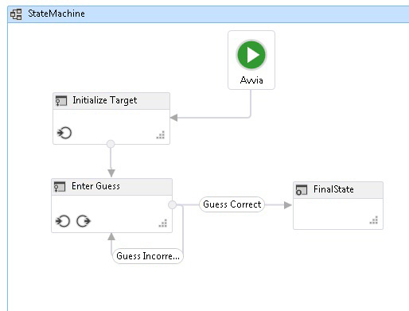

# Procedura: creare un flusso di lavoro della macchina a stati
I flussi di lavoro possono essere costruiti da attività incorporate e da attività personalizzate.In questo argomento viene illustrata in dettaglio la creazione di un flusso di lavoro in cui vengono utilizzate sia attività incorporate, ad esempio <xref:System.Activities.Statements.StateMachine>, sia attività personalizzate dell'argomento [Procedura: creare un'attività](../../../docs/framework/windows-workflow-foundation//how-to-create-an-activity.md) precedente.Il flusso di lavoro consente di modellare un gioco per determinare un numero.  
  
> [!NOTE]
>  Ogni argomento nell'Esercitazione introduttiva dipende dagli argomenti precedenti.Per completare questo argomento, è necessario completare prima [Procedura: creare un'attività](../../../docs/framework/windows-workflow-foundation//how-to-create-an-activity.md).  
  
> [!NOTE]
>  Per scaricare una versione completa dell'esercitazione, vedere [Windows Workflow Foundation \(WF45\) \- esercitazione introduttiva](http://go.microsoft.com/fwlink/?LinkID=248976).  
  
### Per creare il flusso di lavoro  
  
1.  Fare clic con il pulsante destro del mouse su **NumberGuessWorkflowActivities** in **Esplora soluzioni** e selezionare **Aggiungi**, **Nuovo elemento**.  
  
2.  Nel nodo **Installato**, **Elementi comuni**, selezionare **Flusso di lavoro**.Selezionare **Attività** dall'elenco **Flusso di lavoro**.  
  
3.  Digitare `StateMachineNumberGuessWorkflow` nella casella **Nome**, quindi fare clic su **Aggiungi**.  
  
4.  Trascinare un'attività **StateMachine** dalla sezione **Macchina a stati** della **Casella degli strumenti** e rilasciarla sull'etichetta **Rilasciare l'attività** nell'area di progettazione del flusso di lavoro.  
  
### Per creare variabili e argomenti del flusso di lavoro  
  
1.  Fare doppio clic su **StateMachineNumberGuessWorkflow.xaml** in **Esplora soluzioni** per visualizzare il flusso di lavoro nella finestra di progettazione nel caso non sia già visibile.  
  
2.  Fare clic su **Argomenti** nel lato inferiore sinistro della finestra di progettazione del flusso di lavoro per visualizzare il riquadro **Argomenti**.  
  
3.  Fare clic su **Crea argomento**.  
  
4.  Digitare `MaxNumber` nella casella **Nome**, selezionare **Interno** dall'elenco a discesa **Direzione**, selezionare **Int32** dall'elenco a discesa **Tipo di argomento**, quindi premere INVIO per salvare l'argomento.  
  
5.  Fare clic su **Crea argomento**.  
  
6.  Digitare `Turns` nella casella **Nome** che si trova sotto l'argomento `MaxNumber` appena aggiunto, selezionare **Esterno** dall'elenco a discesa **Direzione**, selezionare **Int32** dall'elenco a discesa **Tipo di argomento**, quindi premere INVIO.  
  
7.  Fare clic su **Argomenti** nel lato inferiore sinistro di ActivityDesigner per chiudere il riquadro **Argomenti**.  
  
8.  Fare clic su **Variabili** nel lato inferiore sinistro della finestra di progettazione del flusso di lavoro per visualizzare il riquadro **Variabili**.  
  
9. Fare clic su **Crea variabile**.  
  
    > [!TIP]
    >  Se non viene visualizzata la casella **Crea variabile**, fare clic sull'attività <xref:System.Activities.Statements.StateMachine> nella finestra di progettazione del flusso di lavoro per selezionarla.  
  
10. Digitare `Guess` nella casella **Nome**, selezionare **Int32** dall'elenco a discesa **Tipo di variabile**, quindi premere INVIO per salvare la variabile.  
  
11. Fare clic su **Crea variabile**.  
  
12. Digitare `Target` nella casella **Nome**, selezionare **Int32** dall'elenco a discesa **Tipo di variabile**, quindi premere INVIO per salvare la variabile.  
  
13. Fare clic su **Variabili** nel lato inferiore sinistro di ActivityDesigner per chiudere il riquadro **Variabili**.  
  
### Per aggiungere le attività del flusso di lavoro  
  
1.  Fare clic su **State1** per selezionare questa opzione.Nella **Finestra Proprietà**, modificare **DisplayName** in `Initialize Target`.  
  
    > [!TIP]
    >  Se la **Finestra proprietà** non è visualizzata, scegliere **Finestra Proprietà** dal menu **Visualizza**.  
  
2.  Fare doppio clic sullo stato **Initialize Target** appena rinominato nella finestra di progettazione del flusso di lavoro per espanderlo.  
  
3.  Trascinare un'attività **Assign** dalla sezione **Primitive** della **Casella degli strumenti** e rilasciarla nella sezione **Entry** dello stato.Digitare `Target` nella casella **A** e l'espressione seguente nella casella **Immettere un'espressione C\#** o **Immettere un'espressione VB**.  
  
    ```vb  
    New System.Random().Next(1, MaxNumber + 1)  
    ```  
  
    ```csharp  
    new System.Random().Next(1, MaxNumber + 1)  
    ```  
  
    > [!TIP]
    >  Se la finestra **Casella degli strumenti** non è visualizzata, scegliere **Casella degli strumenti** dal menu **Visualizza**.  
  
4.  Tornare alla visualizzazione generale della macchina a stati nella finestra di progettazione del flusso di lavoro facendo clic su **StateMachine** nella visualizzazione della barra di navigazione nella parte superiore della finestra di progettazione del flusso di lavoro.  
  
5.  Trascinare un'attività **State** dalla sezione **Macchina a stati** della **Casella degli strumenti** nella finestra di progettazione del flusso di lavoro e spostarla sullo stato **Initialize Target**.Si noti che nel momento in cui il nuovo stato viene passato sopra lo stato **Initialize Target**, vengono visualizzati quattro triangoli intorno a quest'ultimo stato.Rilasciare il nuovo stato sul triangolo che si trova immediatamente sotto lo stato **Initialize Target**.Ciò consente di posizionare il nuovo stato sul flusso di lavoro e crea una transizione dallo stato **Initialize Target** al nuovo stato.  
  
6.  Fare clic su **State1** per selezionarlo, modificare **DisplayName** in `Enter Guess`, quindi fare doppio clic sullo stato nella finestra di progettazione del flusso di lavoro per espanderlo.  
  
7.  Trascinare un'attività **WriteLine** dalla sezione **Primitive** della **Casella degli strumenti** e rilasciarla nella sezione **Entry** dello stato.  
  
8.  Digitare la seguente espressione nella casella della proprietà **Text** dell'attività **WriteLine**.  
  
    ```vb  
    "Please enter a number between 1 and " & MaxNumber  
    ```  
  
    ```csharp  
    "Please enter a number between 1 and " + MaxNumber  
    ```  
  
9. Trascinare un'attività **Assign** dalla sezione **Primitive** della **Casella degli strumenti** e rilasciarla nella sezione **Exit** dello stato.  
  
10. Digitare `Turns` nella casella **A** e `Turns + 1` nella casella **Immettere un'espressione C\#** o **Immettere un'espressione VB**.  
  
11. Tornare alla visualizzazione generale della macchina a stati nella finestra di progettazione del flusso di lavoro facendo clic su **StateMachine** nella visualizzazione della barra di navigazione nella parte superiore della finestra di progettazione del flusso di lavoro.  
  
12. Trascinare un'attività **FinalState** dalla sezione **Macchina a stati** della **Casella degli strumenti**, passarla sopra lo stato **Enter Guess** e rilasciarla sul triangolo che viene visualizzato a destra dello stato **Enter Guess** in modo da creare una transizione tra **Enter Guess** e **FinalState**.  
  
13. Il nome predefinito della transizione è **T2**.Fare clic sulla transizione nella finestra di progettazione del flusso di lavoro per selezionarla e impostarne il **DisplayName** su **Guess Correct**.Selezionare **FinalState** e trascinarlo verso destra in modo da creare lo spazio per il nome completo della transizione da visualizzare senza sovrapporre uno dei due stati.Ciò faciliterà il completamento dei passaggi rimanenti nell'esercitazione.  
  
14. Fare doppio clic sulla transizione **Guess Correct** appena rinominata nella finestra di progettazione del flusso di lavoro per espanderlo.  
  
15. Trascinare un'attività **ReadInt** dalla sezione **NumberGuessWorkflowActivities** della **Casella degli strumenti** e rilasciarla nella sezione **Trigger** della transizione.  
  
16. Nella **Finestra Proprietà** dell'attività **ReadInt** digitare `"EnterGuess"`, incluse le virgolette, nella casella del valore della proprietà **BookmarkName** e digitare `Guess` nella casella del valore della proprietà **Result**.  
  
17. Digitare la seguente espressione nella casella del valore della proprietà **Condition** della transizione **Guess Correct**.  
  
    ```vb  
    Guess = Target  
    ```  
  
    ```csharp  
    Guess == Target  
    ```  
  
18. Tornare alla visualizzazione generale della macchina a stati nella finestra di progettazione del flusso di lavoro facendo clic su **StateMachine** nella visualizzazione della barra di navigazione nella parte superiore della finestra di progettazione del flusso di lavoro.  
  
    > [!NOTE]
    >  La transizione si verifica quando viene ricevuto un evento trigger e <xref:System.Activities.Statements.Transition.Condition%2A>, se presente, restituisce `True`.Per quanto riguarda questa transizione, se `Guess` dell'utente corrisponde a `Target` generato casualmente, il controllo passa a **FinalState** e il flusso di lavoro viene completato.  
  
19. A seconda della correttezza dell'ipotesi, è possibile che per il flusso di lavoro venga eseguita la transizione a **FinalState** o venga ripristinato lo stato **Enter Guess** per un altro tentativo.Entrambe le transizioni condividono lo stesso trigger di attesa che l'ipotesi dell'utente sia ricevuta tramite l'attività **ReadInt**.Questa transizione è denominata transizione condivisa.Per creare una transizione condivisa, fare clic sul cerchio che indica l'inizio della transizione **Guess Correct** e trascinarlo nello stato desiderato.In questo caso la transizione è una transizione autodirezionale, quindi trascinare il punto iniziale della transizione **Guess Correct** e rilasciarlo sulla parte inferiore dello stato **Enter Guess**.Dopo aver creato la transizione, selezionarla nella finestra di progettazione del flusso di lavoro e impostarne la proprietà **DisplayName** su **Guess Incorrect**.  
  
    > [!NOTE]
    >  Le transizioni condivise possono essere inoltre create dalla finestra di progettazione della transizione facendo clic su **Aggiungi transizione del trigger condivisa** nella parte inferiore della finestra di progettazione della transizione e selezionando lo stato di destinazione desiderato dall'elenco a discesa **Stati disponibili per la connessione**.  
  
    > [!NOTE]
    >  Si noti che se <xref:System.Activities.Statements.Transition.Condition%2A> di una transizione restituisce `false` \(o tutti gli stati di una transizione trigger condivisa restituiscono `false`\), la transizione non si verificherà e tutti i trigger per tutte le transizioni dallo stato verranno rinviati.In questa esercitazione, questa situazione non può verificarsi a causa della modalità con cui le condizioni vengono configurate \(esistono azioni specifiche per verificare se il valore indicato è corretto o errato\).  
  
20. Fare doppio clic sulla transizione **Guess Incorrect** nella finestra di progettazione del flusso di lavoro per espanderla.Si noti che **Trigger** è già impostato sulla stessa attività **ReadInt** utilizzata dalla transizione **Guess Correct**.  
  
21. Digitare l'espressione seguente nella casella del valore di proprietà **Condition**.  
  
    ```vb  
    Guess <> Target  
    ```  
  
    ```csharp  
    Guess != Target  
    ```  
  
22. Trascinare un'attività **If** dalla sezione **Control Flow** della **Casella degli strumenti** e rilasciarla nella sezione **Action** della transizione.  
  
23. Digitare l'espressione seguente nella casella del valore di proprietà **Condition** dell'attività **If**.  
  
    ```vb-c#  
    Guess < Target  
    ```  
  
24. Trascinare due attività **WriteLine** dalla sezione **Primitive** della **Casella degli strumenti** e rilasciarle in modo che una si trovi nella sezione **Then** dell'attività **If** e l'altra si trovi nella sezione **Else**.  
  
25. Fare clic sull'attività **WriteLine** nella sezione **Then** per selezionarla, quindi digitare la seguente espressione nella casella del valore della proprietà **Text**.  
  
    ```vb-c#  
    "Your guess is too low."  
    ```  
  
26. Fare clic sull'attività **WriteLine** nella sezione **Else** per selezionarla, quindi digitare la seguente espressione nella casella del valore della proprietà **Text**.  
  
    ```vb-c#  
    "Your guess is too high."  
    ```  
  
27. Tornare alla visualizzazione generale della macchina a stati nella finestra di progettazione del flusso di lavoro facendo clic su **StateMachine** nella visualizzazione della barra di navigazione nella parte superiore della finestra di progettazione del flusso di lavoro.  
  
     Nell'esempio seguente viene illustrato il flusso di lavoro completato.  
  
       
  
### Per compilare il flusso di lavoro  
  
1.  Per compilare la soluzione, premere CTRL\+MAIUSC\+B.  
  
     Per istruzioni sull'esecuzione del flusso di lavoro, vedere l'argomento successivo [Procedura: eseguire un flusso di lavoro](../../../docs/framework/windows-workflow-foundation//how-to-run-a-workflow.md).Se è già stato completato il passaggio [Procedura: eseguire un flusso di lavoro](../../../docs/framework/windows-workflow-foundation//how-to-run-a-workflow.md) con uno stile di flusso di lavoro diverso e si desidera eseguirlo tramite il flusso di lavoro della macchina a stati da questo passaggio, andare alla sezione [Per compilare ed eseguire l'applicazione](../../../docs/framework/windows-workflow-foundation//how-to-run-a-workflow.md#BKMK_ToRunTheApplication) di [Procedura: eseguire un flusso di lavoro](../../../docs/framework/windows-workflow-foundation//how-to-run-a-workflow.md).  
  
## Vedere anche  
 <xref:System.Activities.Statements.Flowchart>   
 <xref:System.Activities.Statements.FlowDecision>   
 [Programmazione di Windows Workflow Foundation](../../../docs/framework/windows-workflow-foundation//programming.md)   
 [Progettazione di flussi di lavoro](../../../docs/framework/windows-workflow-foundation//designing-workflows.md)   
 [Esercitazione introduttiva](../../../docs/framework/windows-workflow-foundation//getting-started-tutorial.md)   
 [Procedura: creare un'attività](../../../docs/framework/windows-workflow-foundation//how-to-create-an-activity.md)   
 [Procedura: eseguire un flusso di lavoro](../../../docs/framework/windows-workflow-foundation//how-to-run-a-workflow.md)