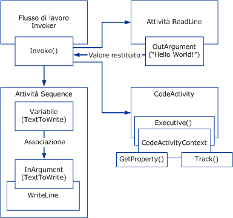

# Panoramica sul flusso di lavoro di Windows
Un flusso di lavoro è un set di unità elementari chiamate *attività* che sono archiviate come un modello che descrive un processo reale.I flussi di lavoro forniscono un metodo per descrivere l'ordine di esecuzione e le relazioni dipendenti tra porzioni di lavoro di breve o lunga durata.Questo lavoro passa attraverso il modello dall'inizio alla fine e le attività possono essere eseguite da persone o da funzioni del sistema.  
  
## Motore di runtime del flusso di lavoro  
 Ogni istanza del flusso di lavoro in esecuzione viene creata e gestita da un motore di runtime in\-process con il quale il processo host interagisce tramite uno degli elementi seguenti:  
  
-   Un oggetto <xref:System.Activities.WorkflowInvoker>, che richiama il flusso di lavoro come metodo.  
  
-   Un oggetto <xref:System.Activities.WorkflowApplication> per il controllo esplicito sull'esecuzione di una singola istanza del flusso di lavoro.  
  
-   Un oggetto <xref:System.ServiceModel.WorkflowServiceHost> per le interazioni basate su messaggi in scenari con più istanze.  
  
 Ognuna di queste classi esegue il wrapping del runtime di attività principale rappresentato come oggetto <xref:System.Activities.ActivityInstance> responsabile dell'esecuzione di attività.In un dominio dell'applicazione possono essere in esecuzione contemporaneamente diversi oggetti <xref:System.Activities.ActivityInstance>.  
  
 Ognuno dei tre precedenti oggetti di interazione host viene creato da una struttura ad albero delle attività definita programma di flusso di lavoro.Utilizzando questi tipi o un host personalizzato che esegue il wrapping dell'oggetto <xref:System.Activities.ActivityInstance>, i flussi di lavoro possono essere eseguiti all'interno di un qualsiasi processo di Windows, incluse applicazioni console, applicazioni basate su form, servizi per Windows, siti Web [!INCLUDE[vstecasp](../../../includes/vstecasp-md.md)] e servizi per [!INCLUDE[indigo1](../../../includes/indigo1-md.md)].  
  
   
Componenti del flusso di lavoro nel processo host  
  
## Interazione tra componenti del flusso di lavoro  
 Nel diagramma seguente viene illustrata la modalità di interazione tra i componenti del flusso di lavoro.  
  
   
  
 Nel diagramma precedente, il metodo <xref:System.Activities.WorkflowInvoker.Invoke%2A> della classe <xref:System.Activities.WorkflowInvoker> viene utilizzato per richiamare più istanze del flusso di lavoro.<xref:System.Activities.WorkflowInvoker> viene utilizzata per flussi di lavoro semplici che non richiedono la gestione da parte dell'host. Tali flussi di lavoro \(ad esempio la ripresa di <xref:System.Activities.Bookmark>\) devono essere eseguiti utilizzando invece il metodo <xref:System.Activities.WorkflowApplication.Run%2A>.Non è necessario attendere il completamento di un'istanza del flusso di lavoro prima di richiamare un altro; il motore di runtime supporta l'esecuzione simultanea di più istanze del flusso di lavoro.Di seguito sono riportati i flussi di lavoro richiamati:  
  
-   Attività <xref:System.Activities.Statements.Sequence> contenente un'attività <xref:System.Activities.Statements.WriteLine> figlio.L'oggetto <xref:System.Activities.Variable> dell'attività padre viene associato a un oggetto <xref:System.Activities.InArgument> dell'attività figlio.[!INCLUDE[crabout](../../../includes/crabout-md.md)] variabili, argomenti e associazione vedere [Variabili e argomenti](../../../docs/framework/windows-workflow-foundation//variables-and-arguments.md).  
  
-   Attività personalizzata denominata `ReadLine`.Un oggetto <xref:System.Activities.OutArgument> dell'attività `ReadLine` viene restituito al metodo <xref:System.Activities.WorkflowInvoker.Invoke%2A> chiamante.  
  
-   Attività personalizzata che deriva dalla classe astratta <xref:System.Activities.CodeActivity>.L'oggetto <xref:System.Activities.CodeActivity> può accedere a funzionalità in fase di esecuzione \(ad esempio rilevamento e proprietà\) tramite l'oggetto <xref:System.Activities.CodeActivityContext> disponibile come parametro del metodo <xref:System.Activities.CodeActivity.Execute%2A>.[!INCLUDE[crabout](../../../includes/crabout-md.md)] queste funzionalità del runtime, vedere [Rilevamento e traccia del flusso di lavoro](../../../docs/framework/windows-workflow-foundation//workflow-tracking-and-tracing.md) e [Proprietà di esecuzione del flusso di lavoro](../../../docs/framework/windows-workflow-foundation//workflow-execution-properties.md).  
  
## Vedere anche  
 [BizTalk Server 2006 or WF? Choosing the Right Workflow Tool for Your Project](http://go.microsoft.com/fwlink/?LinkId=154901)