# Prestazioni di Windows Workflow Foundation 4
Dustin Metzgar  
  
 Wenlong Dong  
  
 Microsoft Corporation, settembre 2010  
  
 Microsoft [!INCLUDE[netfx40_long](../../../includes/netfx40-long-md.md)] include una revisione sostanziale di [!INCLUDE[wf](../../../includes/wf-md.md)] con notevoli investimenti per migliorarne le prestazioni.Questa nuova revisione introduce modifiche significative in termini di progettazione rispetto alle versioni precedenti di [!INCLUDE[wf1](../../../includes/wf1-md.md)], fornite insieme a .NET Framework 3.0 e [!INCLUDE[netfx35_short](../../../includes/netfx35-short-md.md)].L'architettura del modello di programmazione, del runtime e degli strumenti è stata completamente riprogettata al fine di migliorare notevolmente prestazioni e usabilità.In questo argomento vengono illustrate le principali caratteristiche delle prestazioni di tali revisioni confrontandole con quelle della versione precedente.  
  
 Le prestazioni dei singoli componenti del flusso di lavoro sono notevolmente aumentate in WF4 rispetto a WF3.Pertanto il divario tra i servizi di [!INCLUDE[indigo1](../../../includes/indigo1-md.md)] codificati manualmente e i servizi del flusso di lavoro di [!INCLUDE[indigo2](../../../includes/indigo2-md.md)] è minimo.La latenza del flusso di lavoro è stata notevolmente ridotta in WF4.Le prestazioni della persistenza sono aumentate di un fattore di 2,5 \- 3,0.Il sovraccarico del monitoraggio dell'integrità tramite il rilevamento del flusso di lavoro è stato notevolmente ridotto.Questi sono i principali motivi per cui è consigliabile eseguire la migrazione a WF4 o adottarlo nelle applicazioni.  
  
## Terminologia  
 La versione di [!INCLUDE[wf1](../../../includes/wf1-md.md)] introdotta in [!INCLUDE[netfx40_short](../../../includes/netfx40-short-md.md)] verrà denominata WF4 nella parte restante di questo argomento.[!INCLUDE[wf1](../../../includes/wf1-md.md)] era stato introdotto in .NET 3.0 ed era stato oggetto di alcune revisioni secondarie fino alla versione [!INCLUDE[netfx35_short](../../../includes/netfx35-short-md.md)] SP1.La versione [!INCLUDE[netfx35_short](../../../includes/netfx35-short-md.md)] di Workflow Foundation verrà denominata WF3 nella parte restante di questo argomento.WF3 viene fornito con [!INCLUDE[netfx40_short](../../../includes/netfx40-short-md.md)] insieme a WF4.[!INCLUDE[crabout](../../../includes/crabout-md.md)]lla migrazione degli elementi WF3 in WF4, vedere [Guida alla migrazione di Windows Workflow Foundation 4](http://go.microsoft.com/fwlink/?LinkID=153313)  
  
 [!INCLUDE[indigo1](../../../includes/indigo1-md.md)] è il modello di programmazione unificato di Microsoft per la compilazione di applicazioni orientate ai servizi.Inizialmente era stato introdotto in .NET 3.0 insieme a WF3 e ora è uno dei componenti principali di [!INCLUDE[dnprdnshort](../../../includes/dnprdnshort-md.md)].  
  
 Windows Server AppFabric è un set di tecnologie integrate che facilitano la compilazione, il dimensionamento e la gestione di applicazioni Web e composite destinate all'esecuzione su IIS \(Internet Information Services\).Fornisce gli strumenti per monitorare e gestire servizi e flussi di lavoro.[!INCLUDE[crdefault](../../../includes/crdefault-md.md)][Windows Server AppFabric](http://msdn.microsoft.com/windowsserver/ee695849.aspx)  
  
## Obiettivi  
 L'obiettivo di questo argomento è mostrare le caratteristiche delle prestazioni di WF4 con dati misurati per scenari diversi.L'argomento fornisce inoltre confronti dettagliati tra WF4 e WF3 e pertanto evidenzia i notevoli miglioramenti di questa nuova revisione.Gli scenari e i dati presentati in questo articolo quantificano il costo sottostante dei diversi aspetti di WF4 e WF3.Questi dati sono utili per capire le caratteristiche delle prestazioni di WF4 e per pianificare le migrazioni da WF3 a WF4 o per utilizzare WF4 nello sviluppo di applicazioni.È bene, tuttavia, non trarre conclusioni affrettate dai dati presentati in questo articolo.Le prestazioni di un'applicazione composita per la gestione di flussi di lavoro dipendono notevolmente dalla modalità di implementazione del flusso di lavoro e dall'integrazione dei vari componenti.Per determinare le caratteristiche delle prestazioni, è necessario misurare ogni singola applicazione.  
  
## Panoramica dei miglioramenti delle prestazioni di WF4  
 WF4 è stato progettato con estrema cura e implementato in modo da garantire prestazioni elevate e scalabilità, come descritto nelle sezioni seguenti.  
  
### Runtime di WF  
 L'elemento di base del runtime di [!INCLUDE[wf1](../../../includes/wf1-md.md)] è un'utilità di pianificazione asincrona che controlla l'esecuzione delle attività in un flusso di lavoro.Fornisce un ambiente di esecuzione prevedibile e con prestazioni elevate per le attività.L'ambiente dispone di un contratto ben definito per l'esecuzione, la continuazione, il completamento, l'annullamento, le eccezioni e un modello di threading prevedibile.  
  
 Rispetto a WF3, il runtime di WF4 dispone di un'utilità di pianificazione più efficiente.Sfrutta lo stesso pool di thread di I\/O utilizzato per [!INCLUDE[indigo2](../../../includes/indigo2-md.md)], che è molto efficiente nell'esecuzione di elementi di lavoro in batch.La coda interna dell'utilità di pianificazione degli elementi di lavoro è ottimizzata per la maggior parte dei modelli di utilizzo più comuni.Il runtime di WF4 gestisce anche gli stati di esecuzione in modo molto semplice con sincronizzazione minima e logica della gestione degli eventi, mentre WF3 dipende da operazioni di registrazione e chiamata complesse per eseguire la sincronizzazione delle transizioni degli stati.  
  
### Archiviazione e flusso dei dati  
 In WF3 i dati associati a un'attività vengono modellati tramite le proprietà di dipendenza implementate dal tipo <xref:System.Windows.DependencyProperty>.Il modello della proprietà di dipendenza è stato introdotto in [!INCLUDE[avalon1](../../../includes/avalon1-md.md)].In generale, questo modello è molto flessibile per supportare associazioni di dati di facile utilizzo e altre funzionalità dell'interfaccia utente.Le proprietà devono, tuttavia, essere definite come campi statici nella definizione di flusso di lavoro.Ogni volta che il runtime di [!INCLUDE[wf1](../../../includes/wf1-md.md)] imposta o ottiene i valori delle proprietà, comporta l'utilizzo di una logica di ricerca molto complessa.  
  
 WF4 utilizza una logica di ambito dei dati ben definita per migliorare notevolmente la gestione dei dati in un flusso di lavoro.Per separare i dati archiviati in un'attività dai dati che superano i limiti dell'attività, utilizza due concetti diversi: variabili e argomenti.Grazie all'utilizzo di un ambito gerarchico ben definito per le variabili e gli argomenti "In\/Out\/InOut", viene ridotta notevolmente la complessità di utilizzo dei dati per le attività e viene anche definito automaticamente l'ambito della durata dei dati.Le attività dispongono di una firma ben definita descritta dagli argomenti.Controllando semplicemente un'attività, è possibile determinare quali dati prevede di ricevere e quali dati verranno da essa prodotti come risultato dell'esecuzione.  
  
 In WF3 le attività venivano inizializzate al momento della creazione di un flusso di lavoro.In WF 4 le attività vengono inizializzate solo nel momento in cui vengono eseguite le attività corrispondenti.Dato che non è necessario eseguire le operazioni Initialize\/Uninitialize quando viene creata una nuova istanza del flusso di lavoro, il ciclo di vita delle attività risulta più semplice e più efficiente.  
  
### Flusso di controllo  
 In modo analogo a quanto avviene con qualsiasi linguaggio di programmazione, [!INCLUDE[wf1](../../../includes/wf1-md.md)] fornisce il supporto per i flussi di controllo per le definizioni dei flussi di lavoro introducendo un set di attività del flusso di controllo per l'ordinamento in sequenza, l'esecuzione in ciclo, il branching e altri modelli.In WF3, quando è necessario eseguire di nuovo la stessa attività, viene creato un nuovo oggetto <xref:System.Workflow.ComponentModel.ActivityExecutionContext> e l'attività viene duplicata utilizzando una logica di serializzazione e deserializzazione complessa basata su <xref:System.Runtime.Serialization.Formatters.Binary.BinaryFormatter>.Generalmente i flussi di controllo iterativi hanno prestazioni più rallentate rispetto all'esecuzione di una sequenza di attività.  
  
 WF4 li gestisce in modo molto diverso.Prende il modello di attività, crea un nuovo oggetto ActivityInstance e lo aggiunge alla coda dell'utilità di pianificazione.L'intero processo comporta solo la creazione di un oggetto esplicito ed è molto semplice.  
  
### Programmazione asincrona  
 In genere le applicazioni offrono prestazioni migliori e una maggiore scalabilità con la programmazione asincrona per le operazioni di blocco a esecuzione prolungata, quali ad esempio le operazioni di calcolo distribuite o I\/O.WF4 fornisce il supporto asincrono tramite tipi di attività di base <xref:System.Activities.AsyncCodeActivity>, <xref:System.Activities.AsyncCodeActivity%601>.Il runtime supporta in modo nativo le attività asincrone e pertanto può inserire automaticamente l'istanza in un'area di non persistenza mentre è in sospeso il lavoro asincrono.Le attività personalizzate possono derivare da questi tipi per eseguire un lavoro asincrono senza contenere il thread dell'utilità di pianificazione del flusso di lavoro e senza bloccare alcuna delle attività che possono essere eseguite in parallelo.  
  
### Messaggistica  
 Inizialmente WF3 disponeva di un supporto molto limitato della messaggistica tramite eventi esterni o chiamate di servizi Web.In .NET 3.5, era possibile implementare i flussi di lavoro come client [!INCLUDE[indigo2](../../../includes/indigo2-md.md)] o esporli come servizi [!INCLUDE[indigo2](../../../includes/indigo2-md.md)] tramite <xref:System.Workflow.Activities.SendActivity> e <xref:System.Workflow.Activities.ReceiveActivity>.In WF4, il concetto di programmazione della messaggistica basata sul flusso di lavoro è stato ulteriormente rafforzato integrando perfettamente in WF la logica di messaggistica di [!INCLUDE[indigo2](../../../includes/indigo2-md.md)].  
  
 La pipeline di elaborazione dei messaggi unificata disponibile in [!INCLUDE[indigo2](../../../includes/indigo2-md.md)] di .NET 4 consente ai servizi WF4 di offrire prestazioni nettamente migliori e una maggiore scalabilità rispetto a WF3.WF4 fornisce anche un supporto più completo alla programmazione della messaggistica, in grado di definire modelli di scambio dei messaggi \(MEP, Message Exchange Pattern\) più complessi.Gli sviluppatori possono utilizzare contratti di servizio tipizzati per semplificare la programmazione oppure contratti di servizio non tipizzati per ottenere prestazioni migliori senza sostenere i costi della serializzazione.In WF4 il supporto alla memorizzazione canali nella cache lato client tramite la classe <xref:System.ServiceModel.Activities.SendMessageChannelCache> consente agli sviluppatori di compilare applicazioni veloci con il minimo sforzo.[!INCLUDE[crdefault](../../../includes/crdefault-md.md)][Modifica dei livelli di condivisione della cache per le attività Send](../../../docs/framework/wcf/feature-details/changing-the-cache-sharing-levels-for-send-activities.md).  
  
### Programmazione dichiarativa  
 WF4 fornisce un framework di programmazione dichiarativa semplice e ben definito per modellare i processi e i servizi aziendali.Il modello di programmazione supporta la composizione completamente dichiarativa delle attività, senza code\-beside, semplificando notevolmente la creazione dei flussi di lavoro.In [!INCLUDE[netfx40_short](../../../includes/netfx40-short-md.md)], il framework di programmazione dichiarativa basato su XAML è stato unificato in un singolo assembly System.Xaml.dll per supportare sia WPF sia WF.  
  
 In WF4 il linguaggio XAML fornisce un'esperienza realmente dichiarativa e consente di definire completamente il flusso di lavoro nel markup XML, facendo riferimento alle attività e ai tipi compilati tramite .NET.Questa operazione risultava difficile in WF3 con il formato XOML senza utilizzare una logica code\-behind personalizzata.Il nuovo stack\-XAML in .NET 4 offre prestazioni migliori in termini di serializzazione\/deserializzazione degli elementi del flusso di lavoro e rende la programmazione dichiarativa più interessante e affidabile.  
  
### Progettazione flussi di lavoro  
 Il supporto alla programmazione completamente dichiarativa di WF4 impone in modo esplicito requisiti superiori per le prestazioni in fase di progettazione dei flussi di lavoro di grandi dimensioni.In WF4 la progettazione flussi di lavoro offre una maggiore scalabilità per i flussi di lavoro di grandi dimensioni rispetto a WF3.Grazie al supporto per la virtualizzazione dell'interfaccia utente, è in grado di caricare facilmente un flusso di 1000 attività in pochi secondi, mentre è quasi impossibile caricare un flusso di lavoro di poche centinaia di attività con la finestra di progettazione di WF3.  
  
## Confronto delle prestazioni a livello di componente  
 Questa sezione contiene i dati sui confronti diretti tra le singole attività nei flussi di lavoro di WF3 e WF4.Le aree principali quali la persistenza hanno un impatto maggiore sulle prestazioni rispetto ai componenti delle singole attività.Tuttavia, in WF4 i miglioramenti delle prestazioni nei singoli componenti sono significativi perché ora i componenti sono sufficientemente veloci per essere confrontati in base alla logica di orchestrazione codificata manualmente.Per un esempio, vedere la sezione "Scenario relativo alla composizione dei servizi".  
  
### Impostazione dell'ambiente  
 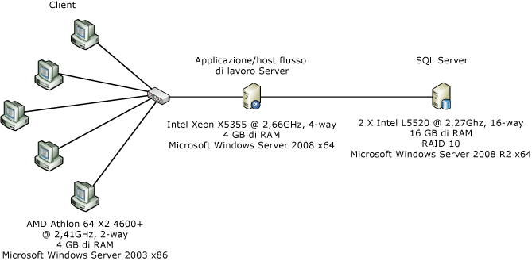  
  
 Nella figura sopra riportata è illustrata la configurazione del computer utilizzata per la misurazione della prestazione a livello di componente:un unico server e cinque client connessi tramite un'interfaccia di rete Ethernet da 1 Gbps.Per facilitare le misurazioni, il server è configurato per l'utilizzo di un singolo core di un server dual\-proc\/quad\-core in cui viene eseguito Windows Server 2008 x86.L'utilizzo della CPU del sistema viene mantenuto quasi al 100%.  
  
### Dettagli del test  
 In WF3 <xref:System.Workflow.Activities.CodeActivity> è probabilmente l'attività più semplice utilizzabile in un flusso di lavoro di WF3.L'attività chiama un metodo nel code\-behind in cui il programmatore del flusso di lavoro può inserire del codice personalizzato.In WF4 non esiste nulla di analogo all'attività <xref:System.Workflow.Activities.CodeActivity> di WF3 che fornisca la stessa funzionalità.Occorre tenere presente che in WF4 esiste una classe base <xref:System.Activities.CodeActivity> che non è correlata a <xref:System.Workflow.Activities.CodeActivity> in WF3.È consigliabile che gli autori dei flussi di lavoro creino attività personalizzate e compilino flussi di lavoro solo XAML.Nei test riportati di seguito, nei flussi di lavoro WF4 viene utilizzata un'attività denominata `Comment` al posto di una attività <xref:System.Workflow.Activities.CodeActivity> vuota.Il codice dell'attività `Comment` è il seguente:  
  
```  
[ContentProperty("Body")]  
    public sealed class Comment : CodeActivity  
    {  
        public Comment()  
            : base()  
        {  
        }  
  
        [DefaultValue(null)]  
        public Activity Body  
        {  
            get;  
            set;  
        }  
  
        protected override void Execute(CodeActivityContext context)  
        {  
        }  
    }  
  
```  
  
### Flusso di lavoro vuoto  
 In questo test viene utilizzato un flusso di lavoro in sequenza senza attività figlio.  
  
### Singola attività  
 Il flusso di lavoro è un flusso di lavoro in sequenza che contiene un'attività figlio.Si tratta di un'attività <xref:System.Workflow.Activities.CodeActivity> senza codice nel caso di WF3 e di un'attività `Comment` nel caso di WF4.  
  
### While con 1000 iterazioni  
 Il flusso di lavoro in sequenza contiene un'attività <xref:System.Activities.Statements.While> con un'attività figlio nel ciclo che non esegue alcun lavoro.  
  
### Confronto tra Replicator e ParallelForEach  
 In WF3 <xref:System.Workflow.Activities.ReplicatorActivity> offre modalità di esecuzione sequenziali e parallele.In modalità sequenziale, le prestazioni dell'attività sono simili a <xref:System.Workflow.Activities.WhileActivity>.<xref:System.Workflow.Activities.ReplicatorActivity> è più utile per l'esecuzione parallela.In WF4 l'attività analoga è <xref:System.Activities.Statements.ParallelForEach>.  
  
 Nel diagramma seguente vengono mostrati i flussi di lavoro utilizzati per questo test.Il flusso di lavoro di WF3 è a sinistra e il flusso di lavoro di WF4 è a destra.  
  
 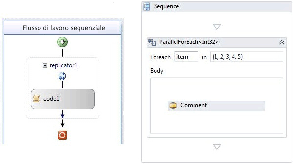  
  
### Flusso di lavoro sequenziale con cinque attività  
 Questo test intende mostrare l'effetto dell'esecuzione in sequenza di più attività.La sequenza è composta da 5 attività.  
  
### Ambito della transazione  
 Il test dell'ambito della transazione è leggermente diverso da altri test in quanto non viene creata una nuova istanza del flusso di lavoro per ogni iterazione.Al contrario, il flusso di lavoro viene strutturato con un ciclo while contenente un'attività <xref:System.Activities.Statements.TransactionScope> che contiene una sola attività che non funziona.Ogni esecuzione di un batch di 50 iterazioni tramite il ciclo while viene contata come un'unica operazione.  
  
### Compensazione  
 Il flusso di lavoro di WF3 dispone di una sola attività compensabile denominata `WorkScope`.L'attività implementa l'interfaccia <xref:System.Workflow.ComponentModel.ICompensatableActivity>:  
  
```  
class WorkScope :   
        CompositeActivity, ICompensatableActivity  
    {  
        public WorkScope() : base() { }  
  
        public WorkScope(string name)  
        {  
            this.Name = name;  
        }  
  
        public ActivityExecutionStatus Compensate(  
            ActivityExecutionContext executionContext)  
        {  
            return ActivityExecutionStatus.Closed;  
        }  
    }  
```  
  
 Il gestore fault è destinato all'attività `WorkScope`. Il flusso di lavoro di WF4 è altrettanto semplicistico.Un'attività <xref:System.Activities.Statements.CompensableActivity> dispone di un corpo e di un gestore di compensazione.Successivamente è presente nella sequenza una compensazione esplicita.L'attività Body e l'attività del gestore di compensazione sono entrambe implementazioni vuote:  
  
```  
public sealed class CompensableActivityEmptyCompensation : CodeActivity  
    {  
        public CompensableActivityEmptyCompensation()  
            : base() { }  
  
        public Activity Body { get; set; }  
  
        protected override void Execute(CodeActivityContext context) { }  
    }  
    public sealed class CompensableActivityEmptyBody : CodeActivity  
    {  
        public CompensableActivityEmptyBody()  
            : base() { }  
  
        public Activity Body { get; set; }  
  
        protected override void Execute(CodeActivityContext context) { }  
    }  
  
```  
  
 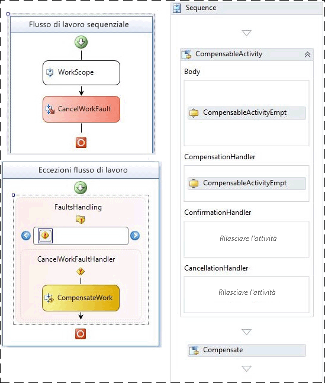  
  
 Figura 2. – Flussi di lavoro di compensazione base di WF3 \(a sinistra\) e WF4 \(a destra\)  
  
### Risultati del test delle prestazioni  
 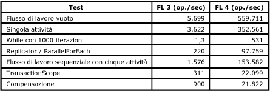  
  
 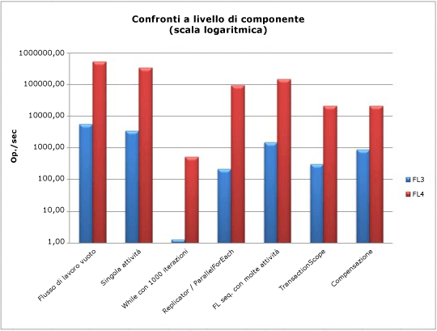  
  
 Tutti i test sono misurati in flussi di lavoro al secondo, fatta eccezione per il test dell'ambito della transazione.Come è possibile osservare nell'esempio sopra riportato, in generale le prestazioni del runtime di [!INCLUDE[wf1](../../../includes/wf1-md.md)] sono migliorate, specialmente nelle aree che richiedono più esecuzioni della stessa attività come il ciclo while.  
  
## Scenario relativo alla composizione dei servizi  
 Come illustrato nella sezione precedente, "Confronto delle prestazioni a livello di componente", tra WF3 e WF4 c'è stata una riduzione significativa nel sovraccarico.I servizi di flusso di lavoro di[!INCLUDE[indigo2](../../../includes/indigo2-md.md)] ora corrispondono all'incirca alle prestazioni dei servizi di [!INCLUDE[indigo2](../../../includes/indigo2-md.md)] codificati manualmente, tuttavia dispongono ancora di tutti i vantaggi del runtime di [!INCLUDE[wf1](../../../includes/wf1-md.md)].In questo scenario di test viene confrontato un servizio di [!INCLUDE[indigo2](../../../includes/indigo2-md.md)] con un servizio del flusso di lavoro di [!INCLUDE[indigo2](../../../includes/indigo2-md.md)] in WF4.  
  
### Servizio di negozio online  
 Uno dei punti di forza di [!INCLUDE[wf2](../../../includes/wf2-md.md)] è la possibilità di comporre i processi utilizzando più servizi.Per questo esempio, supponiamo che ci sia un servizio di negozio online che orchestra due chiamate del servizio per l'acquisto di un ordine.Il primo passaggio è convalidare l'ordine utilizzando un servizio di convalida dell'ordine.Il secondo passaggio è compilare l'ordine utilizzando un servizio magazzino.  
  
 I due servizi di back\-end, ovvero il servizio di convalida dell'ordine e il servizio magazzino, rimangono invariati per entrambi i test.La parte che cambia è il servizio di negozio online che esegue l'orchestrazione.In un caso, il servizio è codificato manualmente come servizio di [!INCLUDE[indigo2](../../../includes/indigo2-md.md)].Nell'altro, viene scritto come servizio del flusso di lavoro di [!INCLUDE[indigo2](../../../includes/indigo2-md.md)] in WF4.Durante l'esecuzione del test, le funzionalità specifiche di [!INCLUDE[wf1](../../../includes/wf1-md.md)], ad esempio il rilevamento e la persistenza, sono disattivate.  
  
### Ambiente  
   
  
 Le richieste del client vengono inviate al servizio di negozio online tramite HTTP da più computer.Un unico computer ospita tutti e tre i servizi.Il livello di trasporto tra il servizio di negozio online e i servizi di back\-end è TCP o HTTP.La misurazione di operazioni\/secondo è basata sul numero di chiamate `PurchaseOrder` completate inviate al servizio di negozio online.Il pool di canali è una nuova funzionalità disponibile in WF4.Nella parte di [!INCLUDE[indigo2](../../../includes/indigo2-md.md)] di questo test, il pool dei canali non viene fornito automaticamente, pertanto nel servizio di negozio online è stata utilizzata una tecnica di pool semplice implementata manualmente.  
  
### Prestazioni  
 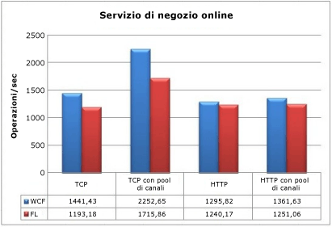  
  
 Se si connettono i servizi TCP di back\-end senza il pool di canali, il servizio di [!INCLUDE[wf1](../../../includes/wf1-md.md)] ha un impatto del 17,2% sulla velocità effettiva.Con il pool di canali, la riduzione delle prestazioni è di circa il 23,8%.Per HTTP, l'impatto è decisamente inferiore: 4,3% senza il pool e 8,1% con il pool.È anche importante notare che il pool di canali non risulta particolarmente vantaggioso quando si utilizza HTTP.  
  
 Anche se in questo test si registra un sovraccarico del runtime di WF4 rispetto a un servizio di [!INCLUDE[indigo2](../../../includes/indigo2-md.md)] codificato manualmente, può essere considerato lo scenario in cui si verifica l'ipotesi più pessimistica.I due servizi di back\-end in questo test svolgono una quantità minima di lavoro.In uno scenario end\-to\-end reale, questi servizi eseguirebbero operazioni più costose, quali chiamate al database, minimizzando l'impatto sulle prestazioni del livello di trasporto.Tutte queste caratteristiche, insieme ai vantaggi offerti dalle funzionalità di WF4, rendono Workflow Foundation una scelta valida per la creazione di servizi di orchestrazione.  
  
## Considerazioni sulle prestazioni principali  
 Le aree funzionali di questa sezione, fatta eccezione per l'interoperabilità, sono notevolmente cambiate in WF4 rispetto a WF3.Queste differenze influiscono sulla progettazione delle applicazioni flusso di lavoro nonché sulle prestazioni.  
  
#### Latenza di attivazione del flusso di lavoro  
 In un'applicazione del servizio flusso di lavoro di [!INCLUDE[indigo2](../../../includes/indigo2-md.md)], la latenza per l'avvio di un nuovo flusso di lavoro o il caricamento di un flusso di lavoro esistente è importante quanto il blocco.Questo test case misura un host XOML di WF3 rispetto a un host XAMLX di WF4 in un scenario tipico.  
  
##### Impostazione dell'ambiente  
 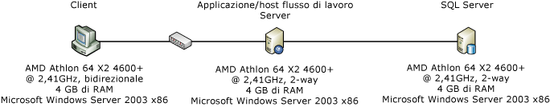  
  
##### Impostazione del test  
 Nello scenario, un computer client contatta un servizio del flusso di lavoro di [!INCLUDE[indigo2](../../../includes/indigo2-md.md)] utilizzando la correlazione basata sul contesto.La correlazione del contesto richiede una speciale associazione del contesto e utilizza un'intestazione del contesto o un cookie per mettere in relazione i messaggi con l'istanza di flusso di lavoro corretta.Ciò garantisce migliori prestazioni in quanto non è necessario analizzare il corpo del messaggio, dato che l'ID della correlazione si trova nell'intestazione del messaggio.[!INCLUDE[crabout](../../../includes/crabout-md.md)] lla correlazione del contesto, vedere [Correlazione di scambio del contesto](../../../docs/framework/wcf/feature-details/context-exchange-correlation.md)  
  
 Il servizio creerà un nuovo flusso di lavoro con la richiesta e invierà una risposta immediata in modo che la misura della latenza non includa il tempo impiegato per eseguire il flusso di lavoro.Il flusso di lavoro di WF3 è XOML con un code\-behind e il flusso di lavoro di WF4 è completamente XAML.Un flusso di lavoro di WF4 è simile al seguente:  
  
 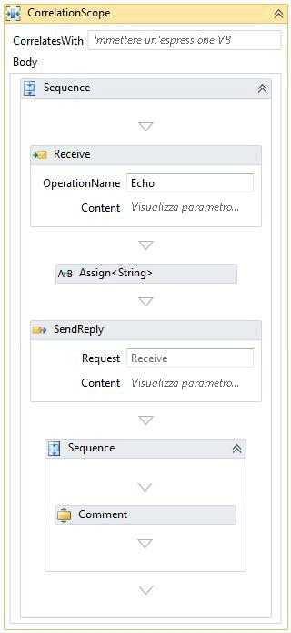  
  
 L'attività <xref:System.ServiceModel.Activities.Receive> crea l'istanza del flusso di lavoro.Un valore passato nel messaggio ricevuto viene restituito nel messaggio di risposta.Una sequenza che segue la risposta contiene il resto del flusso di lavoro.Nel caso sopra menzionato, viene mostrata solo un'attività di commento.Il numero di attività di commento è stato modificato per simulare la complessità del flusso di lavoro.Un'attività di commento equivale a un'attività <xref:System.Workflow.Activities.CodeActivity> di WF3 che non esegue alcun lavoro.[!INCLUDE[crabout](../../../includes/crabout-md.md)]ll'attività di commento, tornare alla sezione "Confronto delle prestazioni a livello di componente" del presente articolo.  
  
##### Risultati del test  
 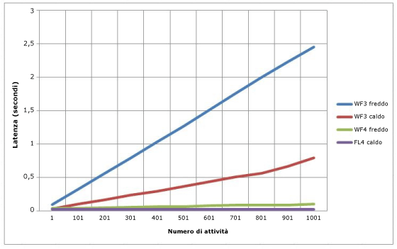  
  
 Figura 3. – Latenza fredda e calda per i servizi flusso di lavoro di WCF  
  
 Nel grafico sopra riportato, la latenza fredda si riferisce al caso in cui non esiste un <xref:System.ServiceModel.WorkflowServiceHost> per il flusso di lavoro specificato.In altre parole, la latenza fredda si verifica quando il flusso di lavoro viene utilizzato per la prima volta ed è necessario compilare XOML o XAML.La latenza calda è il tempo necessario per creare una nuova istanza del flusso di lavoro quando il tipo di flusso di lavoro è già stato compilato.La complessità del flusso di lavoro non fa molta differenza nel test case di WF4, mentre ha una progressione lineare nel test case di WF3.  
  
#### Velocità effettiva della correlazione  
 WF4 offre una nuova funzione di correlazione basata sul contenuto.WF3 offriva solo la correlazione basata sul contesto.La correlazione basata sul contesto poteva essere eseguita solo su specifiche associazioni di canale di [!INCLUDE[indigo2](../../../includes/indigo2-md.md)].Quando vengono utilizzate queste associazioni, l'ID del flusso di lavoro viene inserito nell'intestazione del messaggio.Il runtime di WF3 poteva identificare un flusso di lavoro solo dall'ID.Grazie alla correlazione basata sul contenuto, l'autore del flusso di lavoro può creare una chiave di correlazione da un dato pertinente, come un numero di conto o un ID cliente.[!INCLUDE[crabout](../../../includes/crabout-md.md)]lla correlazione basata sul contenuto, vedere [Correlazione basata sul contenuto](../../../docs/framework/wcf/feature-details/content-based-correlation.md).  
  
 La correlazione basata sul contesto risulta vantaggiosa in termini di prestazioni in quanto la chiave di correlazione si trova nell'intestazione del messaggio.La chiave può essere letta dal messaggio senza deserializzare\/copiare il messaggio.Nella correlazione basata sul contenuto, la chiave di correlazione viene archiviata nel corpo del messaggio.Per individuare la chiave, viene utilizzata un'espressione XPath.Il costo di questa elaborazione aggiuntiva dipende dalla dimensione del messaggio, dalla profondità della chiave nel corpo del messaggio e dal numero di chiavi.Questo test confronta la correlazione basata sul contesto con quella basata sul contenuto ed evidenzia la riduzione del livello delle prestazioni in caso di utilizzo di più chiavi.  
  
#### Impostazione dell'ambiente  
   
  
#### Impostazione del test  
 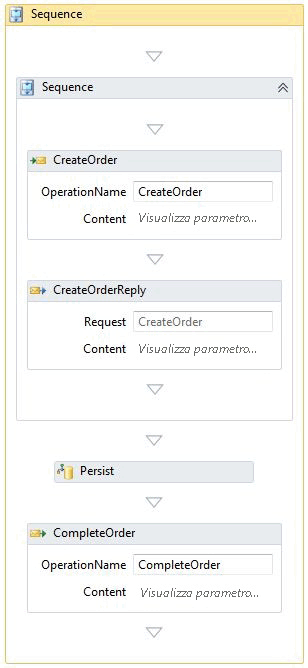  
  
 Il flusso di lavoro illustrato in precedenza è lo stesso utilizzato nella sezione "Persistenza" di seguito.Per i test di correlazione senza persistenza, non è installato un provider di persistenza nel runtime.La correlazione avviene in due punti: CreateOrder e CompleteOrder.  
  
#### Risultati del test  
 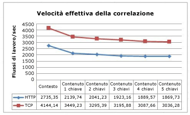  
  
 Questo grafico mostra una diminuzione delle prestazioni man mano che aumenta il numero di chiavi utilizzate nella correlazione basata sul contenuto.La somiglianza delle curve di TCP e HTTP indica il sovraccarico associato a questi protocolli.  
  
#### Correlazione con persistenza  
 Con un flusso di lavoro persistente, la pressione della CPU derivante dalla correlazione basata sul contenuto passa dal runtime del flusso di lavoro al database SQL.Le stored procedure nel provider di persistenza SQL trovano la corrispondenza delle chiavi per individuare il flusso di lavoro adatto.  
  
 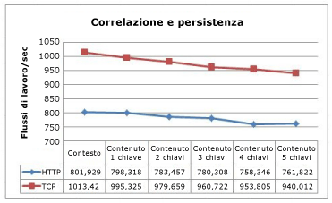  
  
 La correlazione basata sul contesto è ancora più veloce della correlazione basata sul contenuto.Tuttavia, la differenza è minore in quanto la persistenza ha un impatto maggiore sulle prestazioni rispetto alla correlazione.  
  
### Velocità effettiva di un flusso di lavoro complesso  
 La complessità di un flusso di lavoro non viene misurata solo in base al numero di attività.Le attività composte possono contenere molti figli, che a loro volta possono anche essere attività composte.Man mano che aumenta il numero di livelli di annidamento, aumenta anche il numero di attività che possono essere contemporaneamente in stato di esecuzione e il numero di variabili nello stato.Questo test confronta la velocità effettiva di WF3 e WF4 in caso di esecuzione di flussi di lavoro complessi.  
  
### Impostazione del test  
 Questi test sono stati eseguiti su un computer a 4 vie con processore Intel Xeon X5355 da 2,66 GHz con 4 GB di RAM in cui è eseguito Windows Server 2008 x64.Il codice del test viene eseguito in un solo processo con un thread per core per il 100% di utilizzo della CPU.  
  
 I flussi di lavoro generati per questo test contengono due variabili principali: profondità e numero di attività in ogni sequenza.Ogni livello di profondità include un'attività parallela, un ciclo while, decisioni, assegnazioni e sequenze.Nella finestra di progettazione di WF4 illustrata di seguito, è raffigurato il diagramma di flusso di livello superiore.Ogni attività del diagramma di flusso assomiglia al diagramma di flusso principale.Quando si rappresenta questo flusso di lavoro, può essere utile pensare a un frattale, dove la profondità è limitata ai parametri del test.  
  
 Il numero di attività in un determinato test dipende dalla profondità e dal numero di attività per sequenza.Nell'equazione seguente viene calcolato il numero di attività per il test di WF4:  
  
   
  
 Il numero di attività per il test di WF3 può essere calcolato con un'equazione leggermente diversa a causa di una sequenza aggiuntiva:  
  
   
  
 Dove d è la profondità e a è il numero di attività per sequenza.La logica alla base di queste equazioni è che la prima costante, moltiplicata per a, è il numero di sequenze e la seconda costante è il numero statico di attività nel livello corrente.In ogni diagramma di flusso sono presenti tre attività figlio.Al livello di profondità inferiore, questi diagrammi di flusso sono vuoti, ma agli altri livelli sono copie del diagramma di flusso principale.Il numero di attività nella definizione di flusso di lavoro di ogni variazione del test viene indicato nella tabella seguente:  
  
   
  
 Il numero di attività nella definizione del flusso di lavoro aumenta in modo significativo ad ogni livello di profondità.Dal momento che in una determinata istanza del flusso di lavoro viene eseguito solo un percorso per punto di decisione, verrà eseguito solo un piccolo subset delle attività effettive.  
  
 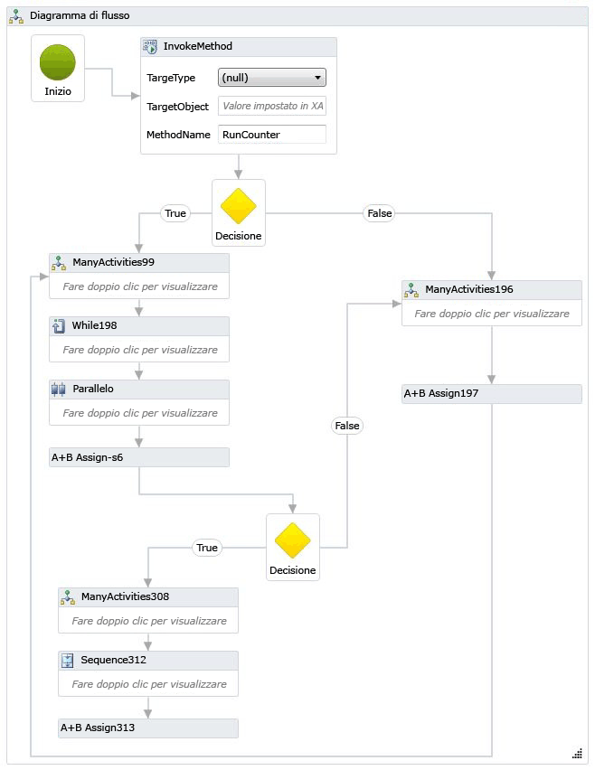  
  
 Per WF3 era stato creato un flusso di lavoro equivalente.La finestra di progettazione di WF3 mostra il flusso di lavoro completo nell'area di progettazione anziché l'annidamento, pertanto è troppo grande per essere visualizzato in questo argomento.Di seguito viene illustrato un frammento del flusso di lavoro.  
  
 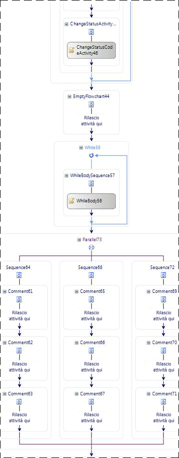  
  
 Per esercitare l'annidamento in un caso estremo, un altro flusso di lavoro che fa parte di questo test utilizza 100 sequenze annidate.Nella sequenza più interna è presente un solo `Comment` o una sola <xref:System.Workflow.Activities.CodeActivity>.  
  
 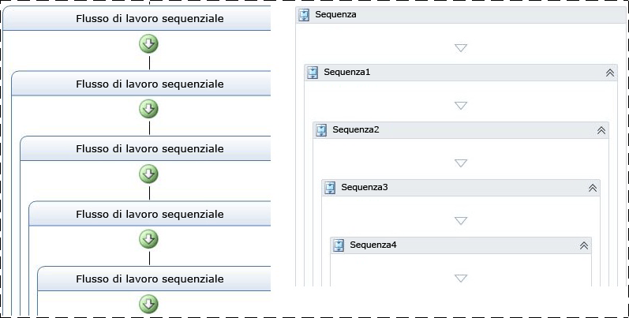  
  
 Il rilevamento e la persistenza non vengono utilizzati in questo test.  
  
### Risultati del test  
 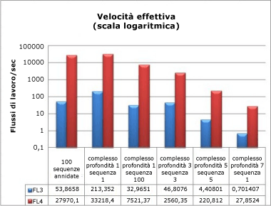  
  
 Anche con flussi di lavoro complessi con molta profondità e un numero elevato di attività, i risultati delle prestazioni sono coerenti con altri dati relativi alla velocità effettiva mostrati in precedenza in questo articolo.La velocità effettiva di WF4 è notevolmente maggiore e deve essere confrontata su scala logaritmica.  
  
### Memoria  
 Il sovraccarico della memoria di Windows Workflow Foundation viene misurato in due aree principali: complessità del flusso di lavoro e numero di definizioni del flusso di lavoro.Le misurazioni della memoria sono state effettuate su una workstation Windows 7 a 64 bit.Sono disponibili molti modi per misurare la dimensione del working set, ad esempio i contatori delle prestazioni del monitoraggio, eseguendo il polling di Environment.WorkingSet o utilizzando uno strumento come VMMap di [VMMap](http://technet.microsoft.com/sysinternals/dd535533.aspx).Per ottenere e verificare i risultati di ogni test, è stata utilizzata una combinazione di metodi.  
  
### Test di complessità del flusso di lavoro  
 Il test di complessità del flusso di lavoro misura la differenza del working set in base alla complessità del flusso di lavoro.Oltre ai flussi di lavoro complessi utilizzati nella sezione precedente, sono state aggiunte nuove varianti per analizzare due casi di base: un flusso di lavoro costituito da una singola attività e una sequenza con 1000 attività.Per questi test i flussi di lavoro vengono inizializzati ed eseguiti fino al completamento in un unico ciclo seriale per un periodo di un minuto.Ogni variante del test viene eseguita tre volte e i dati registrati rappresentano la media delle tre esecuzioni.  
  
 I due nuovi test di base dispongono di flussi di lavoro simili a quelli mostrati di seguito:  
  
 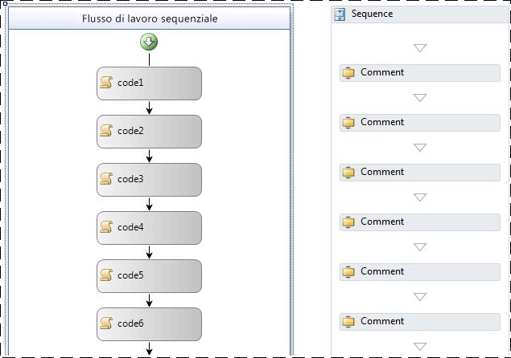  
  
 Nel flusso di lavoro di WF3 sopra riportato, vengono utilizzate attività <xref:System.Workflow.Activities.CodeActivity> vuote.Nel flusso di lavoro di WF4 sopra riportato, vengono utilizzate attività `Comment`.L'attività `Comment` era stata descritta in precedenza nella sezione "Confronto delle prestazioni a livello di componente" di questo articolo.  
  
 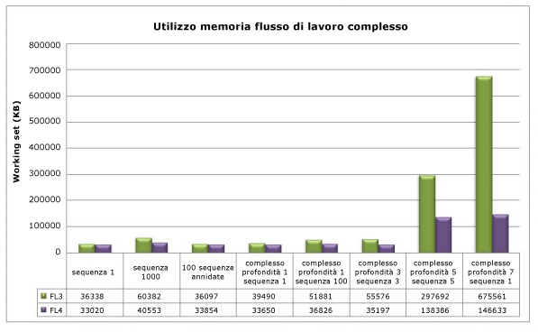  
  
 Una delle tendenze chiare da notare in questo grafico è l'impatto relativamente minimo dell'annidamento sull'utilizzo della memoria sia in WF3 sia in WF4.L'impatto più significativo sulla memoria è dovuto al numero di attività in un determinato flusso di lavoro.Presupponendo come varianti sequenza 1000, profondità complessa 5 sequenza 5 e profondità complessa 7 sequenza 1, è evidente che nel momento in cui il numero di attività supera le migliaia, l'utilizzo della memoria aumenta in modo più significativo.Nel caso estremo \(profondità 7 sequenza 1\), con circa 29.000 attività, WF4 utilizza quasi il 79% in meno di memoria rispetto a WF3.  
  
### Test delle definizioni multiple di un flusso di lavoro  
 La misurazione della memoria per definizione del flusso di lavoro è suddivisa in due test diversi a causa delle opzioni disponibili per l'hosting dei flussi di lavoro in WF3 e WF4.I test vengono eseguiti in modo diverso rispetto al test di complessità del flusso di lavoro: viene generata l'istanza di un determinato flusso di lavoro, che viene poi eseguita solo una volta per definizione.Questo comportamento è dovuto al fatto che la definizione di flusso di lavoro e il suo host rimangono in memoria per tutta la durata dell'AppDomain.La memoria utilizzata durante l'esecuzione di una determinata istanza del flusso di lavoro deve essere pulita durante la procedura di Garbage Collection.Le istruzioni sulla migrazione di WF4 contengono informazioni più dettagliate sulle opzioni di hosting.[!INCLUDE[crdefault](../../../includes/crdefault-md.md)][Guida di riferimento dettagliata sulla migrazione di WF: hosting dei flussi di lavoro](http://go.microsoft.com/fwlink/?LinkID=153313).  
  
 È possibile creare le diverse definizioni di un flusso di lavoro per un test della definizione del flusso di lavoro in vari modi.Ad esempio, è possibile utilizzare la generazione di codice per creare un set di 1000 flussi di lavoro identici tranne che per il nome e salvarli ognuno in file distinti.Questo è l'approccio seguito per il test ospitato dalla console.In WF3 è stata utilizzata la classe <xref:System.Workflow.Runtime.WorkflowRuntime> per eseguire le definizioni del flusso di lavoro.In WF4 è possibile utilizzare <xref:System.Activities.WorkflowApplication> per creare una singola istanza del flusso di lavoro o utilizzare direttamente <xref:System.Activities.WorkflowInvoker> per eseguire l'attività come se fosse una chiamata al metodo.<xref:System.Activities.WorkflowApplication> è un host di una singola istanza del flusso di lavoro e ha una maggiore analogia funzionale con <xref:System.Workflow.Runtime.WorkflowRuntime> nel modo in cui è stato utilizzato nel test.  
  
 Quando si ospitano i flussi di lavoro in IIS, è possibile utilizzare un <xref:System.Web.Hosting.VirtualPathProvider> per creare un nuovo <xref:System.ServiceModel.WorkflowServiceHost> anziché generare tutti i file XAMLX o XOML.<xref:System.Web.Hosting.VirtualPathProvider> gestisce la richiesta in entrata e risponde con un "file virtuale" che può essere caricato da un database oppure, in questo caso, generato al momento.Non è quindi necessario creare 1000 file fisici.  
  
 Le definizioni del flusso di lavoro utilizzate nel test della console erano semplici flussi di lavoro sequenziali con una sola attività.Per il test case di WF3 si trattava di un'attività <xref:System.Workflow.Activities.CodeActivity> vuota, mentre per il test case di WF4 era un'attività `Comment`.Il caso ospitato da IIS utilizzava flussi di lavoro che si avviavano al ricevimento di un messaggio e terminavano nel momento in cui veniva inviata una risposta:  
  
 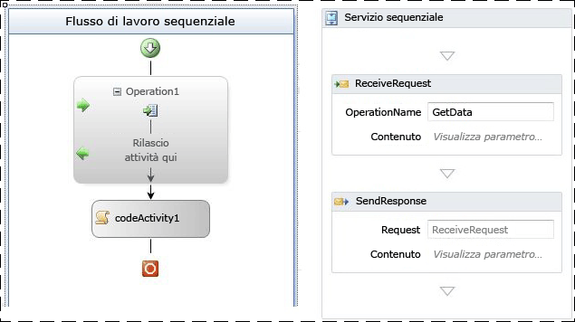  
  
 Figura 4. – Flusso di lavoro di WF3 con ReceiveActivity e flusso di lavoro di WF4 con modello di richiesta\/risposta  
  
 Nella tabella seguente è indicato il delta del working set tra una sola definizione del flusso di lavoro e 1001 definizioni:  
  
|Opzioni di hosting|Delta del working set di WF3|Delta del working set di WF4|  
|------------------------|----------------------------------|----------------------------------|  
|Flussi di lavoro ospitati dell'applicazione console|18 MB|9 MB|  
|Servizi flussi di lavoro ospitati di IIS|446 MB|364 MB|  
  
 L'hosting delle definizioni del flusso di lavoro in IIS utilizza molta più memoria a causa dell'oggetto <xref:System.ServiceModel.WorkflowServiceHost>, degli elementi dettagliati del servizio [!INCLUDE[indigo2](../../../includes/indigo2-md.md)] e della logica di elaborazione dei messaggi associati all'host.  
  
 Per l'hosting della console in WF3, i flussi di lavoro sono stati implementati in codice anziché in linguaggio XOML.In WF4 il valore predefinito da utilizzare è XAML.XAML viene memorizzato nell'assembly come risorsa incorporata e compilato durante il runtime per consentire l'implementazione del flusso di lavoro.Questo processo determina del sovraccarico.Per eseguire un confronto equo tra WF3 e WF4, sono stati utilizzati flussi di lavoro codificati anziché il linguaggio XAML.Di seguito è riportato uno dei quattro flussi di lavoro di WF4:  
  
```  
public class Workflow1 : Activity  
{  
    protected override Func<Activity> Implementation  
    {  
        get  
        {  
            return new Func<Activity>(() =>  
            {  
                return new Sequence  
                {  
                    Activities = {  
                        new Comment()  
                    }  
                };  
            });  
        }  
        set  
        {  
            base.Implementation = value;  
        }  
    }  
}  
  
```  
  
 L'utilizzo della memoria è influenzato da numerosi altri fattori.Per tutti i programmi gestiti vale comunque lo stesso consiglio.Negli ambienti ospitati da IIS, l'oggetto <xref:System.ServiceModel.WorkflowServiceHost> creato per una definizione del flusso di lavoro rimane in memoria fino a quando non viene riciclato il pool di applicazioni.Ciò è da tenere ben presente in caso di scrittura di estensioni.Inoltre, è consigliabile evitare variabili "globali" \(variabili il cui ambito è il flusso di lavoro completo\) e limitare laddove possibile l'ambito delle variabili.  
  
## Servizi di runtime del flusso di lavoro  
  
### Persistenza  
 WF3 e WF4 sono entrambi dotati di un provider di persistenza SQL.Il provider di persistenza SQL di WF3 è un'implementazione semplice che serializza l'istanza del flusso di lavoro e l'archivia in un blob.Per questo motivo, le prestazioni di questo provider sono notevolmente influenzate dalla dimensione dell'istanza del flusso di lavoro.In WF3 la dimensione dell'istanza potrebbe aumentare per vari motivi, come spiegato in precedenza in questo articolo.Molti clienti scelgono di non utilizzare il provider di persistenza SQL predefinito perché l'archiviazione di un'istanza serializzata in un database non fornisce visibilità nello stato del flusso di lavoro.Per trovare un determinato flusso di lavoro senza conoscere l'ID del flusso di lavoro, sarebbe necessario deserializzare ogni istanza persistente ed esaminarne il contenuto.Per superare questo problema, molti sviluppatori preferiscono scrivere il proprio provider di persistenza.  
  
 Il provider di persistenza SQL di WF4 ha cercato di risolvere alcune di queste problematiche.Le tabelle di persistenza espongono determinate informazioni, quali i segnalibri attivi e le proprietà promuovibili.Se si utilizzasse l'approccio di persistenza SQL di WF3, che ha comportato alcune modifiche nell'organizzazione dell'istanza del flusso di lavoro persistente, la nuova funzione di correlazione basata sul contenuto di WF4 non funzionerebbe correttamente.Ciò rende più complesso il compito del provider di persistenza e incide ulteriormente sul database.  
  
### Impostazione dell'ambiente  
   
  
### Impostazione del test  
 Anche con un set di funzionalità migliorate e una gestione delle concorrenze migliorata, il provider di persistenza SQL di WF4 è più veloce del provider di WF3.Per dimostrarlo, di seguito vengono confrontati due flussi di lavoro che eseguono sostanzialmente le stesse operazioni in WF3 e WF4.  
  
 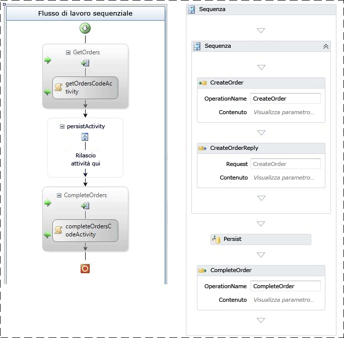  
  
 Figura 5 – Flusso di lavoro della persistenza di WF3 a sinistra e di WF4 a destra  
  
 I due flussi di lavoro vengono entrambi creati da un messaggio ricevuto.Dopo avere inviato una risposta iniziale, il flusso di lavoro viene reso persistente.Nel caso di WF3, viene utilizzato un oggetto <xref:System.Workflow.ComponentModel.TransactionScopeActivity> vuoto per iniziare la persistenza.In WF3 si potrebbe ottenere lo stesso risultato contrassegnando un'attività come "persistente in chiusura". Il flusso di lavoro viene completato da un secondo messaggio correlato.I flussi di lavoro vengono resi persistenti, ma non vengono scaricati.  
  
### Risultati del test  
 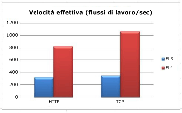  
  
 Quando il trasporto tra client e il livello intermedio è HTTP, la persistenza in WF4 migliora di 2,6 volte.Il trasporto TCP aumenta questo fattore fino a 3,0 volte.In tutti i casi, l'utilizzo della CPU nel livello intermedio è del 98% o superiore.Il motivo della maggiore velocità effettiva in WF4 è il runtime più veloce del flusso di lavoro.La dimensione dell'istanza serializzata è contenuta in entrambi i casi e non è un elemento determinante in questa situazione.  
  
 In questo test sia i flussi di lavoro di WF3 che di WF4 utilizzano un'attività per indicare in modo esplicito quando deve verificarsi la persistenza.In questo modo, si ottiene il vantaggio di rendere persistente il flusso di lavoro senza scaricarlo.In WF3, è anche possibile rendere persistente il flusso di lavoro utilizzando la funzionalità <xref:System.ServiceModel.Activities.Description.WorkflowIdleBehavior.TimeToUnload%2A>, ma in questo caso l'istanza del flusso di lavoro viene scaricata dalla memoria.Se uno sviluppatore che utilizza WF3 desidera essere certo che un flusso di lavoro venga reso persistente in determinati punti, deve modificare la definizione del flusso di lavoro oppure farsi carico dello scaricamento e del ricaricamento dell'istanza del flusso di lavoro.Grazie a una nuova funzionalità di WF4, <xref:System.ServiceModel.Activities.Description.WorkflowIdleBehavior.TimeToPersist%2A>, è possibile rendere persistente un flusso di lavoro senza scaricarlo.Questa funzionalità consente di rendere persistente l'istanza del flusso di lavoro in caso di inattività, ma di rimanere in memoria fino a quando non viene raggiunta la soglia di <xref:System.ServiceModel.Activities.Description.WorkflowIdleBehavior.TimeToUnload%2A> o ripresa l'esecuzione.  
  
 Notare che il provider di persistenza SQL di WF4 esegue più lavoro nel livello del database.Il database SQL può diventare un collo di bottiglia, quindi è importante monitorare la CPU e l'utilizzo del disco.Quando si esegue il test delle prestazioni delle applicazioni flusso di lavoro, verificare che vengano inclusi i seguenti contatori delle prestazioni:  
  
-   PhysicalDisk\\% tempo lettura da disco  
  
-   PhysicalDisk\\% Tempo disco  
  
-   PhysicalDisk\\% tempo scrittura su disco  
  
-   PhysicalDisk\\% mediaLunghezza coda del disco  
  
-   PhysicalDisk\\Lunghezza media lettura coda del disco  
  
-   PhysicalDisk\\Lunghezza media scrittura coda del disco  
  
-   PhysicalDisk\\Lunghezza corrente coda su disco  
  
-   Informazioni sul processore\\% tempo processore  
  
-   SQLServer:Latch\\Tempo medio attesa latch \(ms\)  
  
-   SQLServer:Latch\\Attese latch\/sec  
  
### Rilevamento  
 È possibile utilizzare il rilevamento del flusso di lavoro per tener traccia dello stato di avanzamento di un flusso di lavoro.Le informazioni incluse negli eventi di rilevamento sono determinate da un profilo di rilevamento.Più è complesso il profilo di rilevamento, più diventa oneroso il rilevamento.  
  
 WF3 era dotato di un servizio di rilevamento basato su SQL.Il servizio poteva funzionare in modalità batch e non batch.In modalità non batch, gli eventi di rilevamento vengono scritti direttamente nel database.In modalità batch, gli eventi di rilevamento vengono raccolti nello stesso batch dello stato dell'istanza del flusso di lavoro.La modalità batch offre le prestazioni migliori per la tipologia più ampia di progettazioni del flusso di lavoro.Tuttavia, se il flusso di lavoro esegue molte attività senza renderle persistenti e tali attività vengono rilevate, l'invio in batch può influire negativamente sulle prestazioni.Ciò si verificherebbe solitamente nei cicli e il modo migliore per evitare questo scenario è progettare cicli di grandi dimensioni per contenere un punto di persistenza.L'introduzione di un punto di persistenza in un ciclo può influire negativamente sulle prestazioni, quindi è importante valutare l'onere di ciascuno di essi e trovare un equilibrio ottimale.  
  
 WF4 non è dotato di un servizio di rilevamento basato su SQL.La registrazione delle informazioni di rilevamento in un database SQL può essere gestita meglio da un server applicazioni piuttosto che essere incorporata in [!INCLUDE[dnprdnshort](../../../includes/dnprdnshort-md.md)].Pertanto il rilevamento SQL viene ora gestito da AppFabric.Il provider di rilevamento predefinito di WF4 si basa su ETW \(Event Tracing for Windows\).  
  
 ETW è un sistema di eventi a livello del kernel con bassa latenza integrato in Windows.Utilizza un modello provider\/consumer che penalizza il sistema per il rilevamento degli eventi solo quando è presente realmente un consumer.Oltre agli eventi del kernel, quali utilizzo del processore, del disco, della memoria e della rete, molte applicazioni sfruttano anche ETW.Gli eventi ETW sono più potenti dei contatori delle prestazioni poiché è possibile personalizzarli in base all'applicazione.Un evento può contenere del testo, quale un ID del flusso di lavoro o un messaggio informativo.Inoltre, gli eventi sono suddivisi in categorie con le maschere di bit in modo che l'impatto sulle prestazioni derivante dall'utilizzo di un determinato subset di eventi sia minore rispetto all'acquisizione di tutti gli eventi.  
  
 I vantaggi dell'approccio che prevede l'utilizzo di ETW per il rilevamento invece di SQL sono i seguenti:  
  
-   È possibile tenere la raccolta degli eventi di rilevamento separata da un altro processo.Ciò offre una maggiore flessibilità nella registrazione degli eventi.  
  
-   È possibile utilizzare facilmente gli eventi di rilevamento ETW in combinazione con gli eventi ETW di [!INCLUDE[indigo2](../../../includes/indigo2-md.md)] o con altri provider ETW, quali un SQL Server o un provider del kernel.  
  
-   Gli autori del flusso di lavoro non devono modificarlo perché funzioni meglio con una determinata implementazione del rilevamento di rilevamento, quale la modalità batch del servizio di rilevamento SQL di WF3.  
  
-   Un amministratore può attivare o disattivare il rilevamento senza riciclare il processo host.  
  
 I vantaggi del rilevamento ETW in termini di prestazioni presentano comunque un inconveniente.Se le risorse del sistema sono molto sotto pressione, gli eventi ETW potrebbero andare persi.Poiché l'elaborazione degli eventi non prevede il blocco della normale esecuzione dei programmi, non è garantita la trasmissione di tutti gli eventi ETW ai sottoscrittori.Ciò rende ETW adatto per il monitoraggio dell'integrità ma non per il controllo.  
  
 Contrariamente WF4, AppFabric dispone di un provider di rilevamento SQL.L'approccio del rilevamento SQL di AppFabric prevede la sottoscrizione di eventi ETW con un servizio Windows che invia gli eventi in batch e li scrive in una tabella SQL progettata per inserimenti rapidi.Un processo distinto scarica i dati dalla tabella e li riforma in tabelle di report visualizzabili sul dashboard di AppFabric.Ciò significa che un batch di eventi di rilevamento viene gestito indipendentemente dal flusso di lavoro di origine e pertanto non deve attendere un punto di persistenza prima essere registrato.  
  
 È possibile registrare gli eventi ETW con strumenti quali logman o xperf.Per visualizzare i file ETL compressi, è possibile utilizzare uno strumento quale xperfview oppure convertirli con tracerpt in un formato più leggibile, ad esempio XML.In WF3 l'unico modo per avere eventi di rilevamento senza un database SQL è creare un servizio di rilevamento personalizzato.[!INCLUDE[crabout](../../../includes/crabout-md.md)] ETW, vedere [Servizi WCF e traccia eventi per Windows](../../../docs/framework/wcf/samples/wcf-services-and-event-tracing-for-windows.md) e [ETW \(Event Tracing for Windows\)](http://msdn.microsoft.com/library/ff190903.aspx\)).  
  
 Se è attivo, il rilevamento del flusso di lavoro, influisce sulle prestazioni a vari livelli.Nel test di efficienza riportato di seguito viene utilizzato lo strumento logman per utilizzare gli eventi di rilevamento ETW e registrarli in un file ETL.Il costo del rilevamento SQL in AppFabric non rientra nell'ambito di questo articolo.In questo test di efficienza viene mostrato il profilo di rilevamento di base, utilizzato anche in AppFabric.È inoltre incluso il costo del rilevamento solo degli eventi di monitoraggio dell'integrità.Questi eventi sono utili per risolvere i problemi e determinare la velocità effettiva media del sistema.  
  
### Impostazione dell'ambiente  
   
  
### Risultati del test  
 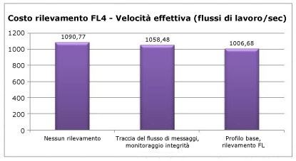  
  
 Il monitoraggio dell'integrità ha un impatto di circa il 3% sulla velocità effettiva.Il costo del profilo di base corrisponde a circa l'8%.  
  
## Interoperabilità  
 WF4 è una riscrittura pressoché completa di [!INCLUDE[wf1](../../../includes/wf1-md.md)] e pertanto i flussi di lavoro e le attività di WF3 non sono direttamente compatibili con WF4.Molti clienti che hanno adottato per primi [!INCLUDE[wf2](../../../includes/wf2-md.md)] avranno a disposizione definizioni dei flussi di lavoro messe a punto internamente o da terze parti e attività personalizzate per WF3.Un modo per facilitare la transizione a WF4 è utilizzare l'attività Interop, che è in grado di eseguire le attività di WF3 da un flusso di lavoro di WF4.Si consiglia di utilizzare l'attività <xref:System.Activities.Statements.Interop> solo quando necessario.[!INCLUDE[crabout](../../../includes/crabout-md.md)]lla migrazione a WF4, vedere [Istruzioni di migrazione di WF4](http://go.microsoft.com/fwlink/?LinkID=153313).  
  
### Impostazione dell'ambiente  
   
  
### Risultati del test  
 Nella tabella seguente vengono mostrati i risultati dell'esecuzione di un flusso di lavoro che contiene cinque attività in una sequenza nelle varie configurazioni.  
  
|Test|Velocità effettiva \(flussi di lavoro\/sec\)|  
|----------|--------------------------------------------------|  
|Sequenza di WF3 nel runtime di WF3|1,576|  
|Sequenza di WF3 nel runtime di WF4 utilizzando Interop|2,745|  
|Sequenza di WF4|153,582|  
  
 L'utilizzo dell'attività Interop in WF3 migliora notevolmente le prestazioni.Tuttavia, se confrontato con le attività di WF4, l'aumento è trascurabile.  
  
## Riepilogo  
 I notevoli investimenti fatti per migliorare le prestazioni di WF4 hanno dato buoni risultati in molte aree critiche.In alcuni casi le prestazioni dei singoli componenti del flusso di lavoro sono centinaia di volte più veloci in WF4 rispetto a WF3 grazie alla maggiore efficienza del runtime di [!INCLUDE[wf1](../../../includes/wf1-md.md)].I valori relativi alla latenza sono anch'essi notevolmente migliorati.Ciò significa che la riduzione delle prestazioni dovuta all'utilizzo di [!INCLUDE[wf1](../../../includes/wf1-md.md)] al posto dei servizi di orchestrazione di [!INCLUDE[indigo2](../../../includes/indigo2-md.md)] codificati manualmente è minima considerando i vantaggi derivanti dall'utilizzo di [!INCLUDE[wf1](../../../includes/wf1-md.md)].Le prestazioni della persistenza sono aumentate di un fattore di 2,5 \- 3,0.Il sovraccarico del monitoraggio dell'integrità tramite il rilevamento del flusso di lavoro ora ha un impatto minimo.Per coloro che stanno valutando il passaggio da WF3 a WF4, è disponibile un set completo di guide alla migrazione.Le considerazioni precedenti renderanno WF4 un'opzione attraente per la scrittura di applicazioni complesse.  
  
## Riconoscimenti  
 Un ringraziamento ai seguenti collaboratori e revisori per il loro contributo:  
  
-   Leon Welicki, Microsoft Corporation  
  
-   Ryszard Kwiecinski, Microsoft Corporation  
  
-   Emil Velinov, Microsoft Corporation  
  
-   Nate Talbert, Microsoft Corporation  
  
-   Bob Schmidt, Microsoft Corporation  
  
-   Stefan Batres, Microsoft Corporation