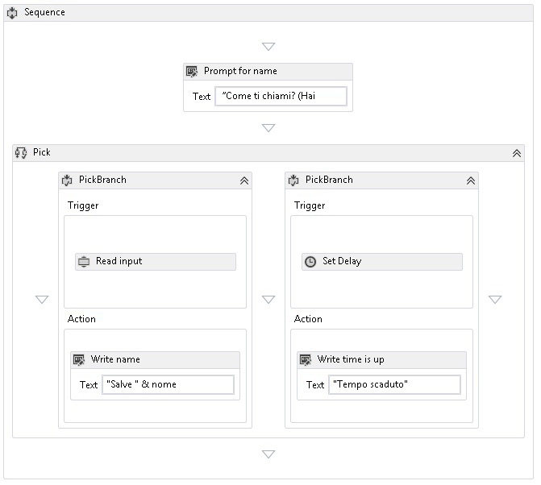

# Attivit&#224; di selezione
L'attività <xref:System.Activities.Statements.Pick> semplifica la modellazione di un set di trigger di eventi seguiti dai relativi gestori corrispondenti.  Un'attività <xref:System.Activities.Statements.Pick> contiene una raccolta di attività <xref:System.Activities.Statements.PickBranch> in cui ogni attività <xref:System.Activities.Statements.PickBranch> è un'associazione tra un'attività <xref:System.Activities.Statements.PickBranch.Trigger%2A> e un'attività <xref:System.Activities.Statements.PickBranch.Action%2A>.  In fase di esecuzione, i trigger per tutti i rami vengono eseguiti in parallelo.  Quando un trigger viene completato, viene eseguita l'azione corrispondente e tutti gli altri trigger vengono annullati.  Il comportamento dell'attività [!INCLUDE[netfx_current_short](../../../includes/netfx-current-short-md.md)]<xref:System.Activities.Statements.Pick> è simile all'attività [!INCLUDE[netfx35_short](../../../includes/netfx35-short-md.md)]<xref:System.Workflow.Activities.Listen>.  
  
 La schermata seguente dell'esempio SDK [Utilizzo dell'attività Pick](../../../docs/framework/windows-workflow-foundation/samples/using-the-pick-activity.md) mostra un'attività Pick con due rami.  Un ramo dispone di un trigger denominato **Read input**, ovvero un'attività personalizzata che legge l'input dalla riga di comando. L'altro ramo dispone di un trigger di attività <xref:System.Activities.Statements.Delay>. Se l'attività **Read input** riceve dati prima del completamento dell'attività <xref:System.Activities.Statements.Delay>, <xref:System.Activities.Statements.Delay> sarà annullata e sulla console verrà scritto un saluto.  In caso contrario, se l'attività **Read input** non riceve dati nel tempo assegnato, sarà annullata e sulla console verrà scritto un messaggio di timeout.  Si tratta di un modello comune usato per aggiungere un timeout a qualsiasi azione.  
  
   
  
## <a name="best-practices"></a>Procedure consigliate  
 In caso di utilizzo dell'attività Pick, il ramo che viene eseguito è il ramo il cui trigger viene completato per primo.  Concettualmente, tutti i trigger vengono eseguiti in parallelo e un trigger potrebbe aver eseguito la maggior parte della relativa logica prima che venga annullato dal completamento di un altro trigger.  Tenuto conto di questo, quando si usa l'attività Pick è consigliabile trattare il trigger come se rappresentasse un singolo evento e inserirvi la minor quantità di logica possibile.  In teoria, il trigger deve contenere solo la logica necessaria per ricevere un evento e tutta l'elaborazione di tale evento deve rientrare nell'azione del ramo.  Questo metodo riduce il numero di sovrapposizioni tra l'esecuzione dei trigger.  Ad esempio si consideri un oggetto <xref:System.Activities.Statements.Pick> con due trigger in cui ogni trigger contiene un'attività <xref:System.ServiceModel.Activities.Receive> seguita da logica aggiuntiva.  Se la logica aggiuntiva introduce un punto di inattività, è possibile completare correttamente entrambe le attività <xref:System.ServiceModel.Activities.Receive>.  Un trigger sarà completato interamente, mentre un altro solo parzialmente.  In alcuni scenari, non è possibile accettare un messaggio e completare solo parzialmente la relativa elaborazione.  Pertanto, in caso d'uso di attività di messaggistica incorporate in WF come <xref:System.ServiceModel.Activities.Receive> e <xref:System.ServiceModel.Activities.SendReply>, mentre l'attività <xref:System.ServiceModel.Activities.Receive> viene usata comunemente nel trigger, l'attività <xref:System.ServiceModel.Activities.SendReply> e altri tipi di logica devono essere inseriti nell'azione, se possibile.  
  
## <a name="using-the-pick-activity-in-the-designer"></a>Utilizzo dell'attività Pick nell'utilità di progettazione  
 Per usare l'attività Pick nell'utilità di progettazione, cercare **Pick** e **PickBranch** nella casella degli strumenti.  Trascinare l'opzione **Pick** e rilasciarla nell'area di disegno.  Per impostazione predefinita, una nuova attività **Pick** nell'utilità di progettazione conterrà due rami.  Per aggiungere rami aggiuntivi, trascinare l'attività **PickBranch** e rilasciarla accanto ai rami esistenti. Le attività possono essere rilasciate nell'area **Trigger** o nell'area **Azione** di qualsiasi **PickBranch** dell'attività **Pick**.  
  
## <a name="using-the-pick-activity-in-code"></a>Utilizzo dell'attività Pick nel codice  
 L'attività <xref:System.Activities.Statements.Pick> viene usata popolando la relativa raccolta <xref:System.Activities.Statements.Pick.Branches%2A> con le attività <xref:System.Activities.Statements.PickBranch>. Ogni attività <xref:System.Activities.Statements.PickBranch> ha una proprietà <xref:System.Activities.Statements.PickBranch.Trigger%2A> di tipo <xref:System.Activities.Activity>. Quando l'esecuzione dell'attività specificata viene completata, viene eseguita la proprietà <xref:System.Activities.Statements.PickBranch.Action%2A>.  
  
 Nell'esempio di codice seguente viene illustrato come usare un'attività <xref:System.Activities.Statements.Pick> per implementare un timeout per un'attività che legge una riga della console.  
  
```csharp  
Sequence body = new Sequence()  
{  
    Variables = { name },  
    Activities =   
   {  
       new System.Activities.Statements.Pick  
        {  
           Branches =   
           {  
               new PickBranch  
               {  
                   Trigger = new ReadLine  
                   {  
                      Result = name,  
                      BookmarkName = "name"  
                   },  
                   Action = new WriteLine   
                   {   
                       Text = ExpressionServices.Convert<string>(ctx => "Hello " +   
                           name.Get(ctx))   
                   }  
               },  
               new PickBranch  
               {  
                   Trigger = new Delay  
                   {  
                      Duration = new TimeSpan(0, 0, 5)  
                   },  
                   Action = new WriteLine  
                   {  
                      Text = "Time is up."  
                   }  
               }  
           }  
       }  
   }  
};  
  
```  
  
```xaml  
<Sequence xmlns="http://schemas.microsoft.com/netfx/2009/xaml/activities" xmlns:x="http://schemas.microsoft.com/winfx/2006/xaml">  
  <Sequence.Variables>  
    <Variable x:TypeArguments="x:String" Name="username" />  
  </Sequence.Variables>  
  <Pick>  
    <PickBranch>  
      <PickBranch.Trigger>  
        <ReadLine BookmarkName="name" Result="username" />  
      </PickBranch.Trigger>  
      <WriteLine>[String.Concat("Hello ", username)]</WriteLine>  
    </PickBranch>  
    <PickBranch>  
      <PickBranch.Trigger>  
        <Delay>00:00:05</Delay>  
      </PickBranch.Trigger>  
      <WriteLine>Time is up.</WriteLine>  
    </PickBranch>  
  </Pick>  
</Sequence>  
  
```