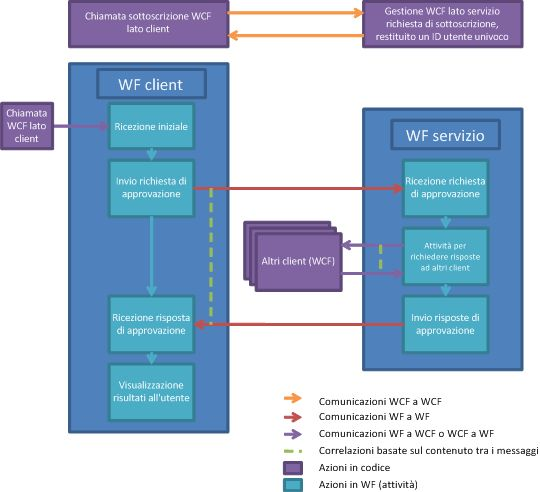

# Processo di approvazione dei documenti
In questo esempio viene illustrato l'utilizzo simultaneo di molte funzionalità di [!INCLUDE[wf](../../../../includes/wf-md.md)] e [!INCLUDE[indigo1](../../../../includes/indigo1-md.md)].Insieme implementano uno scenario del processo di approvazione dei documenti.Un'applicazione client può inviare documenti da sottoporre ad approvazione e approvare documenti.Un'applicazione di gestione delle approvazioni è utile per semplificare le comunicazioni tra i client e per applicare le regole del processo di approvazioneche consiste in un flusso di lavoro che può eseguire molti tipi di approvazione.Le attività servono per ottenere un processo di approvazione singola, di approvazione a quorum \(una percentuale del gruppo di responsabili approvazione\) e di approvazione complessa costituito da un'approvazione a quorum e una singola in sequenza.  
  
> [!IMPORTANT]
>  È possibile che gli esempi siano già installati nel computer.Verificare la directory seguente \(impostazione predefinita\) prima di continuare.  
>   
>  `<UnitàInstallazione>:\WF_WCF_Samples`  
>   
>  Se questa directory non esiste, andare alla sezione relativa agli [esempi di Windows Communication Foundation \(WCF\) e Windows Workflow Foundation \(WF\) per .NET Framework 4](http://go.microsoft.com/fwlink/?LinkId=150780) per scaricare tutti gli esempi [!INCLUDE[indigo1](../../../../includes/indigo1-md.md)] e [!INCLUDE[wf1](../../../../includes/wf1-md.md)].Questo esempio si trova nella directory seguente.  
>   
>  `<UnitàInstallazione>:\WF_WCF_Samples\WF\Application\DocumentApprovalProcess`  
  
## Dettagli dell'esempio  
 Nell'elemento grafico seguente viene illustrato il flusso di lavoro del processo di approvazione dei documenti.  
  
   
  
 Dalla prospettiva del client, il processo di approvazione funziona nel modo seguente:  
  
1.  Un client esegue una sottoscrizione per essere un utente del sistema del processo di approvazione.  
  
2.  Un client [!INCLUDE[indigo2](../../../../includes/indigo2-md.md)] effettua un invio a un servizio [!INCLUDE[indigo2](../../../../includes/indigo2-md.md)] ospitato dall'applicazione di gestione delle approvazioni.  
  
3.  Al client viene restituito un ID utente univoco.Il client può ora partecipare ai processi di approvazione.  
  
4.  Una volta inserito, un client può inviare un documento per l'approvazione utilizzando un processo di approvazione singolo, a quorum o complesso.  
  
5.  La selezione di un pulsante nell'interfaccia del client avvia un'istanza del flusso di lavoro in un host dei servizi di flusso di lavoro del client.  
  
6.  Il flusso di lavoro invia una richiesta di approvazione all'applicazione di gestione delle approvazioni.  
  
7.  Il proprietario del flusso di lavoro avvia un flusso di lavoro per rappresentare un processo di approvazione.  
  
8.  Una volta che il proprietario ha eseguito il flusso di lavoro di approvazione, i risultati vengono restituiti al client.  
  
9. Il client visualizza i risultati.  
  
10. Un client può ricevere una richiesta di approvazione e rispondere alla richiesta in qualsiasi momento.  
  
11. Un servizio [!INCLUDE[indigo2](../../../../includes/indigo2-md.md)] ospitato nel client può ricevere una richiesta di approvazione dall'applicazione di gestione delle approvazioni.  
  
12. Le informazioni sul documento vengono presentate nel client per la revisione.  
  
13. L'utente può approvare o rifiutare il documento.  
  
14. Un client [!INCLUDE[indigo2](../../../../includes/indigo2-md.md)] viene utilizzato per restituire una risposta di approvazione all'applicazione di gestione delle approvazioni.  
  
 Dal punto di vista dell'applicazione di gestione delle approvazioni, il processo di approvazione funziona nel modo seguente:  
  
1.  Un client richiede la partecipazione al sistema del processo di approvazione.  
  
2.  Un servizio [!INCLUDE[indigo2](../../../../includes/indigo2-md.md)] nell'applicazione di gestione delle approvazioni riceve una richiesta di entrare a far parte del sistema del processo di approvazione.  
  
3.  Viene generato un ID univoco per il client.Le informazioni utente vengono archiviate in un database.  
  
4.  L'ID univoco viene restituito all'utente.  
  
5.  Viene ricevuta una richiesta di approvazione.Il responsabile dell'approvazione esegue un processo di approvazione.  
  
6.  Il responsabile dell'approvazione riceve una richiesta di approvazione che avvia un nuovo flusso di lavoro.  
  
7.  A seconda del tipo di richiesta \(semplice, a quorum o complessa\), viene eseguita un'attività diversa.  
  
8.  Le attività di invio e ricezione con correlazione vengono utilizzate per inviare la richiesta di approvazione al client per la revisione e per ricevere la risposta.  
  
9. Il risultato del flusso di lavoro del processo di approvazione viene inviato al client.  
  
## Utilizzo dell'esempio  
  
##### Per impostare il database  
  
1.  Aprire un prompt dei comandi di [!INCLUDE[vs2010](../../../../includes/vs2010-md.md)] con privilegi di amministratore ed eseguire Setup.cmd dalla cartella DocumentApprovalProcess.  
  
##### Per impostare l'applicazione  
  
1.  In [!INCLUDE[vs2010](../../../../includes/vs2010-md.md)] aprire il file della soluzione DocumentApprovalProcess.sln.  
  
2.  Per compilare la soluzione, premere CTRL\+MAIUSC\+B.  
  
3.  Per eseguire la soluzione, avviare l'applicazione di gestione delle approvazioni facendo clic con il pulsante destro del mouse sul progetto ApprovalManager in **Esplora soluzioni** e selezionando **Debug**\-\>**Avvia nuova istanza** nel menu attivato con il clic destro del mouse.  
  
     Attendere l'output del responsabile per sapere che è pronta.  
  
##### Per eseguire lo scenario di approvazione singola  
  
1.  Aprire un prompt dei comandi con l'autorizzazione di amministratore.  
  
2.  Passare alla directory contenente la soluzione.  
  
3.  Passare alla cartella ApprovalClient\\Bin\\Debug ed eseguire due istanze di ApprovalClient.exe.  
  
4.  Fare clic su **Individua** e attendere finché il pulsante **Sottoscrivi** non è abilitato.  
  
5.  Digitare qualsiasi nome utente e fare clic su **Sottoscrivi**.Per un client utilizzare `UserType1` e per l'altro il tipo `UserType2`.  
  
6.  Nel client `UserType1` selezionare il tipo di approvazione singola dal menu a discesa e digitare un nome e il contenuto del documento.Fare clic su **Richiedi approvazione**.  
  
7.  Nel client `UserType2` viene visualizzato un documento in attesa di approvazione.Selezionarlo e premere **Approva** o **Rifiuta**.I risultati devono essere visualizzati nel client `UserType1`.  
  
##### Per eseguire lo scenario di approvazione a quorum  
  
1.  Aprire un prompt dei comandi con l'autorizzazione di amministratore.  
  
2.  Passare alla directory contenente la soluzione.  
  
3.  Passare alla cartella ApprovalClient\\Bin\\Debug ed eseguire tre istanze di ApprovalClient.exe.  
  
4.  Fare clic su **Individua** e attendere finché il pulsante **Sottoscrivi** non è abilitato.  
  
5.  Digitare qualsiasi nome utente e fare clic su **Sottoscrivi**.Per un client utilizzare `UserType1` e per gli altri due utilizzare il tipo `UserType2`.  
  
6.  Nel client `UserType1` selezionare il tipo di approvazione a quorum dal menu a discesa e digitare un nome e il contenuto del documento.Fare clic su **Richiedi approvazione**.In questo modo viene richiesto che i due client `UserType2` approvino o rifiutino il documento.Mentre entrambi i client `UserType2` devono rispondere, solo un client deve approvare il documento.  
  
7.  Nei client `UserType2` viene visualizzato un documento in attesa di approvazione.Selezionarlo e premere **Approva** o **Rifiuta**.I risultati devono essere visualizzati nel client `UserType1`.  
  
##### Per eseguire lo scenario di approvazione complesso  
  
1.  Aprire un prompt dei comandi con l'autorizzazione di amministratore.  
  
2.  Passare alla directory contenente la soluzione.  
  
3.  Passare alla cartella ApprovalClient\\Bin\\Debug ed eseguire quattro istanze di ApprovalClient.exe.  
  
4.  Fare clic su **Individua** e attendere finché il pulsante **Sottoscrivi** non è abilitato.  
  
5.  Digitare qualsiasi nome utente e fare clic su **Sottoscrivi**.Per un client utilizzare `UserType1`, per il secondo utilizzare il tipo `UserType2` e per l'ultimo utilizzare `UserType3`.  
  
6.  Nel client `UserType1` selezionare il tipo di approvazione singola dal menu a discesa e digitare un nome e il contenuto del documento.Fare clic su **Richiedi approvazione**.  
  
7.  Nei client `UserType2` viene visualizzato un documento in attesa di approvazione.Selezionarlo e premere **Approva**; il documento viene passato al client `UserType3`.  
  
     Se il documento viene approvato dal primo quorum `UserType2`, il documento viene passato al client `UserType3`.  
  
8.  Approvare o rifiutare il documento dal client `UserType3`.I risultati devono essere visualizzati nel client `UserType1`.  
  
##### Per eseguire la pulizia  
  
1.  Da un prompt dei comandi di [!INCLUDE[vs2010](../../../../includes/vs2010-md.md)], passare alla cartella DocumentApprovalProcess ed eseguire Cleanup.cmd.  
  
## Vedere anche