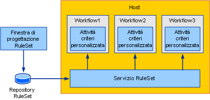
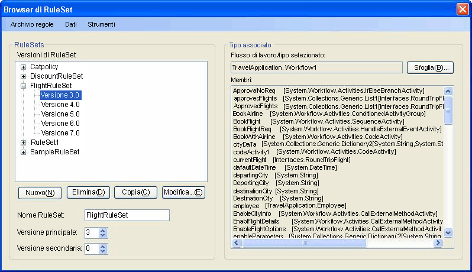
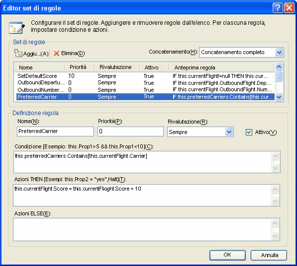
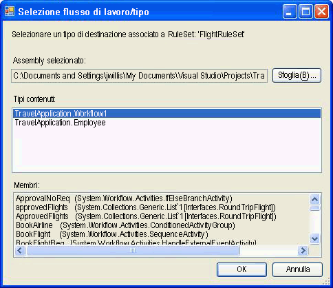
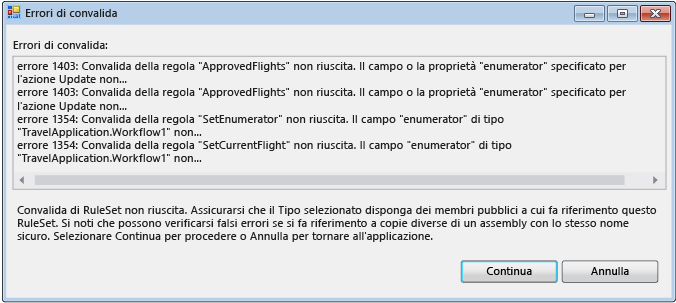
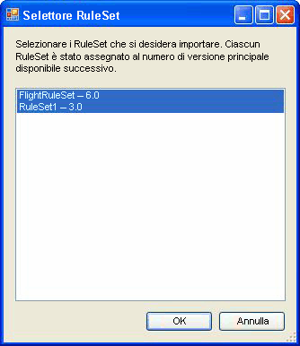

# Toolkit di RuleSet esterno
Normalmente quando vengono usate all'interno di un'applicazione del flusso di lavoro, le regole fanno parte dell'assembly.  In alcuni scenari, può essere necessario gestire il RuleSet separatamente dall'assembly così che possano essere aggiornati senza ricompilare e distribuire l'assembly del flusso di lavoro.  In questo esempio viene illustrato come gestire e modificare il RuleSet in un database e accedere ai RuleSet da un flusso di lavoro durante il runtime.  Abilita l'esecuzione di istanze del flusso di lavoro per incorporare automaticamente le modifiche del RuleSet.  
  
 L'esempio di toolkit di RuleSet esterno contiene uno strumento basato su Windows Form che può essere usato per gestire e modificare le versioni di RuleSet in un database.  Include inoltre un'attività e un servizio host per l'esecuzione di tali regole.  
  
> [!NOTE]
>  Questo esempio richiede [Microsoft SQL Server](http://go.microsoft.com/fwlink/?LinkId=96181).  
  
 [!INCLUDE[vsprvsext](../../../../includes/vsprvsext-md.md)] provvede un editor di RuleSet come parte di Windows Workflow Foundation \(WF\).  È possibile avviare questo editor facendo doppio clic sull'attività `Policy` in un flusso di lavoro; serializza l'oggetto di RuleSet definito al file con estensione rules associato al flusso di lavoro \(un'attività `Policy` esegue un'istanza di RuleSet in base al flusso di lavoro\).  Il file con estensione rules viene compilato nell'assembly come una risorsa quando si compila il progetto del flusso di lavoro.  
  
 L'esempio è costituito dai componenti seguenti:  
  
-   Interfaccia utente grafica di RuleSet che può essere usato per modificare e gestire le versioni di RuleSet nel database.  
  
-   Un servizio RuleSet configurato sull'applicazione host che accede al RuleSet dal database.  
  
-   Un'attività `ExternalPolicy` che richiede un RuleSet dal servizio di RuleSet e lo esegue in base al flusso di lavoro.  
  
 L'interazione dei componenti viene mostrata nella Figura 1.  Nelle sezioni seguenti viene descritto ogni componente.  
  
   
  
 Figura 1: panoramica dell’esempio  
  
> [!IMPORTANT]
>  È possibile che gli esempi siano già installati nel computer.  Verificare la directory seguente \(impostazione predefinita\) prima di continuare.  
>   
>  `<UnitàInstallazione>:\WF_WCF_Samples`  
>   
>  Se questa directory non esiste, andare alla sezione relativa agli [esempi di Windows Communication Foundation \(WCF\) e Windows Workflow Foundation \(WF\) per .NET Framework 4](http://go.microsoft.com/fwlink/?LinkId=150780) per scaricare tutti gli esempi di [!INCLUDE[indigo1](../../../../includes/indigo1-md.md)] e [!INCLUDE[wf1](../../../../includes/wf1-md.md)].  Questo esempio si trova nella directory seguente.  
>   
>  `<UnitàInstallazione>:\WF_WCF_Samples\WF\Scenario\ExternalRuleSetToolKit`  
  
## Strumento di RuleSet  
 Nella Figura 2 è mostrata una schermata dello strumento di RuleSet.  Nel menu **Archivio regole** è possibile caricare gli oggetti RuleSet disponibili dal database e salvare tali oggetti modificati nuovamente nell'archivio.  Un file di configurazione dell'applicazione fornisce una stringa di connessione al database per il database di RuleSet.  Quando si avvia lo strumento, carica automaticamente RuleSet dal database configurato.  
  
   
  
 Figura 2: browser di RuleSet  
  
 Lo strumento di RuleSet applica numeri di versioni principali e secondarie ai RuleSet, consentendo di gestire e archiviare simultaneamente più versioni \(lo strumento non fornisce blocco o altra funzionalità di gestione della configurazione oltre alla funzionalità di controllo delle versioni\).  Usando lo strumento, è possibile creare nuove versioni di RuleSet o eliminare versioni esistenti.  Quando si fa clic su **Nuovo**, lo strumento crea un nuovo nome dell'oggetto RuleSet e applica la versione 1.0.  Quando si copia una versione, lo strumento crea una copia della versione dell'oggetto RuleSet selezionata, incluse le regole contenute e assegna numeri di versione nuovi e univoci.  Questi numeri di versione sono basati sui numeri di versione di RuleSet esistenti.  È possibile modificare il nome e i numeri di versione di RuleSet usando i campi associati sulla maschera.  
  
 Facendo clic su **Modifica regole**, l'editor di RuleSet si avvia, come illustrato nella Figura 3.  
  
   
  
 Figura 3: editor di RuleSet  
  
 Si tratta di un nuovo hosting del dialogo dell’editor che fa parte del componente aggiuntivo di [!INCLUDE[vsprvs](../../../../includes/vsprvs-md.md)] Windows Workflow Foundation.  Fornisce la stessa funzionalità, incluso il supporto di Intellisense.  Le regole vengono create in base a un tipo di destinazione \(ad esempio un flusso di lavoro\) associato al RuleSet nello strumento; facendo clic su **Cerca** nella finestra di dialogo dello strumento principale, verrà visualizzata la finestra di dialogo **Flusso di lavoro\/Selettore del tipo**, come illustrato nella Figura 4.  
  
   
  
 Figura 4: Flusso di lavoro\/Selettore del tipo  
  
 È possibile usare la finestra di dialogo **Flusso di lavoro\/Selettore del tipo** per specificare un assembly e un tipo specifico all'interno di tale assembly.  Questo tipo è il tipo di destinazione in base al quale vengono create \(ed eseguite\) le regole.  In molti casi, il tipo di destinazione è un flusso di lavoro o un altro tipo di attività.  Tuttavia, è possibile eseguire un RuleSet in base a qualsiasi tipo .NET.  
  
 Il percorso al file di assembly e al tipo `name are stored with the` RuleSet nel database, in modo che quando il RuleSet viene recuperato dal database, lo strumento tenta di caricare automaticamente il tipo di destinazione.  
  
 Facendo clic su **OK** nella finestra di dialogo **Flusso di lavoro\/Selettore del tipo**, il tipo selezionato viene convalidato in base al RuleSet, per garantire che il tipo di destinazione abbia tutti i membri ai quali fanno riferimento le regole.  Gli errori vengono mostrati in una finestra di dialogo **Errori di convalida** \(vedere Figura 5\).  È possibile scegliere di continuare con la modifica nonostante gli errori oppure fare clic su **Annulla**.  Dal menu **Strumenti** nella finestra di dialogo principale dello strumento, è possibile fare clic su **Convalida** per convalidare nuovamente la versione di RuleSet in base all'attività di destinazione.  
  
   
  
 Figura 5: errori di convalida  
  
 Dal menu **Dati** dello strumento, è possibile importare ed esportare RuleSet.  Facendo clic su **Importa**, verrà visualizzata una finestra di dialogo per la selezione di file dalla quale selezionare un file con estensione rules.  Può trattarsi di un file inizialmente creato in [!INCLUDE[vsprvs](../../../../includes/vsprvs-md.md)] oppure no.  Il file con estensione rules deve contenere un'istanza `RuleDefinitions` serializzata contenente una raccolta di condizioni e una raccolta di RuleSet.  Lo strumento non usa la raccolta di condizioni, ma usa il formato `RuleDefinitions`.rules per consentire l'interazione con l'ambiente [!INCLUDE[vsprvs](../../../../includes/vsprvs-md.md)].  
  
 Dopo aver selezionato un file con estensione rules, viene visualizzata una finestra di dialogo **Selettore RuleSet** \(vedere Figura 6\).  È possibile usare la finestra di dialogo per selezionare gli oggetti RuleSet dal file che si desidera importare \(l'impostazione predefinita specifica tutti gli oggetti RuleSet\).  I RuleSet nel file con estensione rules non hanno numeri di versione, in quanto il loro controllo delle versioni all’interno di un progetto WF corrisponde alla versione dell'assembly.  Durante il processo di importazione, lo strumento assegna automaticamente il successivo numero di versione principale disponibile \(che è possibile modificare dopo l’importazione\); è possibile visualizzare i numeri di versione assegnati nell'elenco dello strumento di **selezione di Ruleset**.  
  
 Per ogni RuleSet importato, lo strumento tenta di individuare il tipo associato dalla cartella bin\\Debug nel percorso del file con estensione rules \(se esiste\), basato sui membri usati in RuleSet.  Se trova più tipi corrispondenti, lo strumento tenta di scegliere un tipo in base alla corrispondenza tra il nome del file con estensione rules e il nome del tipo \(ad esempio, il tipo `Workflow1` corrisponde a Workflow1.rules\).  Se esistono più corrispondenze, viene richiesto di selezionare il tipo.  Se questo meccanismo di identificazione automatica non riesce a individuare un assembly o un tipo corrispondente, dopo l'importazione è possibile fare clic su **Cerca** nella finestra di dialogo principale dello strumento per passare al tipo associato.  
  
   
  
 Figura 6: Strumento di selezione di RuleSet  
  
 Facendo clic su **Esportazione dei dati** nel menu principale dello strumento, verrà nuovamente visualizzata la finestra di dialogo dello strumento di **selezione di Ruleset** nella quale è possibile determinare il RuleSet del database da esportare.  Facendo clic su **OK**, verrà visualizzata una finestra di dialogo **Salva file** nella quale è possibile specificare il nome e il percorso del file con estensione rules risultante.  Dato che il file con estensione rules non contiene informazioni sulla versione, è possibile selezionare soltanto una versione di RuleSet con un determinato nome di RuleSet.  
  
## Attività PolicyFromService  
 Il codice dell’attività `PolicyFromService` è semplice.  Funziona in modo molto simile all’attività `Policy` fornita con WF, ma invece di recuperare il RuleSet di destinazione dal file con estensione rules, chiama un servizio host per ottenere l'istanza di RuleSet.  Esegue quindi il RuleSet in base all’istanza dell'attività del flusso di lavoro radice.  
  
 Per usare l’attività in un flusso di lavoro, aggiungere un riferimento agli assembly `PolicyActivities` e `RuleSetService` dal progetto flusso di lavoro.  Vedere la procedura riportata alla fine di questo argomento per una discussione su come aggiungere l'attività alla casella degli strumenti.  
  
 Dopo avere posizionato l'attività nel flusso di lavoro, è necessario fornire il nome del RuleSet da eseguire.  È possibile immettere il nome come valore letterale o creare un’associazione a una variabile o proprietà del flusso di lavoro di un'altra attività.  Facoltativamente, è possibile immettere numeri di versione per l’esecuzione di un RuleSet specifico.  Se si lascia il valore predefinito di 0 per i numeri di versioni principali e secondarie, il numero della versione più recente nel database viene fornito automaticamente per l'attività.  
  
## Servizio RuleSet  
 Il servizio è responsabile del recupero della versione di RuleSet specificata dal database e della sua restituzione all'attività chiamante.  Come già indicato, se i valori delle versioni principali e secondarie passati nella chiamata `GetRuleSet` sono entrambi 0, il servizio recupera la versione più recente.  In questa fase, non avviene nessuna memorizzazione nella cache di definizioni o istanze di RuleSet; analogamente, non sono previste funzionalità per contrassegnare le versioni di RuleSet come "distribuite" per differenziarle dai RuleSet in corso.  
  
 Per accedere dal servizio, il database deve essere configurato sull’host usando un file di configurazione dell'applicazione.  
  
#### Per eseguire lo strumento  
  
1.  La cartella che configura la tabella di RuleSet usata dallo strumento e dal servizio contiene un file Setup.sql.  È possibile eseguire il file batch Setup.cmd per creare il database delle regole in SQL Express e configurare la tabella di RuleSet.  
  
2.  Se si modifica il file batch o Setup.sql e si specifica di non usare SQL Express o di posizionare la tabella in un database con un nome diverso da `Rules`, i file di configurazione dell'applicazione nello strumento di RuleSet e i progetti `UsageSample` devono essere modificati con le stesse informazioni.  
  
3.  Dopo avere eseguito lo script Setup.sql, è possibile compilare la soluzione `ExternalRuleSetToolkit` e avviare quindi lo strumento di RuleSet dal progetto ExternalRuleSetTool.  
  
4.  La soluzione Applicazione console del flusso di lavoro sequenziale `RuleSetToolkitUsageSample` include un flusso di lavoro di esempio.  Il flusso di lavoro è costituito da un'attività `PolicyFromService` e da due variabili, `orderValue` e `discount`, in base alle quali avviene l’esecuzione del RuleSet di destinazione.  
  
5.  Per eseguire l'esempio è necessario compilare la soluzione `RuleSetToolkitUsageSample`.  Quindi scegliere **Importazione dati** dal menu principale dello strumento RuleSet e puntare al file DiscountRuleSet.rules nella cartella RuleSetToolkitUsageSample.  Fare clic sull'opzione di menu **Salvataggio archivio regole** per salvare il RuleSet importato nel database.  
  
6.  Dato che il progetto del flusso di lavoro di esempio fa riferimento all’assembly `PolicyActivities`, l'attività `PolicyFromService` viene visualizzata nel flusso di lavoro.  Tuttavia, non viene visualizzata nella casella degli strumenti per impostazione predefinita.  Per aggiungerla alla casella degli strumenti, effettuare le operazioni seguenti:  
  
    -   Fare clic con il pulsante destro del mouse nella casella degli strumenti e selezionare **Scegli elementi** \(l’operazione può richiedere del tempo\).  
  
    -   Non appena verrà visualizzata la finestra di dialogo **Scegli elementi della Casella degli strumenti**, fare clic sulla scheda **Attività**.  
  
    -   Esplorare l'assembly `PolicyActivities` nella soluzione `ExternalRuleSetToolkit` e fare clic su **Apri**.  
  
    -   Assicurarsi di selezionare l’attività `PolicyFromService` nella finestra di dialogo **Scegli elementi della Casella degli strumenti** e quindi fare clic su **OK**.  
  
    -   L'attività verrà quindi visualizzata nella categoria **Componenti RuleSetToolkitUsageSample**.  
  
7.  Il servizio di RuleSet viene già configurato sull’host dell'applicazione console usando l'istruzione seguente in Program.cs.  
  
    ```  
    workflowRuntime.AddService(new RuleSetService());  
    ```  
  
8.  È inoltre possibile configurare il servizio sull’host usando un file di configurazione; per ulteriori informazioni, vedere la documentazione SDK.  
  
9. Un file di configurazione dell'applicazione viene aggiunto al progetto flusso di lavoro per specificare la stringa di connessione per il database che deve essere usato dal servizio.  Deve trattarsi della stessa stringa di connessione usata dallo strumento di RuleSet che punta al database contenente la tabella di RuleSet.  
  
10. È ora possibile eseguire il progetto `RuleSetToolkitUsageSample` nello stesso modo in cui si eseguirebbe qualsiasi altra applicazione console del flusso di lavoro.  Premere F5 o Ctrl\+F5 all'interno di [!INCLUDE[vsprvs](../../../../includes/vsprvs-md.md)] o eseguire direttamente il file RuleSetToolkitUsageSample.exe.  
  
    > [!NOTE]
    >  È necessario chiudere lo strumento di RuleSet per ricompilare l'esempio di utilizzo, in quanto lo strumento carica l'assembly dell'esempio di utilizzo.  
  
## Vedere anche