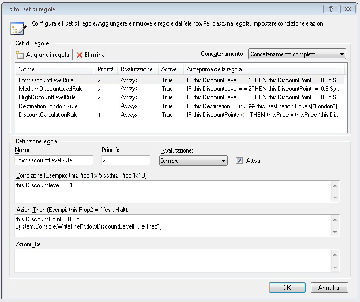
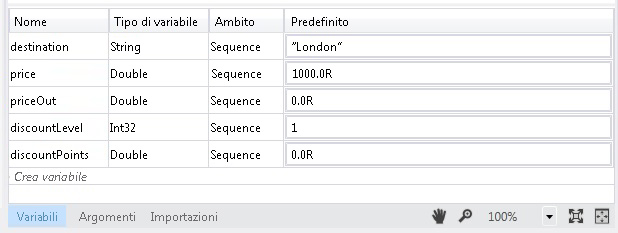
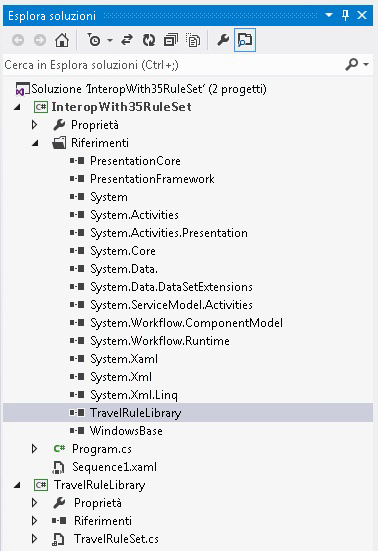
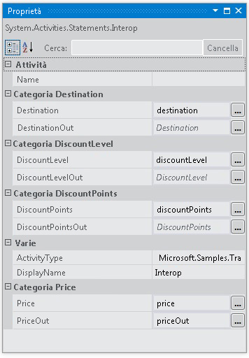

# Interoperabilit&#224; con il set di regole 3.5
In questo esempio viene illustrato l'uso dell'attività <xref:System.Activities.Statements.Interop> per l'integrazione con un'attività personalizzata in [!INCLUDE[netfx35_short](../../../../includes/netfx35-short-md.md)] tramite l'oggetto <xref:System.Workflow.Activities.Policy> e le regole.  Passa i dati all'attività personalizzata associando le variabili di [!INCLUDE[netfx_current_long](../../../../includes/netfx-current-long-md.md)] alle proprietà di dipendenza esposte dall'attività personalizzata.  
  
## Requisiti  
  
1.  [!INCLUDE[vs_current_long](../../../../includes/vs-current-long-md.md)]  
  
2.  [!INCLUDE[netfx_current_long](../../../../includes/netfx-current-long-md.md)]  
  
3.  [!INCLUDE[netfx35_long](../../../../includes/netfx35-long-md.md)]  
  
## Dimostrazione  
 Attività <xref:System.Activities.Statements.Interop> e attività <xref:System.Workflow.Activities.Policy> in [!INCLUDE[netfx35_short](../../../../includes/netfx35-short-md.md)] con proprietà di dipendenza  
  
## Discussione  
 Nell'esempio viene illustrato uno degli scenari di integrazione con un'attività [!INCLUDE[netfx35_short](../../../../includes/netfx35-short-md.md)].  In questo esempio è inclusa un'attività personalizzata di [!INCLUDE[netfx35_short](../../../../includes/netfx35-short-md.md)] che richiama un'attività <xref:System.Workflow.Activities.Policy>.  
  
## TravelRuleLibrary  
 L'apertura di TravelRuleSet.cs nella finestra di progettazione mostra un'attività sequenziale personalizzata contenente un'attività Policy come riportato di seguito  
  
   
  
 Fare doppio clic sull'attività dei criteri **DiscountPolicy** per esaminare le regole  che possono essere visualizzate nel relativo editor.  
  
   
  
 Fare clic con il pulsante destro del mouse sull'attività **DiscountPolicy** e selezionare l'opzione **Visualizza codice** per esaminare il codice C\# di tipo code\-beside incluso in questa attività.  Osservare l'impostazione della proprietà di dipendenza per l'oggetto `DiscountLevel`.  È uguale a un oggetto <xref:System.Activities.Argument> in [!INCLUDE[netfx_current_short](../../../../includes/netfx-current-short-md.md)].  
  
```  
public static DependencyProperty DiscountLevelProperty = DependencyProperty.Register("DiscountLevel", typeof(int), typeof(TravelRuleSet));  
  
[DescriptionAttribute("DiscountLevel")]  
[CategoryAttribute("DiscountLevel Category")]  
[BrowsableAttribute(true)]  
[DesignerSerializationVisibilityAttribute(DesignerSerializationVisibility.Visible)]  
public int DiscountLevel  
{  
   get  
   {  
return ((int)base.GetValue(TravelRuleSet.DiscountLevelProperty)));  
   }  
   set  
   {  
base.SetValue(TravelRuleSet.DiscountLevelProperty, value);  
   }  
}  
```  
  
## InteropWith35RuleSet  
 Si tratta di un flusso di lavoro sequenziale di [!INCLUDE[netfx_current_short](../../../../includes/netfx-current-short-md.md)] che usa l'attività <xref:System.Activities.Statements.Interop> per eseguire l'integrazione con l'oggetto RuleSet personalizzato creato nel progetto TravelRuleLibrary.  Le variabili vengono create nell'oggetto <xref:System.Activities.Statements.Sequence> di primo livello come riportato di seguito.  
  
   
  
   
  
 Infine, l'attività <xref:System.Activities.Statements.Interop> viene usata per eseguire l'integrazione con TravelRuleSet.  Le variabili dichiarate precedentemente nell'oggetto <xref:System.Activities.Statements.Sequence> vengono usate per eseguire l'associazione alle proprietà di dipendenza.  
  
   
  
   
  
   
  
> [!IMPORTANT]
>  È possibile che gli esempi siano già installati nel computer.  Verificare la directory seguente \(impostazione predefinita\) prima di continuare.  
>   
>  `<UnitàInstallazione>:\WF_WCF_Samples`  
>   
>  Se questa directory non esiste, andare alla sezione relativa agli [esempi di Windows Communication Foundation \(WCF\) e Windows Workflow Foundation \(WF\) per .NET Framework 4](http://go.microsoft.com/fwlink/?LinkId=150780) per scaricare tutti gli esempi di [!INCLUDE[indigo1](../../../../includes/indigo1-md.md)] e [!INCLUDE[wf1](../../../../includes/wf1-md.md)].  Questo esempio si trova nella directory seguente.  
>   
>  `<UnitàInstallazione>:\WF_WCF_Samples\WF\Basic\Built-InActivities\InteropWith35RuleSet`