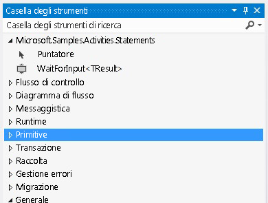

# Attivit&#224; WaitForInput
In questo esempio viene illustrato come creare segnalibri denominati in un flusso di lavoro.[!INCLUDE[wf](../../../../includes/wf-md.md)] non fornisce un'attività per la creazione dichiarativa del segnalibro.Pertanto, quando si desidera creare un segnalibro nel flusso di lavoro, è necessario scrivere un'attività personalizzata.L'attività `WaitForInput` definita in questo esempio fornisce questa funzionalità, in modo che gli utenti possano creare segnalibri in modo dichiarativo all'interno di un flusso di lavoro.  
  
## Progetti di questo esempio  
  
||||  
|-|-|-|  
|**Nome progetto**|**Descrizione**|**File principali**|  
|WaitForInput|Contiene l'attività `WaitForInput` e la relativa finestra di progettazione|WaitForInput.cs   Definizione dell'attività `WaitForInput`.|  
|||WaitForInputDesigner.xaml   Finestra di progettazione personalizzata per l'attività `WaitForInput`.|  
|||TypeToFirstGenericArgumentConverter.cs   Convertitore di tipi WPF utilizzato per aggiornare il tipo generico dell'attività nella finestra di progettazione.|  
|WaitForInputTestClient|Applicazione client di esempio che configura ed esegue un flusso di lavoro tramite diverse attività WaitForInput utilizzando la finestra di progettazione del flusso di lavoro.|Sequence1.xaml   Flusso di lavoro sequenziale che utilizza l'attività `WaitForInput`.|  
|||Program.cs   Esegue un'istanza del flusso di lavoro definito in Sequence1.xaml.|  
  
## Attività WaitForInput  
 L'attività `WaitForInput` crea un segnalibro denominato in un flusso di lavoro.Il segnalibro attende un segnale e riceve i dati del tipo configurato.Una volta ripreso il segnalibro, i dati passati nel flusso di lavoro sono disponibili tramite la proprietà `Result`.  
  
 L'attività `WaitForInput` deriva dalla classe <xref:System.Activities.NativeActivity> poiché deve creare segnalibri che saranno accessibili solo tramite la classe <xref:System.Activities.NativeActivityContext>.  
  
 L'attività dispone di tre attributi applicati per associare una finestra di progettazione, aggiungere la funzionalità di argomento generico che può essere aggiornata e impostare il tipo generico predefinito su string.L'attività dispone inoltre degli argomenti elencati nella tabella seguente.  
  
||||  
|-|-|-|  
|**Nome**|**Tipo**|**Descrizione**|  
|TResult|Argomento generico \(TResult\)|Tipo del segnalibro.Si tratta del tipo di dati da passare al segnalibro quando viene ripreso.|  
|BookmarkName|InArgument\<string\>|Nome del segnalibro.|  
|Result|InArgument\<TResult\>|Dati passati all'attività quando viene ripreso il segnalibro.|  
  
## ActivityDesigner WaitForInput  
 L'ActivityDesigner `WaitForInput` viene implementato nel file WaitForInputDesigner.xaml.L'attività `WaitForInput` e la relativa finestra di progettazione sono incluse nello stesso assembly.Nell'elemento grafico seguente viene mostrata l'attività `WaitForInput` nella casella degli strumenti all'interno di una categoria il cui nome è uguale a quello dell'assembly.  
  
   
  
 Nell'elemento grafico seguente viene mostrata la finestra di progettazione `WaitForInput`.Poiché l'attività `WaitForInput` è molto semplice, la finestra di progettazione consente l'impostazione diretta di tutti i relativi argomenti nell'area di progettazione.  
  
   
  
#### Per utilizzare questo esempio  
  
1.  In [!INCLUDE[vs2010](../../../../includes/vs2010-md.md)] aprire il file WaitForInput.sln.  
  
2.  Per compilare la soluzione, premere CTRL\+MAIUSC\+B.  
  
3.  Per avviare l'esempio senza debug, premere CTRL\+F5.  
  
> [!IMPORTANT]
>  È possibile che gli esempi siano già installati nel computer.Verificare la directory seguente \(impostazione predefinita\) prima di continuare.  
>   
>  `<UnitàInstallazione>:\WF_WCF_Samples`  
>   
>  Se questa directory non esiste, andare alla sezione relativa agli [esempi di Windows Communication Foundation \(WCF\) e Windows Workflow Foundation \(WF\) per .NET Framework 4](http://go.microsoft.com/fwlink/?LinkId=150780) per scaricare tutti gli esempi [!INCLUDE[indigo1](../../../../includes/indigo1-md.md)] e [!INCLUDE[wf1](../../../../includes/wf1-md.md)].Questo esempio si trova nella directory seguente.  
>   
>  `<UnitàInstallazione>:\WF_WCF_Samples\WF\Scenario\ActivityLibrary\WaitForInput`  
  
## Vedere anche