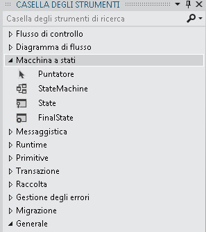

# Flussi di lavoro macchina a stati
Una macchina a stati è un paradigma noto per lo sviluppo di programmi.L'attività <xref:System.Activities.Statements.StateMachine> può essere utilizzata insieme all'oggetto <xref:System.Activities.Statements.State>, <xref:System.Activities.Statements.Transition> e ad altre attività per compilare programmi del flusso di lavoro macchina a stati.In questo argomento viene fornita una panoramica sulla creazione dei flussi di lavoro macchina a stati.  
  
## Panoramica sul flusso di lavoro macchina a stati  
 I flussi di lavoro macchina a stati forniscono uno stile di modellazione con cui è possibile modellare il flusso di lavoro in uso come se fosse basato sugli eventi.Un'attività <xref:System.Activities.Statements.StateMachine> contiene gli stati e le transizioni che costituiscono la logica della macchina a stati e può essere utilizzata ovunque ne sia possibile l'applicazione.Sono disponibili diverse classi nel runtime della macchina a stati:  
  
-   <xref:System.Activities.Statements.StateMachine>  
  
-   <xref:System.Activities.Statements.State>  
  
-   <xref:System.Activities.Statements.Transition>  
  
 Per creare un flusso di lavoro macchina a stati, gli stati vengono aggiunti a un'attività <xref:System.Activities.Statements.StateMachine> e le transizioni vengono utilizzate per controllare il flusso tra gli stati.Nella schermata seguente \(passaggio [Procedura: creare un flusso di lavoro della macchina a stati](../../../docs/framework/windows-workflow-foundation//how-to-create-a-state-machine-workflow.md) di [Esercitazione introduttiva](../../../docs/framework/windows-workflow-foundation//getting-started-tutorial.md)\) viene mostrato un flusso di lavoro macchina a stati con tre stati e tre transizioni.**Initialize Target** è lo stato iniziale e rappresenta il primo stato nel flusso di lavoro.È designato dalla linea che porta a quest'ultimo dal nodo **Start**.Lo stato finale nel flusso di lavoro è denominato **FinalState** e rappresenta il punto in corrispondenza del quale il flusso di lavoro viene completato.  
  
   
  
 In un flusso di lavoro macchina a stati deve essere disponibile un unico stato iniziale e almeno uno stato finale.Ogni stato che non è finale deve disporre di almeno una transizione.Le sezioni seguenti riguardano la creazione e la configurazione degli stati e delle transizioni.  
  
## Creazione e configurazione degli stati  
 Un oggetto <xref:System.Activities.Statements.State> rappresenta uno stato in cui può trovarsi una macchina a stati.Per aggiungere un oggetto <xref:System.Activities.Statements.State> a un flusso di lavoro, trascinare l'ActivityDesigner **Stato** dalla sezione **Macchina a stati** della **Casella degli strumenti** e rilasciarlo su un'attività <xref:System.Activities.Statements.StateMachine> nell'area di [!INCLUDE[wfd1](../../../includes/wfd1-md.md)].  
  
   
  
 Per configurare uno stato come **Stato iniziale**, fare clic con il pulsante destro del mouse sullo stato e selezionare **Imposta come Stato iniziale**.Inoltre, se non vi è uno stato iniziale corrente, è possibile designarne uno tracciando una linea dal nodo **Start**, nella parte superiore del flusso di lavoro, allo stato desiderato.Quando un'attività <xref:System.Activities.Statements.StateMachine> viene rilasciata in Progettazione flussi di lavoro, essa viene preconfigurata con uno stato iniziale denominato **State1**.In un flusso di lavoro macchina a stati deve essere disponibile un unico stato iniziale.  
  
 Uno stato che rappresenta quello di chiusura in una macchina a stati è denominato stato finale.Uno stato finale è uno stato la cui relativa proprietà <xref:System.Activities.Statements.State.IsFinal%2A> è impostata su `true`, è privo di attività <xref:System.Activities.Statements.State.Exit%2A> e non presenta alcuna transizione che abbia origine da esso.Per aggiungere uno stato finale a un flusso di lavoro, trascinare un ActivityDesigner **FinalState** dalla sezione **Macchina a stati** della **Casella degli strumenti** e rilasciarlo su un'attività <xref:System.Activities.Statements.StateMachine> nell'area di [!INCLUDE[wfd1](../../../includes/wfd1-md.md)].Un flusso di lavoro macchina a stati deve disporre di almeno uno stato finale.  
  
### Configurazione delle azioni di ingresso e di uscita  
 Uno stato può disporre di un'azione <xref:System.Activities.Statements.State.Entry%2A> e di una <xref:System.Activities.Statements.State.Exit%2A>.Uno stato configurato come finale può disporre solo di un'azione di ingresso.Quando un'istanza del flusso di lavoro passa a uno stato, tutte le attività nell'azione in ingresso vengono eseguite.Quando l'azione di ingresso viene completata, i trigger per le transizioni di stato vengono pianificati.Quando una transizione a un altro stato viene confermata, le attività nell'azione di uscita vengono eseguite, anche se le transizioni di stato tornano allo stesso stato.Al termine dell'azione di uscita, le attività nell'azione della transizione vengono eseguite, quindi si passa al nuovo stato e le relative azioni di ingresso vengono pianificate.  
  
> [!NOTE]
>  Durante il debug di un flusso di lavoro macchina a stati, i punti di interruzione possono essere inseriti nell'attività e negli stati della macchina a stati del relativo flusso di lavoro.È possibile che i punti di interruzione non siano inseriti direttamente nelle transizioni, bensì in tutte le attività contenute all'interno degli stati e delle transizioni.  
  
## Creazione e configurazione delle transizioni  
 Tutti gli stati devono disporre di almeno una transizione, ad eccezione di uno stato finale che non può presentare alcuna transizione.Le transizioni possono essere aggiunte dopo l'aggiunta di uno stato al flusso di lavoro macchina a stati. In alternativa, possono essere create quando lo stato viene eliminato.  
  
 Per aggiungere un oggetto <xref:System.Activities.Statements.State> e creare una transizione in un passaggio, trascinare un'attività **Stato** dalla sezione **Macchina a stati** della **Casella degli strumenti** e passarla su un altro stato in Progettazione flussi di lavoro.Quando l'oggetto <xref:System.Activities.Statements.State> trascinato si trova su un altro oggetto <xref:System.Activities.Statements.State>, intorno a quest'ultimo verranno visualizzati quattro triangoli.Se l'oggetto <xref:System.Activities.Statements.State> viene rilasciato su uno dei quattro triangoli, viene aggiunto alla macchina a stati e una transizione viene creata dall'oggetto <xref:System.Activities.Statements.State> di origine all'oggetto <xref:System.Activities.Statements.State> di destinazione rilasciato.Per ulteriori informazioni, vedere [ActivityDesigner Transition](../Topic/Transition%20Activity%20Designer.md).  
  
 Per creare una transizione dopo l'aggiunta di uno stato sono disponibili due opzioni.La prima consiste nel trascinare lo stato dall'area di Progettazione flussi di lavoro, passarlo su uno stato esistente, quindi rilasciarlo su uno dei punti di trascinamento.Questa operazione è molto simile al metodo descritto nella sezione precedente.È inoltre possibile passare il mouse sullo stato di origine desiderato e tracciare una linea allo stato di destinazione scelto.  
  
> [!NOTE]
>  Un singolo stato in una macchina a stati può essere composto da un massimo di 76 transizioni create mediante Progettazione flussi di lavoro.Il limite alle transizioni per uno stato per i flussi di lavoro creati all'esterno della finestra di progettazione è stabilito solo dalle risorse di sistema.  
  
 Una transizione può disporre delle proprietà <xref:System.Activities.Statements.Transition.Trigger%2A>, <xref:System.Activities.Statements.Transition.Condition%2A> e <xref:System.Activities.Statements.Transition.Action%2A>.La proprietà <xref:System.Activities.Statements.Transition.Trigger%2A> di una transizione viene pianificata al completamento dell'azione <xref:System.Activities.Statements.State.Entry%2A> dello stato di origine della transizione.In genere, la proprietà <xref:System.Activities.Statements.Transition.Trigger%2A> è un'attività in attesa del verificarsi di alcuni tipi di evento, ma può trattarsi di una qualsiasi attività o di nessuna attività.Una volta completata l'attività <xref:System.Activities.Statements.Transition.Trigger%2A>, la proprietà <xref:System.Activities.Statements.Transition.Condition%2A>, se presente, viene valutata.Se non è disponibile alcuna attività <xref:System.Activities.Statements.Transition.Trigger%2A>, viene valutata immediatamente la proprietà <xref:System.Activities.Statements.Transition.Condition%2A>.Se viene restituito `false` dalla condizione, la transizione viene annullata e l'attività <xref:System.Activities.Statements.Transition.Trigger%2A> per tutte le transizioni dallo stato viene ripianificata.Se vi sono altre transizioni che condividono lo stesso stato di origine della transizione corrente, le azioni <xref:System.Activities.Statements.Transition.Trigger%2A> vengono annullate, nonché ripianificate.Se la proprietà <xref:System.Activities.Statements.Transition.Condition%2A> restituisce `true`, o non esiste alcuna condizione, viene eseguita l'azione <xref:System.Activities.Statements.State.Exit%2A> dello stato di origine, quindi viene eseguita la proprietà <xref:System.Activities.Statements.Transition.Action%2A> della transizione.Quando la proprietà <xref:System.Activities.Statements.Transition.Action%2A> viene completata, il controllo passa allo stato **Destinazione**.  
  
 Le transizioni che condividono un trigger comune sono note come transizioni del trigger condivise.Ogni transizione in un gruppo di transizioni del trigger condivise ha lo stesso trigger, ma una proprietà <xref:System.Activities.Statements.Transition.Condition%2A> e un'azione univoche.Per aggiungere altre azioni a una transizione e creare una transizione condivisa, fare clic sul cerchio che indica l'inizio della transizione desiderata e trascinarlo nello stato desiderato.La nuova transizione condividerà uno stesso trigger della transizione iniziale, ma avrà una condizione e un'azione univoche.Le transizioni condivise possono essere inoltre create dalla finestra di progettazione della transizione facendo clic su **Aggiungi transizione del trigger condivisa** nella parte inferiore della finestra di progettazione della transizione e selezionando lo stato di destinazione desiderato dall'elenco a discesa **Stati disponibili per la connessione**.  
  
> [!NOTE]
>  Si noti che se <xref:System.Activities.Statements.Transition.Condition%2A> di una transizione restituisce `False` \(o tutti gli stati di una transizione trigger condivisa restituiscono `False`\), la transizione non si verificherà e tutti i trigger per tutte le transizioni dallo stato verranno rinviati.  
  
 Per ulteriori informazioni sulla creazione di flussi di lavoro di macchine a stati, vedere [Procedura: creare un flusso di lavoro della macchina a stati](../../../docs/framework/windows-workflow-foundation//how-to-create-a-state-machine-workflow.md), [ActivityDesigner StateMachine](../Topic/StateMachine%20Activity%20Designer.md), [ActivityDesigner State](../Topic/State%20Activity%20Designer.md), [ActivityDesigner FinalState](../Topic/FinalState%20Activity%20Designer.md) e [ActivityDesigner Transition](../Topic/Transition%20Activity%20Designer.md).  
  
## Terminologia della macchina a stati  
 In questa sezione viene definito il vocabolario della macchina a stati utilizzato in questo argomento.  
  
 State  
 L'unità di base che costituisce una macchina a stati.Una macchina a stati può trovarsi in uno stato in qualsiasi momento particolare.  
  
 Azione di ingresso  
 Un'attività eseguita quando si passa a uno stato.  
  
 Azione di uscita  
 Un'attività eseguita quando si esce da uno stato.  
  
 Transizione  
 Una relazione diretta tra due stati che rappresenta la risposta completa di una macchina a stati al verificarsi di un evento di un tipo particolare.  
  
 Transizione condivisa  
 Una transizione che condivide uno stato e un trigger di origine con una o più transizioni, ma dispone di una condizione e un'azione univoche.  
  
 Trigger  
 Un'attività di trigger che genera una transizione.  
  
 Condizione  
 Un vincolo che deve restituire `true` dopo il verificarsi del trigger affinché la transizione venga completata.  
  
 Azione di transizione  
 Un'attività che viene eseguita quando si effettua una determinata transizione.  
  
 Transizione condizionale  
 Una transizione con una condizione esplicita.  
  
 Transizione autodirezionale  
 Una transizione che passa da uno stato a se stessa.  
  
 Stato iniziale  
 Uno stato che rappresenta il punto iniziale della macchina a stati.  
  
 Stato finale  
 Uno stato che rappresenta il completamento della macchina a stati.  
  
## Vedere anche  
 [Procedura: creare un flusso di lavoro della macchina a stati](../../../docs/framework/windows-workflow-foundation//how-to-create-a-state-machine-workflow.md)   
 [ActivityDesigner StateMachine](../Topic/StateMachine%20Activity%20Designer.md)   
 [ActivityDesigner State](../Topic/State%20Activity%20Designer.md)   
 [ActivityDesigner FinalState](../Topic/FinalState%20Activity%20Designer.md)   
 [ActivityDesigner Transition](../Topic/Transition%20Activity%20Designer.md)