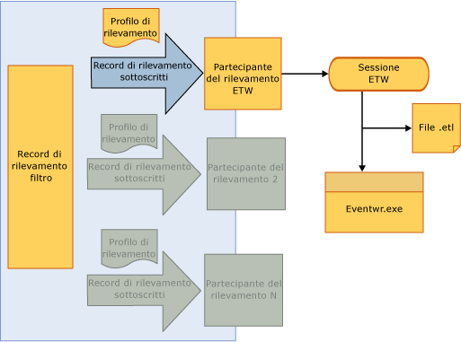

# Partecipanti del rilevamento
I partecipanti del rilevamento sono punti di estensibilità che consentono a uno sviluppatore di flussi di lavoro di accedere a oggetti <xref:System.Activities.Tracking.InteropTrackingRecord.TrackingRecord%2A> e di elaborarli.  In [!INCLUDE[netfx_current_long](../../../includes/netfx-current-long-md.md)] viene fornito un partecipante del rilevamento standard che scrive record di rilevamento come eventi ETW \(Event Tracing for Windows\).  Se tale partecipante non soddisfa i propri requisiti, è anche possibile scrivere un partecipante del rilevamento personalizzato.  
  
## Partecipanti del rilevamento  
 L'infrastruttura di rilevamento consente l'applicazione di un filtro ai record di rilevamento in uscita in modo che un partecipante possa sottoscrivere un subset dei record.  Il meccanismo di applicazione di un filtro avviene tramite un profilo di rilevamento.  
  
 [!INCLUDE[wf](../../../includes/wf-md.md)] in [!INCLUDE[netfx_current_short](../../../includes/netfx-current-short-md.md)] fornisce un partecipante del rilevamento mediante il quale vengono scritti i record di rilevamento in una sessione ETW.  Il partecipante viene configurato su un servizio flusso di lavoro aggiungendo un comportamento specifico del rilevamento in un file di configurazione.  L'abilitazione di un partecipante del rilevamento ETW consente la visualizzazione dei record di rilevamento nel Visualizzatore eventi.  L'esempio SDK per il rilevamento basato su ETW rappresenta un buon metodo per acquisire familiarità con il rilevamento WF tramite il partecipante del rilevamento basato su ETW.  
  
## Partecipante del rilevamento ETW  
 [!INCLUDE[netfx_current_short](../../../includes/netfx-current-short-md.md)] include un partecipante del rilevamento ETW mediante il quale vengono scritti i record di rilevamento in una sessione ETW.  Questa operazione viene eseguita in modo molto efficiente con un impatto minimo sulle prestazioni dell'applicazione o sulla velocità effettiva del server.  Un vantaggio associato all'utilizzo del partecipante del rilevamento ETW standard è la possibilità di visualizzare i record di rilevamento ricevuti con altri registri applicazioni e di sistema nel Visualizzatore eventi di Windows.  
  
 Il partecipante del rilevamento ETW standard viene configurato nel file Web.config come illustrato nell'esempio seguente.  
  
```  
<configuration>  
  <system.web>  
    <compilation debug="true" targetFramework="4.0" />  
  </system.web>  
  <system.serviceModel>  
    <behaviors>  
      <serviceBehaviors>  
        <behavior>  
          <etwTracking profileName="Sample Tracking Profile"/>  
        </behavior>  
      </serviceBehaviors>  
    </behaviors>  
   <tracking>  
      <profiles>  
        <trackingProfile name="Sample Tracking Profile">  
        ….  
       </trackingProfile>  
      </profiles>  
    </tracking>  
  </system.serviceModel>  
</configuration>  
```  
  
> [!NOTE]
>  Se non è specificato un nome per `trackingProfile`, ad esempio `<etwTracking/>` o `<etwTracking profileName=""/>`, viene usato il profilo di rilevamento predefinito installato con [!INCLUDE[netfx_current_short](../../../includes/netfx-current-short-md.md)] nel file Machine.config.  
  
 Il profilo di rilevamento predefinito disponibile in tale file consente di sottoscrivere record ed errori di istanze di flussi di lavoro.  
  
 In ETW gli eventi vengono scritti nella sessione ETW tramite un ID provider.  L'ID provider usato dal partecipante del rilevamento ETW per scrivere i record di rilevamento in ETW è definito nella sezione relativa alla diagnostica del file Web.config \(in `<system.serviceModel><diagnostics>`\).  Per impostazione predefinita, il partecipante del rilevamento ETW usa un ID provider predefinito quando non ne è stato specificato uno, come illustrato nell'esempio seguente.  
  
```  
<system.serviceModel>  
        <diagnostics etwProviderId="52A3165D-4AD9-405C-B1E8-7D9A257EAC9F" />  
```  
  
 Nell'illustrazione seguente viene mostrato il flusso di dati di rilevamento tramite il partecipante del rilevamento ETW.  Una volta che i dati di rilevamento hanno raggiunto la sessione ETW, è possibile accedervi in diversi modi.  Uno dei modi più utili per accedere a questi eventi è tramite il Visualizzatore eventi, uno strumento Windows comune usato per la visualizzazione di log e di tracce da applicazioni e servizi.  
  
   
  
## Dati evento del partecipante del rilevamento  
 Un partecipante del rilevamento serializza i dati evento rilevati in una sessione ETW nel formato di un evento per il record di rilevamento.  Un evento viene identificato usando un ID compreso nell'intervallo tra 100 e 199.  Per le definizioni dei record dell'evento di rilevamento creati da un partecipante del rilevamento, vedere l'argomento [Riferimento agli eventi di rilevamento](../../../docs/framework/windows-workflow-foundation//tracking-events-reference.md).  
  
 La dimensione di un evento ETW è limitata da quella del buffer ETW o dal payload massimo per un evento ETW, a seconda di quale dimensione è minore.  Se la dimensione dell'evento supera entrambi questi limiti ETW, l'evento viene troncato e il relativo contenuto rimosso in maniera arbitraria.  Variabili, argomenti, annotazioni e dati personalizzati non vengono rimossi in modo selettivo.  In caso di troncamento, tutti gli elementi vengono troncati indipendentemente dal valore che ha causato il superamento del limite ETW della dimensione dell'evento.  I dati rimossi vengono sostituiti con `<item>..<item>`.  
  
 I tipi complessi in variabili, argomenti ed elementi di dati personalizzati vengono serializzati nel record dell'evento ETW usando la [Classe NetDataContractSerializer](http://go.microsoft.com/fwlink/?LinkId=177537).  Questa classe include informazioni sul tipo CLR nel flusso XML serializzato.  
  
 Il troncamento di dati payload dovuto ai limiti ETW può comportare l'invio di record di rilevamento duplicati a una sessione ETW.  Questa situazione si può verificare se più sessioni restano in ascolto di eventi. Le sessioni presentano limiti di payload differenti per gli eventi.  
  
 L'evento della sessione con il limite inferiore può essere troncato.  Il partecipante del rilevamento ETW non è informato sul numero di sessioni in attesa di eventi. Se un evento viene troncato per una sessione, il partecipante ETW ritenta l'invio dell'evento una volta.  In questo caso la sessione configurata per accettare una dimensione del payload maggiore otterrà l'evento due volte \(l'evento non troncato e quello troncato\).  La duplicazione può essere evitata configurando tutte le sessioni ETW con gli stessi limiti di dimensione del buffer.  
  
## Accesso ai dati di rilevamento da un partecipante ETW nel Visualizzatore eventi  
 L'accesso agli eventi scritti in una sessione ETW dal partecipante del rilevamento ETW può essere eseguito tramite il Visualizzatore eventi \(in caso di utilizzo dell'ID provider predefinito\).  In questo modo è possibile visualizzare rapidamente i record di rilevamento creati dal flusso di lavoro.  
  
> [!NOTE]
>  Gli eventi del record di rilevamento creati in una sessione ETW usano gli ID evento compresi nell'intervallo tra 100 e 199.  
  
#### Per abilitare la visualizzazione dei record di rilevamento nel Visualizzatore eventi  
  
1.  Avviare il Visualizzatore eventi \(EVENTVWR.EXE\).  
  
2.  Selezionare **Visualizzatore eventi, Registri applicazioni e servizi, Microsoft, Windows, Server applicazioni\-Applicazioni**.  
  
3.  Fare clic con il pulsante destro del mouse e assicurarsi che l'opzione **Visualizza, Visualizza registri analitici e di debug** sia selezionata.  In caso contrario, selezionarlo in modo che accanto venga visualizzato il segno di spunta.  Verranno visualizzati i log **Analitico**, **Prestazioni** e **Debug**.  
  
4.  Fare clic con il pulsante destro del mouse sul log **Analitico** e selezionare **Attiva registro**.  Il log sarà disponibile nel file %SystemRoot%\\System32\\Winevt\\Logs\\Microsoft\-Windows\-Application Server\-Applications%4Analytic.etl.  
  
## Partecipante di rilevamento personalizzato  
 L'API del partecipante del rilevamento consente l'estensione del runtime di rilevamento con un partecipante del rilevamento fornito dall'utente che può includere la logica personalizzata per gestire i record di rilevamento creati dall'esecuzione del flusso di lavoro.  Per scrivere un partecipante del rilevamento personalizzato, lo sviluppatore deve implementare il metodo `Track` sulla classe <xref:System.Activities.Tracking.TrackingParticipant>.  Questo metodo viene chiamato quando un record di rilevamento viene creato dall'esecuzione del flusso di lavoro.  
  
 I partecipanti del rilevamento derivano dalla classe <xref:System.Activities.Tracking.TrackingParticipant>.  L'oggetto <xref:System.Activities.Tracking.EtwTrackingParticipant> fornito dal sistema crea una registrazione degli eventi per Windows \(ETW, Event Tracking for Windows\) per ogni record di rilevamento ricevuto.  Per creare un partecipante del rilevamento personalizzato, viene creata una classe derivata dall'oggetto <xref:System.Activities.Tracking.TrackingParticipant>.  Per fornire una funzionalità di rilevamento di base, eseguire l'override di <xref:System.Activities.Tracking.TrackingParticipant.Track%2A>.  Il metodo <xref:System.Activities.Tracking.TrackingParticipant.Track%2A> viene chiamato quando un record di rilevamento viene inviato dal runtime e può essere elaborato nel modo desiderato.  Nell'esempio seguente viene definita una classe del partecipante del rilevamento personalizzata che crea tutti i record di rilevamento nella finestra della console.  È possibile implementare anche un oggetto <xref:System.Activities.Tracking.TrackingParticipant> che elabora i record di rilevamento in modo asincrono usando i relativi metodi `BeginTrack` e `EndTrack`  
  
```csharp  
class ConsoleTrackingParticipant : TrackingParticipant  
{  
    protected override void Track(TrackingRecord record, TimeSpan timeout)  
    {  
        if (record != null)  
        {  
            Console.WriteLine("=================================");  
            Console.WriteLine(record);  
        }  
    }  
}  
```  
  
 Per usare un determinato partecipante del rilevamento, registrarlo con l'istanza del flusso di lavoro che si desidera rilevare, come illustrato nell'esempio seguente.  
  
```csharp  
myInstance.Extensions.Add(new ConsoleTrackingParticipant());  
```  
  
 Nell'esempio seguente viene creato un flusso di lavoro costituito da un'attività <xref:System.Activities.Statements.Sequence> che contiene un'attività <xref:System.Activities.Statements.WriteLine>.  L'oggetto `ConsoleTrackingParticipant` viene aggiunto alle estensioni e il flusso di lavoro viene richiamato.  
  
```csharp  
Activity activity= new Sequence()  
{  
    Activities =  
    {  
        new WriteLine()  
        {  
            Text = "Hello World."  
        }  
    }  
};  
  
WorkflowApplication instance = new WorkflowApplication(activity);  
  
instance.Extensions.Add(new ConsoleTrackingParticipant());  
  instance.Completed = delegate(WorkflowApplicationCompletedEventArgs e)  
            {  
                Console.WriteLine("workflow instance completed, Id = " + instance.Id);  
                resetEvent.Set();  
            };  
            instance.Run();  
            Console.ReadLine();  
  
```  
  
## Vedere anche  
 [Concetti di monitoraggio](http://go.microsoft.com/fwlink/?LinkId=201273)   
 [Monitoraggio delle applicazioni](http://go.microsoft.com/fwlink/?LinkId=201275)