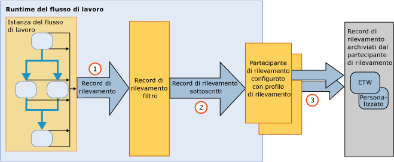

# Rilevamento e traccia del flusso di lavoro
Il rilevamento del flusso di lavoro di Windows è una funzionalità di [!INCLUDE[netfx_current_long](../../../includes/netfx-current-long-md.md)] progettata per fornire visibilità nell'esecuzione del flusso di lavoro.Fornisce un'infrastruttura di rilevamento per individuare l'esecuzione di un'istanza del flusso di lavoro.L'infrastruttura di rilevamento di WF instrumenta in modo trasparente un flusso di lavoro per creare record che riflettono gli eventi principali durante l'esecuzione.Questa funzionalità è disponibile per impostazione predefinita per qualsiasi flusso di lavoro di [!INCLUDE[netfx_current_short](../../../includes/netfx-current-short-md.md)].Non è necessario apportare alcuna modifica a un flusso di lavoro di [!INCLUDE[netfx_current_long](../../../includes/netfx-current-long-md.md)] affinché si verifichi il rilevamento.Si tratta solo di decidere quanti dati di rilevamento si desidera ricevere.Quando un'istanza del flusso di lavoro viene avviata o completata, vengono creati i relativi record di rilevamento dell'elaborazione.Il rilevamento consente inoltre di estrarre dati relativi all'azienda associati alle variabili del flusso di lavoro.Se, ad esempio, il flusso di lavoro rappresenta un sistema di elaborazione degli ordini, l'ID dell'ordine può essere estratto insieme all'oggetto <xref:System.Activities.Tracking.TrackingRecord>.In generale, l'abilitazione del rilevamento di WF semplifica la diagnostica o l'accesso ai dati di analisi aziendale dall'esecuzione di un flusso di lavoro.  
  
 Questi componenti di rilevamento equivalgono al servizio di rilevamento di [!INCLUDE[vstecwinfx](../../../includes/vstecwinfx-md.md)].In [!INCLUDE[netfx_current_short](../../../includes/netfx-current-short-md.md)], le prestazioni sono state migliorate e il modello di programmazione semplificato per la funzionalità di rilevamento di WF.L'esecuzione del rilevamento instrumenta un'istanza del flusso di lavoro per creare gli eventi correlati al ciclo di vita del flusso di lavoro, le attività del flusso di lavoro e gli eventi personalizzati.  
  
 Windows Server AppFabric consente anche di monitorare l'esecuzione dei servizi WCF e del flusso di lavoro.[!INCLUDE[crdefault](../../../includes/crdefault-md.md)][Concetti di monitoraggio](http://go.microsoft.com/fwlink/?LinkId=201273) e [Monitoraggio delle applicazioni](http://go.microsoft.com/fwlink/?LinkId=201287)  
  
 Per risolvere i problemi relativi all'esecuzione del flusso di lavoro, è possibile attivare la traccia del flusso di lavoro di diagnostica.[!INCLUDE[crdefault](../../../includes/crdefault-md.md)][Traccia del flusso di lavoro](../../../docs/framework/windows-workflow-foundation//workflow-tracing.md).  
  
 Per capire il modello di programmazione, i componenti principali dell'infrastruttura di rilevamento vengono illustrati in questo argomento:  
  
-   Oggetti <xref:System.Activities.Tracking.TrackingRecord> creati dall'esecuzione del flusso di lavoro.[!INCLUDE[crdefault](../../../includes/crdefault-md.md)][Record di rilevamento](../../../docs/framework/windows-workflow-foundation//tracking-records.md).  
  
-   Gli oggetti <xref:System.Activities.Tracking.TrackingParticipant> sottoscrivono gli oggetti <xref:System.Activities.Tracking.TrackingRecord>.I partecipanti del rilevamento contengono la logica per elaborare il payload dagli oggetti <xref:System.Activities.Tracking.TrackingRecord>, ad esempio possono scegliere di scrivere in un file.[!INCLUDE[crdefault](../../../includes/crdefault-md.md)][Partecipanti del rilevamento](../../../docs/framework/windows-workflow-foundation//tracking-participants.md).  
  
-   Gli oggetti <xref:System.Activities.Tracking.TrackingProfile> filtrano i record di rilevamento creati da un'istanza del flusso di lavoro.[!INCLUDE[crdefault](../../../includes/crdefault-md.md)][Profili di rilevamento](../../../docs/framework/windows-workflow-foundation//tracking-profiles.md).  
  
## Infrastruttura di rilevamento del flusso di lavoro  
 L'infrastruttura di rilevamento del flusso di lavoro segue un paradigma pubblicazione\-sottoscrizione.L'istanza del flusso di lavoro è l'autore dei record di rilevamento, mentre i sottoscrittori dei record di rilevamento vengono registrati come estensioni al flusso di lavoro.Queste estensioni che sottoscrivono gli oggetti <xref:System.Activities.Tracking.TrackingRecord> vengono definite partecipanti del rilevamento.I partecipanti del rilevamento sono punti di estensibilità che accedono agli oggetti <xref:System.Activities.Tracking.TrackingRecord> e li elaborano nel modo in cui sono scritti per tale scopo.L'infrastruttura di rilevamento consente l'applicazione di un filtro ai record di rilevamento in uscita in modo che un partecipante possa sottoscrivere un subset dei record.Questo meccanismo di applicazione di filtri è garantito da un file del profilo di rilevamento.  
  
 Nell'illustrazione seguente viene mostrata una visualizzazione di alto livello dell'infrastruttura di rilevamento.  
  
   
  
## In questa sezione  
 [Record di rilevamento](../../../docs/framework/windows-workflow-foundation//tracking-records.md)  
 Vengono descritti i record di rilevamento creati dall'esecuzione del flusso di lavoro.  
  
 [Profili di rilevamento](../../../docs/framework/windows-workflow-foundation//tracking-profiles.md)  
 Viene descritto l'utilizzo dei profili di rilevamento.  
  
 [Partecipanti del rilevamento](../../../docs/framework/windows-workflow-foundation//tracking-participants.md)  
 Viene descritto l'utilizzo del partecipante del rilevamento fornito dal sistema o la creazione di partecipanti del rilevamento personalizzati.  
  
 [Configurazione del rilevamento per un flusso di lavoro](../../../docs/framework/windows-workflow-foundation//configuring-tracking-for-a-workflow.md)  
 Viene descritta la configurazione del rilevamento per un flusso di lavoro.  
  
 [Traccia del flusso di lavoro](../../../docs/framework/windows-workflow-foundation//workflow-tracing.md)  
 Vengono descritte le due modalità di abilitazione della traccia di debug per un flusso di lavoro.  
  
 [Determinazione della durata di esecuzione del flusso di lavoro tramite traccia](../../../docs/framework/windows-workflow-foundation//determining-workflow-execution-duration-using-tracing.md)  
 Viene descritto come utilizzare i messaggi di tracciatura per determinare la durata di esecuzione di un flusso di lavoro.  
  
## Vedere anche  
 [Rilevamento SQL](../../../docs/framework/windows-workflow-foundation/samples/sql-tracking.md)