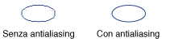

# Anti-aliasing con linee e curve
Per tracciare una linea tramite [!INCLUDE[ndptecgdiplus](../../../../includes/ndptecgdiplus-md.md)], è necessario specificare i punti iniziale e finale della linea ma non le informazioni sui singoli pixel.  [!INCLUDE[ndptecgdiplus](../../../../includes/ndptecgdiplus-md.md)] opera congiuntamente al software del driver video per determinare i pixel da attivare per mostrare la linea in un particolare dispositivo di visualizzazione.  
  
## Aliasing  
 Si prenda in considerazione la linea retta rossa che unisce il punto \(4, 2\) al punto \(16, 10\).  Si supponga che l'origine del sistema di coordinate si trovi nell'angolo superiore sinistro e che l'unità di misura sia il pixel.  Si supponga inoltre che l'asse x sia rivolto verso destra e l'asse y verso il basso.  Nell'immagine seguente viene mostrato un ingrandimento della linea rossa tracciata su uno sfondo multicolore.  
  
   
  
 Si noti che i pixel rossi utilizzati per il rendering della linea sono opachi.  Lungo la linea non sono presenti pixel parzialmente trasparenti.  Questo tipo di rendering attribuisce alla linea un aspetto irregolare: la linea assomiglia infatti quasi a una scala.  La tecnica di rappresentazione di una linea come una scala è definita aliasing: la scala è un alias della linea teorica.  
  
## Anti\-aliasing  
 Una tecnica più avanzata per il rendering di una linea implica l'utilizzo di pixel parzialmente trasparenti insieme ai pixel opachi.  Il colore dei pixel è impostato su rosso puro o su una fusione di rosso e del colore dello sfondo in base alla vicinanza dei pixel alla linea.  Questo tipo di rendering è definito antialias e consente di ottenere una linea che viene percepita come maggiormente uniforme.  Nell'immagine seguente viene mostrata la fusione di alcuni pixel con il colore dello sfondo per creare una linea di tipo antialias.  
  
   
  
 È possibile applicare l'anti\-aliasing \(smussamento\) anche alle curve.  Nell'immagine seguente viene mostrato un ingrandimento di un'ellisse smussata.  
  
   
  
 Nell'immagine seguente viene mostrata la stessa ellisse a dimensioni effettive, senza e con anti\-aliasing.  
  
   
  
 Per tracciare linee e curve che utilizzano l'anti\-aliasing, creare un'istanza della classe <xref:System.Drawing.Graphics> e impostarne la proprietà <xref:System.Drawing.Graphics.SmoothingMode%2A> su <xref:System.Drawing.Drawing2D.SmoothingMode> o su <xref:System.Drawing.Drawing2D.SmoothingMode>.  Chiamare quindi uno dei metodi di disegno della stessa classe <xref:System.Drawing.Graphics>.  
  
 [!code-csharp[LinesCurvesAndShapes#81](../../../../samples/snippets/csharp/VS_Snippets_Winforms/LinesCurvesAndShapes/CS/Class1.cs#81)]
 [!code-vb[LinesCurvesAndShapes#81](../../../../samples/snippets/visualbasic/VS_Snippets_Winforms/LinesCurvesAndShapes/VB/Class1.vb#81)]  
  
## Vedere anche  
 <xref:System.Drawing.Drawing2D.SmoothingMode?displayProperty=fullName>   
 [Linee, curve e forme](../../../../docs/framework/winforms/advanced/lines-curves-and-shapes.md)   
 [Procedura: utilizzare l'antialiasing nel testo](../../../../docs/framework/winforms/advanced/how-to-use-antialiasing-with-text.md)