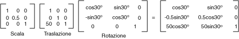

# Trasformazioni globali e locali
Una trasformazione globale è una trasformazione che influisce su tutti gli elementi tracciati da un dato oggetto <xref:System.Drawing.Graphics>.  Una trasformazione locale, invece, è una trasformazione che influisce su un elemento specifico da tracciare.  
  
## Trasformazioni globali  
 Per creare una trasformazione globale, costruire un oggetto <xref:System.Drawing.Graphics>, quindi modificarne la proprietà <xref:System.Drawing.Graphics.Transform%2A>.  Tale proprietà è un oggetto <xref:System.Drawing.Drawing2D.Matrix>, quindi è in grado di contenere qualunque sequenza di trasformazioni affini.  La trasformazione memorizzata nella proprietà <xref:System.Drawing.Graphics.Transform%2A> viene denominata trasformazione complessiva.  Nella classe <xref:System.Drawing.Graphics> sono disponibili svariati metodi per la compilazione di una trasformazione complessiva composta: <xref:System.Drawing.Graphics.MultiplyTransform%2A>, <xref:System.Drawing.Graphics.RotateTransform%2A>, <xref:System.Drawing.Graphics.ScaleTransform%2A> e <xref:System.Drawing.Graphics.TranslateTransform%2A>.  L'esempio seguente consente di tracciare due volte un'ellisse: una volta prima della creazione di una trasformazione complessiva e una volta dopo tale creazione.  Durante la trasformazione l'ellisse viene ridimensionata con un fattore di 0,5 in direzione y, quindi traslata di 50 unità in direzione x e infine ruotata di 30 gradi.  
  
 [!code-csharp[System.Drawing.CoordinateSystems#21](../../../../samples/snippets/csharp/VS_Snippets_Winforms/System.Drawing.CoordinateSystems/CS/Class1.cs#21)]
 [!code-vb[System.Drawing.CoordinateSystems#21](../../../../samples/snippets/visualbasic/VS_Snippets_Winforms/System.Drawing.CoordinateSystems/VB/Class1.vb#21)]  
  
 Nell'immagine seguente vengono mostrate le matrici utilizzate durante la trasformazione.  
  
   
  
> [!NOTE]
>  Nell'esempio precedente l'ellisse viene ruotata lungo l'origine del sistema di coordinate, situata nell'angolo superiore sinistro dell'area client.  Il risultato prodotto da tale rotazione differisce dal risultato ottenuto tramite una rotazione dell'ellisse lungo il centro.  
  
## Trasformazioni locali  
 Un trasformazione locale influisce su uno specifico elemento da tracciare.  Nell'oggetto <xref:System.Drawing.Drawing2D.GraphicsPath> ad esempio è disponibile il metodo <xref:System.Drawing.Drawing2D.GraphicsPath.Transform%2A>, che consente di trasformare i singoli dati di tale percorso.  L'esempio seguente consente di tracciare un rettangolo senza alcuna trasformazione e un percorso con una trasformazione di rotazione.  Si supponga che non venga applicata alcuna trasformazione complessiva.  
  
 [!code-csharp[System.Drawing.CoordinateSystems#22](../../../../samples/snippets/csharp/VS_Snippets_Winforms/System.Drawing.CoordinateSystems/CS/Class1.cs#22)]
 [!code-vb[System.Drawing.CoordinateSystems#22](../../../../samples/snippets/visualbasic/VS_Snippets_Winforms/System.Drawing.CoordinateSystems/VB/Class1.vb#22)]  
  
 È possibile combinare trasformazioni complessive e locali per ottenere svariati risultati.  È ad esempio possibile utilizzare la trasformazione complessiva per modificare il sistema di coordinate e utilizzare le trasformazioni locali per la rotazione e il ridimensionamento di oggetti tracciati nel nuovo sistema di coordinate.  
  
 Si supponga che si desideri creare un sistema di coordinate con origine situata a 200 pixel di distanza dal margine sinistro dell'area client e a 150 pixel di distanza dal margine superiore dell'area client.  Si supponga inoltre che l'unità di misura desiderata siano i pixel e che l'asse x sia rivolto verso destra e l'asse y verso l'alto.  L'asse y del sistema di coordinate predefinito è rivolto verso il basso. È quindi necessario effettuare una reflection lungo l'asse orizzontale.  Nell'immagine seguente viene mostrata la matrice relativa a tale reflection.  
  
   
  
 Si supponga inoltre che sia necessario effettuare una traslazione di 200 unità verso destra e di 150 unità verso il basso.  
  
 L'esempio seguente consente di ottenere il sistema di coordinate appena descritto, impostando la trasformazione complessiva di un oggetto <xref:System.Drawing.Graphics>.  
  
 [!code-csharp[System.Drawing.CoordinateSystems#23](../../../../samples/snippets/csharp/VS_Snippets_Winforms/System.Drawing.CoordinateSystems/CS/Class1.cs#23)]
 [!code-vb[System.Drawing.CoordinateSystems#23](../../../../samples/snippets/visualbasic/VS_Snippets_Winforms/System.Drawing.CoordinateSystems/VB/Class1.vb#23)]  
  
 Il codice seguente \(inserito alla fine dell'esempio precedente\) consente di creare un percorso costituito da un unico rettangolo, il cui angolo inferiore sinistro è situato in corrispondenza dell'origine del nuovo sistema di coordinate.  Il rettangolo viene riempito una volta senza eseguire la trasformazione locale e una volta eseguendo tale trasformazione.  La trasformazione locale consiste in un ridimensionamento orizzontale con un fattore di 2, seguito da una rotazione di 30 gradi.  
  
 [!code-csharp[System.Drawing.CoordinateSystems#24](../../../../samples/snippets/csharp/VS_Snippets_Winforms/System.Drawing.CoordinateSystems/CS/Class1.cs#24)]
 [!code-vb[System.Drawing.CoordinateSystems#24](../../../../samples/snippets/visualbasic/VS_Snippets_Winforms/System.Drawing.CoordinateSystems/VB/Class1.vb#24)]  
  
 Nell'immagine seguente vengono mostrati il nuovo sistema di coordinate e i due rettangoli.  
  
   
  
## Vedere anche  
 [Sistemi di coordinate e trasformazioni](../../../../docs/framework/winforms/advanced/coordinate-systems-and-transformations.md)   
 [Utilizzo di trasformazioni nel codice gestito GDI\+](../../../../docs/framework/winforms/advanced/using-transformations-in-managed-gdi.md)