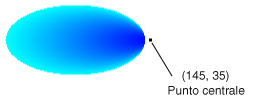

# Procedura: creare una sfumatura percorso
La classe <xref:System.Drawing.Drawing2D.PathGradientBrush> consente di personalizzare la modalità di riempimento di una forma con colori che si modificano in modo graduale.  È possibile ad esempio specificare un colore per il centro di un percorso e un altro per il suo limite.  È inoltre possibile specificare colori separati per ognuno dei diversi punti lungo il limite di un percorso.  
  
> [!NOTE]
>  In [!INCLUDE[ndptecgdiplus](../../../../includes/ndptecgdiplus-md.md)] un percorso è una sequenza di linee e curve gestita da un oggetto <xref:System.Drawing.Drawing2D.GraphicsPath>.  Per ulteriori informazioni sui percorsi [!INCLUDE[ndptecgdiplus](../../../../includes/ndptecgdiplus-md.md)], vedere [Percorsi di oggetti Graphics in GDI\+](../../../../docs/framework/winforms/advanced/graphics-paths-in-gdi.md) e [Costruzione e creazione di percorsi](../../../../docs/framework/winforms/advanced/constructing-and-drawing-paths.md).  
  
### Per riempire un'ellisse con una sfumatura percorso  
  
-   Nell'esempio che segue un'ellisse viene riempita con pennello a sfumatura percorso.  Il colore centrale è impostato su blu e il colore del limite su azzurro.  Nell'illustrazione che segue viene mostrata l'ellisse riempita.  
  
       
  
     Per impostazione predefinita, un pennello a sfumatura percorso non si estende oltre i limiti del percorso.  Se si utilizza il pannello a sfumatura percorso per riempire una figura che si estende oltre i limiti del percorso, l'area dello schermo all'esterno del percorso non verrà riempita.  
  
     Nell'illustrazione seguente viene mostrato cosa avviene se si modifica l'impostazione della chiamata <xref:System.Drawing.Graphics.FillEllipse%2A> nel codice seguente su `e.Graphics.FillRectangle(pthGrBrush, 0, 10, 200, 40)`.  
  
       
  
     [!code-csharp[System.Drawing.UsingaGradientBrush#11](../../../../samples/snippets/csharp/VS_Snippets_Winforms/System.Drawing.UsingaGradientBrush/CS/Class1.cs#11)]
     [!code-vb[System.Drawing.UsingaGradientBrush#11](../../../../samples/snippets/visualbasic/VS_Snippets_Winforms/System.Drawing.UsingaGradientBrush/VB/Class1.vb#11)]  
  
     L'esempio di codice riportato in precedenza è stato creato per essere utilizzato con Windows Form e richiede <xref:System.Windows.Forms.PaintEventArgs> e, un parametro di <xref:System.Windows.Forms.PaintEventHandler>.  
  
### Per specificare punti sul limite  
  
-   Nell'esempio che segue viene creato un pennello a sfumatura percorso da un percorso a forma di stella.  Viene impostata la proprietà <xref:System.Drawing.Drawing2D.PathGradientBrush.CenterColor%2A>, con la quale il colore al centro della stella viene impostato su rosso.  Viene quindi impostata la proprietà <xref:System.Drawing.Drawing2D.PathGradientBrush.SurroundColors%2A> per specificare i vari colori, memorizzati nella matrice `colors`, in corrispondenza dei singoli punti nella matrice `points`.  Con l'istruzione finale del codice il percorso a forma di stella viene riempito con il pennello a sfumatura percorso.  
  
     [!code-csharp[System.Drawing.UsingaGradientBrush#12](../../../../samples/snippets/csharp/VS_Snippets_Winforms/System.Drawing.UsingaGradientBrush/CS/Class1.cs#12)]
     [!code-vb[System.Drawing.UsingaGradientBrush#12](../../../../samples/snippets/visualbasic/VS_Snippets_Winforms/System.Drawing.UsingaGradientBrush/VB/Class1.vb#12)]  
  
-   Nell'esempio riportato di seguito viene tracciata una sfumatura percorso senza oggetto <xref:System.Drawing.Drawing2D.GraphicsPath> nel codice.  Il costruttore <xref:System.Drawing.Drawing2D.PathGradientBrush.%23ctor%2A> particolare utilizzato nell'esempio riceve una matrice di punti ma non richiede un oggetto <xref:System.Drawing.Drawing2D.GraphicsPath>.  Si noti inoltre che il pennello <xref:System.Drawing.Drawing2D.PathGradientBrush> viene utilizzato per riempire un rettangolo, non un percorso.  Il rettangolo è più largo del percorso chiuso utilizzato per definire il pennello e pertanto non viene interamente riempito dal pennello.  Nell'illustrazione che segue si mostra il rettangolo rappresentato dalla linea tratteggiata e la parte di esso riempita con il pennello a sfumatura percorso.  
  
       
  
     [!code-csharp[System.Drawing.UsingaGradientBrush#13](../../../../samples/snippets/csharp/VS_Snippets_Winforms/System.Drawing.UsingaGradientBrush/CS/Class1.cs#13)]
     [!code-vb[System.Drawing.UsingaGradientBrush#13](../../../../samples/snippets/visualbasic/VS_Snippets_Winforms/System.Drawing.UsingaGradientBrush/VB/Class1.vb#13)]  
  
### Per personalizzare una sfumatura percorso  
  
-   Un modo per personalizzare un pennello a sfumatura percorso consiste nell'impostare la proprietà <xref:System.Drawing.Drawing2D.PathGradientBrush.FocusScales%2A>.  Le proporzioni del fuoco specificano un percorso interno che si trova dentro il percorso principale.  Il colore centrale viene visualizzato ovunque all'interno del percorso interno e non nel solo punto centrale.  
  
     Nell'esempio che segue viene creato un pennello a sfumatura percorso in base a un percorso di forma ellittica.  Il colore del limite viene impostato su blu e il colore centrale su azzurro; quindi si utilizza il pennello a sfumatura percorso per riempire il percorso ellittico.  
  
     Successivamente vengono impostate le proporzioni del fuoco del pennello a sfumatura percorso.  La dimensione del fuoco x è impostata su 0,3, la dimensione y su 0,8.  Viene chiamato il metodo <xref:System.Drawing.Graphics.TranslateTransform%2A> di un oggetto <xref:System.Drawing.Graphics> in modo che con la successiva chiamata a <xref:System.Drawing.Graphics.FillPath%2A> venga riempita un'ellisse collocata a destra della prima ellisse.  
  
     Per visualizzare l'effetto sulle dimensioni del fuoco si immagini una piccola ellisse che abbia il centro in comune con l'ellisse principale.  L'ellisse più piccola, ovvero quella interna, è l'ellisse principale adattata in orizzontale in base a un fattore di 0,3 e in verticale in base a un fattore di 0,8 rispetto al centro.  Spostandosi dal limite dell'ellisse esterna al limite dell'ellisse interna il colore cambia in modo graduale da blu ad azzurro.  Spostandosi dal limite dell'ellisse interna al centro condiviso il colore rimane azzurro.  
  
     Nell''immagine che segue viene illustrato l'output del codice seguente.  L'ellisse a sinistra è azzurra solo in corrispondenza del punto centrale.  L'ellisse a destra è azzurra in qualsiasi punto all'interno del percorso interno.  
  
   
  
 [!code-csharp[System.Drawing.UsingaGradientBrush#14](../../../../samples/snippets/csharp/VS_Snippets_Winforms/System.Drawing.UsingaGradientBrush/CS/Class1.cs#14)]
 [!code-vb[System.Drawing.UsingaGradientBrush#14](../../../../samples/snippets/visualbasic/VS_Snippets_Winforms/System.Drawing.UsingaGradientBrush/VB/Class1.vb#14)]  
  
### Per personalizzare mediante interpolazione  
  
-   Un altro modo di personalizzare un pennello a sfumatura percorso è rappresentato dalla specifica di una matrice di colori di interpolazione e di una matrice di posizioni di interpolazione.  
  
     Nell'esempio che segue viene creato un pennello a sfumatura percorso basato su un triangolo.  Viene impostata la proprietà <xref:System.Drawing.Drawing2D.PathGradientBrush.InterpolationColors%2A> del pennello a sfumatura percorso per specificare una matrice di colori di interpolazione \(verde, azzurro, blu\) e una matrice di posizioni di interpolazione \(0, 0,25, 1\).  Spostandosi dal limite del triangolo verso il punto centrale il colore cambia in modo graduale da verde ad azzurro e quindi da azzurro a blu.  Il passaggio da verde ad azzurro avviene al 25% della distanza tra verde e blu.  
  
     Nell'illustrazione che segue è visibile il triangolo riempito con il pennello a sfumatura percorso personalizzato.  
  
     [!code-csharp[System.Drawing.UsingaGradientBrush#15](../../../../samples/snippets/csharp/VS_Snippets_Winforms/System.Drawing.UsingaGradientBrush/CS/Class1.cs#15)]
     [!code-vb[System.Drawing.UsingaGradientBrush#15](../../../../samples/snippets/visualbasic/VS_Snippets_Winforms/System.Drawing.UsingaGradientBrush/VB/Class1.vb#15)]  
  
### Per impostare il punto centrale  
  
-   Per impostazione predefinita il punto centrale di un pennello a sfumatura percorso si trova in corrispondenza del centroide del percorso utilizzare per creare il pennello.  È possibile modificare la posizione del punto centrale impostando la proprietà <xref:System.Drawing.Drawing2D.PathGradientBrush.CenterPoint%2A> della classe <xref:System.Drawing.Drawing2D.PathGradientBrush>.  
  
     Nell'esempio che segue viene creato un pennello a sfumatura percorso basato su un'ellisse.  Il centro dell'ellisse è rappresentato dalla posizione \(70, 35\), ma il punto centrale del pennello a sfumatura percorso è impostato su \(120, 40\).  
  
     [!code-csharp[System.Drawing.UsingaGradientBrush#16](../../../../samples/snippets/csharp/VS_Snippets_Winforms/System.Drawing.UsingaGradientBrush/CS/Class1.cs#16)]
     [!code-vb[System.Drawing.UsingaGradientBrush#16](../../../../samples/snippets/visualbasic/VS_Snippets_Winforms/System.Drawing.UsingaGradientBrush/VB/Class1.vb#16)]  
  
     Nell'illustrazione che segue sono visibili l'ellisse riempita e il punto centrale del pennello a sfumatura percorso.  
  
       
  
-   È possibile impostare il punto centrale di un pennello a sfumatura percorso su una posizione esterna al percorso utilizzato per creare il pennello.  Nell'esempio riportato di seguito la chiamata per l'impostazione della proprietà <xref:System.Drawing.Drawing2D.PathGradientBrush.CenterPoint%2A> utilizzata nel codice precedente viene sostituita da un'altra chiamata.  
  
     [!code-csharp[System.Drawing.UsingaGradientBrush#17](../../../../samples/snippets/csharp/VS_Snippets_Winforms/System.Drawing.UsingaGradientBrush/CS/Class1.cs#17)]
     [!code-vb[System.Drawing.UsingaGradientBrush#17](../../../../samples/snippets/visualbasic/VS_Snippets_Winforms/System.Drawing.UsingaGradientBrush/VB/Class1.vb#17)]  
  
     Nell'illustrazione che segue si mostra l'output del codice dopo la modifica.  
  
       
  
     Nell'illustrazione precedente i punti all'estrema destra dell'ellisse non sono perfettamente blu, anche se sono di un colore molto simile.  I colori della sfumatura sono collocati come se il riempimento avesse raggiunto il punto \(145, 35\) in cui il colore sarebbe perfettamente blu \(0, 0, 255\).  Il riempimento, però, non arriva al punto \(145, 35\) perché un pennello a sfumatura percorso non può colorare all'esterno del proprio percorso.  
  
## Compilazione del codice  
 L'esempio riportato in precedenza è stato creato per essere utilizzato con Windows Form e richiede <xref:System.Windows.Forms.PaintEventArgs> `e`, un parametro del gestore eventi <xref:System.Windows.Forms.Control.Paint>.  
  
## Vedere anche  
 [Utilizzo di un pennello a sfumatura per il riempimento di forme](../../../../docs/framework/winforms/advanced/using-a-gradient-brush-to-fill-shapes.md)