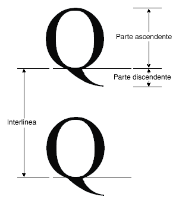

# Procedura: recuperare i criteri di misurazione dei caratteri
Nella classe <xref:System.Drawing.FontFamily> vengono forniti i seguenti metodi per il recupero di alcuni criteri di misurazione per una particolare combinazione di gruppo e stile:  
  
-   <xref:System.Drawing.FontFamily.GetEmHeight%2A>\(FontStyle\)  
  
-   <xref:System.Drawing.FontFamily.GetCellAscent%2A>\(FontStyle\)  
  
-   <xref:System.Drawing.FontFamily.GetCellDescent%2A>\(FontStyle\)  
  
-   <xref:System.Drawing.FontFamily.GetLineSpacing%2A>\(FontStyle\)  
  
 I numeri restituiti da tali metodi sono espressi in unità di progettazione caratteri e perciò sono indipendenti dalla dimensione e dalle unità di un oggetto <xref:System.Drawing.Font> specifico.  
  
 Nell'illustrazione che segue sono mostrati i vari criteri di misurazione.  
  
   
  
## Esempio  
 Nell'esempio che segue sono visualizzati i criteri di misurazione per lo stile normale del gruppo di caratteri Arial.  Viene inoltre creato un oggetto <xref:System.Drawing.Font> basato sul gruppo Arial con dimensioni 16 pixel e vengono visualizzati i criteri di misurazione, espressi in pixel, per quello specificato oggetto <xref:System.Drawing.Font>.  
  
 Nell'esempio che segue è illustrato l'output del codice modificato.  
  
   
  
 Si notino le prime due linee dell'output nell'illustrazione precedente.  L'oggetto <xref:System.Drawing.Font> restituisce una dimensione pari a 16, mentre l'oggetto <xref:System.Drawing.FontFamily> restituisce un'altezza em pari a 2.048.  Questi due numeri \(16 e 2.048\) sono la chiave delle conversione tra le unità di progettazione caratteri e le unità \(in questo caso pixel\) dell'oggetto <xref:System.Drawing.Font>.  
  
 È possibile ad esempio convertire l'inclinazione da unità di progettazione in pixel nel modo che segue:  
  
   
  
 Nel codice seguente il testo viene collocato in verticale tramite l'impostazione del membro di dati <xref:System.Drawing.PointF.Y%2A> di un oggetto <xref:System.Drawing.PointF>.  La coordinata y viene aumentata di `font.Height` per ogni nuova riga di testo.  La proprietà <xref:System.Drawing.Font.Height%2A> di un oggetto <xref:System.Drawing.Font> restituisce l'interlinea, espressa in pixel, per quel particolare oggetto <xref:System.Drawing.Font>.  Nell'esempio il numero restituito da <xref:System.Drawing.Font.Height%2A> è 19.  Si tratta dello stesso numero, arrotondato a un intero, ottenuto tramite la conversione della misurazione dell'interlinea in pixel.  
  
 L'altezza em, detta anche dimensione o dimensione em, non corrisponde alla somma della parte ascendente e della parte discendente.  La somma della parte ascendente e della parte discendente è invece uguale all'altezza della cella.  La differenza tra l'altezza della cella e la spalla superiore è uguale all'altezza em.  La somma dell'altezza della cella e della parte superiore dell'interlinea è uguale all'interlinea.  
  
 [!code-csharp[System.Drawing.FontsAndText#71](../../../../samples/snippets/csharp/VS_Snippets_Winforms/System.Drawing.FontsAndText/CS/Class1.cs#71)]
 [!code-vb[System.Drawing.FontsAndText#71](../../../../samples/snippets/visualbasic/VS_Snippets_Winforms/System.Drawing.FontsAndText/VB/Class1.vb#71)]  
  
## Compilazione del codice  
 L'esempio riportato in precedenza è stato creato per essere utilizzato con Windows Form e richiede <xref:System.Windows.Forms.PaintEventArgs> `e`, un parametro di <xref:System.Windows.Forms.PaintEventHandler>.  
  
## Vedere anche  
 [Grafica e disegno in Windows Form](../../../../docs/framework/winforms/advanced/graphics-and-drawing-in-windows-forms.md)   
 [Utilizzo di tipi di carattere e testo](../../../../docs/framework/winforms/advanced/using-fonts-and-text.md)