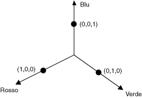
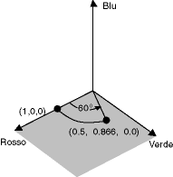
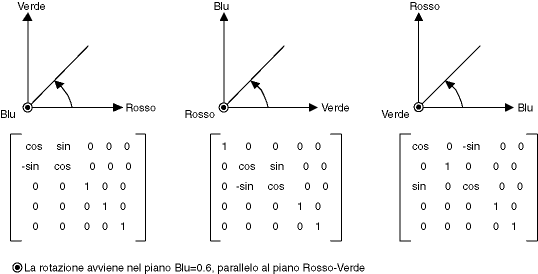
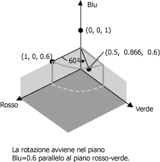

# Procedura: ruotare i colori
È difficile visualizzare la rotazione in uno spazio cromatico quadridimensionale.  È possibile semplificare la visualizzazione di tale rotazione supponendo di mantenere fissa una delle componenti di colore.  Si supponga di mantenere fissa a 1 la componente alfa, che è completamente opaca.  Sarà quindi possibile visualizzare uno spazio cromatico tridimensionale con assi del rosso, del verde e del blu, come mostrato nell'illustrazione che segue.  
  
   
  
 È possibile considerare un colore come un punto nello spazio tridimensionale.  Il punto \(1, 0, 0\) dello spazio, ad esempio, rappresenta il colore rosso, il punto \(0, 1, 0\) il colore verde.  
  
 Nell'illustrazione che segue si mostra cosa significhi ruotare il colore \(1, 0, 0\) di un angolo di 60 gradi sul piano rosso\-verde.  La rotazione su un piano parallelo al piano rosso\-verde può essere vista come una rotazione rispetto all'asse del blu.  
  
   
  
 Nell'illustrazione che segue si mostra come inizializzare una matrice di colori per eseguire rotazioni rispetto a ciascuno dei tre assi delle coordinate rosso, verde e blu.  
  
   
  
## Esempio  
 Nell'esempio che segue viene applicata una rotazione a 60 gradi sull'asse del blu a un'immagine monocromatica \(1, 0, 0,6\).  La rotazione viene effettuata su un piano parallelo al piano rosso\-verde.  
  
 Nell'illustrazione che segue si mostra l'immagine originale a sinistra e l'immagine dopo la rotazione di colori a destra.  
  
   
  
 Nell'illustrazione che segue viene mostrata una visualizzazione della rotazione dei colori eseguita nel codice riportato di seguito.  
  
   
  
 [!code-csharp[System.Drawing.RotateColors#1](../../../../samples/snippets/csharp/VS_Snippets_Winforms/System.Drawing.RotateColors/CS/Form1.cs#1)]
 [!code-vb[System.Drawing.RotateColors#1](../../../../samples/snippets/visualbasic/VS_Snippets_Winforms/System.Drawing.RotateColors/VB/Form1.vb#1)]  
  
## Compilazione del codice  
 L'esempio riportato in precedenza è stato creato per essere utilizzato con Windows Form e richiede <xref:System.Windows.Forms.PaintEventArgs> `e`, un parametro del gestore eventi <xref:System.Windows.Forms.Control.Paint>.  Sostituire `RotationInput.bmp` con il nome e il percorso di un file di immagine validi nel computer in uso.  
  
## Vedere anche  
 <xref:System.Drawing.Imaging.ColorMatrix>   
 <xref:System.Drawing.Imaging.ImageAttributes>   
 [Grafica e disegno in Windows Form](../../../../docs/framework/winforms/advanced/graphics-and-drawing-in-windows-forms.md)   
 [Ricolorazione di immagini](../../../../docs/framework/winforms/advanced/recoloring-images.md)