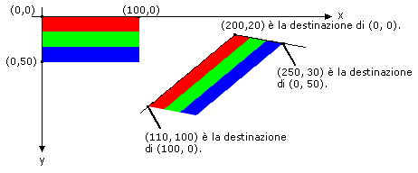

# Procedura: ruotare, riflettere e inclinare immagini
È possibile ruotare, riflettere a specchio e inclinare un'immagine specificando i punti di destinazione per gli angoli in alto a sinistra, in alto a destra e in basso a sinistra dell'immagine originale.  I tre punti di destinazione determinano una trasformazione affine in cui l'immagine rettangolare originale viene associata a un parallelogramma.  
  
## Esempio  
 Si supponga ad esempio che l'immagine originale sia un rettangolo con l'angolo in altro a sinistra in \(0, 0\), l'angolo in alto a destra in \(100, 0\) e l'angolo in basso a sinistra in \(0, 50\).  Si supponga ora di associare questi tre punti ai punti di destinazione nel modo che segue.  
  
|Punto di destinazione|Punto di destinazione|  
|---------------------------|---------------------------|  
|In alto a sinistra \(0, 0\)|\(200, 20\)|  
|In alto a destra \(100, 0\)|\(110, 100\)|  
|In basso a sinistra \(0, 50\)|\(250, 30\)|  
  
 Nell'illustrazione che segue sono visibili l'immagine originale e l'immagine associata al parallelogramma.  L'immagine originale è stata inclinata, riflessa, ruotata e traslata.  L'asse X lungo il margine superiore dell'immagine originale è associato alla linea che passa tra \(200, 20\) e \(110, 100\).  L'asse Y lungo il margine sinistro dell'immagine originale è associato alla linea che passa tra \(200, 20\) e \(250, 30\).  
  
   
  
 Nell'illustrazione riportata di seguito si mostra una trasformazione analoga applicata a un'immagine fotografica.  
  
   
  
 Nell'illustrazione si seguito si mostra una trasformazione analoga applicata a un metafile.  
  
   
  
 Con l'esempio seguente vengono prodotte le immagini mostrate nell'illustrazione precedente.  
  
 [!code-csharp[System.Drawing.WorkingWithImages#61](../../../../samples/snippets/csharp/VS_Snippets_Winforms/System.Drawing.WorkingWithImages/CS/Class1.cs#61)]
 [!code-vb[System.Drawing.WorkingWithImages#61](../../../../samples/snippets/visualbasic/VS_Snippets_Winforms/System.Drawing.WorkingWithImages/VB/Class1.vb#61)]  
  
## Compilazione del codice  
 L'esempio riportato in precedenza è stato creato per essere utilizzato con Windows Form e richiede <xref:System.Windows.Forms.PaintEventArgs> `e`, un parametro del gestore eventi <xref:System.Windows.Forms.Control.Paint>.  Sostituire `Stripes.bmp` con il percorso e il nome di un file di immagine valido per il sistema.  
  
## Vedere anche  
 [Utilizzo di immagini, bitmap, icone e metafile](../../../../docs/framework/winforms/advanced/working-with-images-bitmaps-icons-and-metafiles.md)