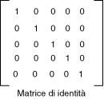

# Procedura: utilizzare una matrice di colori per trasformare un singolo colore
In [!INCLUDE[ndptecgdiplus](../../../../includes/ndptecgdiplus-md.md)] vengono fornite le classi <xref:System.Drawing.Image> e <xref:System.Drawing.Bitmap> per l’archiviazione e la modifica delle immagini.  Gli oggetti <xref:System.Drawing.Image> e <xref:System.Drawing.Bitmap> consentono di memorizzare il colore di ogni pixel come un numero a 32 bit: 8 bit per ogni componente \(rosso, verde, blu e alfa\).  Ciascuna delle quattro componenti è un numero da 0 a 255; 0 indica assenza di intensità e 255 intensità piena.  La componente alfa consente di specificare la trasparenza del colore: 0 indica la trasparenza completa e 255 l'opacità completa.  
  
 Un vettore di colore è un 4 tupla del form \(rosso, verde, blu e alfa\).  Il vettore di colore \(0, 255, 0, 255\), ad esempio, rappresenta un colore opaco privo di rosso o blu, ma con il verde a intensità piena.  
  
 In un'altra convenzione di rappresentazione dei colori viene utilizzato il numero 1 per indicare la piena intensità.  Utilizzando questa convenzione il colore descritto nel paragrafo precedente sarebbe rappresentato dal vettore \(0, 1, 0, 1\).  In [!INCLUDE[ndptecgdiplus](../../../../includes/ndptecgdiplus-md.md)] la piena intensità viene convenzionalmente indicata con 1 quando si eseguono trasformazioni di colore.  
  
 È possibile applicare ai vettori di colore trasformazioni lineari, quali rotazione e adattamento, moltiplicandoli per una matrice 4×4.  Tuttavia non è possibile utilizzare una matrice 4×4 per eseguire una traslazione \(non lineare\).  Se si aggiunge una quinta coordinata finta, ad esempio il numero 1, a ciascuno dei vettori di colore, è possibile utilizzare una matrice 5×5 per applicare qualsiasi combinazione di trasformazioni lineari e traslazioni.  Una trasformazione composta da una trasformazione lineare seguita da una traslazione viene detta trasformazione affine.  
  
 Si supponga ad esempio di voler iniziare con il colore \(0.2, 0.0, 0.4, 1.0\) e applicare le trasformazioni che seguono:  
  
1.  Raddoppiare la componente rossa  
  
2.  Aggiungere 0,2 alle componenti rossa, verde e blu  
  
 Con la moltiplicazione di matrice riportata di seguito verranno eseguite le coppie di trasformazioni nell'ordine indicato.  
  
   
  
 Gli elementi di una matrice di colore sono indicizzati in base zero per riga e quindi per colonna.  La voce in corrispondenza della quinta riga e della terza colonna della matrice M, ad esempio, è indicata da M\[4\]\[2\].  
  
 La matrice di identità 5×5, riportata nell'illustrazione che segue, presenta 1 sulla diagonale e 0 in qualsiasi altro punto.  Se si moltiplica un vettore di colore per la matrice di identità il vettore di colore non cambia.  Un modo comodo per formare la matrice di una trasformazione di colore è cominciare con la matrice di identità, quindi apportare una piccola modifica che produca la trasformazione desiderata.  
  
   
  
 Per informazioni dettagliate sulle matrici e le trasformazioni, vedere [Sistemi di coordinate e trasformazioni](../../../../docs/framework/winforms/advanced/coordinate-systems-and-transformations.md).  
  
## Esempio  
 Nell'esempio che segue viene applicata la trasformazione descritta nei paragrafi precedenti a un'immagine monocromatica \(0.2, 0.0, 0.4, 1.0\).  
  
 Nell'illustrazione che segue si mostra l'immagine originale a sinistra e l'immagine trasformata a destra.  
  
   
  
 Nel codice riportato di seguito la ricolorazione è eseguita tramite i seguenti passaggi:  
  
1.  Inizializzazione di un oggetto <xref:System.Drawing.Imaging.ColorMatrix>.  
  
2.  Creazione di un oggetto <xref:System.Drawing.Imaging.ImageAttributes> e passaggio dell'oggetto <xref:System.Drawing.Imaging.ColorMatrix> al metodo <xref:System.Drawing.Imaging.ImageAttributes.SetColorMatrix%2A> dell'oggetto <xref:System.Drawing.Imaging.ImageAttributes>.  
  
3.  Passaggio dell'oggetto <xref:System.Drawing.Imaging.ImageAttributes> al metodo <xref:System.Drawing.Graphics.DrawImage%2A> di un oggetto <xref:System.Drawing.Graphics>.  
  
 [!code-csharp[System.Drawing.RecoloringImages#21](../../../../samples/snippets/csharp/VS_Snippets_Winforms/System.Drawing.RecoloringImages/CS/Class1.cs#21)]
 [!code-vb[System.Drawing.RecoloringImages#21](../../../../samples/snippets/visualbasic/VS_Snippets_Winforms/System.Drawing.RecoloringImages/VB/Class1.vb#21)]  
  
## Compilazione del codice  
 L'esempio riportato in precedenza è stato creato per essere utilizzato con Windows Form e richiede <xref:System.Windows.Forms.PaintEventArgs> `e`, un parametro del gestore eventi <xref:System.Windows.Forms.Control.Paint>.  
  
## Vedere anche  
 [Ricolorazione di immagini](../../../../docs/framework/winforms/advanced/recoloring-images.md)   
 [Sistemi di coordinate e trasformazioni](../../../../docs/framework/winforms/advanced/coordinate-systems-and-transformations.md)